# Table of Contents

[1 Glossary [10](#glossary)](#glossary)

[2 References [10](#references)](#references)

[3 Overview [12](#overview)](#overview)

[3.1 External storage [12](#external-storage)](#external-storage)

[3.2 Cache Initialization [12](#cache-initialization)](#cache-initialization)

[3.3 Cache parameters and organization [13](#cache-parameters-and-organization)](#cache-parameters-and-organization)

[3.4 Block replacement algorithm [13](#block-replacement-algorithm)](#block-replacement-algorithm)

[3.5 Confidentiality and authentication mechanism [14](#confidentiality-and-authentication-mechanism)](#confidentiality-and-authentication-mechanism)

[3.6 Memory protection [14](#memory-protection)](#memory-protection)

[3.7 Cache disabled mode [14](#cache-disabled-mode)](#cache-disabled-mode)

[4 Hardware support in security subsystem for external instruction memory [14](#hardware-support-in-security-subsystem-for-external-instruction-memory)](#hardware-support-in-security-subsystem-for-external-instruction-memory)

[4.1 Cache Interface Unit [16](#cache-interface-unit)](#cache-interface-unit)

[4.1.1 Cache organization [17](#cache-organization)](#cache-organization)

[4.1.2 Access control [21](#access-control)](#access-control)

[4.2 Cache Management Unit [21](#cache-management-unit)](#cache-management-unit)

[4.2.1 CMU Interfaces [23](#cmu-interfaces)](#cmu-interfaces)

[4.2.2 CMU Configuration [23](#cmu-configuration)](#cmu-configuration)

[4.2.3 CMU Commands [25](#cmu-commands)](#cmu-commands)

[4.2.4 Encryption and authentication algorithm [26](#encryption-and-authentication-algorithm)](#encryption-and-authentication-algorithm)

[4.2.5 CMU DMA [27](#cmu-dma)](#cmu-dma)

[4.2.6 Error reporting [28](#error-reporting)](#error-reporting)

[4.2.7 Cache performance monitor [29](#cache-performance-monitor)](#cache-performance-monitor)

[4.2.8 Debug mode [29](#debug-mode)](#debug-mode)

[4.3 Cache SRAM [30](#cache-sram)](#cache-sram)

[4.4 Address translation unit configuration [30](#address-translation-unit-configuration)](#address-translation-unit-configuration)

[4.5 Static parameters [30](#static-parameters)](#static-parameters)

[5 Requirements [30](#requirements)](#requirements)

[6 Model [30](#model)](#model)

[7 Control and Data Flow [31](#control-and-data-flow)](#control-and-data-flow)

[8 Error Reporting [31](#error-reporting-1)](#error-reporting-1)

[9 Programmer’s Model [31](#programmers-model)](#programmers-model)

[9.1 External Memory System Setup [31](#external-memory-system-setup)](#external-memory-system-setup)

[9.1.1 When generating the BEK key firmware needs to ensure the key attributes will pass the key attribute check in CMU, see “CMU Commands [31](#when-generating-the-bek-key-firmware-needs-to-ensure-the-key-attributes-will-pass-the-key-attribute-check-in-cmu-see-cmu-commands)](#when-generating-the-bek-key-firmware-needs-to-ensure-the-key-attributes-will-pass-the-key-attribute-check-in-cmu-see-cmu-commands)

[9.2 Secure Instruction Cache registers [31](#secure-instruction-cache-registers)](#secure-instruction-cache-registers)

[9.2.1 SInC Command Register [31](#sinc-command-register)](#sinc-command-register)

[9.2.2 First Block Encryption Number Register [32](#first-block-encryption-number-register)](#first-block-encryption-number-register)

[9.2.3 Number of Encryption Blocks Register [32](#number-of-encryption-blocks-register)](#number-of-encryption-blocks-register)

[9.2.4 Block Encryption Address Register [32](#block-encryption-address-register)](#block-encryption-address-register)

[9.2.5 Block Encryption Key Register [33](#block-encryption-key-register)](#block-encryption-key-register)

[9.2.6 AES GCM IV Nonce 1 Register [33](#aes-gcm-iv-nonce-1-register)](#aes-gcm-iv-nonce-1-register)

[9.2.7 AES GCM IV Nonce 2 Register [33](#aes-gcm-iv-nonce-2-register)](#aes-gcm-iv-nonce-2-register)

[9.2.8 AES GCM IV Nonce 3 Register [33](#aes-gcm-iv-nonce-3-register)](#aes-gcm-iv-nonce-3-register)

[9.2.9 Block base address Register [33](#block-base-address-register)](#block-base-address-register)

[9.2.10 Authentication tag base address Register [33](#authentication-tag-base-address-register)](#authentication-tag-base-address-register)

[9.2.11 SInC Status Register [34](#sinc-status-register)](#sinc-status-register)

[9.2.12 CMU Hit Counter Lower Bits Register [35](#cmu-hit-counter-lower-bits-register)](#cmu-hit-counter-lower-bits-register)

[9.2.13 CMU Hit Counter Upper Bits Register [35](#cmu-hit-counter-upper-bits-register)](#cmu-hit-counter-upper-bits-register)

[9.2.14 CMU Miss Counter Lower Bits Register [35](#cmu-miss-counter-lower-bits-register)](#cmu-miss-counter-lower-bits-register)

[9.2.15 CMU Miss Counter Upper Bits Register [35](#cmu-miss-counter-upper-bits-register)](#cmu-miss-counter-upper-bits-register)

[9.2.16 CMU Latency Counter Lower Bits Register [36](#cmu-latency-counter-lower-bits-register)](#cmu-latency-counter-lower-bits-register)

[9.2.17 CMU Latency Counter Upper Bits Register [36](#cmu-latency-counter-upper-bits-register)](#cmu-latency-counter-upper-bits-register)

[9.2.18 CMU Performance Counters Control Register [36](#cmu-performance-counters-control-register)](#cmu-performance-counters-control-register)

[9.2.19 AES-GCM Test Data Input 0 [37](#aes-gcm-test-data-input-0)](#aes-gcm-test-data-input-0)

[9.2.20 AES-GCM Test Data Input 1 [37](#aes-gcm-test-data-input-1)](#aes-gcm-test-data-input-1)

[9.2.21 AES-GCM Test Data Input 2 [37](#aes-gcm-test-data-input-2)](#aes-gcm-test-data-input-2)

[9.2.22 AES-GCM Test Data Input 3 [37](#aes-gcm-test-data-input-3)](#aes-gcm-test-data-input-3)

[9.2.23 AES-GCM Test Data Output 0 [37](#aes-gcm-test-data-output-0)](#aes-gcm-test-data-output-0)

[9.2.24 AES-GCM Test Data Output 1 [37](#aes-gcm-test-data-output-1)](#aes-gcm-test-data-output-1)

[9.2.25 AES-GCM Test Data Output 2 [38](#aes-gcm-test-data-output-2)](#aes-gcm-test-data-output-2)

[9.2.26 AES-GCM Test Data Output 3 [38](#aes-gcm-test-data-output-3)](#aes-gcm-test-data-output-3)

[9.2.27 AES-GCM Test Control Register [38](#aes-gcm-test-control-register)](#aes-gcm-test-control-register)

[9.2.28 AES-GCM Test Status Register [39](#aes-gcm-test-status-register)](#aes-gcm-test-status-register)

[10 Area Target [44](#area-target)](#area-target)

[11 Power [44](#power)](#power)

[12 Performance [45](#performance)](#performance)

[13 Security Features [45](#security-features)](#security-features)

[13.1 Threat Model [45](#threat-model)](#threat-model)

[13.2 Test and debug requirements [47](#test-and-debug-requirements)](#test-and-debug-requirements)

[14 Verification [47](#verification)](#verification)

[14.1 Functional Coverage [47](#functional-coverage)](#functional-coverage)

[14.2 Code Coverage [47](#code-coverage)](#code-coverage)

[15 Power Management [47](#power-management)](#power-management)

[15.1 Power rails [47](#power-rails)](#power-rails)

[16 Known Answer Test Vectors [47](#known-answer-test-vectors)](#known-answer-test-vectors)

[17 Debug Facilities [48](#debug-facilities)](#debug-facilities)

[18 Reliability, Accessibility, and Serviceability [48](#reliability-accessibility-and-serviceability)](#reliability-accessibility-and-serviceability)

[18.1 Parity/ECC [48](#parityecc)](#parityecc)

[18.2 Soft error rate calculations [48](#soft-error-rate-calculations)](#soft-error-rate-calculations)

[19 Reset and Power-On Sequence [48](#reset-and-power-on-sequence)](#reset-and-power-on-sequence)

[19.1 Reset [48](#reset)](#reset)

[20 Test [48](#test)](#test)

[20.1 Scan Stuck at Fault Testing [48](#scan-stuck-at-fault-testing)](#scan-stuck-at-fault-testing)

[20.2 Delay Fault Testing [49](#delay-fault-testing)](#delay-fault-testing)

[20.3 MBIST [49](#mbist)](#mbist)

[21 Clocks [49](#clocks)](#clocks)

[22 Compliance [49](#compliance)](#compliance)

[Hard Macros Used [49](#hard-macros-used)](#hard-macros-used)

[23 Appendix - Cache performance analysis [49](#appendix---cache-performance-analysis)](#appendix---cache-performance-analysis)

[24 Appendix - Cache cost analysis [57](#appendix---cache-cost-analysis)](#appendix---cache-cost-analysis)

[25 Appendix – Alternative schemes with FW managed block-miss handling [58](#appendix-alternative-schemes-with-fw-managed-block-miss-handling)](#appendix-alternative-schemes-with-fw-managed-block-miss-handling)

[26 Appendix – Selection of encryption and authentication algorithm [59](#appendix-selection-of-encryption-and-authentication-algorithm)](#appendix-selection-of-encryption-and-authentication-algorithm)

# List of Tables

[Table 1‑1: Glossary [10](#_Ref20986115)](#_Ref20986115)

[Table 2‑1: References [10](#_Ref20986207)](#_Ref20986207)

[Table 4‑1: Security processor address map example with cache in “disabled” and “initialization” modes [16](#_Toc141084347)](#_Toc141084347)

[Table 4‑2: Security processor address map example with cache in “cache-active” mode [16](#_Toc141084348)](#_Toc141084348)

[Table 4‑3: Security processor address map example when cache state is invalid [17](#_Toc141084349)](#_Toc141084349)

[Table 4‑4: Address format depending on cache and block size. [20](#_Toc141084350)](#_Toc141084350)

[Table 4‑5: AEB to disable SInC authentication. [29](#_Toc141084351)](#_Toc141084351)

[Table 4‑6: AEB to disable SInC key attribute check. [29](#_Toc141084352)](#_Toc141084352)

[Table 13‑1: Assets, threats, and mitigations [45](#_Toc141084353)](#_Toc141084353)

[Table 24‑1: Trace performance on 64KB cache with FIFO block eviction [50](#_Toc141084354)](#_Toc141084354)

[Table 24‑2: Trace performance on 64KB cache with LRU block eviction [51](#_Toc141084355)](#_Toc141084355)

[Table 24‑3: Trace performance on 128 KB cache with FIFO block eviction [55](#_Toc141084356)](#_Toc141084356)

[Table 24‑4: Trace performance on 128KB cache with LRU block eviction [56](#_Toc141084357)](#_Toc141084357)

[Table 25‑1: Cost analysis for 16 MB external space on a 256 KB cache [57](#_Toc141084358)](#_Toc141084358)

# List of Figures

[Figure 4‑1: Security subsystem diagram with IRAM address translation unit [16](#_Toc141084359)](#_Toc141084359)

[Figure 4‑2: Generic K-way cache [18](#_Toc141084360)](#_Toc141084360)

[Figure 4‑3: External instruction memory address format for 256KB cache and 256-byte block [18](#_Toc141084361)](#_Toc141084361)

[Figure 4‑4: Tag search with tags stored in flops [19](#_Toc141084362)](#_Toc141084362)

[Figure 4‑5: Tag search with tags stored in SRAM [20](#_Toc141084363)](#_Toc141084363)

[Figure 4‑6: CMU modes [23](#_Toc141084364)](#_Toc141084364)

[Figure 4‑7: AES GCM 96-bit IV [24](#_Toc141084365)](#_Toc141084365)

[Figure 4‑8: CMU data flow in initialization mode [28](#_Toc141084366)](#_Toc141084366)

[Figure 4‑9: CMU data flow when processing block-miss [28](#_Toc141084367)](#_Toc141084367)

[Figure 24‑1: Trace miss count in 64 KB cache [53](#_Toc141084368)](#_Toc141084368)

[Figure 24‑2: Trace execution time in 64 KB cache [54](#_Toc141084369)](#_Toc141084369)

# Glossary

| Term | Definition                                     |
|------|------------------------------------------------|
| BEK  | Block Encryption Key                           |
| CIU  | Cache Interface Unit                           |
| CMU  | Cache Management Unit                          |
| LRU  | Least Recently Used                            |
| MMU  | Memory Management Unit                         |
| NIST | National Institute of Standards and Technology |
| TLB  | Translation Lookaside Buffer                   |
| ZPR  | Zero-Pin Retention                             |

Table 1‑1: Glossary

# References

| Title | Document Link |
|----|----|
| NIST SP 800-38D Recommendation for Block Cipher Modes of Operation: Galois/Counter Mode and GMAC | [SP 800-38D, Recommendation for Block Cipher Modes of Operation: GCM and GMAC \| CSRC (nist.gov)] |
| The Galois/Counter Mode (GCM) and GMAC Validation System (GCMVS) with the Addition of XPN Validation Testing | [The Galois/Counter Mode (GCM) and GMAC Validation System (GCMVS) (nist.gov)] |
| The Security and Performance of the Galois/Counter Mode (GCM) of Operation | [193.pdf (iacr.org)](https://eprint.iacr.org/2004/193.pdf#:~:text=Abstract.%20The%20recently%20introduced%20Galois%2FCounter%20Mode%20%28GCM%29%20of,We%20also%20consider%20several%20of%20its%20important%20system-securityaspects.) |
| Ibex Reference Guide | [Ibex: An embedded 32 bit RISC-V CPU core](https://ibex-core.readthedocs.io/en/latest/) |

Table 2‑1: References

> 

# Overview 

The amount of instruction SRAM memory inside the security subsystem, typically from 256 KB to 512 KB, currently limits the size of the firmware image that the security processor can execute. Currently 384KB of instruction SRAM is required just to implement a TPM. Moreover, storing firmware code in external DRAM allows for a more capable security subsystem with less instruction memory inside the security subsystem. Instead of a local IRAM large enough to hold the entire executable binary a system could implement a smaller IRAM and a cache for code and constants stored in external memory, making the total amount of internal SRAM smaller. This document introduces a memory caching scheme which enables an instruction memory space up to 16 MB outside the security subsystem local IRAM.

A fixed portion of instruction memory space (from 32KB to 256KB depending on specific project) is mapped into an SRAM inside the security subsystem (local IRAM), and the rest of the instruction space (up to 16MB) is mapped to a memory external to the security subsystem. An internal SRAM of 128 KB, 256 KB or 512 KB acts as a cache for the instruction space mapped to external memory. The cache mechanism does not affect security processor address space outside the instruction space mapped to external memory. Local instruction TCM, data TCM and register accesses are not changed by this specification. Data TCM SRAM size may be increased from 32KB to 128KB when local IRAM is reduced to 32KB. A typical configuration for the sizes of the 3 SRAM spaces may be: 32KB local IRAM, 256KB cache for external memory, 128 KB for data SRAM.

A boot loader configures and initializes the instruction cache and external memory instruction space. After initialization, the instruction memory space mapped to external memory is read-only and contains firmware code and constants.

The instruction memory caching scheme consists of the following elements:

- Space in external storage (outside security subsystem boundary) reserved for security subsystem firmware code and constants

- Configuration and initialization of the external storage and internal cache

- Security subsystem internal cache

- A block replacement algorithm

- A block confidentiality and authentication mechanism

- An extension of the memory protection mechanism for space mapped to external memory

## External storage

The external storage will contain an encrypted firmware image. The firmware image is divided into blocks. The security subsystem decrypts and authenticates each block before loading it into the local cache. The external storage will also contain an authentication tag for each block.

Read transactions to the external storage are expected to have an initial latency between 1 and 2 us and throughput matching the decrypt operation bandwidth.

## Cache Initialization

A firmware loader executing in the security processor initializes the external storage at every security subsystem reset. The security processor does not directly write the external instruction memory nor the internal cache. A Cache Management Unit (CMU) in the security subsystem supports the initialization driven by the firmware loader. The loader performs the following operations:

1.  Generate the block encryption key (BEK) and store it in the key store

2.  Configure the address translation unit for the external memory space mapping to security subsystem address space

3.  Configure address to be issued by the CMU when storing or retrieving cache blocks

4.  Authenticate the firmware image. As part of the authentication process the loader will copy firmware blocks into shared ram and, for the blocks to be located in external memory, instruct the security subsystem CMU to encrypt the blocks and generate their corresponding authentication tag and copy both to their location in external memory.

5.  Lock the cache configuration and disable write permission, for both the security processor and CMU, on the full external instruction memory space.

6.  Erase the BEK from the key store. CMU keeps a local copy. If required for power-management flows where the security subsystem is powered down but the external instruction memory is preserved BEK can be wrapped and saved outside the security subsystem for restore on security subsystem power-gating exit.

## Cache parameters and organization

The internal cache architecture is determined by choices on the following parameters:

- Block size. The block size affects the block-miss rate, the time penalty of a block-miss and the amount of information required to manage the cache. **Supported block sizes are: 128 bytes, 256 bytes, 512 bytes and 1024 bytes**.

- Associativity. A fully associative scheme allows storing the contents of any external memory block into any slot of the internal cache. On a direct-mapped cache each external memory block has only one slot assigned in the internal cache. On a 2-way set-associative cache each external memory block has a set of two slots of internal cache assigned. On a 4-way set-associative cache each external memory block has a set of four slots of internal cache assigned.

> Associativity affects block-miss rate and the amount of information required to manage the cache. High associativity schemes should have a lower miss rate but higher cache management cost.
>
> **The instruction memory cache in the security subsystem is 4-way set-associative**.

- Transparency. Paging schemes are usually software managed, caches are usually transparent to SW.

> In SW managed schemes HW performs address translation, but block misses trigger an exception. The exception handler is responsible for selecting a block to evict in the local memory and bring the missing block from external memory.
>
> In HW managed schemes SW is not aware of block misses.
>
> **The scheme described in this specification is HW managed**. HW managed schemes are adequate for low-associative schemes because the selection of which block to evict is simpler, there is no need for the processor to support precise exceptions and security analysis doesn’t include the exception handler (see section 26 on core selection for SW managed schemes).

Block size and associativity choices depend on firmware behavior. See sections 26 and 27 for a justification of the choice for 4-way associativity and the block sizes supported.

## Block replacement algorithm

A FIFO algorithm will determine the block to be replaced in the set-associative cache. The older block in the set is replaced. The cache logic will keep track of the oldest block in each set.

The FIFO algorithm was chosen because keeping track of the older block in a set requires less logic than other algorithms, for example LRU. Moreover, the older block status doesn’t need to be updated on every security processor access to external instruction memory, it needs to be updated only on block-miss.

Performance analysis of a current firmware trace (see section 24) shows no significant differences between FIFO and LRU algorithms for the optimal block size.

## Confidentiality and authentication mechanism

The caching mechanism implemented needs to guarantee confidentiality and integrity of the firmware image. At initialization, blocks copied into external memory need to be encrypted before leaving the security subsystem. Blocks copied from external memory into the local cache need to be decrypted and authenticated before the security processor is allowed to read them.

A Block Encryption Key (BEK) is generated by firmware from RNG and stored in the key store on every security subsystem reset.

An authentication tag is generated for all blocks and stored in external memory.

Dedicated ciphers and DMA engine in CMU perform:

- DMA read from shared ram, encryption and authentication tag generation for each block to be stored in external memory.

- DMA write of encrypted blocks and their corresponding authentication tags.

- DMA read, decryption and tag authentication of the blocks read from system memory and copied into local cache.

Once initialization of the external instruction memory ends, CMU is the only unit in the security subsystem that can write the local cache.

Upon a block-miss CIU will identify the cache block to be replaced and tells the CMU to read, decrypt and authenticate the missing block, and copy it into the cache, overriding the block to be replaced, following by CIU updating the tags.

CMU performs encryption and authentication using an AES GCM cipher. The authentication tag size is 128-bit and it is stored in external memory.

## Memory protection

Memory protection is extended to the instruction space mapped to external storage. Before the security processor is allowed to access a location mapped to external instruction memory the transaction is checked for permission.

See section [5.1.2](#access-control) for a description of the memory protection scheme.

## Cache disabled mode

Prior to initialization, the external memory cache is directly accessible to the security processor as additional local IRAM space. In this mode the lower range of external instruction memory addresses corresponding to the cache size are decoded as direct accesses to the cache SRAM, no address translation nor cache hit/miss check is done. The upper range of external instruction memory addresses is reserved (accesses result in error).

# Hardware support in security subsystem for external instruction memory

Two new units are added to the security subsystem:

- External instruction memory transactions are routed to a cache interface unit (CIU). The cache interface unit determines if the block accessed is present in the cache (hit) or needs to be read from external memory (miss). On a block-hit the cache is read, and corresponding data returned. On a block-miss the cache management unit is instructed to bring the missing block from external memory to the cache. On a block-miss the security processor access is stalled until the missing block is copied into the cache.

- A Cache Management Unit is added to the security subsystem to perform encryption/decryption and authentication tag generation/check on the outgoing and incoming blocks. CMU contains registers accessed by the security processor, it can initiate transactions on the fabric targeting the address translation unit and it is the only unit able to write the local cache.

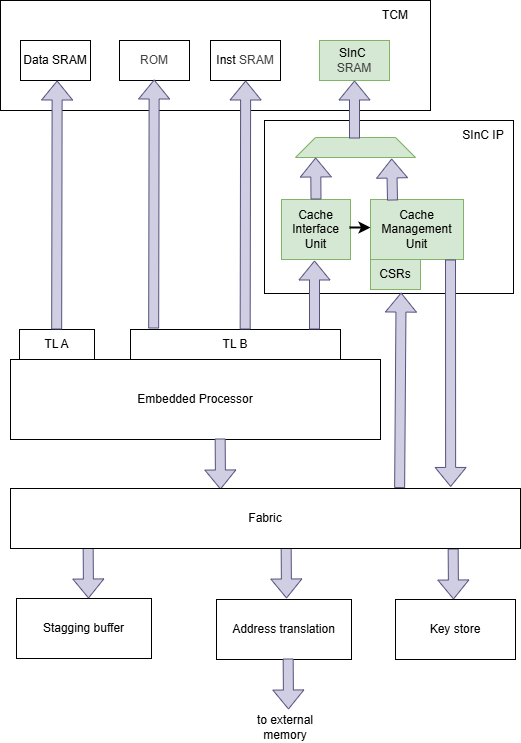

> Figure 4‑1: Security subsystem diagram with IRAM address translation unit

## Cache Interface Unit

Memory read commands issued by the security processor that decode to the external memory space are sent to the cache interface.

The cache interface unit (CIU) contains the logic and state required to determine if a block is in the cache and, if the block is cached, return the data requested by the security processor.

When CMU is in “disabled” mode (see CMU modes in next section) the cache interface unit performs a direct map of the address to the cache SRAM. In this mode the cache SRAM is an extension of the local IRAM. Thus, the security processor address map will be different when the cache is in “disabled” or “initialization” mode, “cache-active” mode and “cache-failed mode”, see modes described in “[CMU Configuration](#cmu-configuration)”. For example, the following table shows a possible address mapping in “disabled” and “initialization” modes:

| Start Address | End Address | Description               |
|---------------|-------------|---------------------------|
| 0x2008_0000   | 0x2008_FFFF | dRAM                      |
| 0x2009_0000   | 0x200C_FFFF | always-local iRAM (256KB) |
| 0x200D_0000   | 0x2010_FFFF | iRAM (256KB)              |
| 0x2011_0000   | 0x8DFF_FFFF | Reserved                  |

Table 4‑1: Security processor address map example with cache in “disabled” and “initialization” modes

and the next table shows the address map in “cache-active” mode where there appears as though there is a large addressable space but the cache is reaching out to external memory and fetching in blocks as needed to hold all that memory:

| Start Address | End Address | Description               |
|---------------|-------------|---------------------------|
| 0x2008_0000   | 0x2008_FFFF | dRAM                      |
| 0x2009_0000   | 0x200C_FFFF | always-local iRAM (256KB) |
| 0x200D_0000   | 0x210C_FFFF | External iRAM (16MB)      |
| 0x210D_0000   | 0x8DFF_FFFF | Reserved                  |

Table 4‑2: Security processor address map example with cache in “cache-active” mode

When the cache is in “disabled” mode accesses outside iRAM that would correspond to external iRAM (0x2011_0000-0x8DFF_FFFF in above example) fall into reserved space. All memory locations that are marked as reserved or otherwise unspecified will need to be made inaccessible. Any transactions targeting inaccessible addresses shall be made detectable and trigger an error event somewhere along the way, either as a bus error or an error interrupt that is forwarded to the security processor.

If CMU state becomes invalid (state encoding doesn’t match any of the possible states (“disabled”, “initialization”, “cache-active” and “cache-failed”) or the state is “cache-failed”, then only always-only iRAM is available as shown in the following table. CMU state can only become invalid due to malfunction, soft-error or fault injection. “Cache-failed” state can be entered due to an authentication error.

| Start Address | End Address | Description               |
|---------------|-------------|---------------------------|
| 0x2008_0000   | 0x2008_FFFF | dRAM                      |
| 0x2009_0000   | 0x200C_FFFF | always-local iRAM (256KB) |
| 0x200D_0000   | 0x210C_FFFF | Reserved                  |
| 0x210D_0000   | 0x8DFF_FFFF | Reserved                  |

Table 4‑3: Security processor address map example when cache state is invalid

### Cache organization

The external memory is divided into blocks. The internal cache is divided into sets. In k-way set associative cache each set can contain K blocks. Tags in the cache indicate which block is stored in each cache line. It is possible that a cache line is not initialized and doesn’t contain any block, for this reason alongside with the tag there must be a bit for each cache line indicating whether the tag value is valid. The external memory address is split into tag, set, and offset fields. The offset field is the byte address inside the block. The set field selects one of the sets in the cache and the tag field identifies the block inside the set.

<figure>
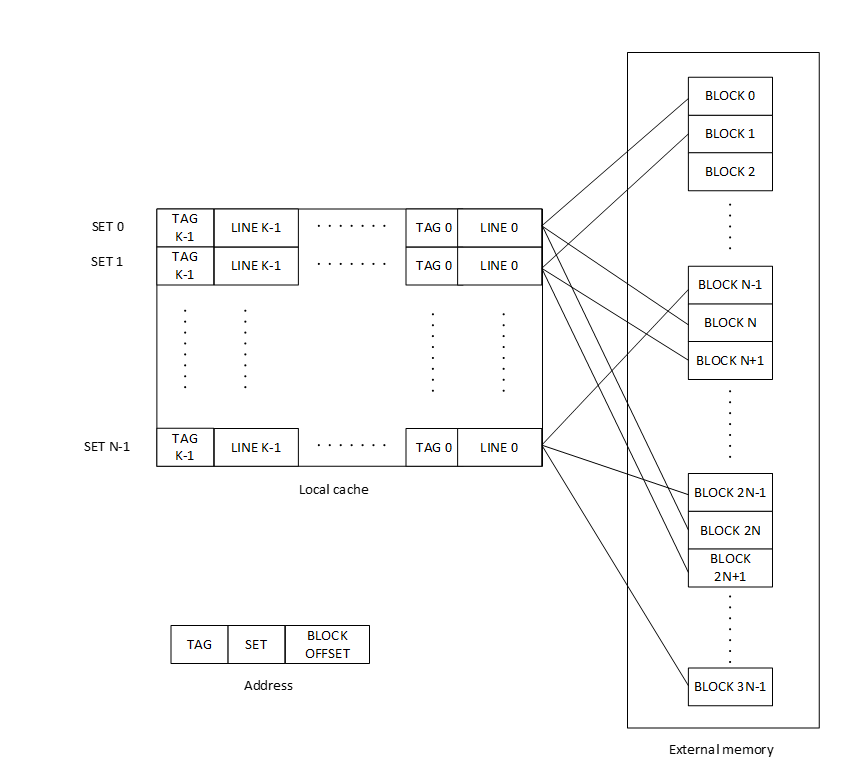
<figcaption><blockquote>

Figure 4‑2: Generic K-way cache

</blockquote></figcaption>
</figure>

Assuming the following parameter choices:

- External instruction memory space is 16 MB

- Block size is 256 bytes

- Cache is 4-way set-associative

- Size of local cache is 256 KB

The cache will contain 256 sets, each set containing 4 blocks.

The address at the security processor interface will contain the following fields:

<figure>
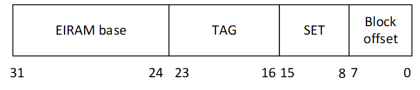
<figcaption><blockquote>

Figure 4‑3: External instruction memory address format for 256KB cache and 256-byte block

</blockquote></figcaption>
</figure>

Security processor memory interface will route accesses matching EIRAM base (bits 31:24) to the cache interface unit.

SET field (bits 15:8) will determine the set in the cache where the block might be.

The cache interface determines whether the block containing the data requested is present in the cache by comparing the TAG field (bits 23:16) with the tags of the 4 cache-lines in the selected set and checking their valid bit.

Different implementations of the cache and interface logic are possible. Depending on the shapes and sizes of available SRAM macrocells, and how timing-critical are the paths through the cache interface, it may be better to store the cache-line tags in flops and implement a scheme like the one depicted in figure 4-4 or the optimal implementation may be storing the tags in SRAM as in figure 4-5.

Both figure 4-4 and 4-5 show an implementation of a 256 KB cache.

The implementation in Figure 4-4 stores blocks in a 256K memory with 16-bit address and 32-bit data. The information required to locate a block in the cache is a table stored in flops with an entry per set (256 entries) and 4 tags per entry (the tags corresponding to the blocks currently stored in the cache have their valid bit set).

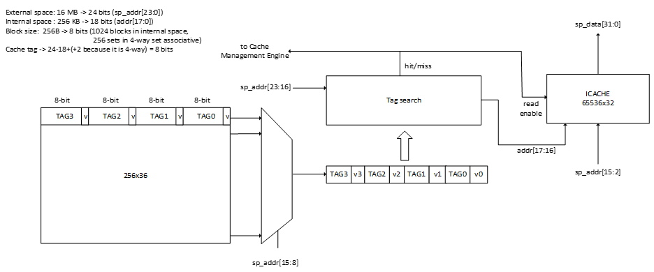

Figure 4‑4: Tag search with tags stored in flops

The implementation in Figure 4-5 stores the tags in the same SRAM as the cache content. An SRAM read would produce a set with its corresponding tags, afterwards a tag search and further address decoding would locate the 32-bit data to be returned to the security processor or it would trigger a block-miss and its corresponding block replacement.

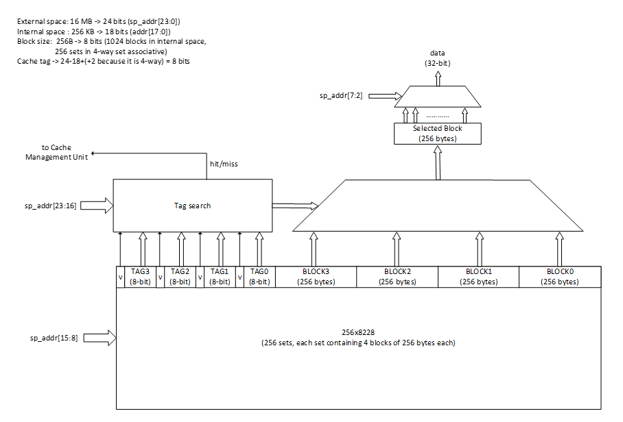

Figure 4‑5: Tag search with tags stored in SRAM

On a block-miss the CIU will send a block miss indication with its corresponding missing block address to the CMU and it will stall the security processor read command until the CMU has decrypted, authenticated and copied into cache the missing block. The transaction will terminate successfully when the block has been loaded and the data read properly, or it can be terminated unsuccessfully when an error has occurred and an error status returned.

The following table shows address fields for tag, set and offset in each of the supported configurations.

<table>
<caption>
Table 4‑4: Address format depending on cache and block size.
</caption>
<colgroup>
<col style="width: 20%" />
<col style="width: 12%" />
<col style="width: 27%" />
<col style="width: 20%" />
<col style="width: 20%" />
</colgroup>
<thead>
<tr>
<th></th>
<th></th>
<th colspan="3">Cache size</th>
</tr>
</thead>
<tbody>
<tr>
<td></td>
<td></td>
<td>128 KB</td>
<td>256 KB</td>
<td>512 KB</td>
</tr>
<tr>
<td rowspan="4">Block size</td>
<td>128 bytes</td>
<td>
1024 blocks

256 sets

Offset -&gt; addr[6:0]

Set -&gt;addr[14:7]

Tag -&gt; addr[23:15]
</td>
<td>
2048 blocks

512 sets

Offset -&gt; addr[6:0]

Set -&gt;addr[15:7]

Tag -&gt; addr[23:16]
</td>
<td>
4096 blocks

1024 sets

Offset -&gt; addr[6:0]

Set -&gt;addr[16:7]

Tag -&gt; addr[23:17]
</td>
</tr>
<tr>
<td>256 bytes</td>
<td>
512 blocks

128 sets

Offset -&gt; addr[7:0]

Set -&gt;addr[14:8]

Tag -&gt; addr[23:15]
</td>
<td>
1024 blocks

256 sets

Offset -&gt; addr[7:0]

Set -&gt;addr[15:8]

Tag -&gt; addr[23:16]
</td>
<td>
2048 blocks

512 sets

Offset -&gt; addr[7:0]

Set -&gt;addr[16:8]

Tag -&gt; addr[23:17]
</td>
</tr>
<tr>
<td>512 bytes</td>
<td>
256 blocks

64 sets

Offset -&gt; addr[8:0]

Set -&gt;addr[14:9]

Tag -&gt; addr[23:15]
</td>
<td>
512 blocks

128 sets

Offset -&gt; addr[8:0]

Set -&gt;addr[15:9]

Tag -&gt; addr[23:16]
</td>
<td>
1024 blocks

256 sets

Offset -&gt; addr[8:0]

Set -&gt;addr[16:9]

Tag -&gt; addr[23:17]
</td>
</tr>
<tr>
<td>1024 bytes</td>
<td>
128 blocks

32 sets

Offset -&gt; addr[9:0]

Set -&gt;addr[14:10]

Tag -&gt; addr[23:15]
</td>
<td>
256 blocks

64 sets

Offset -&gt; addr[9:0]

Set -&gt;addr[15:10]

Tag -&gt; addr[23:16]
</td>
<td>
512 blocks

128 sets

Offset -&gt; addr[9:0]

Set -&gt;addr[16:10]

Tag -&gt; addr[23:17]
</td>
</tr>
</tbody>
</table>

The size of tag field in the table above corresponds to the maximum size of external instruction memory space supported (16 MB). If a smaller external instruction memory is chosen, then the tag field will be reduced accordingly. The offset field size only depends on the block size and the set field size depends on the block and cache size.

### Access control

The always-local iRAM space has read, write, execute and lock bit permissions, configurable by security processor firmware, for each 4KB page independently of CMU mode.

When external memory space is disabled (CMU mode is “disabled” or “initialization”) each 4KB page of security-processor-visible iRAM (including always-local and the space corresponding to the disabled cache) is protected with read, write and execute permission and lock bit configurable by firmware. The lock bit allows locking the permission configuration for the corresponding 4KB page.

When external memory space is enabled (CMU mode is “cache-active”), the security processor is not allowed to write the external instruction memory space. Any write command targeting range EIRAM base to (EIRAM base + external instruction memory size) must trigger a memory access violation as if MPU permission check had failed. In cache-active mode each page of the external memory space is protected with read and execute access permission settings configurable by firmware. In addition, a lock bit for each page will enable firmware to lock the read/execute permission settings. The cache interface unit will perform an access check on security processor read commands and trigger an access violation if the access is not allowed.

As the external space may contain a large number of 4KB pages (4096 4KB-pages in 16MB) the implementation should take special care minimizing the area and timing impact of storing and accessing the permission bits.

## Cache Management Unit

Every block must be encrypted before it is copied into external memory and decrypted when it is transferred from external memory to IRAM. For every block an authentication tag must be generated before the block and authentication tag are written into external memory and the tag must be checked when the page is read back, before allowing the security processor to execute the page copied into IRAM.

The CMU performs encryption/decryption and authentication tag generation/authentication on the outgoing and incoming firmware blocks.

The CMU has four modes of operation:

- Disabled

- Initialization

- Cache-active

- Cache-failed

When CMU is disabled the cache memory is directly accessed by the security processor. The lower address space of external instruction memory corresponding to the cache size will be directly mapped to the local cache.

In initialization mode the CMU executes commands issued by security processor firmware to read one or more pages from shared ram, encrypt and generate authentication tag, and copy the page and authentication tag to external memory.

In cache-active mode the CMU is listening for a block-miss indication from the CIU. When a block-miss occurs, the CMU reads the block and its authentication tag from external memory, decrypts it, calculates and checks its authentication tag and, if the authentication tag is correct, writes the decrypted block into the cache.

CMU state is encoded with redundancy to protect it against fault-injections and glitch attacks. If the state encoding becomes invalid or an authentication error occurs when servicing a cache miss, CMU enters cache-failed mode. In cache-failed mode the address space handled by the cache (including the space when cache is in disabled state) becomes a reserved region in the address map. In cache-failed mode only a cmu_reset command is accepted which will change mode to “disabled”.

<figure>
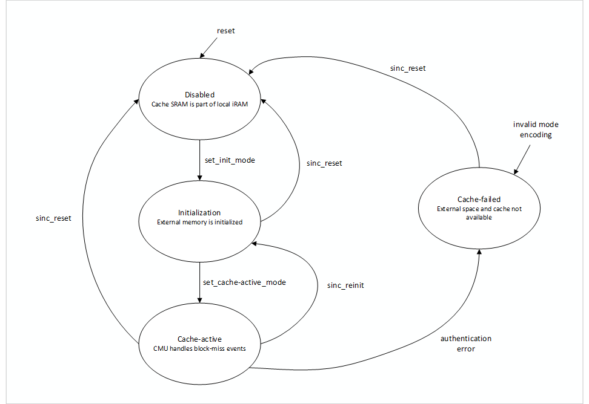
</figure>

Figure 4‑6: CMU modes

### CMU Interfaces

The CMU interfaces with the following units:

- The cache SRAM. CMU writes the cache when initializing it or replacing blocks.

- The Cache Interface Unit. The CIU issues a command to CMU when a block replacement is required. CMU indicates to CIU when the block replacement is completed. CMU also indicates to CIU what mode it is working on.

- The AXI interconnect fabric. This interface is required for CMU to access blocks in SRAM during initialization, for the security processor to write and read CMU registers, for CMU to read the BEK from the key store and for CMU to read and write external memory through the address translation unit.

### CMU Configuration

#### Mode

The CMU starts in “disabled” mode after reset. By writing a CMU register the security processor can change the mode from “disabled” to “initialization” and from “initialization” to “cache-actives”. If mode becomes cache-failed then the security processor can move it back to “disabled”.

The firmware loader in the security processor will change the mode to initialization prior to starting external memory initialization and it will change the mode to “cache-active” once initialization is completed.

Two special commands allow the security processor to move CMU mode backwards to “disabled” or “initialization”:

- In cache-active and cache-failed modes the security processor can issue a SInC local reset by writing the CMU command register. The local CMU reset will erase the cache SRAM and BEK before moving CMU mode to “disabled”.

- In cache-active mode the security processor can issue a SInC reinit command by writing the CMU command register. The reinit command will move CMU mode to initialization without changing the cache content nor erasing BEK.

Both reset and reinit commands can be disabled and locked by the security processor when the content of external memory is final.

It is possible for the security processor to change the state from “initialization” to “cache-active” without initializing any block. In this case all the cache lines in the local cache will be empty and will be brought in as needed on miss events. This is useful to accelerate power state transitions where the full security subsystem has undergone a reset or power cycle and the external memory content has been retained.

#### Key store slot

The key store slot where BEK is stored is configured by the firmware loader into a CMU register before changing CMU mode to initialization.

When transitioning from “disabled” to “initialization” mode CMU reads the BEK from the key store and stores it locally. The firmware loader will erase the BEK from the key store once initialization is completed.

#### Security processor address space base for blocks and authentication tags

A register in the CMU stores the base address that CMU will use when accessing blocks stored in external memory. The block address will be calculated by multiplying the block number by the block size and adding the result to the block base address. The configured base address must be in the range 9000_0000 to FFFF_FFFF so that the transactions are routed to the address translation unit.

A register in the CMU stores the base address that CMU will use when accessing authentication tags stored in external memory. The authentication tag address will be calculated by multiplying the block number by the block size and adding the result to the MAC base address. The configured base address must be in the range 9000_0000 to FFFF_FFFF so that the transactions are routed to the address translation unit.

The block and authentication tag base address registers can be updated only in disabled mode.

#### AES GCM IV

A different 96-bit initialization vector (IV) needs to be generated for the encryption/decryption of each block following the deterministic construction guidelines of NISP SP.800-38D, section 8.2.1. The 96-bit IV will be split into a fixed field generated by the firmware loader and written into a CMU configuration register and the invocation field calculated by HW based on the number of the block being processed by a particular AES-GCM invocation.

The size required by the invocation field depends on the external memory and block sizes. Among the supported configurations (16, 8, 4 or 2 MB external instruction memory size and 128, 256, 512 or 1024-byte block), the maximum number of blocks corresponds to the biggest external memory space and smaller block size: 16 MB / 128 bytes = 128K blocks. Thus, the count of number of blocks will always fit in 24 bits of the IV and 72 bits can be assigned to the fixed field configured by the firmware loader.

<figure>
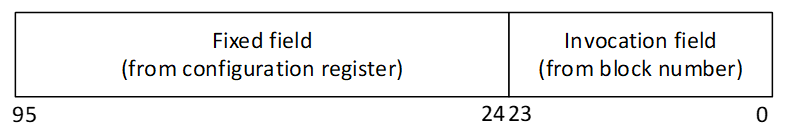
<figcaption>
Figure 4‑7: AES GCM 96-bit IV
</figcaption>
</figure>

The firmware loader in the security processor writes the fixed field of the IV in CMU register before issuing initialization commands. The IV configuration can only be modified in disabled mode.

When processing commands CMU calculates the block number part of the IV from the command input. As the external space is only setup once for a given key, there won’t be two invocations corresponding to different blocks with the same block number (same IV) and same key.

#### CMU reset disable

A status register bit in CMU determines whether the security processor can issue a local reset of CMU (see SInC reset command in section below). This status bit can be set to 1 by the security processor writing the CMU command register. Once set to 1 the CMU reset command is not allowed until security subsystem reset. The usage of this bit is for the firmware loader in the security processor to prevent further initializations of the external memory space.

#### CMU reinitialization disable

A status register bit in CMU determines whether the security processor can issue a reinit command to CMU (see SInC reinit command in section below). This status bit can be set to 1 by the security processor writing the CMU command register. Once set to 1 the SInC reinit command is not allowed until security subsystem reset. The usage of this bit is for the firmware loader in the security processor to prevent further modifications of the external memory space.

### CMU Commands

#### Commands in CMU Disabled Mode

In "disabled" mode CMU is inactive. The only command that the security processor can issue, apart from enabling AES-GCM cipher’s test mode and performing test encrypt/decrypt operations through the test interface (see [AES-GCM Test Mode](#aes-gcm-test-mode)), is a mode change to “initialization” mode. After receiving the mode change command CMU will fetch BEK from the key store, the key store will check that key attributes meet the following requirements:

- keysize is 256-bit

- IsDeviceSecret bit is set

- AESEncryptAllowed bit is set

- AESDecryptAllowed bit is set

If the attribute requirements above are not met, then CMU will remain in “disabled” mode and an error will be triggered. The attribute check can be disabled via AEB (see debug mode section) and in AES-GCM test mode there is no attribute check.

The key store needs to be modified to recognize SinC as a user and check the attributes above.

#### Commands in CMU Initialization mode

##### Block write command

The command contains the following information:

- First block number

- Number of blocks

- Shared ram address where the first block source is located

The firmware loader writes the command into CMU registers.

On a block write command CMU will read the blocks from shared ram, encrypt them, calculate the authentication tag and write the encrypted blocks and tags to external memory. The address of the first block and number of blocks to process is written into CMU registers prior to issuing the block write command.

##### Change mode to cache-active

Once initialization is completed the security processor will write CMU command register to move the mode to cache-active. The cache will start empty, all the valid bits will be 0.

##### SInC reset command

The SInC reset command will change CMU mode to “disabled”. Prior to changing mode, CMU will erase the cache SRAM and zero out the local copy of BEK and reset the MPU permissions. The IV register and other CMU configuration is not affected by the SInC reset.

The ability of the security processor to perform a SInC reset command can be disabled by the security processor via a CMU configuration register write. Once disabled any attempt to execute a SInC reset command will result on an invalid command error. The disabled status can only be cleared by a security subsystem reset (either por_reset or ss_reset inputs of the security subsystem).

#### Commands in cache-active mode

In cache-active mode the CMU can receive a block-miss command issued by CIU and, SInC reset and reinit commands issued by the security processor.

##### Block-miss command from CIU

The block-miss command contains the following information:

- Missing block number

- Block in set to be evicted from cache

CMU will calculate the address from where to fetch the external block and authentication tag from the command’s missing block number and the configured base addresses for block and authentication tag. .

CMU will calculate the cache address where the decrypted block is to be copied from the command’s missing block number and the command’s block to be evicted number.

Once the missing block has been copied into the cache CMU will signal CIU that the block copy is completed and CIU will update the oldest block in set status.

##### SinC reset command

The SInC reset command will change CMU mode to “disabled”. Prior to changing mode, CMU will erase the cache SRAM and zero out the local copy of BEK and reset the MPU permissions. The IV register and other CMU configuration is not affected by the SInC reset.

The ability of the security processor to perform a SInC reset command can be disabled by the security processor via a CMU configuration register write. Once disabled any attempt to execute a SInC reset command will result on an invalid command error. The disabled status can only be cleared by a security subsystem reset (either por_reset or ss_reset inputs of the security subsystem).

##### SInC reinit command

The SInC reinitialization command will change CMU mode from “cache-active” to “initialization”. The cache content and BEK copy in CMU are not affected by this command. The reinit command is intended to allow the security processor to extend or modify code and data previously loaded to external memory. A partial image can be loaded in a first initialization stage, then executed in cache-active mode and be later extended or modified in a subsequent initialization stage.

The ability of the security processor to perform a SInC reinit command can be disabled by the security processor via a CMU configuration register write. Once disabled any attempt to execute a SInC reinit command will result on an invalid command error. The disabled status can only be cleared by a security subsystem reset (either por_reset or ss_reset inputs of the security subsystem).

#### Commands in cache-failed mode

In cache-failed mode only security processor firmware can reset CMU back to “disabled” mode by issuing a cmu_reset command if cmu_reset command is not disabled.

### Encryption and authentication algorithm

Each block is encrypted/decrypted and authenticated using AES GCM. CMU contains a cipher able to perform AES-256 GCM with a throughput of one 128-bit block every 15 clock cycles.

There is no associated data input.

The AES-256 GCM cipher implements DPA countermeasures. CMU reads the seed for DPA countermeasures from the RNG in the security subsystem before the AES cipher processes any data. If the RNG cannot be read for any reason the corresponding error is set in the command status register and AES operations fail.

The 96-bit input IV is calculated from configuration and the block number (see CMU configuration section).

The symmetric key and its corresponding attributes will be read from the key store slot indicated by CMU configuration when mode is changed to initialization (see commands in CMU Disabled mode)

The implementation of AES GCM in CMU must be FIPS 140-3 L2 certifiable. A KAT (known answer test) must be run on the GCM cipher before firmware is allowed to use the cipher for external memory initialization. The KAT must be performed by the security processor using the cipher test interface before the AES-GCM cipher is used to initialize external space. If the KAT test fails firmware will not change CMU mode to “initialization" and firmware will decide what action to take, could force and security subsystem reset or keep running in CMU “Disable” mode .

The AES cipher in CMU could leverage the AES block cipher implementation in the general-purpose AES unit of the security subsystem. In the future it may be desirable to add GCM mode to the general-purpose AES unit or use the CMU cipher as a standalone unit not subject to the limited use cases of CMU (fixed length messages, no AAD). For a guide to what the CMU cipher should aim to, see “Standalone AES” in references.

#### AES-GCM Test Mode

NIST CAVP GCMVS and AESVS (ECB mode) must be run on CMU’s cipher. To allow testing arbitrary message lengths (AAD length is always set to 0) a test register interface is added to CMU (see AES-GCM Test registers in Programming model section). Firmware will be able to apply tests by controlling and observing the inputs and outputs of the block cipher.

The test mode can only be enabled when CMU is in “Disabled” state.

The procedure firmware will follow to apply tests to the cipher will be:

- set the cipher in test mode by writing “Test_enable” field in AES-GCM Test Control register.

- Store the key in the key store and IV in “AES GCM IV Nonce” registers. Use the keystore_slot of the “Block_encryption_key” register and the “set_key_and_iv” field of “AES-GCM Test Control” register to transfer the key and IV to the cipher.

- use the registers “AES-GCM Test Data In” and “AES-GCM Test Control register” to set the cipher mode and input data to the cipher and registers “AES-GCM Test Data Out” and “AES-GCM Test Status” to observe the cipher outputs, requests for inputs and valid indications for outputs.

In AES-GCM mode the tag is output at the end on “AES-GCM Test Data Out” registers. The test interface can be used by firmware to run the on reset KAT test.

### CMU DMA

#### Initialization mode

When writing a block to external memory CMU reads the source from shared ram and writes the encrypted data and authentication tag to an address translation unit address. The security processor is responsible for copying and authenticating the data to shared ram.

<figure>
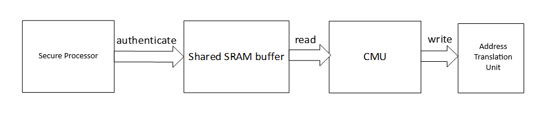
<figcaption>
Figure 4‑8: CMU data flow in initialization mode
</figcaption>
</figure>

#### Cache-active mode

When CMU is in cache-active mode a cache miss will trigger a block to be brought from external memory into the cache. CMU performs the following operations:

- Read from address translation unit address and write the data received into an internal buffer.

- Decrypt and authenticate the data from buffer and if authentication passes write decrypted data into cache.

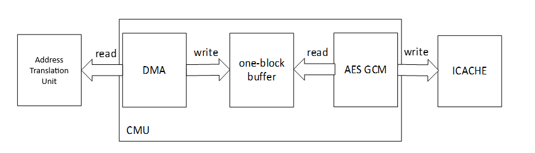

Figure 4‑9: CMU data flow when processing block-miss

CMU uses an internal intermediate buffer to store data read from external memory when servicing a cache miss.

### Error reporting

CMU contains a status register readable by the security processor with the following information:

- Command in progress flag -\> cleared when the command register is written, set when the command is completed

- Command completion status. Indicates whether the command written in “SInC Command Register” completed successfully and in case of failure the cause of the error. See the list of reported errors in “[SInC Status Register](#sinc-status-register)” section.

In cache-active mode an authentication tag check failure or a read completion error or an AES fault will prevent the block to be loaded into the cache, mode CMU mode to cache-failed, and cause an error that could be routed to an event collector. Additionally the failure to access the cache will be indicated to the security processor through its TCM interface, equivalent to an access denied error that will trigger an instruction access or load access fault. The exception handler will determine how the security processor will recover depending on the content in external memory, possible actions are forcing security subsystem reset, reinitializing external memory, downgrading to a mode without external memory, etc.

### Cache performance monitor

CMU monitors cache performance via counters for hit and miss events. The counters can be erased and enabled via the control bits in a “CMU Performance Counters Control” register.

CMU also provides a counter to measure DMA read latency when processing cache misses.

For details see CMU HIT Counter, CMU MISS Counter, CMU LAT counter and CMU Performance Counters Control registers in CMU registers section.

Firmware Implementation Note:

The miss counter will increment by 1 for each block miss while the latency counter increments by *at least* 1. Therefore, the latency counter will stop incrementing before the miss counter. If that happens, the design described in the counter section (where incrementing stops at overflow) means the miss counter will continue to increment, and the (calculated) average latency per miss will decrease. For average latency to be meaningful, firmware must treat both miss and latency counters as invalid if either is at overflow, and take firmware action (such as periodic polling and reset) to ensure they never reach that state.

### Debug mode

Encryption and authentication may be bypassed for debugging. An AEB set to N/SP in TEST Security State and HWNO for all other Security States will indicate to CMU that encryption and authentication is to be bypassed in CMU. Blocks are written into external memory in plaintext and authentication tag checks always succeed.

| Description                  | UNKNOWN | BLANK | TEST | PROD | SECURE | RETEST |
|------------------------------|---------|-------|------|------|--------|--------|
| SInC authentication disabled | HWNO    | HWNO  | N/SP | HWNO | HWNO   | HWNO   |

Table 4‑5: AEB to disable SInC authentication.

Key attribute check can be skipped for debugging. An AEB set to N/SP in TEST Security State and HWNO for all other Security States will indicate to CMU that key attributes are not to be checked when BEK is fetched from the key store. This will allow security processor firmware loader to use a known key for debugging CIU and CMU.

| Description                       | UNKNOWN | BLANK | TEST | PROD | SECURE | RETEST |
|-----------------------------------|---------|-------|------|------|--------|--------|
| SInC key attribute check disabled | HWNO    | HWNO  | N/SP | HWNO | HWNO   | HWNO   |

Table 4‑6: AEB to disable SInC key attribute check.

## Cache SRAM

The cache SRAM has the same requirements as the current IRAM SRAM regarding initialization, data scrambling and error correction/detection.

## Address translation unit configuration

Firmware loader will configure the address translation unit so that reads and writes issued by CMU reach the correct destination at external memory. When CMU state is not “Disabled” an address translation unit region (slot in translation table) needs to be assigned for the mapping of internal addresses to the external 16MB of data + tag space. The size of tag space will depend on the block size, for example the tag space for a cache block size of 256 bytes would require 1MB to store tags (there are 64K cache blocks in 16MB and each cache block requires storing a 16 byte tag, 64K\*16 = 1MB).

The number of pending reads that the address translation unit supports will need to be adjusted depending on maximum latency requirement when pages are brought into IRAM.

## Static parameters

The cache is statically configured (via RTL parameters):

- Size of external instruction memory (16 MB, 8 MB, 4 MB, 2 MB). The default parameter value will be 16 MB.

- Cache size (128 KB, 256 KB or 512 KB). The default parameter value is 256 KB.

Block size (128, 256, 512 or 1024 bytes). The default parameter value is 256 bytes. The default settings listed are the current settings used in the first version and must be implemented and verified.

The parameter options that are not the default might not be validated other than the set that is chosen initially but they need to be available for evaluation or changes. See the Appendix sections for guidance on the methodology of evaluating different tradeoffs and how to pick the optimal settings for these parameters.

# Requirements

Cache hits should have at most 1 clock cycle more than local IRAM accesses. Latency for local iRAM accesses should remain the same as without SinC.

The address translation unit number of pending reads and fabric throughput must be able to sustain AES encrypt/decrypt rate (128-bit/15 clock cycles).

# Model

For a model of the AES-GCM implementation in CMU see reference to “Standalone 1RxC AES”.

# Control and Data Flow 

NA

# Error Reporting

CIU reports errors related to memory protection violations. See “Access Control” section.

For CMU errors see section “[Error reporting](#error-reporting)” in “[Cache Management Unit](#cache-management-unit)”.

# Programmer’s Model

## External Memory System Setup

The external memory region that the security subsystem will use for external instruction storage needs to be setup and pinned at the system level before the security subsystem can start writing to it.

Different systems will handle this differently. For example, on a past project, a fixed region of DRAM is carved out during early boot for the security subsystem to use and the security subsystem always has access to this DRAM. For recent projects, a fixed region of DRAM is still carved out during early boot for the security subsystem but is taken away later. When the system boots to WinLoad, it will need to allocate DRAM memory for the security subsystem to use and pin that memory in the system. Winload will then place the “larger Windows runtime” security subsystem firmware image in this DRAM for the security subsystem to load. The initial part of this firmware will fit in the always local iRAM and contain the components needed to set the cache to initialization mode, and then move the rest of the firmware code, piece by piece, using CMU, into DRAM. The DRAM region needs to be non-cacheable and pinned and be large enough to contain the external space data and tags. The security subsystem address translation unit will have to reserve an address translation slot for access to this DRAM carve-out.

Access time when the security processor reads code mapped to external memory is variable, it will depend on whether the content accessed is in the cache or it needs to be brought from external memory and read latency to external memory may be affected by external factors. Some code like interrupt and exception handlers, error response routines, low-lever security code that requires fixed latency must be placed into the always local iRAM.

### When generating the BEK key firmware needs to ensure the key attributes will pass the key attribute check in CMU, see “[CMU Commands](#cmu-commands)

[Commands in CMU Disabled Mode](#cmu-commands)” section. If the BEK key needs to be saved/restored to support SoC power-management flows, the “SaveKeyAllowed” attribute needs to be set too, in this case firmware would use SHACK commands: “SaveKey” to save the key and “LoadKey” to restore the key.

## Secure Instruction Cache registers

The following register descriptions are for guidance

### SInC Command Register

The security processor writes SInC command register to perform CMU operation or change its mode or status. Section “[CMU Commands](#cmu-commands)” describes what commands are valid depending on mode. Every field in this register executes a command when written to 1, either changing CMU mode or status. All fields are WO, so this register read value is always 0. CMU mode and status, including command completion or in progress status, can be read in SInC Status Register. On every write only one of the fields can be set to 1, if more than one field is written to 1 on the same transaction, then the command results in an “Invalid Command” error.

<table>
<colgroup>
<col style="width: 13%" />
<col style="width: 5%" />
<col style="width: 6%" />
<col style="width: 9%" />
<col style="width: 65%" />
</colgroup>
<thead>
<tr>
<th style="text-align: left;"><strong>Signal Name </strong></th>
<th style="text-align: left;"><strong>Type </strong></th>
<th style="text-align: left;"><strong>Width </strong></th>
<th style="text-align: center;"><strong>Default</strong></th>
<th style="text-align: left;"><strong>Description </strong></th>
</tr>
</thead>
<tbody>
<tr>
<td style="text-align: left;"><strong>set_init_mode</strong></td>
<td style="text-align: left;">WO</td>
<td style="text-align: left;">1</td>
<td style="text-align: left;">0</td>
<td style="text-align: left;">When written to 1 changes CMU mode from “Disabled” to “Initialization”</td>
</tr>
<tr>
<td style="text-align: left;"><strong>set_cache-active_mode</strong></td>
<td style="text-align: left;">WO</td>
<td style="text-align: left;">1</td>
<td style="text-align: left;">0</td>
<td style="text-align: left;">When written to 1 changes CMU mode from “Initialization” to “Cache-active”</td>
</tr>
<tr>
<td style="text-align: left;"><strong>sinc_reset</strong></td>
<td style="text-align: left;">WO</td>
<td style="text-align: left;">1</td>
<td style="text-align: left;">0</td>
<td style="text-align: left;">
If CMU_reset_disabled is set to 0 in CMU status register when sinc_reset is written to 1 CMU mode is moved to “Disabled”. Note this command erases the instruction cache and CMU block encryption key as well as MPU permission settings for the cache and external address space.

If CMU_reset_disabled is set to 1 in CMU status register writing 1 to sinc_reset results in “Invalid Command” error.
</td>
</tr>
<tr>
<td style="text-align: left;"><strong>sinc_reinit</strong></td>
<td style="text-align: left;">WO</td>
<td style="text-align: left;">1</td>
<td style="text-align: left;">0</td>
<td style="text-align: left;">If CMU is in cache-active mode and CMU_reinit_disabled is set to 0 in CMU status register when sinc_reinit is written to 1 CMU mode is moved to “Initialization”. This command does not erase BEK from CMU nor cache and external memory content.</td>
</tr>
<tr>
<td style="text-align: left;"><strong>encrypt_block</strong></td>
<td style="text-align: left;">WO</td>
<td style="text-align: left;">1</td>
<td style="text-align: left;">0</td>
<td style="text-align: left;">
When CMU mode is “Initialization” writing encrypt_block to 1 performs a block initialization operation in CMU.

If encrypt_block is set to 1 when mode is different than “Initizalization” then the command results in “Invalid command” error.
</td>
</tr>
<tr>
<td style="text-align: left;"><strong>disable_reset</strong></td>
<td style="text-align: left;">WO</td>
<td style="text-align: left;">1</td>
<td style="text-align: left;">0</td>
<td style="text-align: left;">When written to 1 sets the CMU_reset_disabled status to 1.</td>
</tr>
<tr>
<td style="text-align: left;"><strong>disable_reinit</strong></td>
<td style="text-align: left;">WO</td>
<td style="text-align: left;">1</td>
<td style="text-align: left;">0</td>
<td style="text-align: left;">When written to 1 sets the CMU_reinit_disabled status to 1.</td>
</tr>
</tbody>
</table>

### First Block Encryption Number Register

| **Signal Name ** | **Type ** | **Width ** | **Default** | **Description** |
|:---|:---|:---|:---|:---|
| **First_block_number** | RW  | 24 | 0x000000 | Block number for the first block of an encrypt block command |

### Number of Encryption Blocks Register

| **Signal Name ** | **Type ** | **Width ** | **Default** | **Description** |
|:---|:---|:---|:---|:---|
| **Number_of_blocks** | RW  | 11 | 0 | Number of blocks to encrypt in encrypt block command |

### Block Encryption Address Register

| **Signal Name ** | **Type ** | **Width ** | **Default** | **Description ** |
|:---|:---|:---|:---|:---|
| **shared_sram_addr** | RW | 32 | 0x00000000 | Shared ram address from where the block will be fetched in encrypt block command |

### Block Encryption Key Register

| **Signal Name ** | **Type ** | **Width ** | **Default** | **Description ** |
|:---|:---|:---|:---|:---|
| **keystore_slot** | RW  | 16 | 0x0000 | Key store slot where CMU will fetch the Block Encryption Key. Writes to this register are discarded when CMU mode is set to “Initialization” or “Cache-active”. |

### AES GCM IV Nonce 1 Register

<table style="width:100%;">
<colgroup>
<col style="width: 14%" />
<col style="width: 6%" />
<col style="width: 7%" />
<col style="width: 14%" />
<col style="width: 57%" />
</colgroup>
<thead>
<tr>
<th style="text-align: left;"><strong>Signal Name </strong></th>
<th style="text-align: left;"><strong>Type </strong></th>
<th style="text-align: left;"><strong>Width </strong></th>
<th style="text-align: left;"><strong>Default</strong></th>
<th style="text-align: left;"><strong>Description </strong></th>
</tr>
</thead>
<tbody>
<tr>
<td style="text-align: left;"><strong>IV DW1</strong></td>
<td style="text-align: left;">RW </td>
<td style="text-align: left;">32</td>
<td style="text-align: left;">0x00000000</td>
<td style="text-align: left;">
Bits 31:0 of CMU’s AES GCM 96-bit IV. Writes to this register are discarded when CMU mode is set to “Cache-active”.

When test interface of CMU’s AES-GCM cipher is enabled this register contains bits 31:0 of the IV cipher input. See section <a href="#aes-gcm-iv">5.2.2.4</a> on how to set this.
</td>
</tr>
</tbody>
</table>

### AES GCM IV Nonce 2 Register

<table style="width:100%;">
<colgroup>
<col style="width: 14%" />
<col style="width: 6%" />
<col style="width: 7%" />
<col style="width: 14%" />
<col style="width: 57%" />
</colgroup>
<thead>
<tr>
<th style="text-align: left;"><strong>Signal Name </strong></th>
<th style="text-align: left;"><strong>Type </strong></th>
<th style="text-align: left;"><strong>Width </strong></th>
<th style="text-align: left;"><strong>Default</strong></th>
<th style="text-align: left;"><strong>Description </strong></th>
</tr>
</thead>
<tbody>
<tr>
<td style="text-align: left;"><strong>IV DW2</strong></td>
<td style="text-align: left;">RW </td>
<td style="text-align: left;">32</td>
<td style="text-align: left;">0x00000000</td>
<td style="text-align: left;">
Bits 63:32 of CMU’s AES GCM 96-bit IV. Writes to this register are discarded when CMU mode is set to “Cache-active”.

When test interface of CMU’s AES-GCM cipher is enabled this register contains bits 63:32 of the IV cipher input.
</td>
</tr>
</tbody>
</table>

### AES GCM IV Nonce 3 Register

| **Signal Name ** | **Type ** | **Width ** | **Default** | **Description ** |
|:---|:---|:---|:---|:---|
| **IV DW3** | RW  | 8 | 0x00 | Bits 71:64 of CMU’s AES GCM 96-bit IV. Writes to this register are discarded when CMU mode is set to “Cache-active”. |
| **IV_DW3_Test** | RW | 24 | 0x000000 | Bits 95:72 IV input of CMU’s AES-GCM when AES-GCM test interface is enabled (see AES-GCM Test Control register) |

### Block base address Register

The lower bits of this register will be tied-low as the block base address must be aligned to block boundary. The number of bits tied low depends on the block size.

| **Signal Name ** | **Type ** | **Width ** | **Default** | **Description ** |
|:---|:---|:---|:---|:---|
| **Block_base_addr** | RW  | 32 | 0x00000000 | Base address in internal security subsystem address map for DMA block transactions sent to the address translation unit. Writes to this register are discarded when CMU mode is set to “Cache-active”. |

### Authentication tag base address Register

| **Signal Name ** | **Type ** | **Width ** | **Default ** | **Description ** |
|:---|:---|:---|----|:---|
| **tag_base_addr** | RW  | 32 | 0x00000000 | Bits 31:4 of the base address in internal security subsystem address map for DMA tag transactions sent to the address translation unit. Writes to this register are discarded when CMU mode is set to “Cache-active”. As the tag base address must be aligned to the tag size (16 bytes) the lower 4 bits of the are always 0. |

###  SInC Status Register

<table style="width:100%;">
<colgroup>
<col style="width: 21%" />
<col style="width: 6%" />
<col style="width: 7%" />
<col style="width: 9%" />
<col style="width: 54%" />
</colgroup>
<thead>
<tr>
<th style="text-align: left;"><strong>Signal Name </strong></th>
<th style="text-align: left;"><strong>Type </strong></th>
<th style="text-align: left;"><strong>Width </strong></th>
<th style="text-align: center;"><strong>Default</strong></th>
<th style="text-align: left;"><strong>Description </strong></th>
</tr>
</thead>
<tbody>
<tr>
<td style="text-align: left;"><strong>CMU_reinit_disabled</strong></td>
<td style="text-align: left;">RO</td>
<td style="text-align: left;">1</td>
<td style="text-align: left;">1</td>
<td style="text-align: left;">
0 – SInC reinit command is valid and will set mode back to “Initialization”

1 – SInC reinit command is invalid.
</td>
</tr>
<tr>
<td style="text-align: left;"><strong>CMU_reset_disabled</strong></td>
<td style="text-align: left;">RO</td>
<td style="text-align: left;">1</td>
<td style="text-align: left;">1</td>
<td style="text-align: left;">
0 – SInC reset command is valid and will set mode back to “Disabled”

1 – SInC reset command is invalid.
</td>
</tr>
<tr>
<td style="text-align: left;"><strong>Mode</strong></td>
<td style="text-align: left;">RO </td>
<td style="text-align: left;">8</td>
<td style="text-align: left;">0x00</td>
<td style="text-align: left;">
CMU mode.

0x00 – Disabled

0x0F – Initialization

0xF0 – Cache-active

0xFF – Cache-failed
</td>
</tr>
<tr>
<td style="text-align: left;"><strong>Command_status</strong></td>
<td style="text-align: left;">RO</td>
<td style="text-align: left;">5</td>
<td style="text-align: left;">0x1</td>
<td style="text-align: left;">
0x0 - Command in progress.

0x1 – Command completed without errors.

0x2 – Command failed.

0x3 - Invalid CMU command. Set when the command written into “SinC command” register has invalid encoding.

0x4 – HW inconsistent state error. Indicates that redundancy checks in CMU failed, an example is invalid CMU mode encoding. Set when HW state becomes invalid due to fault or glitch injection.

0x5 – Key fetch failed. Set when CMU key read from the key store failed.

0x6 - Read completion error when reading from external memory

0x7 - Authentication tag check fail

0x8 - RNG error. DPA seed read failed.

0x9 – Write completion error at initialization.

0xA – AES fault indication, countermeasure against fault-injection, was set.

0xB-0xF Reserved
</td>
</tr>
</tbody>
</table>

### CMU Hit Counter Lower Bits Register

| **Signal Name ** | **Type ** | **Width ** | **Default** | **Description ** |
|:---|:---|:---|:---|:---|
| **CMU_HIT_CNT_LO** | RO | 32 | 0 | Lower 32 bits of CMU HIT counter. CMU HIT counter counts the number of cache-hit events when CMU_HIT_CNT_EN in “CMU Performance Counters Control” register has value 1. The counter resets when CMU_HIT_CNT_CLR bit is written to 1. The counter doesn’t roll-over, if it ever reaches its max value (0xFFFFFFFFFFFF) it stops incrementing. |

###  CMU Hit Counter Upper Bits Register

| **Signal Name ** | **Type ** | **Width ** | **Default** | **Description ** |
|:---|:---|:---|:---|:---|
| **Reserved** | RO | 16 | 0 | Reserved |
| **CMU_HIT_CNT_HI** | RO | 16 | 0 | Upper 16 bits of CMU HIT counter. CMU HIT counter counts the number of cache-hit events when CMU_HIT_CNT_EN in “CMU Performance Counters Control” register has value 1. The counter resets when CMU_HIT_CNT_CLR bit is written to 1. The counter doesn’t roll over, if it ever reaches its max value (0xFFFFFFFFFFFF) it stops incrementing. |

###  CMU Miss Counter Lower Bits Register

| **Signal Name ** | **Type ** | **Width ** | **Default** | **Description ** |
|:---|:---|:---|:---|:---|
| **CMU_MISS_CNT_LO** | RO | 32 | 0 | Lower 32 bits of CMU MISS counter. CMU MISS counter counts the number of cache-miss events when CMU_MISS_CNT_EN in “CMU Performance Counters Control” register has value 1. The counter resets when CMU_MISS_CNT_CLR bit is written to 1. The counter doesn’t roll over, if it ever reaches its max value (0xFFFFFFFFFFFF) it stops incrementing. |

###  CMU Miss Counter Upper Bits Register

| **Signal Name ** | **Type ** | **Width ** | **Default** | **Description ** |
|:---|:---|:---|:---|:---|
| **Reserved** | RO | 16 | 0 | Reserved |
| **CMU_MISS_CNT_HI** | RO | 16 | 0 | Upper 16 bits of CMU MISS counter. CMU MISS counter counts the number of cache-miss events when CMU_MISS_CNT_EN in “CMU Performance Counters Control” register has value 1. The counter resets when CMU_MISS_CNT_CLR bit is written to 1. The counter doesn’t roll over, if it ever reaches its max value (0xFFFFFFFFFFFF) it stops incrementing. |

###  CMU Latency Counter Lower Bits Register

<table>
<colgroup>
<col style="width: 20%" />
<col style="width: 4%" />
<col style="width: 7%" />
<col style="width: 9%" />
<col style="width: 57%" />
</colgroup>
<thead>
<tr>
<th style="text-align: left;"><strong>Signal Name </strong></th>
<th style="text-align: left;"><strong>Type </strong></th>
<th style="text-align: left;"><strong>Width </strong></th>
<th style="text-align: center;"><strong>Default</strong></th>
<th style="text-align: left;"><strong>Description </strong></th>
</tr>
</thead>
<tbody>
<tr>
<td style="text-align: left;"><strong>CMU_LAT_CNT_LO</strong></td>
<td style="text-align: left;">RO</td>
<td style="text-align: left;">32</td>
<td style="text-align: left;">0</td>
<td style="text-align: left;">
Lower 32 bits of CMU LAT counter. CMU Read Latency measurement. When CMU_LAT_CNT_EN in “CMU Performance Counters Control” register is written to 1, CMU LAT counter accumulates the latency on CMU DMA reads. The counter will start counting clock cycles when CMU starts a read transaction to the address translation unit and stop when the read completion bringing the last byte of the missed block into the cache reaches CMU, it measures latency outside CMU, doesn’t measure the time of the data going through decryption and authentication functions. It will count cycles for all reads for as long as CMU_LAT_CNT_EN is set.

The counter resets when CMU_LAT_CNT_CLR bit in “CMU Performance Counters Control” is written to 1.

CMU_LAT_CNT doesn’t roll over, it stops if it reaches it max value (0xFFFFFFFFFFFF).
</td>
</tr>
</tbody>
</table>

###  CMU Latency Counter Upper Bits Register

<table>
<colgroup>
<col style="width: 20%" />
<col style="width: 4%" />
<col style="width: 7%" />
<col style="width: 9%" />
<col style="width: 57%" />
</colgroup>
<thead>
<tr>
<th style="text-align: left;"><strong>Signal Name </strong></th>
<th style="text-align: left;"><strong>Type </strong></th>
<th style="text-align: left;"><strong>Width </strong></th>
<th style="text-align: center;"><strong>Default</strong></th>
<th style="text-align: left;"><strong>Description </strong></th>
</tr>
</thead>
<tbody>
<tr>
<td style="text-align: left;"><strong>CMU_LAT_CNT_HI</strong></td>
<td style="text-align: left;">RO</td>
<td style="text-align: left;">16</td>
<td style="text-align: left;">0</td>
<td style="text-align: left;">
Upper 16 bits of CMU LAT counter. CMU Read Latency measurement. When CMU_LAT_CNT_EN in “CMU Performance Counters Control” register is written to 1, CMU LAT counter accumulates the latency on CMU DMA reads. The counter will start counting clock cycles when CMU starts a read transaction to the address translation unit and stop when the read completion bringing the last byte of the missed block into the cache reaches CMU, it measures latency outside CMU, doesn’t measure the time of the data going through decryption and authentication functions. It will count cycles for all reads for as long as CMU_LAT_CNT_EN is set.

The counter resets when CMU_LAT_CNT_CLR bit in “CMU Performance Counters Control” is written to 1.

CMU_LAT_CNT doesn’t roll over, it stops if it reaches it max value (0xFFFFFFFFFFFF).
</td>
</tr>
</tbody>
</table>

### CMU Performance Counters Control Register

| **Signal Name ** | **Type ** | **Width ** | **Default** | **Description ** |
|:---|:---|:---|:---|:---|
| **CMU_HIT_CNT_CLR** | RW/V | 1 | 0 | When written to 1 clears CMU HIT counter. HW clears this field after counter has been cleared. |
| **CMU_HIT_CNT_EN** | RW | 1 | 0 | When set to 1, it enables cache hit event counting. When set to 0 CMU HIT counter doesn’t increment on cache hit events. |
| **Reserved** | RO | 5 | 0 | Reserved |
| **CMU_MISS_CNT_CLR** | RW/V | 1 | 0 | When written to 1 clears CMU MISS counter. HW clears this field after counter has been cleared. |
| **CMU_MISS_CNT_EN** | RW | 1 | 0 | When set to 1, cache miss event counting is enabled. When set to 0 CMU MISS counter doesn’t increment on cache miss events. |
| **Reserved** | RO | 5 | 0 | Reserved |
| **CMU_LAT_CNT_CLR** | RW/V | 1 | 0 | When written to 1 clears CMU MISS counter. HW clears this field after counter has been cleared. |
| **CMU_LAT_CNT_EN** | RW | 1 | 0 | When set to 1 CMU DMA latency is accumulated in CMU LAT counter. |
| **Reserved** | RO | 14 | 0 | Reserved |

###  AES-GCM Test Data Input 0

| **Signal Name ** | **Type ** | **Width ** | **Default** | **Description ** |
|:---|:---|:---|:---|:---|
| **AES_DATA_IN_0** | RW | 32 | 0 | Bits 31:0 of CMU AES cipher input in test mode. |

###  AES-GCM Test Data Input 1

| **Signal Name ** | **Type ** | **Width ** | **Default** | **Description ** |
|:---|:---|:---|:---|:---|
| **AES_DATA_IN_1** | RW | 32 | 0 | Bits 63:32 of CMU AES cipher input in test mode. |

###  AES-GCM Test Data Input 2

| **Signal Name ** | **Type ** | **Width ** | **Default** | **Description ** |
|:---|:---|:---|:---|:---|
| **AES_DATA_IN_2** | RW | 32 | 0 | Bits 95:63 of CMU AES cipher input in test mode. |

### AES-GCM Test Data Input 3

| **Signal Name ** | **Type ** | **Width ** | **Default** | **Description ** |
|:---|:---|:---|:---|:---|
| **AES_DATA_IN_3** | RW | 32 | 0 | Bits 127:96 of CMU AES cipher input in test mode. |

### AES-GCM Test Data Output 0

| **Signal Name ** | **Type ** | **Width ** | **Default** | **Description ** |
|:---|:---|:---|:---|:---|
| **AES_DATA_OUT_0** | RO | 32 | 0 | Bits 31:0 of CMU AES cipher output in test mode. |

### AES-GCM Test Data Output 1

| **Signal Name ** | **Type ** | **Width ** | **Default** | **Description ** |
|:---|:---|:---|:---|:---|
| **AES_DATA_OUT_1** | RO | 32 | 0 | Bits 63:32 of CMU AES cipher output in test mode. |

### AES-GCM Test Data Output 2

| **Signal Name ** | **Type ** | **Width ** | **Default** | **Description ** |
|:---|:---|:---|:---|:---|
| **AES_DATA_OUT_2** | RO | 32 | 0 | Bits 95:63 of CMU AES cipher output in test mode. |

### AES-GCM Test Data Output 3

| **Signal Name ** | **Type ** | **Width ** | **Default** | **Description ** |
|:---|:---|:---|:---|:---|
| **AES_DATA_OUT_3** | RO | 32 | 0 | Bits 127:96 of CMU AES cipher output in test mode. |

### AES-GCM Test Control Register

<table style="width:97%;">
<colgroup>
<col style="width: 18%" />
<col style="width: 6%" />
<col style="width: 7%" />
<col style="width: 7%" />
<col style="width: 56%" />
</colgroup>
<thead>
<tr>
<th style="text-align: left;"><strong>Signal Name </strong></th>
<th style="text-align: left;"><strong>Type </strong></th>
<th style="text-align: left;"><strong>Width </strong></th>
<th style="text-align: center;"><strong>Default</strong></th>
<th style="text-align: left;"><strong>Description </strong></th>
</tr>
</thead>
<tbody>
<tr>
<td style="text-align: left;"><strong>Test enable</strong></td>
<td style="text-align: left;">RW</td>
<td style="text-align: left;">1</td>
<td style="text-align: left;">0</td>
<td style="text-align: left;">Enables test interface of the AES-GCM cipher in CMU.</td>
</tr>
<tr>
<td style="text-align: left;"><strong>Mode</strong></td>
<td style="text-align: left;">RW</td>
<td style="text-align: left;">4</td>
<td style="text-align: left;">0</td>
<td style="text-align: left;">
Cipher mode when AES-GCM test interface is enabled.

0001: ECB

0111: GCM
</td>
</tr>
<tr>
<td style="text-align: left;"><strong>Enc_Dec</strong></td>
<td style="text-align: left;">RW</td>
<td style="text-align: left;">1</td>
<td style="text-align: left;">0</td>
<td style="text-align: left;">
Encrypt/decrypt input when AES-GCM test interface is enabled.

1: encrypt

0: decrypt
</td>
</tr>
<tr>
<td style="text-align: left;"><strong>Key_length</strong></td>
<td style="text-align: left;">RW</td>
<td style="text-align: left;">2</td>
<td style="text-align: left;">0</td>
<td style="text-align: left;">
Key length input when AES-GCM test interface is enabled.

00: Reserved

01: Reserved

10: 256-bit key

11: reserved
</td>
</tr>
<tr>
<td style="text-align: left;"><strong>Set_key_and_iv</strong></td>
<td style="text-align: left;">RW/V</td>
<td style="text-align: left;">1</td>
<td style="text-align: left;">0</td>
<td style="text-align: left;">When written to 1 CMU will read the key from the key store slot indicated in the keystore_slot field of the “Block_encryption_key” register and set it up to be used in subsequent test operations. Additionally CMU will read the IV from AES-GCM IV Nonce registers and set it up to be used in subsequent test operations. HW resets this bit to 0 when the cipher has loaded the IV and key.</td>
</tr>
<tr>
<td style="text-align: left;"><strong>Data_in_valid</strong></td>
<td style="text-align: left;">RW/V</td>
<td style="text-align: left;">1</td>
<td style="text-align: left;">0</td>
<td style="text-align: left;">
When written to 1 the AES-GCM cipher loads the input data block contained in “AES-GCM IV Data_IN 0..3” registers (data_in_last and Data_in_BE indicate whether the block is the last one in a message and how many bytes it contains).

HW resets this bit to 0 when the cipher has loaded the IV.
</td>
</tr>
<tr>
<td style="text-align: left;"><strong>Data_in_byte_cnt</strong></td>
<td style="text-align: left;">RW</td>
<td style="text-align: left;">4</td>
<td style="text-align: left;">0</td>
<td style="text-align: left;">Indicates how many bytes are valid in data_in_0..3 registers. Only applicable when Data_in_last is written to 1.</td>
</tr>
<tr>
<td style="text-align: left;"><strong>Data_in_last</strong></td>
<td style="text-align: left;">RW</td>
<td style="text-align: left;">1</td>
<td style="text-align: left;">0</td>
<td style="text-align: left;">Indicates that the block stored in data_in_0..3 registers is the last one in a message.</td>
</tr>
<tr>
<td style="text-align: left;"><strong>Data_out_ack</strong></td>
<td style="text-align: left;">RW/V</td>
<td style="text-align: left;">1</td>
<td style="text-align: left;">0</td>
<td style="text-align: left;">Indicates that data_out_0..3 registers have been read by the tester. The block cipher will set data_out_valid to 0 when data_out_taken is written to 1. HW will automatically reset data_out_taken after it is written to 1.</td>
</tr>
</tbody>
</table>

### AES-GCM Test Status Register

<table style="width:97%;">
<colgroup>
<col style="width: 14%" />
<col style="width: 4%" />
<col style="width: 6%" />
<col style="width: 8%" />
<col style="width: 62%" />
</colgroup>
<thead>
<tr>
<th style="text-align: left;"><strong>Signal Name </strong></th>
<th style="text-align: left;"><strong>Type </strong></th>
<th style="text-align: left;"><strong>Width </strong></th>
<th style="text-align: center;"><strong>Default</strong></th>
<th style="text-align: left;"><strong>Description </strong></th>
</tr>
</thead>
<tbody>
<tr>
<td style="text-align: left;"><strong>IV_ready</strong></td>
<td style="text-align: left;">RO</td>
<td style="text-align: left;">1</td>
<td style="text-align: left;">0</td>
<td style="text-align: left;">Indicates that AES-GCM test interface is ready to receive IV (IV_valid can be written to 1)</td>
</tr>
<tr>
<td style="text-align: left;"><strong>Data_in_ready</strong></td>
<td style="text-align: left;">RO</td>
<td style="text-align: left;">1</td>
<td style="text-align: left;">0</td>
<td style="text-align: left;">Indicates that AES-GCM test interface is ready to receive input data (data_in_valid can be written to 1)</td>
</tr>
<tr>
<td style="text-align: left;"><strong>Data_out_valid</strong></td>
<td style="text-align: left;">RO</td>
<td style="text-align: left;">1</td>
<td style="text-align: left;">0</td>
<td style="text-align: left;">Indicates that AES-GCM test interface output data is valid (data_out_taken must be written to 1 to retire the output data block)</td>
</tr>
<tr>
<td style="text-align: left;"><strong>Tag_out</strong></td>
<td style="text-align: left;">RO</td>
<td style="text-align: left;">1</td>
<td style="text-align: left;">0</td>
<td style="text-align: left;">
Indicates then the value at AES_GCM_Test Data_Output registers correspond to a tag or plaintext/ciphetext.

0: data output is plaintext or ciphertext

1: data output is the authentication tag
</td>
</tr>
<tr>
<td style="text-align: left;"><strong>Key_ready</strong></td>
<td style="text-align: left;">RO</td>
<td style="text-align: left;">1</td>
<td style="text-align: left;">0</td>
<td style="text-align: left;">
Indicates when the set_key_and_iv operation is done. After writing set_key_and_iv field to 1 in AES-GCM Test Control register, firmware must poll for this field to be 1 before inputting test data.

0: setting key and IV operation in progress

1: key and IV set operation done

HW sets this field to 0 when set_key_and_iv field is written to 1 and sets this field to 1 once the key and IV are set.
</td>
</tr>
</tbody>
</table>

# Area Target

The area dedicated to CIU/CMU logic is expected to be much smaller than the SRAM area dedicated to cache. The decision to include SinC or not for each project will largely depend on the projected FW image size but the smaller overhead SinC adds to security subsystem area the more useful it will be.

A rough estimate of the resources added:

- Cache metadata: 8-bit tag + 1 valid indication for each 256 byte block in a 256KB cache = 9 Kbits

- Tag search and block in set selection logic: 4 tag comparisons and 4 to 1 selection, combinational logic

- MPU read, execute and lock bits for each 4KB page of 16 MB external memory = 12 Kbits

- CMU registers: 758 bits

- CMU state machine, DMA and cipher: as a reference the implementation in a node of the security subsystem general-purpose AES including command decoder and DMA is 10,365 um2 and a 16KB of dRAM is 8,379 um2.

The total of 22,240 additional bits of which 21,504 could be implemented in SRAM plus the estimated area equivalent of the CMU logic being approximately less equivalent to 16KB SRAM should make the cost of implementing SinC less approximately equivalent to adding 32KB of TCM memory.

# Power

The CIU and CMU units are in the same power domain as the TCM SRAM wrapper.

In power states where the local IRAM content is retained (Power Gated Retention State) the following content must be retained:

- instruction cache SRAM

- Any information in CIU required to determine access cache hit/miss stored in flops must be in Zero Pin Retention flops.

- Memory protection information for external instruction space in CIU must be retained (stored in ZPR flops or retained SRAM).

- BEK copy in CMU (stored in Zero Pin Retention flops).

- CMU mode (stored in ZPR flops).

- CMU reset disabled status (stored in ZPR flops).

The case where the external instruction content is lost due to external memory power cycle will be considered at system level. Security subsystem HW provides a mechanism for the security processor to reinitialize the external content, when the external instruction memory goes through a power cycle the security subsystem will need to go through a reset cycle or a cache reinitialization to restore it.

In the case where the external instruction content is preserved during a complete security subsystem power cycle and the BEK and IV has been saved and restored it is not necessary to reinitialize the external memory space. The security processor can simply go through the cache states without initializing any blocks at “initialization” state. The cache will start in “cache-active” mode empty and blocks will be brought in as needed on cache miss events.

Internal nodes should be prevented from switching while not processing valid data.

# Performance

The clock frequency target is to match existing security subsystem instances. Latency for cache hits should not be more than 1 clock cycle added to the latency access to iRAM without SInC. If there is a trade-off between additional area and additional latency for cache hits, latency should be prioritized.

# Security Features

## Threat Model

<table style="width:100%;">
<caption>
Table 13‑1: Assets, threats, and mitigations
</caption>
<colgroup>
<col style="width: 24%" />
<col style="width: 24%" />
<col style="width: 25%" />
<col style="width: 25%" />
</colgroup>
<thead>
<tr>
<th>Asset</th>
<th>Threat</th>
<th>Mitigation</th>
<th>Supporting assets</th>
</tr>
</thead>
<tbody>
<tr>
<td>Security subsystem firmware confidentiality</td>
<td>
Attacker can read firmware from external memory

Glitch and fault injection attacks in CMU logic
</td>
<td>
Blocks are encrypted

Firmware that issues CMU commands to encrypt cache blocks and store them in external memory is trusted and will not encrypt a block twice with same key and IV which would violate GCM requirements.

CMU state has redundancy + error checking, CMU commands are one-hot encoded.
</td>
<td>
BEK

CMU logic
</td>
</tr>
<tr>
<td>Security subsystem firmware unchangeability</td>
<td>
Block modification in external memory, authentication tag forging.

Block swapping (swap blocks with different permission settings).

Replay attack
</td>
<td>
Blocks authenticated (AES GCM)

Authentication tags are generated per block.

The security processor can’t modify cache tags and content after initialization and lock.

Any new security subsystem firmware version will be encrypted with a different BEK since BEK is refreshed every security subsystem reset or BEK is recovered by trusted firmware (on modern standby exit). There is no “old” version of a block encrypted with the same BEK that can be used for a replay attack.
</td>
<td>
AES-GCM Tags.

Mode lock in CMU.
</td>
</tr>
<tr>
<td>BEK</td>
<td>Key is extracted from the security subsystem: SCA attacks, glitch and fault injection attacks, access to the key through security subsystem interfaces</td>
<td>
Key changed every security subsystem reset.

Key stored in the key store. The security processor can’t read it.

CMU checks ephemeral key and device secret attributes of key

DPA mitigations in AES GCM cipher

Fault injection mitigations in AES cipher.
</td>
<td>RNG for DPA seed</td>
</tr>
<tr>
<td>Any secret processed by security subsystem firmware</td>
<td>Timing attacks if occurrence of block miss event depends on a secret value</td>
<td>Firmware will not have secret dependencies on the code stored in external memory. All kernel and mutable code will be stored in the local IRAM</td>
<td></td>
</tr>
<tr>
<td><del>Exception handler code</del></td>
<td><del>ROP/JOP attacks that cause it to return to a different address</del></td>
<td><del>Same mitigation as current exception handler.</del></td>
<td></td>
</tr>
<tr>
<td>Memory protection settings</td>
<td>
Change page permissions.

Modify PMP in core.
</td>
<td>
Permission lock bits corresponding to external pages are set to 0 only on reset and when CMU state goes back to Disabled.

The core’s PMP applies to external memory space (security processor addresses). Since cache is external to the security processor, the cache doesn’t interfere with page permissions.
</td>
<td></td>
</tr>
<tr>
<td>Residual data left from previous boot</td>
<td>After boot in lesser privilege mode extract secrets left by a previous boot in higher privilege mode.</td>
<td>local iRAM and cache are presumed to be erased automatically by hardware as part of security subsystem initialization. External DRAM is encrypted with a key unknown to current boot.</td>
<td>
Memory erase in memory wrapper, init block.

BEK.
</td>
</tr>
<tr>
<td></td>
<td></td>
<td></td>
<td></td>
</tr>
</tbody>
</table>

## Test and debug requirements

There are no scan exclusions required in the logic added.

# Verification

Because this module affects security processor FW execution it is important for this module to be very well verified.

AES GCM implementation in CMU needs to pass NIST cAVP vectors, see “The Galois/Counter Mode (GCM) and GMAC Validation System (GCMVS) with the Addition of XPN Validation Testing” in reference list.

## Functional Coverage

The functional verification coverage requirement is 100%.

## Code Coverage

Code coverage including line, branch, and expression must be 100%.

Because parameters are added, code not covered will be reviewed, and waivers with comments will be provided.

# Power Management 

## Power rails

No modification to security subsystem power supply.

# Known Answer Test Vectors

For FIPS certifiability:

- CMU AES-GCM cipher requires a KAT to be applied for FIPS upon CMU reset deassertion, before the cipher is made use of to encrypt cache blocks. The KAT test will be implemented in firmware before external memory is setup. If the initial KAT fails the external memory space cannot be set up, firmware must keep CMU in “Disabled” state until a reset is triggered.

- NIST CAVP tests for AES-GCM as described in “The Galois-Counter Mode (GCM) and GMAC Validation System (GCMVS)” must be validated. GCMVS also requires the underlying AES algorithm to be tested in ECB mode according to NIST “The Advanced Encryption Standard Algorithm Validation Suite (AESAVS). The test interface to CMU’s AES-GCM cipher can be used to apply GCMVS and AESAV test suites.

# Debug Facilities

See 5.2.8 Debug Mode in CMU section.

# Reliability, Accessibility, and Serviceability

## Parity/ECC

Cache SRAM will have the same ECC as current IRAM. External memory error detection correction will depend on each project. In general, any error detection/correction scheme already required for CPU access to DRAM will also cover security subsystem error detection/correction requirements.

SinC units are no exception to per-project RAS requirements. If a project requires additional parity protections on security subsystem busses and interfaces, register bits, ciphers, etc, the same protections must be done on SinC busses, interfaces, registers and ciphers.

## Soft error rate calculations

NA

# Reset and Power-On Sequence

## Reset

All the flops added use an asynchronous active low reset.

# Test

## Scan Stuck at Fault Testing

High coverage scan testing should be performed on the logic added.

## Delay Fault Testing

This module should also be delay fault tested to a high degree. Address translation logic may become a critical path.

## MBIST

MBST should be implemented on any SRAM added or modified by this specification.

# Clocks

All the units added by this specification will utilize the security subsystem clock. All flops are rising edge sensitive.

No latches are added.

# Compliance

AES algorithm as specified by Federal Information Processing Standards on Advanced Encryption Standard

- **FIPS-197** <http://nist.gov/fips-197.pdf>

AES-GCM as specified in NIST Special Publication SP800-38d

- **SP800-38D** [https://nist.gov/sp800-38d.pdf](https://nvlpubs.nist.gov/nistpubs/Legacy/SP/nistspecialpublication800-38d.pdf)

# Hard Macros Used

SRAMs for local IRAM and external instruction memory cache

# Appendix - Cache performance analysis

The following tables show the analysis of a trace of 12,793,900 security processor reads on read-only instruction memory result of execution of a security subsystem TPM firmware image. The firmware image size is 384 KB.

The trace was processed by a custom program that calculates the number of hits and misses for a given trace and cache model. The output of the program is shown in the tables and graphs below. Currently a large firmware image is not available, once firmware images large enough to make use of SInC are available, profiling and trace extraction from more real world scenarios will help tune the SInC parameters.

Execution time is calculated by estimating a 2us latency on the first block read and an AES GCM thoughput of 15 clock cycles per 128-bit block for block misses; block hits latency is one clock cycle.

<table>
<caption>
Table 24‑1: Trace performance on 64KB cache with FIFO block eviction
</caption>
<colgroup>
<col style="width: 9%" />
<col style="width: 19%" />
<col style="width: 9%" />
<col style="width: 16%" />
<col style="width: 22%" />
<col style="width: 23%" />
</colgroup>
<thead>
<tr>
<th style="text-align: center;">Block size 
(bytes)</th>
<th style="text-align: center;">Associativity</th>
<th style="text-align: center;"># Miss</th>
<th style="text-align: center;"># Hit</th>
<th style="text-align: center;">Execution time (us) 
@ 100 MHz 
2 us initial read latency</th>
<th style="text-align: center;">Execution time (us) 
@ 200 MHz 
2 us initial read latency</th>
</tr>
</thead>
<tbody>
<tr>
<td style="text-align: right;">16</td>
<td style="text-align: center;">Direct Mapping</td>
<td style="text-align: right;">47,423</td>
<td style="text-align: right;">12,746,477</td>
<td style="text-align: right;">229,424.22</td>
<td style="text-align: right;">162,135.11</td>
</tr>
<tr>
<td style="text-align: right;">32</td>
<td style="text-align: center;">Direct Mapping</td>
<td style="text-align: right;">26,401</td>
<td style="text-align: right;">12,767,499</td>
<td style="text-align: right;">188,397.29</td>
<td style="text-align: right;">120,599.65</td>
</tr>
<tr>
<td style="text-align: right;">64</td>
<td style="text-align: center;">Direct Mapping</td>
<td style="text-align: right;">16,645</td>
<td style="text-align: right;">12,777,255</td>
<td style="text-align: right;">171,049.55</td>
<td style="text-align: right;">102,169.78</td>
</tr>
<tr>
<td style="text-align: right;">128</td>
<td style="text-align: center;">Direct Mapping</td>
<td style="text-align: right;">11,180</td>
<td style="text-align: right;">12,782,720</td>
<td style="text-align: right;">163,603.20</td>
<td style="text-align: right;">92,981.60</td>
</tr>
<tr>
<td style="text-align: right;">256</td>
<td style="text-align: center;">Direct Mapping</td>
<td style="text-align: right;">9,006</td>
<td style="text-align: right;">12,784,894</td>
<td style="text-align: right;">167,475.34</td>
<td style="text-align: right;">92,743.67</td>
</tr>
<tr>
<td style="text-align: right;">512</td>
<td style="text-align: center;">Direct Mapping</td>
<td style="text-align: right;">7,325</td>
<td style="text-align: right;">12,786,575</td>
<td style="text-align: right;">177,675.75</td>
<td style="text-align: right;">96,162.88</td>
</tr>
<tr>
<td style="text-align: right;">1024</td>
<td style="text-align: center;">Direct Mapping</td>
<td style="text-align: right;">7,229</td>
<td style="text-align: right;">12,786,671</td>
<td style="text-align: right;">211,723.11</td>
<td style="text-align: right;">113,090.56</td>
</tr>
<tr>
<td style="text-align: right;">2048</td>
<td style="text-align: center;">Direct Mapping</td>
<td style="text-align: right;">7,622</td>
<td style="text-align: right;">12,786,278</td>
<td style="text-align: right;">289,449.18</td>
<td style="text-align: right;">152,346.59</td>
</tr>
<tr>
<td style="text-align: right;">4096</td>
<td style="text-align: center;">Direct Mapping</td>
<td style="text-align: right;">10,676</td>
<td style="text-align: right;">12,783,224</td>
<td style="text-align: right;">559,142.64</td>
<td style="text-align: right;">290,247.32</td>
</tr>
<tr>
<td style="text-align: right;">8192</td>
<td style="text-align: center;">Direct Mapping</td>
<td style="text-align: right;">16,203</td>
<td style="text-align: right;">12,777,697</td>
<td style="text-align: right;">1,404,573.37</td>
<td style="text-align: right;">718,489.69</td>
</tr>
<tr>
<td style="text-align: right;"></td>
<td style="text-align: center;"></td>
<td style="text-align: right;"> </td>
<td style="text-align: right;"></td>
<td style="text-align: right;"></td>
<td style="text-align: right;"></td>
</tr>
<tr>
<td style="text-align: right;">16</td>
<td style="text-align: center;">2-way</td>
<td style="text-align: right;">31,943</td>
<td style="text-align: right;">12,761,957</td>
<td style="text-align: right;">196,297.02</td>
<td style="text-align: right;">130,091.51</td>
</tr>
<tr>
<td style="text-align: right;">32</td>
<td style="text-align: center;">2-way</td>
<td style="text-align: right;">16,623</td>
<td style="text-align: right;">12,777,277</td>
<td style="text-align: right;">166,005.67</td>
<td style="text-align: right;">99,625.84</td>
</tr>
<tr>
<td style="text-align: right;">64</td>
<td style="text-align: center;">2-way</td>
<td style="text-align: right;">8,834</td>
<td style="text-align: right;">12,785,066</td>
<td style="text-align: right;">150,819.06</td>
<td style="text-align: right;">84,243.53</td>
</tr>
<tr>
<td style="text-align: right;">128</td>
<td style="text-align: center;">2-way</td>
<td style="text-align: right;">4,816</td>
<td style="text-align: right;">12,789,084</td>
<td style="text-align: right;">143,302.04</td>
<td style="text-align: right;">76,467.02</td>
</tr>
<tr>
<td style="text-align: right;">256</td>
<td style="text-align: center;">2-way</td>
<td style="text-align: right;">3,298</td>
<td style="text-align: right;">12,790,602</td>
<td style="text-align: right;">142,417.22</td>
<td style="text-align: right;">74,506.61</td>
</tr>
<tr>
<td style="text-align: right;">512</td>
<td style="text-align: center;">2-way</td>
<td style="text-align: right;">2,250</td>
<td style="text-align: right;">12,791,650</td>
<td style="text-align: right;">143,216.50</td>
<td style="text-align: right;">73,858.25</td>
</tr>
<tr>
<td style="text-align: right;">1024</td>
<td style="text-align: center;">2-way</td>
<td style="text-align: right;">1,714</td>
<td style="text-align: right;">12,792,186</td>
<td style="text-align: right;">147,804.26</td>
<td style="text-align: right;">75,616.13</td>
</tr>
<tr>
<td style="text-align: right;">2048</td>
<td style="text-align: center;">2-way</td>
<td style="text-align: right;">1,872</td>
<td style="text-align: right;">12,792,028</td>
<td style="text-align: right;">167,606.68</td>
<td style="text-align: right;">85,675.34</td>
</tr>
<tr>
<td style="text-align: right;">4096</td>
<td style="text-align: center;">2-way</td>
<td style="text-align: right;">1,824</td>
<td style="text-align: right;">12,792,076</td>
<td style="text-align: right;">201,610.36</td>
<td style="text-align: right;">102,629.18</td>
</tr>
<tr>
<td style="text-align: right;">8192</td>
<td style="text-align: center;">2-way</td>
<td style="text-align: right;">2,465</td>
<td style="text-align: right;">12,791,435</td>
<td style="text-align: right;">322,156.35</td>
<td style="text-align: right;">163,543.18</td>
</tr>
<tr>
<td style="text-align: right;"></td>
<td style="text-align: center;"></td>
<td style="text-align: right;"> </td>
<td style="text-align: right;"></td>
<td style="text-align: right;"></td>
<td style="text-align: right;"></td>
</tr>
<tr>
<td style="text-align: right;">16</td>
<td style="text-align: center;">4-way</td>
<td style="text-align: right;">30,302</td>
<td style="text-align: right;">12,763,598</td>
<td style="text-align: right;">192,785.28</td>
<td style="text-align: right;">126,694.64</td>
</tr>
<tr>
<td style="text-align: right;">32</td>
<td style="text-align: center;">4-way</td>
<td style="text-align: right;">15,449</td>
<td style="text-align: right;">12,778,451</td>
<td style="text-align: right;">163,317.21</td>
<td style="text-align: right;">97,107.61</td>
</tr>
<tr>
<td style="text-align: right;">64</td>
<td style="text-align: center;">4-way</td>
<td style="text-align: right;">7,912</td>
<td style="text-align: right;">12,785,988</td>
<td style="text-align: right;">148,431.08</td>
<td style="text-align: right;">82,127.54</td>
</tr>
<tr>
<td style="text-align: right;">128</td>
<td style="text-align: center;">4-way</td>
<td style="text-align: right;">4,093</td>
<td style="text-align: right;">12,789,807</td>
<td style="text-align: right;">140,995.67</td>
<td style="text-align: right;">74,590.84</td>
</tr>
<tr>
<td style="text-align: right;">256</td>
<td style="text-align: center;">4-way</td>
<td style="text-align: right;">2,147</td>
<td style="text-align: right;">12,791,753</td>
<td style="text-align: right;">137,364.33</td>
<td style="text-align: right;">70,829.17</td>
</tr>
<tr>
<td style="text-align: right;">512</td>
<td style="text-align: center;">4-way</td>
<td style="text-align: right;">1,216</td>
<td style="text-align: right;">12,792,684</td>
<td style="text-align: right;">136,195.64</td>
<td style="text-align: right;">69,313.82</td>
</tr>
<tr>
<td style="text-align: right;">1024</td>
<td style="text-align: center;">4-way</td>
<td style="text-align: right;">706</td>
<td style="text-align: right;">12,793,194</td>
<td style="text-align: right;">136,121.54</td>
<td style="text-align: right;">68,766.77</td>
</tr>
<tr>
<td style="text-align: right;">2048</td>
<td style="text-align: center;">4-way</td>
<td style="text-align: right;">546</td>
<td style="text-align: right;">12,793,354</td>
<td style="text-align: right;">139,508.74</td>
<td style="text-align: right;">70,300.37</td>
</tr>
<tr>
<td style="text-align: right;">4096</td>
<td style="text-align: center;">4-way</td>
<td style="text-align: right;">537</td>
<td style="text-align: right;">12,793,363</td>
<td style="text-align: right;">149,628.43</td>
<td style="text-align: right;">75,351.22</td>
</tr>
<tr>
<td style="text-align: right;">8192</td>
<td style="text-align: center;">4-way</td>
<td style="text-align: right;">1,948</td>
<td style="text-align: right;">12,791,952</td>
<td style="text-align: right;">281,421.92</td>
<td style="text-align: right;">142,658.96</td>
</tr>
<tr>
<td style="text-align: right;"></td>
<td style="text-align: center;"></td>
<td style="text-align: right;"> </td>
<td style="text-align: right;"></td>
<td style="text-align: right;"></td>
<td style="text-align: right;"></td>
</tr>
<tr>
<td style="text-align: right;">16</td>
<td style="text-align: center;">Fully associative</td>
<td style="text-align: right;">30,761</td>
<td style="text-align: right;">12,763,139</td>
<td style="text-align: right;">193,767.54</td>
<td style="text-align: right;">127,644.77</td>
</tr>
<tr>
<td style="text-align: right;">32</td>
<td style="text-align: center;">Fully associative</td>
<td style="text-align: right;">15,618</td>
<td style="text-align: right;">12,778,282</td>
<td style="text-align: right;">163,704.22</td>
<td style="text-align: right;">97,470.11</td>
</tr>
<tr>
<td style="text-align: right;">64</td>
<td style="text-align: center;">Fully associative</td>
<td style="text-align: right;">7,963</td>
<td style="text-align: right;">12,785,937</td>
<td style="text-align: right;">148,563.17</td>
<td style="text-align: right;">82,244.59</td>
</tr>
<tr>
<td style="text-align: right;">128</td>
<td style="text-align: center;">Fully associative</td>
<td style="text-align: right;">4,085</td>
<td style="text-align: right;">12,789,815</td>
<td style="text-align: right;">140,970.15</td>
<td style="text-align: right;">74,570.08</td>
</tr>
<tr>
<td style="text-align: right;">256</td>
<td style="text-align: center;">Fully associative</td>
<td style="text-align: right;">2,133</td>
<td style="text-align: right;">12,791,767</td>
<td style="text-align: right;">137,302.87</td>
<td style="text-align: right;">70,784.44</td>
</tr>
<tr>
<td style="text-align: right;">512</td>
<td style="text-align: center;">Fully associative</td>
<td style="text-align: right;">1,124</td>
<td style="text-align: right;">12,792,776</td>
<td style="text-align: right;">135,570.96</td>
<td style="text-align: right;">68,909.48</td>
</tr>
<tr>
<td style="text-align: right;">1024</td>
<td style="text-align: center;">Fully associative</td>
<td style="text-align: right;">635</td>
<td style="text-align: right;">12,793,265</td>
<td style="text-align: right;">135,298.65</td>
<td style="text-align: right;">68,284.33</td>
</tr>
<tr>
<td style="text-align: right;">2048</td>
<td style="text-align: center;">Fully associative</td>
<td style="text-align: right;">461</td>
<td style="text-align: right;">12,793,439</td>
<td style="text-align: right;">137,707.59</td>
<td style="text-align: right;">69,314.80</td>
</tr>
<tr>
<td style="text-align: right;">4096</td>
<td style="text-align: center;">Fully associative</td>
<td style="text-align: right;">523</td>
<td style="text-align: right;">12,793,377</td>
<td style="text-align: right;">149,062.97</td>
<td style="text-align: right;">75,054.49</td>
</tr>
<tr>
<td style="text-align: right;">8192</td>
<td style="text-align: center;">Fully associative</td>
<td style="text-align: right;">911</td>
<td style="text-align: right;">12,792,989</td>
<td style="text-align: right;">199,716.69</td>
<td style="text-align: right;">100,769.35</td>
</tr>
</tbody>
</table>

Table 24‑2: Trace performance on 64KB cache with LRU block eviction

<table>
<colgroup>
<col style="width: 9%" />
<col style="width: 20%" />
<col style="width: 11%" />
<col style="width: 11%" />
<col style="width: 23%" />
<col style="width: 22%" />
</colgroup>
<thead>
<tr>
<th style="text-align: center;">Block size 
(bytes)</th>
<th style="text-align: center;">Associativity</th>
<th style="text-align: center;"># Miss</th>
<th style="text-align: center;"># Hit</th>
<th style="text-align: center;">Execution time (us) 
@ 100 MHz 
2 us initial read latency</th>
<th style="text-align: center;">Execution time (us) 
@ 200 MHz 
2 us initial read latency</th>
</tr>
</thead>
<tbody>
<tr>
<td style="text-align: right;">16</td>
<td style="text-align: center;">Direct Mapping</td>
<td style="text-align: right;">64860</td>
<td style="text-align: right;">12729040</td>
<td style="text-align: right;">266,739.40</td>
<td style="text-align: right;">198,229.70</td>
</tr>
<tr>
<td style="text-align: right;">32</td>
<td style="text-align: center;">Direct Mapping</td>
<td style="text-align: right;">37085</td>
<td style="text-align: right;">12756815</td>
<td style="text-align: right;">212,863.65</td>
<td style="text-align: right;">143,516.83</td>
</tr>
<tr>
<td style="text-align: right;">64</td>
<td style="text-align: center;">Direct Mapping</td>
<td style="text-align: right;">23751</td>
<td style="text-align: right;">12770149</td>
<td style="text-align: right;">189,454.09</td>
<td style="text-align: right;">118,478.05</td>
</tr>
<tr>
<td style="text-align: right;">128</td>
<td style="text-align: center;">Direct Mapping</td>
<td style="text-align: right;">16775</td>
<td style="text-align: right;">12777125</td>
<td style="text-align: right;">181,451.25</td>
<td style="text-align: right;">107,500.63</td>
</tr>
<tr>
<td style="text-align: right;">256</td>
<td style="text-align: center;">Direct Mapping</td>
<td style="text-align: right;">13998</td>
<td style="text-align: right;">12779902</td>
<td style="text-align: right;">189,390.22</td>
<td style="text-align: right;">108,693.11</td>
</tr>
<tr>
<td style="text-align: right;">512</td>
<td style="text-align: center;">Direct Mapping</td>
<td style="text-align: right;">11929</td>
<td style="text-align: right;">12781971</td>
<td style="text-align: right;">208,936.91</td>
<td style="text-align: right;">116,397.46</td>
</tr>
<tr>
<td style="text-align: right;">1024</td>
<td style="text-align: center;">Direct Mapping</td>
<td style="text-align: right;">12010</td>
<td style="text-align: right;">12781890</td>
<td style="text-align: right;">267,134.90</td>
<td style="text-align: right;">145,577.45</td>
</tr>
<tr>
<td style="text-align: right;">2048</td>
<td style="text-align: center;">Direct Mapping</td>
<td style="text-align: right;">13718</td>
<td style="text-align: right;">12780182</td>
<td style="text-align: right;">418,623.42</td>
<td style="text-align: right;">223,029.71</td>
</tr>
<tr>
<td style="text-align: right;">4096</td>
<td style="text-align: center;">Direct Mapping</td>
<td style="text-align: right;">21727</td>
<td style="text-align: right;">12772173</td>
<td style="text-align: right;">1,005,492.53</td>
<td style="text-align: right;">524,473.27</td>
</tr>
<tr>
<td style="text-align: right;">8192</td>
<td style="text-align: center;">Direct Mapping</td>
<td style="text-align: right;">34285</td>
<td style="text-align: right;">12759615</td>
<td style="text-align: right;">2,829,254.15</td>
<td style="text-align: right;">1,448,912.08</td>
</tr>
<tr>
<td style="text-align: right;"></td>
<td style="text-align: center;"></td>
<td style="text-align: right;"> </td>
<td style="text-align: right;"></td>
<td style="text-align: right;"></td>
<td style="text-align: right;"></td>
</tr>
<tr>
<td style="text-align: right;">16</td>
<td style="text-align: center;">2-way</td>
<td style="text-align: right;">40050</td>
<td style="text-align: right;">12753850</td>
<td style="text-align: right;">213,646.00</td>
<td style="text-align: right;">146,873.00</td>
</tr>
<tr>
<td style="text-align: right;">32</td>
<td style="text-align: center;">2-way</td>
<td style="text-align: right;">21423</td>
<td style="text-align: right;">12772477</td>
<td style="text-align: right;">176,997.67</td>
<td style="text-align: right;">109,921.84</td>
</tr>
<tr>
<td style="text-align: right;">64</td>
<td style="text-align: center;">2-way</td>
<td style="text-align: right;">12255</td>
<td style="text-align: right;">12781645</td>
<td style="text-align: right;">159,679.45</td>
<td style="text-align: right;">92,094.73</td>
</tr>
<tr>
<td style="text-align: right;">128</td>
<td style="text-align: center;">2-way</td>
<td style="text-align: right;">7360</td>
<td style="text-align: right;">12786540</td>
<td style="text-align: right;">151,417.40</td>
<td style="text-align: right;">83,068.70</td>
</tr>
<tr>
<td style="text-align: right;">256</td>
<td style="text-align: center;">2-way</td>
<td style="text-align: right;">5678</td>
<td style="text-align: right;">12788222</td>
<td style="text-align: right;">152,865.42</td>
<td style="text-align: right;">82,110.71</td>
</tr>
<tr>
<td style="text-align: right;">512</td>
<td style="text-align: center;">2-way</td>
<td style="text-align: right;">4878</td>
<td style="text-align: right;">12789022</td>
<td style="text-align: right;">161,060.62</td>
<td style="text-align: right;">85,408.31</td>
</tr>
<tr>
<td style="text-align: right;">1024</td>
<td style="text-align: center;">2-way</td>
<td style="text-align: right;">4518</td>
<td style="text-align: right;">12789382</td>
<td style="text-align: right;">180,302.62</td>
<td style="text-align: right;">94,669.31</td>
</tr>
<tr>
<td style="text-align: right;">2048</td>
<td style="text-align: center;">2-way</td>
<td style="text-align: right;">4535</td>
<td style="text-align: right;">12789365</td>
<td style="text-align: right;">224,035.65</td>
<td style="text-align: right;">116,552.83</td>
</tr>
<tr>
<td style="text-align: right;">4096</td>
<td style="text-align: center;">2-way</td>
<td style="text-align: right;">5815</td>
<td style="text-align: right;">12788085</td>
<td style="text-align: right;">362,806.85</td>
<td style="text-align: right;">187,218.43</td>
</tr>
<tr>
<td style="text-align: right;">8192</td>
<td style="text-align: center;">2-way</td>
<td style="text-align: right;">7935</td>
<td style="text-align: right;">12785965</td>
<td style="text-align: right;">753,137.65</td>
<td style="text-align: right;">384,503.83</td>
</tr>
<tr>
<td style="text-align: right;"></td>
<td style="text-align: center;"></td>
<td style="text-align: right;"> </td>
<td style="text-align: right;"></td>
<td style="text-align: right;"></td>
<td style="text-align: right;"></td>
</tr>
<tr>
<td style="text-align: right;">16</td>
<td style="text-align: center;">4-way</td>
<td style="text-align: right;">36134</td>
<td style="text-align: right;">12757766</td>
<td style="text-align: right;">205,265.76</td>
<td style="text-align: right;">138,766.88</td>
</tr>
<tr>
<td style="text-align: right;">32</td>
<td style="text-align: center;">4-way</td>
<td style="text-align: right;">18719</td>
<td style="text-align: right;">12775181</td>
<td style="text-align: right;">170,805.51</td>
<td style="text-align: right;">104,121.76</td>
</tr>
<tr>
<td style="text-align: right;">64</td>
<td style="text-align: center;">4-way</td>
<td style="text-align: right;">9934</td>
<td style="text-align: right;">12783966</td>
<td style="text-align: right;">153,668.06</td>
<td style="text-align: right;">86,768.03</td>
</tr>
<tr>
<td style="text-align: right;">128</td>
<td style="text-align: center;">4-way</td>
<td style="text-align: right;">5688</td>
<td style="text-align: right;">12788212</td>
<td style="text-align: right;">146,083.72</td>
<td style="text-align: right;">78,729.86</td>
</tr>
<tr>
<td style="text-align: right;">256</td>
<td style="text-align: center;">4-way</td>
<td style="text-align: right;">3653</td>
<td style="text-align: right;">12790247</td>
<td style="text-align: right;">143,975.67</td>
<td style="text-align: right;">75,640.84</td>
</tr>
<tr>
<td style="text-align: right;">512</td>
<td style="text-align: center;">4-way</td>
<td style="text-align: right;">3173</td>
<td style="text-align: right;">12790727</td>
<td style="text-align: right;">149,483.67</td>
<td style="text-align: right;">77,914.84</td>
</tr>
<tr>
<td style="text-align: right;">1024</td>
<td style="text-align: center;">4-way</td>
<td style="text-align: right;">3888</td>
<td style="text-align: right;">12790012</td>
<td style="text-align: right;">173,000.92</td>
<td style="text-align: right;">90,388.46</td>
</tr>
<tr>
<td style="text-align: right;">2048</td>
<td style="text-align: center;">4-way</td>
<td style="text-align: right;">3864</td>
<td style="text-align: right;">12790036</td>
<td style="text-align: right;">209,817.16</td>
<td style="text-align: right;">108,772.58</td>
</tr>
<tr>
<td style="text-align: right;">4096</td>
<td style="text-align: center;">4-way</td>
<td style="text-align: right;">5585</td>
<td style="text-align: right;">12788315</td>
<td style="text-align: right;">353,517.15</td>
<td style="text-align: right;">182,343.58</td>
</tr>
<tr>
<td style="text-align: right;">8192</td>
<td style="text-align: center;">4-way</td>
<td style="text-align: right;">6799</td>
<td style="text-align: right;">12787101</td>
<td style="text-align: right;">663,632.21</td>
<td style="text-align: right;">338,615.11</td>
</tr>
<tr>
<td style="text-align: right;"></td>
<td style="text-align: center;"></td>
<td style="text-align: right;"> </td>
<td style="text-align: right;"></td>
<td style="text-align: right;"></td>
<td style="text-align: right;"></td>
</tr>
<tr>
<td style="text-align: right;">16</td>
<td style="text-align: center;">Fully associative</td>
<td style="text-align: right;">35152</td>
<td style="text-align: right;">12758748</td>
<td style="text-align: right;">203,164.28</td>
<td style="text-align: right;">136,734.14</td>
</tr>
<tr>
<td style="text-align: right;">32</td>
<td style="text-align: center;">Fully associative</td>
<td style="text-align: right;">17835</td>
<td style="text-align: right;">12776065</td>
<td style="text-align: right;">168,781.15</td>
<td style="text-align: right;">102,225.58</td>
</tr>
<tr>
<td style="text-align: right;">64</td>
<td style="text-align: center;">Fully associative</td>
<td style="text-align: right;">9091</td>
<td style="text-align: right;">12784809</td>
<td style="text-align: right;">151,484.69</td>
<td style="text-align: right;">84,833.35</td>
</tr>
<tr>
<td style="text-align: right;">128</td>
<td style="text-align: center;">Fully associative</td>
<td style="text-align: right;">4708</td>
<td style="text-align: right;">12789192</td>
<td style="text-align: right;">142,957.52</td>
<td style="text-align: right;">76,186.76</td>
</tr>
<tr>
<td style="text-align: right;">256</td>
<td style="text-align: center;">Fully associative</td>
<td style="text-align: right;">2710</td>
<td style="text-align: right;">12791190</td>
<td style="text-align: right;">139,835.90</td>
<td style="text-align: right;">72,627.95</td>
</tr>
<tr>
<td style="text-align: right;">512</td>
<td style="text-align: center;">Fully associative</td>
<td style="text-align: right;">2123</td>
<td style="text-align: right;">12791777</td>
<td style="text-align: right;">142,354.17</td>
<td style="text-align: right;">73,300.09</td>
</tr>
<tr>
<td style="text-align: right;">1024</td>
<td style="text-align: center;">Fully associative</td>
<td style="text-align: right;">1924</td>
<td style="text-align: right;">12791976</td>
<td style="text-align: right;">150,238.16</td>
<td style="text-align: right;">77,043.08</td>
</tr>
<tr>
<td style="text-align: right;">2048</td>
<td style="text-align: center;">Fully associative</td>
<td style="text-align: right;">2796</td>
<td style="text-align: right;">12791104</td>
<td style="text-align: right;">187,186.24</td>
<td style="text-align: right;">96,389.12</td>
</tr>
<tr>
<td style="text-align: right;">4096</td>
<td style="text-align: center;">Fully associative</td>
<td style="text-align: right;">3279</td>
<td style="text-align: right;">12790621</td>
<td style="text-align: right;">260,377.81</td>
<td style="text-align: right;">133,467.91</td>
</tr>
<tr>
<td style="text-align: right;">8192</td>
<td style="text-align: center;">Fully associative</td>
<td style="text-align: right;">6352</td>
<td style="text-align: right;">12787548</td>
<td style="text-align: right;">628,413.08</td>
<td style="text-align: right;">320,558.54</td>
</tr>
</tbody>
</table>
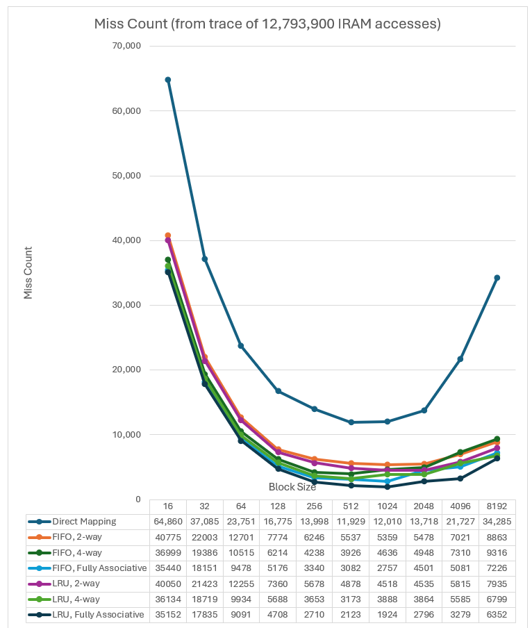

Figure 24‑1: Trace miss count in 64 KB cache

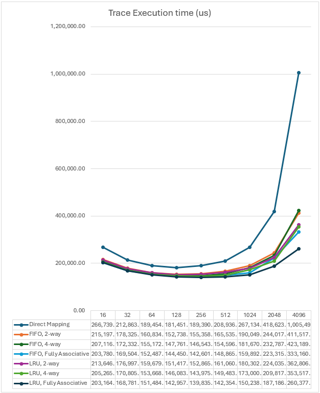

Figure 24‑2: Trace execution time in 64 KB cache

Table 24‑3: Trace performance on 128 KB cache with FIFO block eviction

<table>
<colgroup>
<col style="width: 9%" />
<col style="width: 19%" />
<col style="width: 9%" />
<col style="width: 16%" />
<col style="width: 22%" />
<col style="width: 23%" />
</colgroup>
<thead>
<tr>
<th style="text-align: center;">Block size 
(bytes)</th>
<th style="text-align: center;">Associativity</th>
<th style="text-align: center;"># Miss</th>
<th style="text-align: center;"># Hit</th>
<th style="text-align: center;">Execution time (us) 
@ 100 MHz 
2 us initial read latency</th>
<th style="text-align: center;">Execution time (us) 
@ 200 MHz 
2 us initial read latency</th>
</tr>
</thead>
<tbody>
<tr>
<td style="text-align: right;">16</td>
<td style="text-align: center;">Direct Mapping</td>
<td style="text-align: right;">47,423</td>
<td style="text-align: right;">12,746,477</td>
<td style="text-align: right;">229,424.22</td>
<td style="text-align: right;">162,135.11</td>
</tr>
<tr>
<td style="text-align: right;">32</td>
<td style="text-align: center;">Direct Mapping</td>
<td style="text-align: right;">26,401</td>
<td style="text-align: right;">12,767,499</td>
<td style="text-align: right;">188,397.29</td>
<td style="text-align: right;">120,599.65</td>
</tr>
<tr>
<td style="text-align: right;">64</td>
<td style="text-align: center;">Direct Mapping</td>
<td style="text-align: right;">16,645</td>
<td style="text-align: right;">12,777,255</td>
<td style="text-align: right;">171,049.55</td>
<td style="text-align: right;">102,169.78</td>
</tr>
<tr>
<td style="text-align: right;">128</td>
<td style="text-align: center;">Direct Mapping</td>
<td style="text-align: right;">11,180</td>
<td style="text-align: right;">12,782,720</td>
<td style="text-align: right;">163,603.20</td>
<td style="text-align: right;">92,981.60</td>
</tr>
<tr>
<td style="text-align: right;">256</td>
<td style="text-align: center;">Direct Mapping</td>
<td style="text-align: right;">9,006</td>
<td style="text-align: right;">12,784,894</td>
<td style="text-align: right;">167,475.34</td>
<td style="text-align: right;">92,743.67</td>
</tr>
<tr>
<td style="text-align: right;">512</td>
<td style="text-align: center;">Direct Mapping</td>
<td style="text-align: right;">7,325</td>
<td style="text-align: right;">12,786,575</td>
<td style="text-align: right;">177,675.75</td>
<td style="text-align: right;">96,162.88</td>
</tr>
<tr>
<td style="text-align: right;">1024</td>
<td style="text-align: center;">Direct Mapping</td>
<td style="text-align: right;">7,229</td>
<td style="text-align: right;">12,786,671</td>
<td style="text-align: right;">211,723.11</td>
<td style="text-align: right;">113,090.56</td>
</tr>
<tr>
<td style="text-align: right;">2048</td>
<td style="text-align: center;">Direct Mapping</td>
<td style="text-align: right;">7,622</td>
<td style="text-align: right;">12,786,278</td>
<td style="text-align: right;">289,449.18</td>
<td style="text-align: right;">152,346.59</td>
</tr>
<tr>
<td style="text-align: right;">4096</td>
<td style="text-align: center;">Direct Mapping</td>
<td style="text-align: right;">10,676</td>
<td style="text-align: right;">12,783,224</td>
<td style="text-align: right;">559,142.64</td>
<td style="text-align: right;">290,247.32</td>
</tr>
<tr>
<td style="text-align: right;">8192</td>
<td style="text-align: center;">Direct Mapping</td>
<td style="text-align: right;">16,203</td>
<td style="text-align: right;">12,777,697</td>
<td style="text-align: right;">1,404,573.37</td>
<td style="text-align: right;">718,489.69</td>
</tr>
<tr>
<td style="text-align: right;"></td>
<td style="text-align: center;"></td>
<td style="text-align: right;"> </td>
<td style="text-align: right;"></td>
<td style="text-align: right;"></td>
<td style="text-align: right;"></td>
</tr>
<tr>
<td style="text-align: right;">16</td>
<td style="text-align: center;">2-way</td>
<td style="text-align: right;">31,943</td>
<td style="text-align: right;">12,761,957</td>
<td style="text-align: right;">196,297.02</td>
<td style="text-align: right;">130,091.51</td>
</tr>
<tr>
<td style="text-align: right;">32</td>
<td style="text-align: center;">2-way</td>
<td style="text-align: right;">16,623</td>
<td style="text-align: right;">12,777,277</td>
<td style="text-align: right;">166,005.67</td>
<td style="text-align: right;">99,625.84</td>
</tr>
<tr>
<td style="text-align: right;">64</td>
<td style="text-align: center;">2-way</td>
<td style="text-align: right;">8,834</td>
<td style="text-align: right;">12,785,066</td>
<td style="text-align: right;">150,819.06</td>
<td style="text-align: right;">84,243.53</td>
</tr>
<tr>
<td style="text-align: right;">128</td>
<td style="text-align: center;">2-way</td>
<td style="text-align: right;">4,816</td>
<td style="text-align: right;">12,789,084</td>
<td style="text-align: right;">143,302.04</td>
<td style="text-align: right;">76,467.02</td>
</tr>
<tr>
<td style="text-align: right;">256</td>
<td style="text-align: center;">2-way</td>
<td style="text-align: right;">3,298</td>
<td style="text-align: right;">12,790,602</td>
<td style="text-align: right;">142,417.22</td>
<td style="text-align: right;">74,506.61</td>
</tr>
<tr>
<td style="text-align: right;">512</td>
<td style="text-align: center;">2-way</td>
<td style="text-align: right;">2,250</td>
<td style="text-align: right;">12,791,650</td>
<td style="text-align: right;">143,216.50</td>
<td style="text-align: right;">73,858.25</td>
</tr>
<tr>
<td style="text-align: right;">1024</td>
<td style="text-align: center;">2-way</td>
<td style="text-align: right;">1,714</td>
<td style="text-align: right;">12,792,186</td>
<td style="text-align: right;">147,804.26</td>
<td style="text-align: right;">75,616.13</td>
</tr>
<tr>
<td style="text-align: right;">2048</td>
<td style="text-align: center;">2-way</td>
<td style="text-align: right;">1,872</td>
<td style="text-align: right;">12,792,028</td>
<td style="text-align: right;">167,606.68</td>
<td style="text-align: right;">85,675.34</td>
</tr>
<tr>
<td style="text-align: right;">4096</td>
<td style="text-align: center;">2-way</td>
<td style="text-align: right;">1,824</td>
<td style="text-align: right;">12,792,076</td>
<td style="text-align: right;">201,610.36</td>
<td style="text-align: right;">102,629.18</td>
</tr>
<tr>
<td style="text-align: right;">8192</td>
<td style="text-align: center;">2-way</td>
<td style="text-align: right;">2,465</td>
<td style="text-align: right;">12,791,435</td>
<td style="text-align: right;">322,156.35</td>
<td style="text-align: right;">163,543.18</td>
</tr>
<tr>
<td style="text-align: right;"></td>
<td style="text-align: center;"></td>
<td style="text-align: right;"> </td>
<td style="text-align: right;"></td>
<td style="text-align: right;"></td>
<td style="text-align: right;"></td>
</tr>
<tr>
<td style="text-align: right;">16</td>
<td style="text-align: center;">4-way</td>
<td style="text-align: right;">30,302</td>
<td style="text-align: right;">12,763,598</td>
<td style="text-align: right;">192,785.28</td>
<td style="text-align: right;">126,694.64</td>
</tr>
<tr>
<td style="text-align: right;">32</td>
<td style="text-align: center;">4-way</td>
<td style="text-align: right;">15,449</td>
<td style="text-align: right;">12,778,451</td>
<td style="text-align: right;">163,317.21</td>
<td style="text-align: right;">97,107.61</td>
</tr>
<tr>
<td style="text-align: right;">64</td>
<td style="text-align: center;">4-way</td>
<td style="text-align: right;">7,912</td>
<td style="text-align: right;">12,785,988</td>
<td style="text-align: right;">148,431.08</td>
<td style="text-align: right;">82,127.54</td>
</tr>
<tr>
<td style="text-align: right;">128</td>
<td style="text-align: center;">4-way</td>
<td style="text-align: right;">4,093</td>
<td style="text-align: right;">12,789,807</td>
<td style="text-align: right;">140,995.67</td>
<td style="text-align: right;">74,590.84</td>
</tr>
<tr>
<td style="text-align: right;">256</td>
<td style="text-align: center;">4-way</td>
<td style="text-align: right;">2,147</td>
<td style="text-align: right;">12,791,753</td>
<td style="text-align: right;">137,364.33</td>
<td style="text-align: right;">70,829.17</td>
</tr>
<tr>
<td style="text-align: right;">512</td>
<td style="text-align: center;">4-way</td>
<td style="text-align: right;">1,216</td>
<td style="text-align: right;">12,792,684</td>
<td style="text-align: right;">136,195.64</td>
<td style="text-align: right;">69,313.82</td>
</tr>
<tr>
<td style="text-align: right;">1024</td>
<td style="text-align: center;">4-way</td>
<td style="text-align: right;">706</td>
<td style="text-align: right;">12,793,194</td>
<td style="text-align: right;">136,121.54</td>
<td style="text-align: right;">68,766.77</td>
</tr>
<tr>
<td style="text-align: right;">2048</td>
<td style="text-align: center;">4-way</td>
<td style="text-align: right;">546</td>
<td style="text-align: right;">12,793,354</td>
<td style="text-align: right;">139,508.74</td>
<td style="text-align: right;">70,300.37</td>
</tr>
<tr>
<td style="text-align: right;">4096</td>
<td style="text-align: center;">4-way</td>
<td style="text-align: right;">537</td>
<td style="text-align: right;">12,793,363</td>
<td style="text-align: right;">149,628.43</td>
<td style="text-align: right;">75,351.22</td>
</tr>
<tr>
<td style="text-align: right;">8192</td>
<td style="text-align: center;">4-way</td>
<td style="text-align: right;">1,948</td>
<td style="text-align: right;">12,791,952</td>
<td style="text-align: right;">281,421.92</td>
<td style="text-align: right;">142,658.96</td>
</tr>
<tr>
<td style="text-align: right;"></td>
<td style="text-align: center;"></td>
<td style="text-align: right;"> </td>
<td style="text-align: right;"></td>
<td style="text-align: right;"></td>
<td style="text-align: right;"></td>
</tr>
<tr>
<td style="text-align: right;">16</td>
<td style="text-align: center;">Fully associative</td>
<td style="text-align: right;">30,761</td>
<td style="text-align: right;">12,763,139</td>
<td style="text-align: right;">193,767.54</td>
<td style="text-align: right;">127,644.77</td>
</tr>
<tr>
<td style="text-align: right;">32</td>
<td style="text-align: center;">Fully associative</td>
<td style="text-align: right;">15,618</td>
<td style="text-align: right;">12,778,282</td>
<td style="text-align: right;">163,704.22</td>
<td style="text-align: right;">97,470.11</td>
</tr>
<tr>
<td style="text-align: right;">64</td>
<td style="text-align: center;">Fully associative</td>
<td style="text-align: right;">7,963</td>
<td style="text-align: right;">12,785,937</td>
<td style="text-align: right;">148,563.17</td>
<td style="text-align: right;">82,244.59</td>
</tr>
<tr>
<td style="text-align: right;">128</td>
<td style="text-align: center;">Fully associative</td>
<td style="text-align: right;">4,085</td>
<td style="text-align: right;">12,789,815</td>
<td style="text-align: right;">140,970.15</td>
<td style="text-align: right;">74,570.08</td>
</tr>
<tr>
<td style="text-align: right;">256</td>
<td style="text-align: center;">Fully associative</td>
<td style="text-align: right;">2,133</td>
<td style="text-align: right;">12,791,767</td>
<td style="text-align: right;">137,302.87</td>
<td style="text-align: right;">70,784.44</td>
</tr>
<tr>
<td style="text-align: right;">512</td>
<td style="text-align: center;">Fully associative</td>
<td style="text-align: right;">1,124</td>
<td style="text-align: right;">12,792,776</td>
<td style="text-align: right;">135,570.96</td>
<td style="text-align: right;">68,909.48</td>
</tr>
<tr>
<td style="text-align: right;">1024</td>
<td style="text-align: center;">Fully associative</td>
<td style="text-align: right;">635</td>
<td style="text-align: right;">12,793,265</td>
<td style="text-align: right;">135,298.65</td>
<td style="text-align: right;">68,284.33</td>
</tr>
<tr>
<td style="text-align: right;">2048</td>
<td style="text-align: center;">Fully associative</td>
<td style="text-align: right;">461</td>
<td style="text-align: right;">12,793,439</td>
<td style="text-align: right;">137,707.59</td>
<td style="text-align: right;">69,314.80</td>
</tr>
<tr>
<td style="text-align: right;">4096</td>
<td style="text-align: center;">Fully associative</td>
<td style="text-align: right;">523</td>
<td style="text-align: right;">12,793,377</td>
<td style="text-align: right;">149,062.97</td>
<td style="text-align: right;">75,054.49</td>
</tr>
<tr>
<td style="text-align: right;">8192</td>
<td style="text-align: center;">Fully associative</td>
<td style="text-align: right;">911</td>
<td style="text-align: right;">12,792,989</td>
<td style="text-align: right;">199,716.69</td>
<td style="text-align: right;">100,769.35</td>
</tr>
</tbody>
</table>

Table 24‑4: Trace performance on 128KB cache with LRU block eviction

<table>
<colgroup>
<col style="width: 9%" />
<col style="width: 20%" />
<col style="width: 9%" />
<col style="width: 13%" />
<col style="width: 21%" />
<col style="width: 24%" />
</colgroup>
<thead>
<tr>
<th style="text-align: center;">Block size 
(bytes)</th>
<th style="text-align: center;">Associativity</th>
<th style="text-align: center;"># Miss</th>
<th style="text-align: center;"># Hit</th>
<th style="text-align: center;">Execution time (us) 
@ 100 MHz 
2 us initial read latency</th>
<th style="text-align: center;">Execution time (us) 
@ 200 MHz 
2 us initial read latency</th>
</tr>
</thead>
<tbody>
<tr>
<td style="text-align: right;">16</td>
<td style="text-align: center;">Direct Mapping</td>
<td style="text-align: right;">47423</td>
<td style="text-align: right;">12746477</td>
<td style="text-align: right;">229,424.22</td>
<td style="text-align: right;">162,135.11</td>
</tr>
<tr>
<td style="text-align: right;">32</td>
<td style="text-align: center;">Direct Mapping</td>
<td style="text-align: right;">26401</td>
<td style="text-align: right;">12767499</td>
<td style="text-align: right;">188,397.29</td>
<td style="text-align: right;">120,599.65</td>
</tr>
<tr>
<td style="text-align: right;">64</td>
<td style="text-align: center;">Direct Mapping</td>
<td style="text-align: right;">16645</td>
<td style="text-align: right;">12777255</td>
<td style="text-align: right;">171,049.55</td>
<td style="text-align: right;">102,169.78</td>
</tr>
<tr>
<td style="text-align: right;">128</td>
<td style="text-align: center;">Direct Mapping</td>
<td style="text-align: right;">11180</td>
<td style="text-align: right;">12782720</td>
<td style="text-align: right;">163,603.20</td>
<td style="text-align: right;">92,981.60</td>
</tr>
<tr>
<td style="text-align: right;">256</td>
<td style="text-align: center;">Direct Mapping</td>
<td style="text-align: right;">9006</td>
<td style="text-align: right;">12784894</td>
<td style="text-align: right;">167,475.34</td>
<td style="text-align: right;">92,743.67</td>
</tr>
<tr>
<td style="text-align: right;">512</td>
<td style="text-align: center;">Direct Mapping</td>
<td style="text-align: right;">7325</td>
<td style="text-align: right;">12786575</td>
<td style="text-align: right;">177,675.75</td>
<td style="text-align: right;">96,162.88</td>
</tr>
<tr>
<td style="text-align: right;">1024</td>
<td style="text-align: center;">Direct Mapping</td>
<td style="text-align: right;">7229</td>
<td style="text-align: right;">12786671</td>
<td style="text-align: right;">211,723.11</td>
<td style="text-align: right;">113,090.56</td>
</tr>
<tr>
<td style="text-align: right;">2048</td>
<td style="text-align: center;">Direct Mapping</td>
<td style="text-align: right;">7622</td>
<td style="text-align: right;">12786278</td>
<td style="text-align: right;">289,449.18</td>
<td style="text-align: right;">152,346.59</td>
</tr>
<tr>
<td style="text-align: right;">4096</td>
<td style="text-align: center;">Direct Mapping</td>
<td style="text-align: right;">10676</td>
<td style="text-align: right;">12783224</td>
<td style="text-align: right;">559,142.64</td>
<td style="text-align: right;">290,247.32</td>
</tr>
<tr>
<td style="text-align: right;">8192</td>
<td style="text-align: center;">Direct Mapping</td>
<td style="text-align: right;">16203</td>
<td style="text-align: right;">12777697</td>
<td style="text-align: right;">1,404,573.37</td>
<td style="text-align: right;">718,489.69</td>
</tr>
<tr>
<td style="text-align: right;"></td>
<td style="text-align: center;"></td>
<td style="text-align: right;"> </td>
<td style="text-align: right;"></td>
<td style="text-align: right;"></td>
<td style="text-align: right;"></td>
</tr>
<tr>
<td style="text-align: right;">16</td>
<td style="text-align: center;">2-way</td>
<td style="text-align: right;">31690</td>
<td style="text-align: right;">12762210</td>
<td style="text-align: right;">195,755.60</td>
<td style="text-align: right;">129,567.80</td>
</tr>
<tr>
<td style="text-align: right;">32</td>
<td style="text-align: center;">2-way</td>
<td style="text-align: right;">16437</td>
<td style="text-align: right;">12777463</td>
<td style="text-align: right;">165,579.73</td>
<td style="text-align: right;">99,226.87</td>
</tr>
<tr>
<td style="text-align: right;">64</td>
<td style="text-align: center;">2-way</td>
<td style="text-align: right;">8707</td>
<td style="text-align: right;">12785193</td>
<td style="text-align: right;">150,490.13</td>
<td style="text-align: right;">83,952.07</td>
</tr>
<tr>
<td style="text-align: right;">128</td>
<td style="text-align: center;">2-way</td>
<td style="text-align: right;">4710</td>
<td style="text-align: right;">12789190</td>
<td style="text-align: right;">142,963.90</td>
<td style="text-align: right;">76,191.95</td>
</tr>
<tr>
<td style="text-align: right;">256</td>
<td style="text-align: center;">2-way</td>
<td style="text-align: right;">3061</td>
<td style="text-align: right;">12790839</td>
<td style="text-align: right;">141,376.79</td>
<td style="text-align: right;">73,749.40</td>
</tr>
<tr>
<td style="text-align: right;">512</td>
<td style="text-align: center;">2-way</td>
<td style="text-align: right;">2031</td>
<td style="text-align: right;">12791869</td>
<td style="text-align: right;">141,729.49</td>
<td style="text-align: right;">72,895.75</td>
</tr>
<tr>
<td style="text-align: right;">1024</td>
<td style="text-align: center;">2-way</td>
<td style="text-align: right;">1508</td>
<td style="text-align: right;">12792392</td>
<td style="text-align: right;">145,416.72</td>
<td style="text-align: right;">74,216.36</td>
</tr>
<tr>
<td style="text-align: right;">2048</td>
<td style="text-align: center;">2-way</td>
<td style="text-align: right;">1436</td>
<td style="text-align: right;">12792464</td>
<td style="text-align: right;">158,367.84</td>
<td style="text-align: right;">80,619.92</td>
</tr>
<tr>
<td style="text-align: right;">4096</td>
<td style="text-align: center;">2-way</td>
<td style="text-align: right;">1855</td>
<td style="text-align: right;">12792045</td>
<td style="text-align: right;">202,862.45</td>
<td style="text-align: right;">103,286.23</td>
</tr>
<tr>
<td style="text-align: right;">8192</td>
<td style="text-align: center;">2-way</td>
<td style="text-align: right;">2169</td>
<td style="text-align: right;">12791731</td>
<td style="text-align: right;">298,834.51</td>
<td style="text-align: right;">151,586.26</td>
</tr>
<tr>
<td style="text-align: right;"></td>
<td style="text-align: center;"></td>
<td style="text-align: right;"> </td>
<td style="text-align: right;"></td>
<td style="text-align: right;"></td>
<td style="text-align: right;"></td>
</tr>
<tr>
<td style="text-align: right;">16</td>
<td style="text-align: center;">4-way</td>
<td style="text-align: right;">29989</td>
<td style="text-align: right;">12763911</td>
<td style="text-align: right;">192,115.46</td>
<td style="text-align: right;">126,046.73</td>
</tr>
<tr>
<td style="text-align: right;">32</td>
<td style="text-align: center;">4-way</td>
<td style="text-align: right;">15262</td>
<td style="text-align: right;">12778638</td>
<td style="text-align: right;">162,888.98</td>
<td style="text-align: right;">96,706.49</td>
</tr>
<tr>
<td style="text-align: right;">64</td>
<td style="text-align: center;">4-way</td>
<td style="text-align: right;">7795</td>
<td style="text-align: right;">12786105</td>
<td style="text-align: right;">148,128.05</td>
<td style="text-align: right;">81,859.03</td>
</tr>
<tr>
<td style="text-align: right;">128</td>
<td style="text-align: center;">4-way</td>
<td style="text-align: right;">4020</td>
<td style="text-align: right;">12789880</td>
<td style="text-align: right;">140,762.80</td>
<td style="text-align: right;">74,401.40</td>
</tr>
<tr>
<td style="text-align: right;">256</td>
<td style="text-align: center;">4-way</td>
<td style="text-align: right;">2097</td>
<td style="text-align: right;">12791803</td>
<td style="text-align: right;">137,144.83</td>
<td style="text-align: right;">70,669.42</td>
</tr>
<tr>
<td style="text-align: right;">512</td>
<td style="text-align: center;">4-way</td>
<td style="text-align: right;">1174</td>
<td style="text-align: right;">12792726</td>
<td style="text-align: right;">135,910.46</td>
<td style="text-align: right;">69,129.23</td>
</tr>
<tr>
<td style="text-align: right;">1024</td>
<td style="text-align: center;">4-way</td>
<td style="text-align: right;">660</td>
<td style="text-align: right;">12793240</td>
<td style="text-align: right;">135,588.40</td>
<td style="text-align: right;">68,454.20</td>
</tr>
<tr>
<td style="text-align: right;">2048</td>
<td style="text-align: center;">4-way</td>
<td style="text-align: right;">433</td>
<td style="text-align: right;">12793467</td>
<td style="text-align: right;">137,114.27</td>
<td style="text-align: right;">68,990.14</td>
</tr>
<tr>
<td style="text-align: right;">4096</td>
<td style="text-align: center;">4-way</td>
<td style="text-align: right;">415</td>
<td style="text-align: right;">12793485</td>
<td style="text-align: right;">144,700.85</td>
<td style="text-align: right;">72,765.43</td>
</tr>
<tr>
<td style="text-align: right;">8192</td>
<td style="text-align: center;">4-way</td>
<td style="text-align: right;">1504</td>
<td style="text-align: right;">12792396</td>
<td style="text-align: right;">246,439.16</td>
<td style="text-align: right;">124,723.58</td>
</tr>
<tr>
<td style="text-align: right;"></td>
<td style="text-align: center;"></td>
<td style="text-align: right;"> </td>
<td style="text-align: right;"></td>
<td style="text-align: right;"></td>
<td style="text-align: right;"></td>
</tr>
<tr>
<td style="text-align: right;">16</td>
<td style="text-align: center;">Fully associative</td>
<td style="text-align: right;">30463</td>
<td style="text-align: right;">12763437</td>
<td style="text-align: right;">193,129.82</td>
<td style="text-align: right;">127,027.91</td>
</tr>
<tr>
<td style="text-align: right;">32</td>
<td style="text-align: center;">Fully associative</td>
<td style="text-align: right;">15472</td>
<td style="text-align: right;">12778428</td>
<td style="text-align: right;">163,369.88</td>
<td style="text-align: right;">97,156.94</td>
</tr>
<tr>
<td style="text-align: right;">64</td>
<td style="text-align: center;">Fully associative</td>
<td style="text-align: right;">7907</td>
<td style="text-align: right;">12785993</td>
<td style="text-align: right;">148,418.13</td>
<td style="text-align: right;">82,116.07</td>
</tr>
<tr>
<td style="text-align: right;">128</td>
<td style="text-align: center;">Fully associative</td>
<td style="text-align: right;">4051</td>
<td style="text-align: right;">12789849</td>
<td style="text-align: right;">140,861.69</td>
<td style="text-align: right;">74,481.85</td>
</tr>
<tr>
<td style="text-align: right;">256</td>
<td style="text-align: center;">Fully associative</td>
<td style="text-align: right;">2087</td>
<td style="text-align: right;">12791813</td>
<td style="text-align: right;">137,100.93</td>
<td style="text-align: right;">70,637.47</td>
</tr>
<tr>
<td style="text-align: right;">512</td>
<td style="text-align: center;">Fully associative</td>
<td style="text-align: right;">1093</td>
<td style="text-align: right;">12792807</td>
<td style="text-align: right;">135,360.47</td>
<td style="text-align: right;">68,773.24</td>
</tr>
<tr>
<td style="text-align: right;">1024</td>
<td style="text-align: center;">Fully associative</td>
<td style="text-align: right;">582</td>
<td style="text-align: right;">12793318</td>
<td style="text-align: right;">134,684.38</td>
<td style="text-align: right;">67,924.19</td>
</tr>
<tr>
<td style="text-align: right;">2048</td>
<td style="text-align: center;">Fully associative</td>
<td style="text-align: right;">332</td>
<td style="text-align: right;">12793568</td>
<td style="text-align: right;">134,974.08</td>
<td style="text-align: right;">67,819.04</td>
</tr>
<tr>
<td style="text-align: right;">4096</td>
<td style="text-align: center;">Fully associative</td>
<td style="text-align: right;">242</td>
<td style="text-align: right;">12793658</td>
<td style="text-align: right;">137,713.38</td>
<td style="text-align: right;">69,098.69</td>
</tr>
<tr>
<td style="text-align: right;">8192</td>
<td style="text-align: center;">Fully associative</td>
<td style="text-align: right;">372</td>
<td style="text-align: right;">12793528</td>
<td style="text-align: right;">157,248.88</td>
<td style="text-align: right;">78,996.44</td>
</tr>
</tbody>
</table>

# Appendix - Cache cost analysis

The following table shows the amount of extra storage required by different cache organizations considering an external memory size of 16 MB and an internal cache of 256 KB.

The fourth column shows the amount of memory required to store 128-bit authentication tags.

The fifth column (page table size) corresponds to a table indexed by external block address, external to internal address translation consisting of a table lookup.

Columns 7 to 9 correspond to cache with different amounts of associativity.

Table 25‑1: Cost analysis for 16 MB external space on a 256 KB cache

<table style="width:100%;">
<colgroup>
<col style="width: 11%" />
<col style="width: 12%" />
<col style="width: 10%" />
<col style="width: 12%" />
<col style="width: 11%" />
<col style="width: 11%" />
<col style="width: 11%" />
<col style="width: 11%" />
<col style="width: 9%" />
</colgroup>
<thead>
<tr>
<th style="text-align: center;">block size 
(bytes)</th>
<th style="text-align: center;"># blocks in external memory</th>
<th style="text-align: center;"># blocks in internal memory</th>
<th style="text-align: center;">128-bit tag store 
(bytes)</th>
<th style="text-align: center;">Page table size 
(bytes)</th>
<th style="text-align: center;">Fully associative cache table size (bytes)</th>
<th style="text-align: center;">4-way set associative cache table size (bytes)</th>
<th style="text-align: center;">2-way set associative cache table size (bytes)</th>
<th style="text-align: center;">Direct mapped cache table size (bytes)</th>
</tr>
</thead>
<tbody>
<tr>
<td style="text-align: right;">16</td>
<td style="text-align: right;">1048576</td>
<td style="text-align: right;">16384</td>
<td style="text-align: right;">16777216</td>
<td style="text-align: right;">1835008</td>
<td style="text-align: right;">40960</td>
<td style="text-align: right;">16384</td>
<td style="text-align: right;">14336</td>
<td style="text-align: right;">12288</td>
</tr>
<tr>
<td style="text-align: right;">32</td>
<td style="text-align: right;">524288</td>
<td style="text-align: right;">8192</td>
<td style="text-align: right;">8388608</td>
<td style="text-align: right;">851968</td>
<td style="text-align: right;">19456</td>
<td style="text-align: right;">8192</td>
<td style="text-align: right;">7168</td>
<td style="text-align: right;">6144</td>
</tr>
<tr>
<td style="text-align: right;">64</td>
<td style="text-align: right;">262144</td>
<td style="text-align: right;">4096</td>
<td style="text-align: right;">4194304</td>
<td style="text-align: right;">393216</td>
<td style="text-align: right;">9216</td>
<td style="text-align: right;">4096</td>
<td style="text-align: right;">3584</td>
<td style="text-align: right;">3072</td>
</tr>
<tr>
<td style="text-align: right;">128</td>
<td style="text-align: right;">131072</td>
<td style="text-align: right;">2048</td>
<td style="text-align: right;">2097152</td>
<td style="text-align: right;">180224</td>
<td style="text-align: right;">4352</td>
<td style="text-align: right;">2048</td>
<td style="text-align: right;">1792</td>
<td style="text-align: right;">1536</td>
</tr>
<tr>
<td style="text-align: right;">256</td>
<td style="text-align: right;">65536</td>
<td style="text-align: right;">1024</td>
<td style="text-align: right;">1048576</td>
<td style="text-align: right;">81920</td>
<td style="text-align: right;">2048</td>
<td style="text-align: right;">1024</td>
<td style="text-align: right;">896</td>
<td style="text-align: right;">768</td>
</tr>
<tr>
<td style="text-align: right;">512</td>
<td style="text-align: right;">32768</td>
<td style="text-align: right;">512</td>
<td style="text-align: right;">524288</td>
<td style="text-align: right;">36864</td>
<td style="text-align: right;">960</td>
<td style="text-align: right;">512</td>
<td style="text-align: right;">448</td>
<td style="text-align: right;">384</td>
</tr>
<tr>
<td style="text-align: right;">1024</td>
<td style="text-align: right;">16384</td>
<td style="text-align: right;">256</td>
<td style="text-align: right;">262144</td>
<td style="text-align: right;">16384</td>
<td style="text-align: right;">448</td>
<td style="text-align: right;">256</td>
<td style="text-align: right;">224</td>
<td style="text-align: right;">192</td>
</tr>
<tr>
<td style="text-align: right;">2048</td>
<td style="text-align: right;">8192</td>
<td style="text-align: right;">128</td>
<td style="text-align: right;">131072</td>
<td style="text-align: right;">7168</td>
<td style="text-align: right;">208</td>
<td style="text-align: right;">128</td>
<td style="text-align: right;">112</td>
<td style="text-align: right;">96</td>
</tr>
<tr>
<td style="text-align: right;">4096</td>
<td style="text-align: right;">4096</td>
<td style="text-align: right;">64</td>
<td style="text-align: right;">65536</td>
<td style="text-align: right;">3072</td>
<td style="text-align: right;">96</td>
<td style="text-align: right;">64</td>
<td style="text-align: right;">56</td>
<td style="text-align: right;">48</td>
</tr>
<tr>
<td style="text-align: right;">8192</td>
<td style="text-align: right;">2048</td>
<td style="text-align: right;">32</td>
<td style="text-align: right;">32768</td>
<td style="text-align: right;">1280</td>
<td style="text-align: right;">44</td>
<td style="text-align: right;">32</td>
<td style="text-align: right;">28</td>
<td style="text-align: right;">24</td>
</tr>
</tbody>
</table>

# Appendix – Alternative schemes with FW managed block-miss handling

Schemes less transparent to firmware (a paging scheme with MMU instead of a transparent cache) were discarded due to their dependency on core selection for the security processor and more complex security.

The following scenarios were considered:

1.  The security processor implements a standard virtual memory scheme, like RISC-V SV32 or SV39. Usually, the cores supporting virtual memory are 64-bit cores meant to be used as application processors and run an off-the-shelf OS.

> SiFive offers a RISC-V 32-bit core with SV32 support (E6A).

2.  The security processor doesn’t have an internal MMU but supports a firmware driven virtual memory implementation with an external MMU. In this scenario the security processor supports precise exceptions on instruction fetch and data load. An external address translation mechanism triggers an exception upon detecting a page fault. The exception handler drives the replacement of one of the pages in physical memory by the missing page and returns to the instruction that caused the fault.

> Open-source Ibex and ARM Cortex-M3 cores support precise exceptions. SiFive E-series cores don’t support precise exceptions on data load faults.

3.  The security processor doesn’t support virtual memory with internal MMU and doesn’t support firmware driven implementation based on precise access fault exceptions. In this scenario a transparent mechanism is required.

Scenario \#1 is not considered in this specification since security subsystem instances that are most likely to benefit from the paging mechanism require a small footprint RISC-V core optimized for area and power without an internal MMU. Moreover, virtual memory schemes like SV32 or SV39 are more complex than the paging scheme required in the security subsystem, and such complexity makes ensuring the security of the paging scheme more difficult.

Both scenarios \#2 and \#3 require an MMU external to the security processor core. The difference between them is whether firmware is aware of page faults and can influence page replacing.

In scenario \#2 an access to IRAM falling into pages which are not present in physical memory will cause an access denied error. The access denied error aborts the instruction execution and triggers an instruction fault exception. Firmware handling the exception will program security subsystem HW to bring the missing page from system memory and replace one of the pages in physical memory.

In scenario \#3 an access to IRAM falling into pages which are not present in physical memory will cause a delay on the response to security processor access. Hardware will automatically bring the missing page from system memory and replace one of the pages in physical memory before allowing the security processor access to proceed. In this scenario is better from cost and performance point of view to implement a cache with limited associativity.

# Appendix – Selection of encryption and authentication algorithm

AES-GCM with 256-bit key and 128-bit tag is the algorithm selected for encrypting and authenticating the code and constants stored outside the security subsystem.

The advantages of AES-GCM in the context of encrypting write-once code and constants are:

- GHASH implementation takes small area and easily matches AES performance.

- DPA countermeasures don’t add a large overhead to GHASH.

- The write-once property of the data makes it possible to guarantee that IV is not reused. If the one cache-block is not encrypted more than once with a given key, the IV can be made dependent on the block address and every block is guaranteed to be encrypted with a different IV.

- CTR mode for encryption can easily be parallelized. If future data were to show that lower latency in the decryption would improve performance, then the AES cipher could be replaced by a larger version with multiple AES block ciphers and lower latency. GCM mode is easier to speed up compared with alternatives based on CBC, XTS and SHA. However, current trace analysis shows that it is more critical to minimize cache misses than to improve latency when a cache miss occurs.

- The amount of data encrypted is bound to 16MB for a given key. One weakness of AES-GCM (see reference to “The Security and Performance of the Galois/Counter Mode (GCM) of Operation”) is that the forgery advantage quadratically depends on the amount of data that is authenticated. An attacker will be able to see tags and encrypted blocks of at most 16MB of data.

Regarding the choice of tag length, as the authentication tags are stored in external memory which density is expected to be much larger than security subsystem internal SRAMs, a tag length of 128-bit doesn’t add much overhead compared to shorter tags. 128-bit is the maximum length allowed by AES-GCM.

The following paragraph from NIST SP.800-38D explains the probability of forgery:

*“In particular, if* n *denotes the total number of blocks in the encoding (i.e., the input to the GHASH function in the definition of* S *in Secs. 7.1 and 7.2 above) of the ciphertext and AAD, then there is a method of constructing a “targeted” ciphertext forgery that is expected to succeed with a probability of approximately* n*/2t. Moreover, each successful forgery in this attack 1) increases the probability that subsequent targeted forgeries will succeed, and 2) leaks information about the hash subkey,* H*. Eventually,* H *may be compromised entirely, with consequences as described at the end of Appendix A: the authentication assurance is completely lost.”*

There are 1024 blocks (128-bit block inputs to GHASH) in 16MB. For a 128-bit tag the probability of a successful forgery would be 210/2128 = 2-118.

Moreover, any failed authentication signals an exception which processing will either result I firmware working in a limited amount of memory where AES-GCM is not used or trigger a reset and a change of key.

Alternative algorithms were considered for encryption:

- AES-XTS: It would allow for multiple writes to the same location in external memory but it is more complex than CTR mode.

- AES-CBC: Cannot process multiple blocks concurrently.

These would need a separate algorithm for authentication:

- HMAC with SHA2-256. More costly to protect with DPA countermeasures and much slower than GHASH.

- HMAC with SHA3-256.Faster and easier to protect with DPA countermeasures compared with SHA2 but still bigger area and slower than GHASH.
