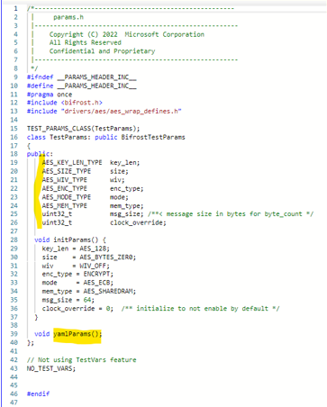
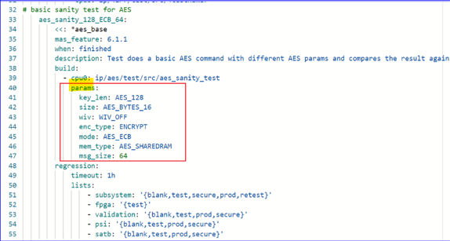
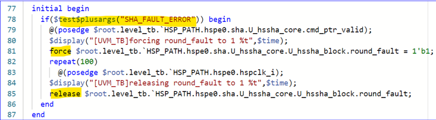
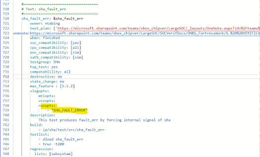

**security subsystem Validation Testplan**

***SInC***

**\**

# Table of Contents

[1 Introduction [4](#introduction)](#introduction)

[2 Glossary [4](#glossary)](#glossary)

[3 Overview [4](#overview)](#overview)

[3.1 IP Interfaces [5](#ip-interfaces)](#ip-interfaces)

[4 Test Requirements [6](#test-requirements)](#test-requirements)

[4.1 Silicon and Validation Tool Dependencies [6](#silicon-and-validation-tool-dependencies)](#silicon-and-validation-tool-dependencies)

[4.2 Security State Dependencies [6](#security-state-dependencies)](#security-state-dependencies)

[4.3 RPC Model Dependencies [7](#rpc-model-dependencies)](#rpc-model-dependencies)

[4.4 Backdoor Access or TB Features Only [7](#backdoor-access-or-tb-features-only)](#backdoor-access-or-tb-features-only)

[5 C Models [7](#c-models)](#c-models)

[6 Test Global Parameters [7](#test-global-parameters)](#test-global-parameters)

[6.1 Compile-Time Parameters [7](#compile-time-parameters)](#compile-time-parameters)

[6.2 Run-Time Parameters [7](#run-time-parameters)](#run-time-parameters)

[6.2.1 Parameters in Test Source Code [8](#parameters-in-test-source-code)](#parameters-in-test-source-code)

[6.2.2 Parameters in Testbench Code [10](#parameters-in-testbench-code)](#parameters-in-testbench-code)

[7 Verification Version Information [11](#verification-version-information)](#verification-version-information)

[8 Test Cases [11](#test-cases)](#test-cases)

[8.1 Test Group 1 – Cache Disabled State Tests [11](#test-group-1-cache-disabled-state-tests)](#test-group-1-cache-disabled-state-tests)

[8.1.1 SInC Cache Disabled Mem Access [11](#sinc-cache-disabled-mem-access)](#sinc-cache-disabled-mem-access)

[8.1.2 SInC AES Mode [12](#sinc-aes-mode)](#sinc-aes-mode)

[8.2 Test Group 2 – Cache Initialized State Tests [12](#test-group-2-cache-initialized-state-tests)](#test-group-2-cache-initialized-state-tests)

[8.2.1 SInC Cache Initialized Mem Access [12](#sinc-cache-initialized-mem-access)](#sinc-cache-initialized-mem-access)

[8.2.2 SInC Cache Initialized Encrypt [13](#sinc-cache-initialized-encrypt)](#sinc-cache-initialized-encrypt)

[8.2.3 SInC Cache Initialized Encrypt Powergating [13](#sinc-cache-initialized-encrypt-powergating)](#sinc-cache-initialized-encrypt-powergating)

[8.2.4 SInC Cache Initialized Encrypt Clockgating [14](#sinc-cache-initialized-encrypt-clockgating)](#sinc-cache-initialized-encrypt-clockgating)

[8.2.5 SInC Cache Transition Initialized Runtime [14](#sinc-cache-transition-initialized-runtime)](#sinc-cache-transition-initialized-runtime)

[8.2.6 SInC key store Access [15](#sinc-key-store-access)](#sinc-key-store-access)

[8.3 Test Group 3 – Cache Active State Tests [16](#test-group-3-cache-active-state-tests)](#test-group-3-cache-active-state-tests)

[8.3.1 SInC Cache Active Mem Access [16](#sinc-cache-active-mem-access)](#sinc-cache-active-mem-access)

[8.3.2 SInC Cache Active Mem Access Powergating [16](#sinc-cache-active-mem-access-powergating)](#sinc-cache-active-mem-access-powergating)

[8.3.3 SInC Cache Active Mem Access Clockgating [17](#sinc-cache-active-mem-access-clockgating)](#sinc-cache-active-mem-access-clockgating)

[8.3.4 SInC Encrypt and Run Program Test [17](#sinc-encrypt-and-run-program-test)](#sinc-encrypt-and-run-program-test)

[8.3.5 SInC Power Gating in Disable then Cache Active Mem Access [17](#sinc-power-gating-in-disable-then-cache-active-mem-access)](#sinc-power-gating-in-disable-then-cache-active-mem-access)

[8.3.6 SInC Clock Gating in Disable then Cache Active Mem Access [18](#sinc-clock-gating-in-disable-then-cache-active-mem-access)](#sinc-clock-gating-in-disable-then-cache-active-mem-access)

[8.3.7 SInC Restore After Reset Flow Test [18](#sinc-restore-after-reset-flow-test)](#sinc-restore-after-reset-flow-test)

[8.3.8 SInC Reinit After Powergate [19](#sinc-reinit-after-powergate)](#sinc-reinit-after-powergate)

[8.3.9 SInC Reinit After Clockgate [19](#sinc-reinit-after-clockgate)](#sinc-reinit-after-clockgate)

[8.3.10 SInC Reset After Powergate [20](#sinc-reset-after-powergate)](#sinc-reset-after-powergate)

[8.3.11 SInC Reinit After Clockgate [21](#sinc-reinit-after-clockgate-1)](#sinc-reinit-after-clockgate-1)

[8.3.12 SInC Performance Counter Check [21](#sinc-performance-counter-check)](#sinc-performance-counter-check)

[8.3.13 SInC Reset [22](#sinc-reset)](#sinc-reset)

[8.3.14 SInC Reinit [23](#sinc-reinit)](#sinc-reinit)

[8.4 Test Group 4 – Error Tests [24](#test-group-4-error-tests)](#test-group-4-error-tests)

[8.4.1 SInC Parity Error [24](#sinc-parity-error)](#sinc-parity-error)

[8.4.2 SInC Command Error [24](#sinc-command-error)](#sinc-command-error)

[8.4.3 SInC Authentication Tag Mismatch Test [25](#sinc-authentication-tag-mismatch-test)](#sinc-authentication-tag-mismatch-test)

[8.4.4 SInC Register Access By State [25](#sinc-register-access-by-state)](#sinc-register-access-by-state)

[8.4.5 SInC Non Severe Errors [26](#sinc-non-severe-errors)](#sinc-non-severe-errors)

[8.4.6 SInC Mem Erase Busy Error [26](#sinc-mem-erase-busy-error)](#sinc-mem-erase-busy-error)

[8.4.7 SInC Cache Failed State [27](#sinc-cache-failed-state)](#sinc-cache-failed-state)

[8.5 Test Group 5 – Other Tests [28](#test-group-5-other-tests)](#test-group-5-other-tests)

[8.5.1 SInC Interrupt [28](#sinc-interrupt)](#sinc-interrupt)

[8.5.2 SInC Retention Test Active [28](#sinc-retention-test-active)](#sinc-retention-test-active)

[8.5.3 SInC Retention Test Disabled [29](#sinc-retention-test-disabled)](#sinc-retention-test-disabled)

[8.5.4 SInC Retention Test Initialized [30](#sinc-retention-test-initialized)](#sinc-retention-test-initialized)

# Introduction 

 

This document is to define the tests and test procedures for verifying a particular subblock (aka. IP), namely SInC, to cover the following objectives:

1.  **To verify in simulation that integration of this sub-block IP in security subsystem works as expected at security subsystem L3 level, and**

2.  **To validate the IP at SOC level in silicon.**

 

Note that it is important to recognize that the verification coverage in L3 test plan alone is by nature very sparse and thus is a very leaky bug net. Unfortunately, there is no reasonable metrics that can establish definitively the degree of coverage generated by this L3 test plan.

 

Thus, IP L3 test owners need to be make meaningful choices about how the test plan is designed, and need to be able to defend the reasonings behind the opted limited scope of coverage.

Meanwhile, independent test plan reviewers need to review the plan in the full context of overall verification plan that spans L1, L2, L3, Formal, and others, in order to judge intelligently if the L3 test plan meets the objectives.

 

 

# Glossary

 

Acronyms referenced in this document are listed below.

>  

| **Acronym** | **Description**           |
|-------------|---------------------------|
|  SInC       |  Secure Instruction Cache |
|             |                           |

>  
>
>  

 

# Overview

 

Overall pre-silicon verification for security subsystem is a divide-and-conquer multi-level, L1, L2 and L3, approach, where:

 

- 

| **L1 level** | focuses on thoroughly verifying individual IP blocks in security subsystem, in separate stand-alone UVM testbench environments. |
|----|----|
| **L2 level** | Some functional features are better verified in environment where multiple IP blocks are integrated together. Thus, we have L2 UVM testbench where the whole security subsystem is instantiated as DUT, except for the embedded security processor which is not included and which is replaced by an AXI master VIP instead. |
| **L3 level** | This is a Verilog-and-C cosimulation environment where the whole security subsystem is instantiated including the embedded security processor, and tests are written in C/C++ compiled to code image to be executed by the security processor. |

>  

 

 

This document is to detail any testbench features and test procedures that are unique and specific to this specific subblock, and to defined the tests and test procedures applicable specifically to this subblock.

 

Since security subsystem is re-used in multiple SOC projects, the IP under test here may have multiple variants that are customized and adapted to the different projects. Thus,

- there generally is a common base test suite that is applicable to all variants, and

- there may be additional tests that address unique feature deltas of each version of the IP.

 

Tests described in this document are generally structured such that they are re-usable across multiple security subsystems. Oftentimes, tests are also portable as is from pre-silicon L3 simulation environments to post-silicon environments.

 

 

 

## IP Interfaces

>  

<table style="width:87%;">
<colgroup>
<col style="width: 25%" />
<col style="width: 15%" />
<col style="width: 20%" />
<col style="width: 25%" />
</colgroup>
<thead>
<tr>
<th><strong>Interface</strong></th>
<th><strong>From</strong></th>
<th><strong>To</strong></th>
<th><strong>Notes</strong></th>
</tr>
</thead>
<tbody>
<tr>
<td>AXI Subordinate I/F</td>
<td>security processor,</td>
<td>SInC</td>
<td>
 

 
</td>
</tr>
<tr>
<td>AXI Manager I/F</td>
<td>SInC</td>
<td>
key store,

external memories over address translation unit

 
</td>
<td>
 

 
</td>
</tr>
<tr>
<td>Memory Interface</td>
<td>SInC</td>
<td>Cached Iram</td>
<td></td>
</tr>
<tr>
<td>Error Inject and Log Interface</td>
<td>CREG</td>
<td>
CREG

SInC
</td>
<td></td>
</tr>
<tr>
<td>
Sideband status signals:

Done, Error
</td>
<td>SInC</td>
<td>CREG Interrupt block</td>
<td>
 

 
</td>
</tr>
<tr>
<td>
Memory Erase Interface

 
</td>
<td>SInC </td>
<td>
Cached Iram

 
</td>
<td> </td>
</tr>
</tbody>
</table>

 

>  

# Test Requirements

There are a number of requirements to run the tests in this test plan. The following is a description of each of those requirements.

## Silicon and Validation Tool Dependencies

>  
>
> For simulation and FPGA emulation, tests may be run with Test-ROM codes or with production Pre-Final ROM code that may be loaded at run time.
>
> For silicon validation, a fixed ROM code is in place. Tests will be chain loaded in either from the flash or loaded via PSI-2020 tool suite into the security processor IRAM and then executed.
>
> Here we assume the following:

- The ability to program tests into Flash memory is in place

- PSI-2020 validation tool flow to load tests for validation is in place.

- For SinC specifically we will need the ability to run with our initial code only in the local iram so that we can properly test the entire range of both the cache iram and external iram without needing to avoid overwriting our test code. We ideally would have the ability to specify some code to be compiled and loaded into local iram and some code compiled and loaded into cache iram and some additional code compiled and placed somewhere where we can have SInC encypt and transfer it into external memory. But if we only have the ability to compile code into local iram then we could have the test itself copy some dummy functions to run in cache iram and exernal memory.

>  

## Security State Dependencies

 

> Tests that state dependencies will be coded to automatically adjust to compensate for that dependency.

 

## RPC Model Dependencies

 

> Tests that involves RPC must have the remote C model already compiled and installed in the remote host.
>
>  
>
>   

## Backdoor Access or TB Features Only

 

N/A 

>  

# C Models

 

If this test suite makes use of any C models and call them via RPC, they should be called out here.

 

The required RPC models used in this test suite are:

 

> AES RPC command used to call AES c model for testing AES

 

# Test Global Parameters

 

This section lists and describes all available test global configuration parameters that are declared in the test suite.

 

The setting of the parameter values is mostly done from the test yaml files.

 

 

## Compile-Time Parameters

 

In general, test compile-time parameters are declared in RTL and are referenced by the test bench code. These are typically used to configure feature differences between subsystems.

 

No compile time parameters are present for SInC

 

## Run-Time Parameters

 

In general, test run-time parameters are declared and used in testbench code or in test source code.

 

- Used in test source code, these are typically used to generate multiple tests from a smaller number of base tests.

- Used in testbench code, these are typically used to enable certain Verilog coded features in a common shared testbench component.

 

 

<table style="width:87%;">
<colgroup>
<col style="width: 27%" />
<col style="width: 59%" />
</colgroup>
<thead>
<tr>
<th>
<strong>Run-Time Parameter</strong>

<strong>in Test Source Code</strong>
</th>
<th><strong>Description and Usage</strong></th>
</tr>
</thead>
<tbody>
<tr>
<td>TBD</td>
<td></td>
</tr>
<tr>
<td></td>
<td></td>
</tr>
<tr>
<td></td>
<td></td>
</tr>
</tbody>
</table>

>  

<table style="width:87%;">
<colgroup>
<col style="width: 28%" />
<col style="width: 58%" />
</colgroup>
<thead>
<tr>
<th>
<strong>Run-Time Parameter</strong>

<strong>In Testbench Code</strong>
</th>
<th><strong>Description and Usage</strong></th>
</tr>
</thead>
<tbody>
<tr>
<td>TBD</td>
<td></td>
</tr>
<tr>
<td> </td>
<td></td>
</tr>
<tr>
<td> </td>
<td> </td>
</tr>
</tbody>
</table>

 

### Parameters in Test Source Code

>  
>
> The mechanics of test parameterization in test source code works as follows:
>
>  

- Test parameters are defined in a C++ class named **TestParams**() defined in file **params.h** in each of the test directories for tests that support parameterization.

>  
>
> 
>
>  

- Parameter values are set in the "**params**" hash in each individual test declaration entry in the test yaml file.

> Example: An AES test:
>
> 
>
>  

1.  A utility script parses the yaml file and convert it to a C-construct file containing a **yamlParams**() function such that it can be compiled together with the test source code.

>  

### Parameters in Testbench Code

 

> On the other, the mechanics of test parameterization in testbench code works as follows:
>
>  

2.  Test parameters are defined as **\$test\$plusargs()** system function in Verilog testbench component.

>  
>
> 
>
>  

3.  Parameter values are set in the "**runopts**" array in each individual test declaration entry in the test yaml file.

> Example:
>
> 
>
>  
>
>  

4.  The simulation run script parses the yaml file and pass the parameter to the Verilog simulation run command.

>  

 

 

# Verification Version Information

 

This section describes how the test suite is configurable to support feature deltas that may exist between different security subsystems.

 

None

 

# Test Cases

 

**General Discussion:**

> We have decided that the test yaml declaration files in open sinc repo are the golden source of L3 test plans where all tests are specified including test names, test descriptions, and test parameters.
>
> However, the space within the yaml files do not allow adequate description of the test setup, sequence, dependencies, and detailed procedures for executing the tests, either in L3 sim env or in silicon validation environment.
>
> Thus, this section is intended to provide:
>
> Detailed test procedure, tools, models information that are applicable to a wide number of tests. Differences in test procedures may be identified by test groups.
>
>  

## Test Group 1 – Cache Disabled State Tests

> Tests in cache disabled state

### SInC Cache Disabled Mem Access

>  

<table>
<colgroup>
<col style="width: 17%" />
<col style="width: 82%" />
</colgroup>
<thead>
<tr>
<th><strong>TEST NAME</strong></th>
<th>sinc_cache_disabled_mem_access</th>
</tr>
</thead>
<tbody>
<tr>
<td><strong>FEATURE DETAILS</strong></td>
<td>This tests access to memory in cache disabled</td>
</tr>
<tr>
<td><strong>TEST SETUP and SEQUENCE</strong></td>
<td>
Init security subsystem running out of local iram with test running in local iram then run detailed procedure

 
</td>
</tr>
<tr>
<td><strong>TOOLS</strong></td>
<td>n/a</td>
</tr>
<tr>
<td><strong>MODELS</strong></td>
<td></td>
</tr>
<tr>
<td><strong>DETAILED PROCEDURE</strong></td>
<td>
1. Check after reset that sinc is in cache disabled state

2. Check data access to various parts of cached iram region

3. Check execute access to various parts of cached iram region (copy function there and point function pointer to it then call)

4. Access above cached iram region and check that it is blocked
</td>
</tr>
</tbody>
</table>

 

### SInC AES Mode

>  

<table>
<colgroup>
<col style="width: 21%" />
<col style="width: 78%" />
</colgroup>
<thead>
<tr>
<th><strong>TEST NAME</strong></th>
<th>sinc_aes_test_mode</th>
</tr>
</thead>
<tbody>
<tr>
<td><strong>FEATURE DETAILS</strong></td>
<td>This tests the aes mode of sinc</td>
</tr>
<tr>
<td><strong>TEST SETUP and SEQUENCE</strong></td>
<td>Init security subsystem with test running in local iram then run detailed procedure</td>
</tr>
<tr>
<td><strong>TOOLS</strong></td>
<td>n/a</td>
</tr>
<tr>
<td><strong>MODELS</strong></td>
<td>AES Mode</td>
</tr>
<tr>
<td><strong>DETAILED PROCEDURE</strong></td>
<td>
1. Follow steps listed in the SInC MAS “Run AES in test mode” to run with AES mode

2. Randomize parameters and check output using AES C Model

3. AES Mode parameter should cover GCM and ECB mode for most tests, reuse key, and doing multiples of 16 bytes of data in the same command
</td>
</tr>
</tbody>
</table>

>  
>
> .

## Test Group 2 – Cache Initialized State Tests

### SInC Cache Initialized Mem Access

>  

<table>
<colgroup>
<col style="width: 16%" />
<col style="width: 83%" />
</colgroup>
<thead>
<tr>
<th><strong>TEST NAME</strong></th>
<th>sinc_cache_initialized_mem_access </th>
</tr>
</thead>
<tbody>
<tr>
<td><strong>FEATURE DETAILS</strong></td>
<td>
This tests access to memory in cache initialized state 

 
</td>
</tr>
<tr>
<td><strong>TEST SETUP and SEQUENCE</strong></td>
<td>
Init security subsystem running out of local iram then run detailed procedure

 
</td>
</tr>
<tr>
<td><strong>TOOLS</strong></td>
<td>
n/a

 
</td>
</tr>
<tr>
<td><strong>MODELS</strong></td>
<td> </td>
</tr>
<tr>
<td><strong>DETAILED PROCEDURE</strong></td>
<td>
1. FW writes to aes_iv_nonce*, block_encr_key, block_base_addr, and tag_base_addr registers.

2. FW sets set_init_state bit in cmd register.

3. FW reads cmd_status field in status register for command completion and state field to verify SInC state.

4. Check data access to various parts of cached iram region

5. Check execute access to various parts of cached iram region (copy function there and point function pointer to it then call)

6. Access above cached iram region and check that it is blocked
</td>
</tr>
</tbody>
</table>

 

### SInC Cache Initialized Encrypt

>  

<table style="width:100%;">
<colgroup>
<col style="width: 16%" />
<col style="width: 83%" />
</colgroup>
<thead>
<tr>
<th><strong>TEST NAME</strong></th>
<th>sinc_cache_initialized_encrypt </th>
</tr>
</thead>
<tbody>
<tr>
<td><strong>FEATURE DETAILS</strong></td>
<td>This tests the encrypt command</td>
</tr>
<tr>
<td><strong>TEST SETUP and SEQUENCE</strong></td>
<td>
Init security subsystem then run detailed procedure

 
</td>
</tr>
<tr>
<td><strong>TOOLS</strong></td>
<td>n/a</td>
</tr>
<tr>
<td><strong>MODELS</strong></td>
<td></td>
</tr>
<tr>
<td><strong>DETAILED PROCEDURE</strong></td>
<td>
1. Setup address translation unit to point to external memory and randomly generate a key value and set it in the key store

2. Based on a paremeter either set or do not set the aeb to disable encryption.

3. Run steps to go to initialized state from sinc_cache_intialized_mem_access test, pointing block base and tag base addresses to external memory.

4. Generate random data in shared ram, sized for a random number of cache blocks, also copy function into it after the end of random data

5. Write the block_encr_num, num_of_blocks, and block_encr_addr registers, with the block encr addr register pointing to the base of the random data in shared ram and num of blocks corresponding to how many blocks we generated in step 2.

6. Set encr_block field in cmd register.

7. Reads cmd_status field in status register for command completion.

8. If aeb to disable encryption is not set use AES c model to generate expected encryption of the data and the tag and then compare against actual result in external memory written by SInC by having the security processor read it over address translation unit. If aeb is set then check that data in external memory equals the unencrypted plaintext.

9. Transition to cache active state and read data from external iram and compare with data in shared ram

10. Check that copied function executes correctly
</td>
</tr>
</tbody>
</table>

>  

### SInC Cache Initialized Encrypt Powergating

>  

<table>
<colgroup>
<col style="width: 16%" />
<col style="width: 83%" />
</colgroup>
<thead>
<tr>
<th><strong>TEST NAME</strong></th>
<th>sinc_cache_initialized_encrypt_pwrgate</th>
</tr>
</thead>
<tbody>
<tr>
<td><strong>FEATURE DETAILS</strong></td>
<td>
This tests access to memory in cache active state 

 
</td>
</tr>
<tr>
<td><strong>TEST SETUP and SEQUENCE</strong></td>
<td>
Init security subsystem running out of local iram then run detailed procedure. Run with PAV=1 set in build environment.

 
</td>
</tr>
<tr>
<td><strong>TOOLS</strong></td>
<td>
n/a

 
</td>
</tr>
<tr>
<td><strong>MODELS</strong></td>
<td> </td>
</tr>
<tr>
<td><strong>DETAILED PROCEDURE</strong></td>
<td><ol type="1">
<li>
Do SInC Cache Initialized Encyrpt test but do a power gating entry and wakeup before doing encrypt block
</li>
<li>
Also have version of this test that does the power gating entry and wakeup after doing encrypt block but before transitioning to active
</li>
</ol></td>
</tr>
</tbody>
</table>

### SInC Cache Initialized Encrypt Clockgating

>  

<table>
<colgroup>
<col style="width: 16%" />
<col style="width: 83%" />
</colgroup>
<thead>
<tr>
<th><strong>TEST NAME</strong></th>
<th>sinc_cache_initialized_encrypt_clkgate</th>
</tr>
</thead>
<tbody>
<tr>
<td><strong>FEATURE DETAILS</strong></td>
<td>
This tests access to memory in cache active state 

 
</td>
</tr>
<tr>
<td><strong>TEST SETUP and SEQUENCE</strong></td>
<td>
Init security subsystem running out of local iram then run detailed procedure. Run with PAV=1 set in build environment.

 
</td>
</tr>
<tr>
<td><strong>TOOLS</strong></td>
<td>
n/a

 
</td>
</tr>
<tr>
<td><strong>MODELS</strong></td>
<td> </td>
</tr>
<tr>
<td><strong>DETAILED PROCEDURE</strong></td>
<td><ol type="1">
<li>
Do SInC Cache Initialized Encyrpt test but do a clock gating entry and wakeup before doing encrypt block
</li>
<li>
Also have version of this test that does the clock gating entry and wakeup after doing encrypt block but before transitioning to active
</li>
</ol></td>
</tr>
</tbody>
</table>

### SInC Cache Transition Initialized Runtime

>  

<table>
<colgroup>
<col style="width: 15%" />
<col style="width: 84%" />
</colgroup>
<thead>
<tr>
<th><strong>TEST NAME</strong></th>
<th>sinc_cache_transition_initialized_runtime </th>
</tr>
</thead>
<tbody>
<tr>
<td><strong>FEATURE DETAILS</strong></td>
<td>This tests transitioning to initialized state while running from cached iram</td>
</tr>
<tr>
<td><strong>TEST SETUP and SEQUENCE</strong></td>
<td>
Init security subsystem running out of cached iram then run detailed procedure

 
</td>
</tr>
<tr>
<td><strong>TOOLS</strong></td>
<td>n/a</td>
</tr>
<tr>
<td><strong>MODELS</strong></td>
<td></td>
</tr>
<tr>
<td><strong>DETAILED PROCEDURE</strong></td>
<td>
1. The test should be running out of cached iram

2. Run steps to go to initialized state from sinc_cache_intialized_mem_access test

3. Do some basic dummy math operations and check that the result was as expected now that we are in a new state

4. The point of this test is to check that if we transition to initialized state while running out of the cached iram it doesn’t interrupt the code running out of said memory
</td>
</tr>
</tbody>
</table>

>  

### SInC key store Access

>  

<table>
<colgroup>
<col style="width: 15%" />
<col style="width: 84%" />
</colgroup>
<thead>
<tr>
<th><strong>TEST NAME</strong></th>
<th>sinc_ksu_access </th>
</tr>
</thead>
<tbody>
<tr>
<td><strong>FEATURE DETAILS</strong></td>
<td>
This tests SInC access to key store checks and related AEB

 
</td>
</tr>
<tr>
<td><strong>TEST SETUP and SEQUENCE</strong></td>
<td>
Init security subsystem running out of local iram then run detailed procedure

 
</td>
</tr>
<tr>
<td><strong>TOOLS</strong></td>
<td>n/a</td>
</tr>
<tr>
<td><strong>MODELS</strong></td>
<td></td>
</tr>
<tr>
<td><strong>DETAILED PROCEDURE</strong></td>
<td>
1. Setup key store with valid key

<ul>
<li>
KeySize384 is not set.
</li>
<li>
IsDeviceSecret, AESEncryptAllowed, and AESDecryptAllowed are set.
</li>
</ul>

2. Run steps to go to initialized state from sinc_cache_intialized_mem_access test and check that we transitioned successfully

3. Do a sinc reset to go back to disabled

4. Setup key store with invalid key, randomize which attribute is incorrect

5. Run steps to go to initialized state from sinc_cache_intialized_mem_access test and check that we get an error and that we are in cached failed state

6. Do a sinc reset to go back to disabled

7. Set AEB to ignore key store attribute check

8. Setup key store with valid key

9. Run steps to go to initialized state from sinc_cache_intialized_mem_access test and check that we transitioned successfully

10. Do a sinc reset to go back to disabled

11. Setup key store with invalid key, randomize which attribute is incorrect

12. Run steps to go to initialized state from sinc_cache_intialized_mem_access test and check that we transitioned successfully since key store should ignore attributes
</td>
</tr>
</tbody>
</table>

>  

## Test Group 3 – Cache Active State Tests

### SInC Cache Active Mem Access

>  

<table>
<colgroup>
<col style="width: 16%" />
<col style="width: 83%" />
</colgroup>
<thead>
<tr>
<th><strong>TEST NAME</strong></th>
<th>sinc_cache_active_mem_access </th>
</tr>
</thead>
<tbody>
<tr>
<td><strong>FEATURE DETAILS</strong></td>
<td>
This tests access to memory in cache active state 

 
</td>
</tr>
<tr>
<td><strong>TEST SETUP and SEQUENCE</strong></td>
<td>
Init security subsystem running out of local iram then run detailed procedure

 
</td>
</tr>
<tr>
<td><strong>TOOLS</strong></td>
<td>
n/a

 
</td>
</tr>
<tr>
<td><strong>MODELS</strong></td>
<td> </td>
</tr>
<tr>
<td><strong>DETAILED PROCEDURE</strong></td>
<td>
1. Run steps to go to initialized state from sinc_cache_intialized_mem_access test

2. Encrypt a large amount of contiguous data into external memory, larger than cache size

3. Sets set_cache_active_state field in cmd register

4. FW reads cmd_status field in status register for command completion and state field to verify SInC state.

5. Read out the data from setup 2 and check decrypted data all matches what we encrypted

6. Try write access to ciram and check that it is blocked
</td>
</tr>
</tbody>
</table>

 

### SInC Cache Active Mem Access Powergating

>  

<table>
<colgroup>
<col style="width: 16%" />
<col style="width: 83%" />
</colgroup>
<thead>
<tr>
<th><strong>TEST NAME</strong></th>
<th>sinc_cache_active_mem_access_pwrgate</th>
</tr>
</thead>
<tbody>
<tr>
<td><strong>FEATURE DETAILS</strong></td>
<td>
This tests access to memory in cache active state 

 
</td>
</tr>
<tr>
<td><strong>TEST SETUP and SEQUENCE</strong></td>
<td>
Init security subsystem running out of local iram then run detailed procedure. Run with PAV=1 set in build environment.

 
</td>
</tr>
<tr>
<td><strong>TOOLS</strong></td>
<td>
n/a

 
</td>
</tr>
<tr>
<td><strong>MODELS</strong></td>
<td> </td>
</tr>
<tr>
<td><strong>DETAILED PROCEDURE</strong></td>
<td><ol type="1">
<li>
Repeat steps 1 to 6 of the SInC Cache Active Mem Access test and do a power gating entry and wakeup.
</li>
<li>
Check that we can still access memory.
</li>
</ol></td>
</tr>
</tbody>
</table>

### SInC Cache Active Mem Access Clockgating

>  

<table>
<colgroup>
<col style="width: 16%" />
<col style="width: 83%" />
</colgroup>
<thead>
<tr>
<th><strong>TEST NAME</strong></th>
<th>sinc_cache_active_mem_access_clkgate</th>
</tr>
</thead>
<tbody>
<tr>
<td><strong>FEATURE DETAILS</strong></td>
<td>
This tests access to memory in cache active state 

 
</td>
</tr>
<tr>
<td><strong>TEST SETUP and SEQUENCE</strong></td>
<td>
Init security subsystem running out of local iram then run detailed procedure. Run with PAV=1 set in build environment.

 
</td>
</tr>
<tr>
<td><strong>TOOLS</strong></td>
<td>
n/a

 
</td>
</tr>
<tr>
<td><strong>MODELS</strong></td>
<td> </td>
</tr>
<tr>
<td><strong>DETAILED PROCEDURE</strong></td>
<td><ol type="1">
<li>
Repeat steps 1 to 6 of the SInC Cache Active Mem Access test and do a clock gating entry and wakeup.
</li>
<li>
Check that we can still access memory.
</li>
</ol></td>
</tr>
</tbody>
</table>

### SInC Encrypt and Run Program Test

>  

<table>
<colgroup>
<col style="width: 16%" />
<col style="width: 83%" />
</colgroup>
<thead>
<tr>
<th><strong>TEST NAME</strong></th>
<th>hello_world_from_cache, other sanity tests with _from_cache added</th>
</tr>
</thead>
<tbody>
<tr>
<td><strong>FEATURE DETAILS</strong></td>
<td>
This tests encrypting normal program and then running it

 
</td>
</tr>
<tr>
<td><strong>TEST SETUP and SEQUENCE</strong></td>
<td>Run detailed procedure from ROM </td>
</tr>
<tr>
<td><strong>TOOLS</strong></td>
<td>
n/a

 
</td>
</tr>
<tr>
<td><strong>MODELS</strong></td>
<td> </td>
</tr>
<tr>
<td><strong>DETAILED PROCEDURE</strong></td>
<td><ol type="1">
<li>
Preload test code into ciram
</li>
<li>
During ROM before jumping to the test initialize sinc and encrypt ciram in place
</li>
<li>
Transition to cache active state and then jump to test and run it as normal
</li>
<li>
Do this with sanity tests for various blocks, starting with hello world
</li>
</ol></td>
</tr>
</tbody>
</table>

### SInC Power Gating in Disable then Cache Active Mem Access

>  

<table>
<colgroup>
<col style="width: 16%" />
<col style="width: 83%" />
</colgroup>
<thead>
<tr>
<th><strong>TEST NAME</strong></th>
<th>sinc_cache_active_mem_access_pwrgate3 and sinc_cache_active_mem_access_pwrgate4</th>
</tr>
</thead>
<tbody>
<tr>
<td><strong>FEATURE DETAILS</strong></td>
<td>
This tests access to memory in cache active state 

 
</td>
</tr>
<tr>
<td><strong>TEST SETUP and SEQUENCE</strong></td>
<td>
Init security subsystem running out of local iram then run detailed procedure. Run with PAV=1 set in build environment.

 
</td>
</tr>
<tr>
<td><strong>TOOLS</strong></td>
<td>
n/a

 
</td>
</tr>
<tr>
<td><strong>MODELS</strong></td>
<td> </td>
</tr>
<tr>
<td><strong>DETAILED PROCEDURE</strong></td>
<td><ol type="1">
<li>
Do a power gating entry and wakeup.
</li>
<li>
Repeat steps 1 to 6 of the SInC Cache Active Mem Access test and check that sinc still works as expected
</li>
</ol></td>
</tr>
</tbody>
</table>

### SInC Clock Gating in Disable then Cache Active Mem Access 

<table>
<colgroup>
<col style="width: 16%" />
<col style="width: 83%" />
</colgroup>
<thead>
<tr>
<th><strong>TEST NAME</strong></th>
<th>sinc_cache_active_mem_access_clkgate3 and sinc_cache_active_mem_access_clkgate4</th>
</tr>
</thead>
<tbody>
<tr>
<td><strong>FEATURE DETAILS</strong></td>
<td>
This tests access to memory in cache active state 

 
</td>
</tr>
<tr>
<td><strong>TEST SETUP and SEQUENCE</strong></td>
<td>
Init security subsystem running out of local iram then run detailed procedure. Run with PAV=1 set in build environment.

 
</td>
</tr>
<tr>
<td><strong>TOOLS</strong></td>
<td>
n/a

 
</td>
</tr>
<tr>
<td><strong>MODELS</strong></td>
<td> </td>
</tr>
<tr>
<td><strong>DETAILED PROCEDURE</strong></td>
<td><ol type="1">
<li>
Do a clock gating entry and wakeup.
</li>
<li>
Repeat steps 1 to 6 of the SInC Cache Active Mem Access test and check that sinc still works as expected
</li>
</ol></td>
</tr>
</tbody>
</table>

### SInC Restore After Reset Flow Test 

>  

<table>
<colgroup>
<col style="width: 16%" />
<col style="width: 83%" />
</colgroup>
<thead>
<tr>
<th><strong>TEST NAME</strong></th>
<th>sinc_restore_after_reset </th>
</tr>
</thead>
<tbody>
<tr>
<td><strong>FEATURE DETAILS</strong></td>
<td>
This test mimics the flow to restore sinc after reset without re encrypting dram

 
</td>
</tr>
<tr>
<td><strong>TEST SETUP and SEQUENCE</strong></td>
<td>
Init security subsystem running out of local iram then run detailed procedure, need to be run in secure security state

 
</td>
</tr>
<tr>
<td><strong>TOOLS</strong></td>
<td>
n/a

 
</td>
</tr>
<tr>
<td><strong>MODELS</strong></td>
<td> </td>
</tr>
<tr>
<td><strong>DETAILED PROCEDURE</strong></td>
<td>
1. Preload random device key into the fuses, or burn it, with attributes that would allow it to be used as a key encryption key

2. Run steps to go to initialized, encrypt 10 random blocks in external memory with reproducible pseudorandom data, and transition to active state

3. Wrap sinc key using key sensed from fuses and store in external memory along with iv nonce

4. Reset security subsystem with a por reset to clear SINC and cached iram, but not external memory

5. Unwrap key blob in external memory using key sensed from fuses

6. Use unwrapped key and stored iv nonce to initialize sinc, then transition to cache active without doing any further encryption

7. Read contents of 10 blocks from step 2 and check that data equals expected values
</td>
</tr>
</tbody>
</table>

### SInC Reinit After Powergate 

>  

<table style="width:93%;">
<colgroup>
<col style="width: 16%" />
<col style="width: 76%" />
</colgroup>
<thead>
<tr>
<th><strong>TEST NAME</strong></th>
<th>sinc_reinit_after_powergate </th>
</tr>
</thead>
<tbody>
<tr>
<td><strong>FEATURE DETAILS</strong></td>
<td>
This tests reinit after powergating

 
</td>
</tr>
<tr>
<td><strong>TEST SETUP and SEQUENCE</strong></td>
<td>
Init security subsystem running out of local iram then run detailed procedure

 
</td>
</tr>
<tr>
<td><strong>TOOLS</strong></td>
<td>
n/a

 
</td>
</tr>
<tr>
<td><strong>MODELS</strong></td>
<td> </td>
</tr>
<tr>
<td><strong>DETAILED PROCEDURE</strong></td>
<td>
1. Run steps to go to initialized, encrypt 5 random blocks in external memory with reproducible pseudorandom data, and transition to active state

2. Test access to memory

3. Enter and exit power gate mode

4. Perform reinit

5. Encrypt 5 more random blocks

6. Transition to cache active again and test both original and new blocks of memory

7. Disable reinit

8. Try reinit and check that it fails
</td>
</tr>
</tbody>
</table>

### SInC Reinit After Clockgate 

>  

<table style="width:93%;">
<colgroup>
<col style="width: 16%" />
<col style="width: 76%" />
</colgroup>
<thead>
<tr>
<th><strong>TEST NAME</strong></th>
<th>sinc_reinit_after_clkgate </th>
</tr>
</thead>
<tbody>
<tr>
<td><strong>FEATURE DETAILS</strong></td>
<td>
This tests reinit after clockgating

 
</td>
</tr>
<tr>
<td><strong>TEST SETUP and SEQUENCE</strong></td>
<td>
Init security subsystem running out of local iram then run detailed procedure

 
</td>
</tr>
<tr>
<td><strong>TOOLS</strong></td>
<td>
n/a

 
</td>
</tr>
<tr>
<td><strong>MODELS</strong></td>
<td> </td>
</tr>
<tr>
<td><strong>DETAILED PROCEDURE</strong></td>
<td>
1. Run steps to go to initialized, encrypt 5 random blocks in external memory with reproducible pseudorandom data, and transition to active state

2. Test access to memory

3. Enter and exit clock gate mode

4. Perform reinit

5. Encrypt 5 more random blocks

6. Transition to cache active again and test both original and new blocks of memory

7. Disable reinit

8. Try reinit and check that it fails
</td>
</tr>
</tbody>
</table>

### SInC Reset After Powergate 

>  

<table style="width:93%;">
<colgroup>
<col style="width: 16%" />
<col style="width: 76%" />
</colgroup>
<thead>
<tr>
<th><strong>TEST NAME</strong></th>
<th>sinc_reset_after_powergate </th>
</tr>
</thead>
<tbody>
<tr>
<td><strong>FEATURE DETAILS</strong></td>
<td>
This tests reset after powergating

 
</td>
</tr>
<tr>
<td><strong>TEST SETUP and SEQUENCE</strong></td>
<td>
Init security subsystem running out of local iram then run detailed procedure

 
</td>
</tr>
<tr>
<td><strong>TOOLS</strong></td>
<td>
n/a

 
</td>
</tr>
<tr>
<td><strong>MODELS</strong></td>
<td> </td>
</tr>
<tr>
<td><strong>DETAILED PROCEDURE</strong></td>
<td>
1. Run steps to go to initialized, encrypt 5 random blocks in external memory with reproducible pseudorandom data, and transition to active state

2. Test access to memory

3. Enter and exit power gate mode

4. Perform reset

5. Encrypt 5 more random blocks

6. Transition to cache active again and test both original and new blocks of memory

7. Disable sinc reset

8. Try sinc reset and check that it fails
</td>
</tr>
</tbody>
</table>

### SInC Reinit After Clockgate 

>  

<table style="width:93%;">
<colgroup>
<col style="width: 16%" />
<col style="width: 76%" />
</colgroup>
<thead>
<tr>
<th><strong>TEST NAME</strong></th>
<th>sinc_reset_after_clkgate </th>
</tr>
</thead>
<tbody>
<tr>
<td><strong>FEATURE DETAILS</strong></td>
<td>
This tests sinc reset after clockgating

 
</td>
</tr>
<tr>
<td><strong>TEST SETUP and SEQUENCE</strong></td>
<td>
Init security subsystem running out of local iram then run detailed procedure

 
</td>
</tr>
<tr>
<td><strong>TOOLS</strong></td>
<td>
n/a

 
</td>
</tr>
<tr>
<td><strong>MODELS</strong></td>
<td> </td>
</tr>
<tr>
<td><strong>DETAILED PROCEDURE</strong></td>
<td>
1. Run steps to go to initialized, encrypt 5 random blocks in external memory with reproducible pseudorandom data, and transition to active state

2. Test access to memory

3. Enter and exit clock gate mode

4. Perform sinc reset

5. Encrypt 5 more random blocks

6. Transition to cache active again and test both original and new blocks of memory

7. Disable sinc reset

8. Try sinc reset and check that it fails
</td>
</tr>
</tbody>
</table>

### SInC Performance Counter Check

>  

<table style="width:93%;">
<colgroup>
<col style="width: 16%" />
<col style="width: 76%" />
</colgroup>
<thead>
<tr>
<th><strong>TEST NAME</strong></th>
<th>sinc_performance_counter_check </th>
</tr>
</thead>
<tbody>
<tr>
<td><strong>FEATURE DETAILS</strong></td>
<td>
This tests the performance counters in the sinc

 
</td>
</tr>
<tr>
<td><strong>TEST SETUP and SEQUENCE</strong></td>
<td>
Init security subsystem running out of local iram then run detailed procedure

 
</td>
</tr>
<tr>
<td><strong>TOOLS</strong></td>
<td>
n/a

 
</td>
</tr>
<tr>
<td><strong>MODELS</strong></td>
<td> </td>
</tr>
<tr>
<td><strong>DETAILED PROCEDURE</strong></td>
<td>
1. Run steps to go to initialized state from sinc_cache_intialized_mem_access test

2. Pick 10 random cache sets and encrypt 10 random blocks within each set.

3. Sets set_cache_active_state field in cmd register

4. FW reads cmd_status field in status register for command completion and state field to verify SInC state.

5. Do random reads within the blocks we encrypted and keep track of expected cache hits and misses

6. Check if miss and hit counter value in performance counter matches expected
</td>
</tr>
</tbody>
</table>

### SInC Reset

>  

<table style="width:100%;">
<colgroup>
<col style="width: 16%" />
<col style="width: 83%" />
</colgroup>
<thead>
<tr>
<th><strong>TEST NAME</strong></th>
<th>sinc_reset </th>
</tr>
</thead>
<tbody>
<tr>
<td><strong>FEATURE DETAILS</strong></td>
<td>This tests the sinc reset command</td>
</tr>
<tr>
<td><strong>TEST SETUP and SEQUENCE</strong></td>
<td>
Init security subsystem running out of local iram then run detailed procedure

 
</td>
</tr>
<tr>
<td><strong>TOOLS</strong></td>
<td>n/a</td>
</tr>
<tr>
<td><strong>MODELS</strong></td>
<td></td>
</tr>
<tr>
<td><strong>DETAILED PROCEDURE</strong></td>
<td>
1. Run steps to go to initialized state from sinc_cache_intialized_mem_access test

2. Write some data into cached iram

3. Send sinc reset command

4. Check that SInC is in cache disabled state and that data written in step 2 was cleared and MPU permissions were reset

5. Set disable_sinc_reset bit in cmd register

6. Run steps to go to initialized state from sinc_cache_intialized_mem_access test

7. Send sinc reset command

8. Check that command failed and we are still in initialized state (RTL 0.8 feature)

9. Try to clear disable_sinc_reset bit in cmd register and check that it doesn’t get cleared and that command still fails (bit in cmd register does get cleared, but status bit indicating it’s disabled does not)

10. Do security subsystem reset and check that disable_sinc_reset bit is clear

11. Repeat steps 5 to 8 but set disable_sinc_reset after transitioning to initialized instead of before

12. Do security subsystem reset and check that disable_sinc_reset bit is clear

13. Run steps to go to initialized state from sinc_cache_intialized_mem_access test

14. Write some data into cached iram

15. Run steps to go to cache active state from sinc_cache_active_mem_access test

16. Send sinc reset command

17. Check that SInC is in cache disabled state and that data written in step 2 was cleared

19. Run steps to go to initialized state from sinc_cache_intialized_mem_access test

20. Run steps to go to initialized state from sinc_cache_intialized_mem_access te

18. Set disable_sinc_reset bit in cmd register

21. Send sinc reset command

22. Check that command failed and we are still in active state

23. Try to clear disable_sinc_reset bit in cmd register and check that it doesn’t get cleared and that command still fails
</td>
</tr>
</tbody>
</table>

>  

###  SInC Reinit

>  

<table style="width:100%;">
<colgroup>
<col style="width: 16%" />
<col style="width: 83%" />
</colgroup>
<thead>
<tr>
<th><strong>TEST NAME</strong></th>
<th>sinc_reinit</th>
</tr>
</thead>
<tbody>
<tr>
<td><strong>FEATURE DETAILS</strong></td>
<td>This tests the sinc reinit command</td>
</tr>
<tr>
<td><strong>TEST SETUP and SEQUENCE</strong></td>
<td>
Init security subsystem running out of local iram then run detailed procedure

 
</td>
</tr>
<tr>
<td><strong>TOOLS</strong></td>
<td>n/a</td>
</tr>
<tr>
<td><strong>MODELS</strong></td>
<td></td>
</tr>
<tr>
<td><strong>DETAILED PROCEDURE</strong></td>
<td>
1. Run steps to go to initialized state from sinc_cache_intialized_mem_access test

2. Write some data into cached iram

3. Run steps to go to cache active state from sinc_cache_active_mem_access test

4. Send sinc reinit command

5. Check that SInC is in cache initialized state and that data written in step 2 was cleared

6. Set disable_sinc_reinit bit in cmd register

7. Run steps to go to cache active from sinc_cache_active_mem_access test

8. Send sinc reinit command

9. Check that command failed and we are still in active state

10. Try to clear disable_sinc_reinit bit in cmd register and check that it doesn’t get cleared and that command still fails (bit gets cleared in cmd register but not in status register)

10. Do security subsystem reset and check that disable_sinc_reinit bit is clear

11. Set disable_sinc_reinit bit in cmd register in disabled state

12. Run steps to go to initialized state from sinc_cache_intialized_mem_access test

13. Run steps to go to cache active state from sinc_cache_active_mem_access test

14. Send sinc reinit command

15. Check that command failed and we are still in active state

16. Do security subsystem reset and check that disable_sinc_reinit bit is clear

17. Run steps to go to initialized state from sinc_cache_intialized_mem_access test

18. Run steps to go to cache active state from sinc_cache_active_mem_access test

19. Set disable_sinc_reinit bit in cmd register in disabled state

20. Send sinc reinit command

21. Check that command failed and we are still in active state
</td>
</tr>
</tbody>
</table>

##  Test Group 4 – Error Tests

### SInC Parity Error

>  

<table style="width:100%;">
<colgroup>
<col style="width: 16%" />
<col style="width: 83%" />
</colgroup>
<thead>
<tr>
<th><strong>TEST NAME</strong></th>
<th>sinc_parity_error</th>
</tr>
</thead>
<tbody>
<tr>
<td><strong>FEATURE DETAILS</strong></td>
<td>This tests the sinc parity error. Note SInC does not currently have parity so this test is not applicable or planned to be written, but leaving a placeholder in the test plan for if it is added.</td>
</tr>
<tr>
<td><strong>TEST SETUP and SEQUENCE</strong></td>
<td>
Init security subsystem running out of local iram then run detailed procedure

 
</td>
</tr>
<tr>
<td><strong>TOOLS</strong></td>
<td>n/a</td>
</tr>
<tr>
<td><strong>MODELS</strong></td>
<td></td>
</tr>
<tr>
<td><strong>DETAILED PROCEDURE</strong></td>
<td>1. Force a parity error on a bus and then use sinc</td>
</tr>
</tbody>
</table>

### SInC Command Error

>  

<table>
<colgroup>
<col style="width: 32%" />
<col style="width: 67%" />
</colgroup>
<thead>
<tr>
<th><strong>TEST NAME</strong></th>
<th>sinc_command_err</th>
</tr>
</thead>
<tbody>
<tr>
<td><strong>FEATURE DETAILS</strong></td>
<td>This tests the sinc command error</td>
</tr>
<tr>
<td><strong>TEST SETUP and SEQUENCE</strong></td>
<td>
Init security subsystem running out of local iram then run detailed procedure

 
</td>
</tr>
<tr>
<td><strong>TOOLS</strong></td>
<td>n/a</td>
</tr>
<tr>
<td><strong>MODELS</strong></td>
<td></td>
</tr>
<tr>
<td><strong>DETAILED</strong> <strong>PROCEDURE</strong></td>
<td>
1. Try invalid commands in disabled state and check for command error

2. Transition to initialized

3. Try invalid commands in initialized state and check for command error

4. Do an encrypt block command, then do another before clearing status from first, and check for security processor bus error on second one

5. Transition to active

6. Try invalid commands in active state and check for command error

7. Transition to cache failed

8. Try invalid commands in cache failed state and check for command error

9. Do sinc reset

10. Try programming cmd register to a non one-hot encoded value and check for command failed

11. Try AES test mode with AES configuration set incorrectly and check for command failed

12. Enter AES test mode again, then try set init state without clearing the enable, check that command failed and we are still in disabled state
</td>
</tr>
</tbody>
</table>

### SInC Authentication Tag Mismatch Test

<table style="width:100%;">
<colgroup>
<col style="width: 16%" />
<col style="width: 83%" />
</colgroup>
<thead>
<tr>
<th><strong>TEST NAME</strong></th>
<th>sinc_auth_tag_mismatch</th>
</tr>
</thead>
<tbody>
<tr>
<td><strong>FEATURE DETAILS</strong></td>
<td>This tests the gcm authentication tag mismatching</td>
</tr>
<tr>
<td><strong>TEST SETUP and SEQUENCE</strong></td>
<td>
Init security subsystem running out of local iram then run detailed procedure

 
</td>
</tr>
<tr>
<td><strong>TOOLS</strong></td>
<td>n/a</td>
</tr>
<tr>
<td><strong>MODELS</strong></td>
<td></td>
</tr>
<tr>
<td><strong>DETAILED PROCEDURE</strong></td>
<td>
1. Setup address translation unit to point to external memory and randomly generate a key value and set it in the key store

2. Run steps to go to initialized state from sinc_cache_intialized_mem_access test, pointing block base and tag base addresses to external memory

3. Encrypt five random blocks

4. Have security processor corrupt a random bit in one of the tags over address translation unit, randomize which tag of the five.

4. Read a word from each block in a random order, the corrupted tag should cause an error and transition sinc to cache failed.

5. Reset sinc

6. Set the AEB to ignore auth tags

7. Repeat steps 1 to 4 and the block with the corrupted tag should not trigger an error and the data read back should match expected
</td>
</tr>
</tbody>
</table>

### SInC Register Access By State

<table style="width:100%;">
<colgroup>
<col style="width: 16%" />
<col style="width: 83%" />
</colgroup>
<thead>
<tr>
<th><strong>TEST NAME</strong></th>
<th>sinc_reg_access_by_state</th>
</tr>
</thead>
<tbody>
<tr>
<td><strong>FEATURE DETAILS</strong></td>
<td>This tests register access in different state</td>
</tr>
<tr>
<td><strong>TEST SETUP and SEQUENCE</strong></td>
<td>
Init security subsystem running out of local iram then run detailed procedure

 
</td>
</tr>
<tr>
<td><strong>TOOLS</strong></td>
<td>n/a</td>
</tr>
<tr>
<td><strong>MODELS</strong></td>
<td></td>
</tr>
<tr>
<td><strong>DETAILED PROCEDURE</strong></td>
<td>
1. For each writable register in SINC do the following steps

2. Read the register

3. Write data different than the read back data

4. Read the register again and check if it was updated, then compare that against access permissions by state for current state

5. Do steps 1 to 4 for all states, disabled, initialized, active, and failed.
</td>
</tr>
</tbody>
</table>

### SInC Non Severe Errors

>  

<table style="width:100%;">
<colgroup>
<col style="width: 16%" />
<col style="width: 83%" />
</colgroup>
<thead>
<tr>
<th><strong>TEST NAME</strong></th>
<th>sinc_non_severe_err</th>
</tr>
</thead>
<tbody>
<tr>
<td><strong>FEATURE DETAILS</strong></td>
<td>This tests the sinc non severe errors that aren’t tested elsewhere</td>
</tr>
<tr>
<td><strong>TEST SETUP and SEQUENCE</strong></td>
<td>
Init security subsystem running out of local iram then run detailed procedure

 
</td>
</tr>
<tr>
<td><strong>TOOLS</strong></td>
<td>n/a</td>
</tr>
<tr>
<td><strong>MODELS</strong></td>
<td></td>
</tr>
<tr>
<td><strong>DETAILED PROCEDURE</strong></td>
<td>
1. Test tries the following non severe errors and checks the error in status if applicable and in creg crypto error

<ul>
<li>
Cache block write error during encrypt block command
</li>
<li>
Authentication tag write error
</li>
</ul>

2. Setup address translation unit to use different segment for block base address and tag base address and set permissions to block corresponding one for above two cases

3. Check for SInC error in creg
</td>
</tr>
</tbody>
</table>

### SInC Mem Erase Busy Error

>  

<table style="width:93%;">
<colgroup>
<col style="width: 16%" />
<col style="width: 76%" />
</colgroup>
<thead>
<tr>
<th><strong>TEST NAME</strong></th>
<th>sinc_mem_erase_busy_err</th>
</tr>
</thead>
<tbody>
<tr>
<td><strong>FEATURE DETAILS</strong></td>
<td>This tests mem erase busy in disabled state</td>
</tr>
<tr>
<td><strong>TEST SETUP and SEQUENCE</strong></td>
<td>
Init security subsystem running out of rom then run detailed procedure

 
</td>
</tr>
<tr>
<td><strong>TOOLS</strong></td>
<td>n/a</td>
</tr>
<tr>
<td><strong>MODELS</strong></td>
<td></td>
</tr>
<tr>
<td><strong>DETAILED PROCEDURE</strong></td>
<td>
1. Test needs to run out of rom code as otherwise security processor will be stalled during erase due to sinc busy signal, use SABE to generate rom test

2. Start ciram memory erase

3. Access ciram

4. Check creg for err_erase_busy_spciram bit in MEM_ERASE_ERR_INTSTS register
</td>
</tr>
</tbody>
</table>

### SInC Cache Failed State

>  

<table style="width:100%;">
<colgroup>
<col style="width: 16%" />
<col style="width: 83%" />
</colgroup>
<thead>
<tr>
<th><strong>TEST NAME</strong></th>
<th>sinc_cache_failed_state</th>
</tr>
</thead>
<tbody>
<tr>
<td><strong>FEATURE DETAILS</strong></td>
<td>This tests the sinc in cache failed state</td>
</tr>
<tr>
<td><strong>TEST SETUP and SEQUENCE</strong></td>
<td>
Init security subsystem running out of local iram then run detailed procedure

 
</td>
</tr>
<tr>
<td><strong>TOOLS</strong></td>
<td>n/a</td>
</tr>
<tr>
<td><strong>MODELS</strong></td>
<td></td>
</tr>
<tr>
<td><strong>DETAILED PROCEDURE</strong></td>
<td>
1. Enter cache failed state by each of the following methods, may require forces

<ul>
<li>
HW fault in SInC
</li>
<li>
Cache block read error during encrypt block
</li>
<li>
Cache block read error during fetch block
</li>
<li>
Authentication tag check error (Authentication tag refers to the 128b tag value generated by AES-GCM mode for authentication purposes. It is not the same as a cache tag)
</li>
<li>
Authentication tag read error
</li>
<li>
RNG seed read error (done as a separate standalone test since rng disable/enable can be time consuming)
</li>
<li>
Cache block write error during fetch block (done as a separate standalone test since requires running out of rom)
</li>
<li>
AES error
</li>
<li>
key store error case covered in key store test
</li>
<li>
Uncorrectable ECC error in memory
</li>
</ul>

2. In cache failed state check that iv nonce registers get cleared and that we can’t read and write to ciram

3. Check after all above that if we reset back to disabled state we can then get to cache active and access memory normally
</td>
</tr>
</tbody>
</table>

> Note the sinc block does not have it’s own fatal error, sinc errors get forwarded to the crypto fatal error block and testing this is part of the crypto fatal error test described in.
>

##  Test Group 5 – Other Tests

### SInC Interrupt

>  

<table style="width:100%;">
<colgroup>
<col style="width: 16%" />
<col style="width: 83%" />
</colgroup>
<thead>
<tr>
<th><strong>TEST NAME</strong></th>
<th>sinc_intr</th>
</tr>
</thead>
<tbody>
<tr>
<td><strong>FEATURE DETAILS</strong></td>
<td>This tests the sinc interrupt</td>
</tr>
<tr>
<td><strong>TEST SETUP and SEQUENCE</strong></td>
<td>
Init security subsystem running out of local iram then run detailed procedure

 
</td>
</tr>
<tr>
<td><strong>TOOLS</strong></td>
<td>n/a</td>
</tr>
<tr>
<td><strong>MODELS</strong></td>
<td></td>
</tr>
<tr>
<td><strong>DETAILED PROCEDURE</strong></td>
<td>
1. Set sinc interrupt enable

2. Register an interrupt handler

3. Cause interrupt condition

4. Repeat for the following conditions

<ol type="1">
<li>
Transition to initialized
</li>
<li>
Encrypt block
</li>
<li>
Transition to cache active
</li>
<li>
Reinit command
</li>
<li>
Reset command
</li>
</ol></td>
</tr>
</tbody>
</table>

### SInC Retention Test Active

<table style="width:100%;">
<colgroup>
<col style="width: 16%" />
<col style="width: 83%" />
</colgroup>
<thead>
<tr>
<th><strong>TEST NAME</strong></th>
<th>sinc_onoff_ret_check_active</th>
</tr>
</thead>
<tbody>
<tr>
<td><strong>FEATURE DETAILS</strong></td>
<td>This tests the retention of parts of sinc when entering and exiting power gating</td>
</tr>
<tr>
<td><strong>TEST SETUP and SEQUENCE</strong></td>
<td>
Init security subsystem running out of local iram then run detailed procedure

 
</td>
</tr>
<tr>
<td><strong>TOOLS</strong></td>
<td>n/a</td>
</tr>
<tr>
<td><strong>MODELS</strong></td>
<td></td>
</tr>
<tr>
<td><strong>DETAILED PROCEDURE</strong></td>
<td>
1. Initialize SINC and encrypt some blocks into memory and transition to cache active

2. Enable performance counters and do some hits and misses, make sure at least one block has not been accessed yet and record most recently accessed block

3. Write data into MPU registers which is different than reset values

4. Randomly disable either reset or reinit or both

5. Record value of every register

6. Modify key in key store that was loaded into SINC so we can check that it is retained and by decrypting memory and know it couldn’t have read the key again

7. Enter and exit power gate state

8. Check that we are still in active state

9. Check value of every register is as expected based on if it is retained or not per the MAS, e.g. check nonce is retained, performance counters are cleared, other registers are cleared, mpu is not cleared, reset and reinit are still disabled per what was done in step 4

10. Setup ext base registers again and renable performance counter

11. Restore mpu to all allow

12. Read memory and check that we don’t get any errors, and check that the vtag wasn’t cleared by checking that when we read most recently accessed block it is a hit and then access unaccessed block it is a miss
</td>
</tr>
</tbody>
</table>

### SInC Retention Test Disabled

<table style="width:100%;">
<colgroup>
<col style="width: 16%" />
<col style="width: 83%" />
</colgroup>
<thead>
<tr>
<th><strong>TEST NAME</strong></th>
<th>sinc_onoff_ret_check_disabled</th>
</tr>
</thead>
<tbody>
<tr>
<td><strong>FEATURE DETAILS</strong></td>
<td>This tests the retention of parts of sinc when entering and exiting power gating</td>
</tr>
<tr>
<td><strong>TEST SETUP and SEQUENCE</strong></td>
<td>
Init security subsystem running out of local iram then run detailed procedure

 
</td>
</tr>
<tr>
<td><strong>TOOLS</strong></td>
<td>n/a</td>
</tr>
<tr>
<td><strong>MODELS</strong></td>
<td></td>
</tr>
<tr>
<td><strong>DETAILED PROCEDURE</strong></td>
<td>
1. Write data into all registers that can be accessed in disabled state without initiating any commands

2. Write data into CIRAM

3. Write data into MPU registers which is different than reset values

4. Randomly disable either reset or reinit or both

5. Record value of every register

6. Enter and exit power gate state

7. Check value of every register is as expected based on if it is retained or not per the MAS, e.g. check nonce is retained, performance counters are cleared, other registers are cleared, mpu is not cleared, reset and reinit are still disabled per what was done in step 4

8. Restore MPU to all allow

9. Check contents of CIRAM was not modified

10. Check that we are still in disabled state
</td>
</tr>
</tbody>
</table>

### SInC Retention Test Initialized

<table style="width:100%;">
<colgroup>
<col style="width: 16%" />
<col style="width: 83%" />
</colgroup>
<thead>
<tr>
<th><strong>TEST NAME</strong></th>
<th>sinc_onoff_ret_check_initialized</th>
</tr>
</thead>
<tbody>
<tr>
<td><strong>FEATURE DETAILS</strong></td>
<td>This tests the retention of parts of sinc when entering and exiting power gating</td>
</tr>
<tr>
<td><strong>TEST SETUP and SEQUENCE</strong></td>
<td>
Init security subsystem running out of local iram then run detailed procedure

 
</td>
</tr>
<tr>
<td><strong>TOOLS</strong></td>
<td>n/a</td>
</tr>
<tr>
<td><strong>MODELS</strong></td>
<td></td>
</tr>
<tr>
<td><strong>DETAILED PROCEDURE</strong></td>
<td>
1. Write data into all registers that can be accessed in disabled state without initiating any commands

2. Transition to initialized state after doing any needed setup

3. Write data into CIRAM

4. Write data into MPU registers which is different than reset values

5. Randomly disable either reset or reinit or both

6. Record value of every register

7. Modify key in key store that was loaded into SINC so we can check that it is retained and by decrypting memory and know it couldn’t have read the key again

8. Enter and exit power gate state

9. Check that we are still in initialized state

10. Check value of every register is as expected based on if it is retained or not per the MAS, e.g. check nonce is retained, other registers are cleared, mpu is not cleared, reset and reinit are still disabled per what was done in step 4

11. Restore MPU to all allow

12. Check data in CIRAM was not modifed

13. Call encrypt block on random blocks

14. Check that we can transition to active state and access memory
</td>
</tr>
</tbody>
</table>
