Version: 1.0

# Disclaimer

Copyright (c) Microsoft Corporation and contributors. All rights reserved.

Licensed under the Apache License, Version 2.0 (the "License"); you may not use this file except in compliance with the License. You may obtain a copy of the License at http://www.apache.org/licenses/LICENSE-2.0.

Unless required by applicable law or agreed to in writing, software distributed under the License is distributed on an "AS IS" BASIS, WITHOUT WARRANTIES OR CONDITIONS OF ANY KIND, either express or implied. See the License for the specific language governing permissions and limitations under the License.

# Table of Contents

[1 Disclaimer [6](#disclaimer)](#disclaimer)

[2 Table of Contents [7](#_Toc150432639)](#_Toc150432639)

[3 List of Tables [11](#list-of-tables)](#list-of-tables)

[4 List of Figures [11](#_Toc150432641)](#_Toc150432641)

[5 Glossary [13](#glossary)](#glossary)

[6 Overview [14](#overview)](#overview)

[6.1 Nomenclature and assumptions: [14](#nomenclature-and-assumptions)](#nomenclature-and-assumptions)

[6.2 Is/Is Not [14](#isis-not)](#isis-not)

[6.3 High-level requirements [14](#high-level-requirements)](#high-level-requirements)

[6.4 IPs impacted [15](#ips-impacted)](#ips-impacted)

[6.5 Block Diagram [15](#block-diagram)](#block-diagram)

[7 Hardware Description [17](#hardware-description)](#hardware-description)

[7.1 Functional description [17](#functional-description)](#functional-description)

[7.1.1 CIU [18](#ciu)](#ciu)

[7.1.1.1 CIU Control [18](#ciu-control)](#ciu-control)

[7.1.1.2 MPU [19](#mpu)](#mpu)

[7.1.1.3 Tag Storage [19](#vtag-control)](#vtag-control)

[7.1.1.4 Cache eviction policy control [19](#cache-eviction-policy-control)](#cache-eviction-policy-control)

[7.1.1.5 RAM Wrapper [20](#ram-wrapper)](#ram-wrapper)

[7.1.2 CMU [20](#cmu)](#cmu)

[7.1.2.1 CMU Control [21](#cmu-control)](#cmu-control)

[7.1.2.2 Crypto wrap [26](#crypto-wrap)](#crypto-wrap)

[7.1.2.3 DMA-R [33](#dma-r)](#dma-r)

[7.1.2.4 DMA-W [33](#dma-w)](#dma-w)

[7.1.2.5 Reg Control [33](#reg-control)](#reg-control)

[7.1.2.6 AXI Subordinate [33](#axi-subordinate)](#axi-subordinate)

[7.1.2.7 AXI Manager [34](#axi-manager)](#axi-manager)

[7.2 Interfaces [34](#interfaces)](#interfaces)

[7.2.1 Top-level interface [34](#top-level-interface)](#top-level-interface)

[7.2.1.1 AXI Access Control [38](#axi-subordinate-access-control)](#axi-subordinate-access-control)

[7.2.2 CIU Interface [39](#ciu-interface)](#ciu-interface)

[7.2.3 CMU Interface [41](#cmu-interface)](#cmu-interface)

[7.2.4 CIU-CMU interaction [43](#ciu-cmu-interaction)](#ciu-cmu-interaction)

[7.3 Clocks [43](#clocks)](#clocks)

[7.4 Resets [43](#resets)](#resets)

[7.4.1 Reset duration/recovery [43](#reset-durationrecovery)](#reset-durationrecovery)

[7.4.2 Soft reset [44](#soft-reset)](#soft-reset)

[7.5 Parameters [44](#parameters)](#parameters)

[7.6 Memories [44](#memories)](#memories)

[7.6.1 Logical view [45](#logical-view)](#logical-view)

[7.6.2 Physical view [45](#physical-view)](#physical-view)

[7.6.3 External memory [48](#external-memory)](#external-memory)

[7.7 Errors [48](#errors)](#errors)

[7.7.1 CIU [49](#ciu-1)](#ciu-1)

[7.7.2 CMU [50](#cmu-1)](#cmu-1)

[7.7.2.1 Non-severe errors [51](#non-severe-errors)](#non-severe-errors)

[7.7.2.2 Severe errors [52](#severe-errors)](#severe-errors)

[7.7.3 Error reporting [53](#error-reporting)](#error-reporting)

[7.8 Interrupts [53](#interrupts)](#interrupts)

[7.9 Debug [53](#debug)](#debug)

[7.10 Performance Counters [54](#performance-counters)](#performance-counters)

[7.11 Low Power Design [54](#low-power-design)](#low-power-design)

[7.11.1 Clock gating [54](#clock-gating)](#clock-gating)

[7.11.2 Power gating [54](#power-gating)](#power-gating)

[7.11.2.1 Retention domain [56](#retention-domain)](#retention-domain)

[7.11.2.2 Non-retention domain [57](#non-retention-domain)](#non-retention-domain)

[7.11.3 Power states [**Error! Bookmark not defined.**](#_Toc150432707)](#_Toc150432707)

[7.12 Performance Targets [58](#performance-targets)](#performance-targets)

[7.13 Power and Area Estimates [58](#power-and-area-estimates)](#power-and-area-estimates)

[7.14 PD Guidance [59](#pd-guidance)](#pd-guidance)

[8 Memory Map [60](#memory-map)](#memory-map)

[9 Registers [61](#registers)](#registers)

[10 Software Programming Model [62](#software-programming-model)](#software-programming-model)

[10.1 FW Commands [62](#fw-commands)](#fw-commands)

[10.1.1 Set to Initialization state [62](#set-to-initialization-state)](#set-to-initialization-state)

[10.1.2 Set to Cache-active state [62](#fw-writes-to-aes_iv_nonce-block_encr_key-block_base_addr-and-tag_base_addr-registers.fw-sets-set_init_state-bit-in-cmd-register.sinc-then-performs-required-steps-to-transition-to-initialization-state.fw-reads-cmd_status-field-in-status-register-for-command-completion-and-state-field-to-verify-sinc-state.set-to-cache-active-state)](#fw-writes-to-aes_iv_nonce-block_encr_key-block_base_addr-and-tag_base_addr-registers.fw-sets-set_init_state-bit-in-cmd-register.sinc-then-performs-required-steps-to-transition-to-initialization-state.fw-reads-cmd_status-field-in-status-register-for-command-completion-and-state-field-to-verify-sinc-state.set-to-cache-active-state)

[10.1.3 Encrypt Block [62](#fw-sets-set_cache_active_state-field-in-cmd-register.sinc-then-performs-required-steps-to-transition-to-cache-active-state.fw-reads-cmd_status-field-in-status-register-for-command-completion-and-state-field-to-verify-sinc-state.encrypt-block)](#fw-sets-set_cache_active_state-field-in-cmd-register.sinc-then-performs-required-steps-to-transition-to-cache-active-state.fw-reads-cmd_status-field-in-status-register-for-command-completion-and-state-field-to-verify-sinc-state.encrypt-block)

[10.1.4 Run AES in test mode [63](#fw-writes-to-block_encr_num-num_of_blocks-and-block_encr_addr-registers.fw-set-encr_block-field-in-cmd-register.sinc-then-encrypt-required-number-of-blocks-and-writes-them-to-external-memory.fw-reads-cmd_status-field-in-status-register-for-command-completion.run-aes-in-test-mode)](#fw-writes-to-block_encr_num-num_of_blocks-and-block_encr_addr-registers.fw-set-encr_block-field-in-cmd-register.sinc-then-encrypt-required-number-of-blocks-and-writes-them-to-external-memory.fw-reads-cmd_status-field-in-status-register-for-command-completion.run-aes-in-test-mode)

[10.2 Command encodings if applicable [63](#command-encodings-if-applicable)](#command-encodings-if-applicable)

[10.3 Error Recovery [63](#error-recovery)](#error-recovery)

[10.4 Interrupt Handling [64](#interrupt-handling)](#interrupt-handling)

[10.5 Debug/Performance Counter Programming [64](#debugperformance-counter-programming)](#debugperformance-counter-programming)

[10.6 Low Power Programming [64](#low-power-programming)](#low-power-programming)

[11 Implementation Details/RTL Hierarchy [65](#implementation-detailsrtl-hierarchy)](#implementation-detailsrtl-hierarchy)

[11.1 Cache Interface Unit (CIU) [65](#cache-interface-unit-ciu)](#cache-interface-unit-ciu)

[11.1.1 Block Diagram [66](#block-diagram-1)](#block-diagram-1)

[11.1.1.1 Cache Organization [67](#cache-organization)](#cache-organization)

[11.1.1.2 Access Control [70](#access-control)](#access-control)

[11.1.1.3 Cache Disabled [70](#cache-disabled)](#cache-disabled)

[11.1.1.4 Memory Control Wrapper [71](#memory-control-wrapper)](#memory-control-wrapper)

[11.1.2 Interfaces [74](#interfaces-1)](#interfaces-1)

[11.1.2.1 Interface with CPU [74](#interface-with-cpu)](#interface-with-cpu)

[11.1.2.2 Interface with Cache Memory [75](#interface-with-cache-memory)](#interface-with-cache-memory)

[11.1.2.3 Sideband Interface [76](#sideband-interface)](#sideband-interface)

[11.1.2.4 Interface with MPU [78](#interface-with-mpu)](#interface-with-mpu)

[11.1.2.5 Interface with CMU [79](#interface-with-cmu)](#interface-with-cmu)

[11.1.3 Clocks [81](#clocks-1)](#clocks-1)

[11.1.4 Timing Diagrams [81](#timing-diagrams)](#timing-diagrams)

[11.1.5 State Machines [83](#state-machines)](#state-machines)

[11.2 CMU [85](#cmu-2)](#cmu-2)

[11.2.1 Block Diagram [85](#block-diagram-2)](#block-diagram-2)

[11.2.2 CMU Control [85](#cmu-control-1)](#cmu-control-1)

[11.2.3 Crypto wrap [87](#crypto-wrap-control)](#crypto-wrap-control)

[11.2.4 AXI Attributes [88](#axi-attributes)](#axi-attributes)

[11.2.5 Timing Diagrams [89](#timing-diagrams-1)](#timing-diagrams-1)

[11.3 Performance/FIFO/latency calculations [91](#performancefifolatency-calculations)](#performancefifolatency-calculations)

[11.4 RTL bring up tests [91](#rtl-bring-up-tests)](#rtl-bring-up-tests)

[12 References [92](#input-buffer-in-cmu-can-be-parameterized-to-optimize-its-size-without-affecting-sinc-performance.-use-input_buffer_size-parameter-while-adding-this-improvement.mpu-can-be-divided-into-separate-logic-for-cache-memory-and-rest-of-external-memory-where-attributes-for-cache-memory-is-stored-in-flops-and-attributes-for-external-memory-is-stored-in-sramrf.-this-logic-can-also-be-separately-clock-gated.improve-write-latency-in-disabled-state-from-3-cycles-to-1-cycle-by-splitting-single-instance-of-ram-wrapper-into-4-instances.references)](#input-buffer-in-cmu-can-be-parameterized-to-optimize-its-size-without-affecting-sinc-performance.-use-input_buffer_size-parameter-while-adding-this-improvement.mpu-can-be-divided-into-separate-logic-for-cache-memory-and-rest-of-external-memory-where-attributes-for-cache-memory-is-stored-in-flops-and-attributes-for-external-memory-is-stored-in-sramrf.-this-logic-can-also-be-separately-clock-gated.improve-write-latency-in-disabled-state-from-3-cycles-to-1-cycle-by-splitting-single-instance-of-ram-wrapper-into-4-instances.references)

# List of Tables

[Table 1: Glossary [13](#_Toc164078202)](#_Toc164078202)

[Table 2 Errors and Faults in CIU [49](#_Toc164078203)](#_Toc164078203)

[Table 3 Non-severe errors – Logged in status reg and doesn’t affect SInC operation [51](#_Toc164078204)](#_Toc164078204)

[Table 4 Severe errors – Logged in status reg and causes SInC to move to cache-failed state. [52](#_Toc164078205)](#_Toc164078205)

[Table 5‑4: AEB to disable SInC encryption and authentication. [53](#_Toc164078206)](#_Toc164078206)

[Table 5‑5: AEB to disable SInC key attribute check in key store. [53](#_Toc164078207)](#_Toc164078207)

[Table 7 SInC logic area [58](#_Toc164078208)](#_Toc164078208)

[Table 8 Macro area [59](#_Toc164078209)](#_Toc164078209)

[Table 9: Example SInC memory map [60](#_Toc164078210)](#_Toc164078210)

[Table 10 SInC hierarchy [65](#_Toc164078211)](#_Toc164078211)

[Table 11 The CPU view of Memory Space under Different Mode (in case of Cache Size 256KB) [65](#_Toc164078212)](#_Toc164078212)

[Table 12 Different Configurations ({Set Size, 4, Block Size}) of 4-way Set Associate Cache (16MB External IRAM) [68](#_Toc164078213)](#_Toc164078213)

[Table 13 Interface with Memory Control Wrapper [72](#_Toc164078214)](#_Toc164078214)

[Table 14 Interface with CPU [75](#_Toc164078215)](#_Toc164078215)

[Table 15 Interface with Cache Memory [76](#_Toc164078216)](#_Toc164078216)

[Table 16 Interface with Sideband Signals [76](#_Toc164078217)](#_Toc164078217)

[Table 17 Interface with MPU [78](#_Toc164078218)](#_Toc164078218)

[Table 18 Interface with CMU [79](#_Toc164078219)](#_Toc164078219)

[Table 19 CIU State Machine State Transitions [84](#_Toc164078220)](#_Toc164078220)

[Table 20 CMU Control command FSM table [86](#_Toc164078221)](#_Toc164078221)

[Table 21 Crypto wrap control FSM 1 state table [87](#_Toc164078222)](#_Toc164078222)

[Table 22 Crypto wrap control FSM 2 state table [88](#_Toc164078223)](#_Toc164078223)

# List of Figures

[Figure 1: Top Level Block Diagram [16](#_Ref139620981)](#_Ref139620981)

[Figure 2 Block encryption flow during initialization [28](#_Toc164078400)](#_Toc164078400)

[Figure 3 Block decryption flow (on block miss) [29](#_Toc164078401)](#_Toc164078401)

[Figure 4 AES-GCM 96b IV [30](#_Toc164078402)](#_Toc164078402)

[Figure 5 Input Buffer (block size = 512B) [31](#_Toc164078403)](#_Toc164078403)

[Figure 6 Output buffer [32](#_Toc164078404)](#_Toc164078404)

[Figure 7 Illustration of cache IRAM and external memory organization [45](#_Toc164078405)](#_Toc164078405)

[Figure 8 Implementation of cache IRAM and tag bit storage [46](#_Toc164078406)](#_Toc164078406)

[Figure 9 256KB Cache with Block size 512B for 512KB external memory (Cache Active Mode) [46](#_Toc164078407)](#_Toc164078407)

[Figure 10 256KB Cache with Block size 512B for 512KB external memory (Cache Disabled Mode) [47](#_Toc164078408)](#_Toc164078408)

[Figure 11 CIU power domain split [55](#_Toc164078409)](#_Toc164078409)

[Figure 12 CMU power domain split [56](#_Toc164078410)](#_Toc164078410)

[Figure 13 CIU with all kinds of Interfaces [66](#_Toc164078411)](#_Toc164078411)

[Figure 14 32-bit Address with Tag, Index and Offset (k = 4) [67](#_Toc164078412)](#_Toc164078412)

[Figure 15 4-way Set Associate Cache [68](#_Toc164078413)](#_Toc164078413)

[Figure 16 Data Out (4 bytes or 32-bit wide) with Cache Hit (k = 4) [69](#_Toc164078414)](#_Toc164078414)

[Figure 17 Write Data back to Cache Memory while a Cache Miss (k = 4) [70](#_Toc164078415)](#_Toc164078415)

[Figure 18 Direct Read in Cache Disable Mode (k = 4) [71](#_Toc164078416)](#_Toc164078416)

[Figure 19 Direct Write in Cache Disable Mode (k = 4) [71](#_Toc164078417)](#_Toc164078417)

[Figure 20 Timing for CPU Reads (A Miss followed by a Hit) [81](#_Toc164078418)](#_Toc164078418)

[Figure 21 Timing for CPU Write (Two successful reads followed by one MPU failed) [83](#_Toc164078419)](#_Toc164078419)

[Figure 22 Basic States of CIU State Machine [83](#_Toc164078420)](#_Toc164078420)

[Figure 23 CMU Block diagram with power domains [85](#_Toc164078421)](#_Toc164078421)

[Figure 24 CMU Control state FSM diagram [86](#_Toc164078422)](#_Toc164078422)

[Figure 25 Block fetch request timing diagram [89](#_Toc164078423)](#_Toc164078423)

[Figure 26 Set to Initialization command timing diagram [90](#_Toc164078424)](#_Toc164078424)

[Figure 27 Performance counters [90](#_Toc164078425)](#_Toc164078425)

#  Glossary

| Term | Definition                                     |
|------|------------------------------------------------|
| AEB  | Access Enablement Block                        |
| AES  | Advance Encryption Standard                    |
| BEK  | Block Encryption Key                           |
| CIU  | Cache Interface Unit                           |
| CMU  | Cache Management Unit                          |
| CR   | Control Registers                              |
| ECC  | Error Correction Code                          |
| EDC  | Error Detection Code                           |
| FW   | Firmware                                       |
| GCM  | Galois Counter Mode                            |
| HW   | Hardware                                       |
| IV   | Initialization Vection                         |
| KAT  | Known Answer Test                              |
| MAS  | Micro-Architecture Specification               |
| MPU  | Memory Protection Unit                         |
| NIST | National Institute of Standards and Technology |                  |
| SInC | Secure Instruction Cache                       |

Table 1: Glossary

# Overview

This document is based on Secure Instruction Cache AS \[1\] and describes micro-architecture details of Secure Instruction Cache IP.

The amount of instruction SRAM memory inside security subsystem, typically from 256 KB to 512 KB, currently limits the size of the firmware image that security processor can execute. Currently 384KB of instruction SRAM is required just to implement a TPM. Moreover, storing firmware code in external DRAM allows for a more capable security subsystem system with less instruction memory inside security subsystem. Instead of the current 512KB of local IRAM a system could implement just 128KB of local IRAM plus 256KB of cached external memory. Secure Instruction Cache IP implements a memory caching mechanism which enables an addressable instruction memory space up to 16 MB outside security subsystem local IRAM.

A fixed portion of instruction memory space (from 32KB to 256KB depending on specific project) is mapped into an SRAM inside the security subsystem (cached IRAM), and the rest of the instruction space (up to 16MB) is mapped to a memory external to security subsystem. An internal SRAM (also known as cache IRAM) acts as a cache for the instruction space mapped to external memory. Note that when adding this IP to the design, security processor mus have an available addressable space of the size of external memory. The cache mechanism does not affect security processor address space outside this external memory. Local instruction RAM, data RAM and register accesses are not changed by this specification.

A boot loader configures and initializes the instruction cache and external memory instruction space. After initialization, the instruction memory space mapped to external memory is read-only and contains firmware code and constants.

## Nomenclature and assumptions

- Cache and memory nomenclature

  - Block refers to a cache block.

  - Cache Line = Cache Block. A cache line is the same as a cache block. Typically, cache line is generally used when referring to the cache memory, while cache block is used when referring to external memory, but both can be used interchangeably.

  - Tag refers to a cache tag.

  - A memory line refers to a single address line in a memory, independent of the width of the memory.

- AES nomenclature

  - The AES block refers to one block (128b) of data that AES algorithm operates on at a time. It is not the same as the cache block.

  - Authentication tag refers to the 128b tag value generated by AES-GCM mode for authentication purposes. It is not the same as a cache tag.

## High-level requirements

- The data stored in external memory space must be stored contiguously starting from the assigned external memory base address. The authentication tags stored in external memory space must be stored contiguously starting from the assigned authentication tag base address.

- CPU address decoding logic must be able to allow CPU access to different address regions (only cache region accessible vs entire external memory) using sinc_cpu_non_active_state output.

## Block Diagram

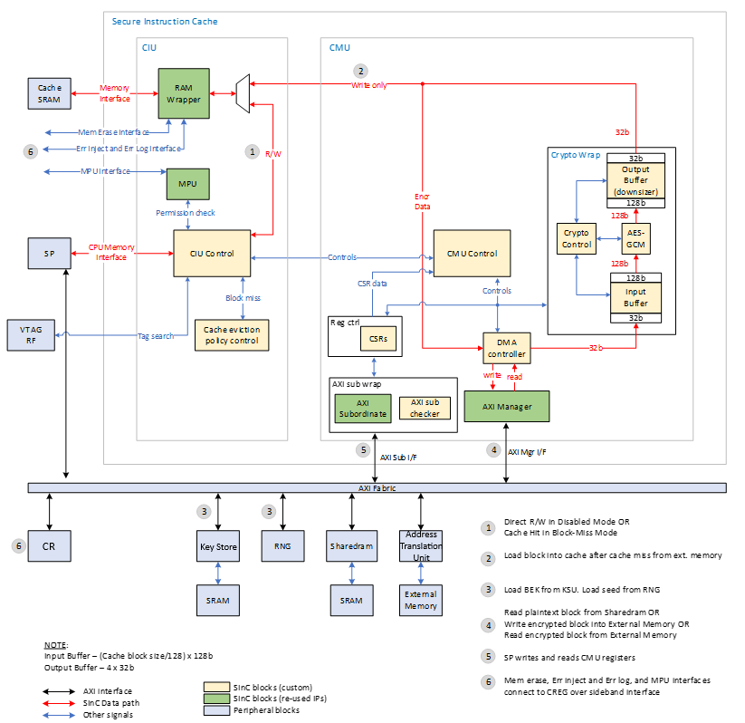

Figure 1: Top Level Block Diagram

# Hardware Description

## Functional description

Secure Instruction Cache implements completely hardware-based memory caching mechanism for Instruction RAM. It is a 4-way set associative cache whose purpose is to accept any requests from CPU within the external memory space and respond to those requests. On any request, it determines whether the request encountered a cache hit or a miss. In the event of a hit, the response is driven by accessing cache IRAM directly whereas during a cache miss, it will fetch the requested data (one cache block), store it in cache and then provide response to CPU.

SInC design is divided into two main blocks – CIU (Cache Interface Unit) and CMU (Cache Management Unit) which are further divided into multiple sub-blocks described later in this section. Some of the sub-blocks are custom while some are re-used from the existing IP portfolio.

security processor/CPU send transactions to SInC over CPU memory interface as shown in block diagram and is connected to CIU block in SInC. SInC typically interfaces with the rest of the design over AXI fabric and acts as both AXI Manager and AXI Subordinate for different purposes.

In terms of security processor memory map, a region up to 16MB (matching the size of external memory allocated to SInC) can be assigned to SInC (i.e., cached IRAM). The cached IRAM itself is much smaller than external memory and is project specific.

SInC is designed with various parameters including external memory size, cache size, block size and more to serve requirements for different implementations. Refer to Parameters Section for more details on parameters.

SInC operates in one of the four states – Disabled, Initialization, Cache-active, and Cache-failed.

The typical flow of state machine is Disabled -\> Initialization -\> Cache-active. CMU is responsible for controlling the SInC state. Below is a brief description of these states and more details can be found in [CIU](#ciu) and [CMU](#cmu) sections.

**Disabled state**

Out of reset, it starts in Disabled state. In Disabled state, the caching mechanism is disabled and the cache IRAM acts completely as an extension of local IRAM to security processor i.e., security processor has read and write access to cache IRAM given FW sets MPU permissions appropriately. The rest of the external memory space is inaccessible in this state.

FW can run KAT in this state using AES test mode. n

**Initialization state**

Initialization state is meant for FW to take the unencrypted FW image from shared ram, encrypt it and store it in the external memory. In other words, it is meant for FW to initialize the external memory space. SInC provides registers for FW to execute these steps. In this state, the cache IRAM acts the same way as Disabled state, and the external memory is inaccessible.

FW can choose not to do anything in this state and move to cache-active if external memory is already initialized such as when coming up from low-power state.

**Cache-active state**

In Cache-active state, SInC enables its caching mechanism, checks for cache hit/miss on incoming security processor requests, allows the security processor request if it is a hit and fetches the block from external memory if it is a miss. During a cache-miss, security processor request is stalled until block is replaced. security processor also doesn’t have write access to cache IRAM anymore.

**Cache-failed state**

This is an error state. SInC transitions to this state if a severe error occurs in SInC CMU. In this state, the SInC (CIU) doesn’t accept any requests from CPU and will respond to them with error. Refer to Errors section to read about severe errors.

The only way out of this state is to transition to Disabled state using SInC reset command.

### CIU

This is the Cache Interface Unit which is responsible for looking for incoming requests from CPU, implementing MPU restrictions on the incoming requests, performing the tag search, implementing cache-block replacement/eviction policy, forward the CPU request to memory and signal cache miss with the address to CMU. CIU’s operations depend on the SInC state which is described in [CIU Control](#ciu-control) section.

#### CIU Control

CIU control implements the primary control logic to perform all the CIU operations. Depending on the SInC state – disabled, initialization, cache-active, or cache-failed, CIU performs different tasks on the incoming CPU requests. Note that SInC state is controlled by CMU and more information about how CMU manage these states is described in [CMU](#cmu) section.

**Disabled state**

In this state, cache SRAM acts as just another local IRAM, meaning caching mechanism is disabled. The cache sits at the lowest address region of the entire external ~~cache~~ memory space. MPU is active and implements access restrictions for cache IRAM. FW can choose to change these permissions if needed.

In this state, CIU is looking for incoming requests from CPU. On a new request, it checks if the request is allowed by MPU and simultaneously sends the request to cache SRAM. Read data is sent back to CPU only if there is no uncorrectable error or MPU violation. For the write request, the write is only committed after MPU allows it. Tag search is not performed, and cache replacement policy control block is also inactive in this state.

*NOTE*: In this state, only the lowest region mapped to cache IRAM is accessible and access to any other location in the external memory space outside this cache region must result in a decode error or any other error. This logic must be implemented outside SInC (within the CPU address decoding logic) using sinc_cpu_non_active_state output to block such requests. If such a request is provided to SInC, it will alias it back into cache IRAM region resulting in unexpected behavior.

If FW initiates the state change request to initialization, CMU sends this request to CIU for CIU to block all incoming requests from CPU until SInC completes its transition to Initialization state. CMU will also indicate state change request complete.

**Initialization state**

CIU behaves in the exact same way as Disabled state.

**Cache-active state**

In this state, caching mechanism is enabled. CIU is looking for incoming requests from CPU and checks each request for hit/miss as described below. CPU write requests are not allowed in this state.

On a new incoming request, it asserts the busy output, checks if the request is allowed by MPU and simultaneously sends the request to cache. At the same time, it also sends the request to vtag block for tag search. If tag search returns successful, MPU allows it and there is no uncorrectable error, then the read data is sent back to CPU. If the tag is found but there is either MPU violation or uncorrectable error, then the CPU request is responded with error. If the valid tag is not found, then a block fetch request is sent to CMU and busy is kept high. Once CMU responds with block fetch completion, CIU reads the cache again and then sends the read data to CPU (lowering the busy as well).

CPU doesn’t have write permission to the cache IRAM in this state. A write request is flagged as an MPU violation.

Apart from this, CIU stalls all incoming requests from CPU while SInC is in the process of transitioning from one state to another.

**Cache-failed state**

In this state, CIU won’t service any CPU requests. Any request from CPU will be flagged as an MPU violation.

#### MPU

SInC implements standard MPU IP to implement access restrictions for cache. The MPU will be mapped to entire external memory space and as a result it needs to hold permission attributes for the entire external memory. MPU has a set of attributes for each page which corresponds to 4KB size of the external memory.

FW can modify MPU attributes as needed including locking some of the attributes which prevent further modification of attributes until next reset. FW must take care to not perform CPU access to SInC and modifying MPU attributes at the same time to avoid unpredictable response for the corresponding CPU request.

#### Vtag Control

This block performs tag search upon request and responds back with tag found or not. It also ensure tags and their valid bits are erased during memory erase, or sinc reset and sinc re-init commands. It is originally planned to be implemented as a register-file but may be changed to SRAM depending on area optimization.

If an SRAM is used to store tags, it may also need its own RAM Wrapper instance, which should be kept in mind while analyzing area for SRAM.

#### Cache eviction policy control

This block implements FIFO cache replacement/eviction policy for each set in the cache and indicates which block to evict/replace on a cache miss.

Upon a cache miss, it identifies the block to evict based on FIFO status for that set, writes the new block and updates the FIFO status accordingly. On a cache hit, FIFO remains unchanged.

Since SInC implements a fixed 4-way set associative cache, each set in the cache contains 4 cache blocks and to implement FIFO replacement policy, there will be a 2b counter (to record FIFO status) representing each set and whose value will indicate the next block to replace on a cache miss.

This counter is initialized to 0 on entering Cache-active state. Below is the example which shows how the blocks are replaced and the counter is updated on cache misses.

| New tag | Result | Tag to be replaced | Counter value | Next counter value | Tag in block 3 | Tag in block 2 | Tag in block 1 | Tag in block 0 |
|----|----|----|----|----|----|----|----|----|
| E | Cache miss | A | 00 | 01 | D | C | B | A |
| F | Cache miss | B | 01 | 10 | D | C | B | E |
| A | Cache miss | C | 10 | 11 | D | C | F | E |
| G | Cache miss | D | 11 | 00 | D | A | F | E |
| C | Cache miss | E | 00 | 01 | G | A | F | E |

The number of such counters matches the number of sets in the cache.

#### RAM Wrapper

SInC implements standard RAM Wrapper module as the memory controller to communicate with cache SRAM. It handles memory erase, ECC encoding and decoding, and error injection and error logging, as well as data scrambling.

### CMU

This is the Cache Management Unit, which is responsible for handling multiple SInC operations the details of which are described in this section, but mainly it performs cache block encryption to initialize the external memory with encrypted FW image and fetches the block from external memory upon request from CIU, decrypt that block, and store it in cache during a cache miss. It also contains registers to perform the FW commands supported by SInC (one at a time) and provides the status back to FW.

There are 4 states that CMU operates in.

1.  **Disabled:** Reset state. CMU is idle, CMU can run AES in test mode.

2.  **Initialization**: Perform block encryption.

3.  **Cache-active**: Service block fetch request from CIU.

4.  **Cache-failed**: Transitions in this state if an error is encountered.

The typical flow of state machine is Disabled -\> Initialization -\> Cache-active. The details of these states are described in [CMU Control](#cmu-control) section.

The commands supported by SInC (implemented by CMU) are listed below. All are FW executed except Fetch block command which is executed by SInC hardware on a cache miss.

1.  **Set to Initialization**: Move SInC from Disabled to Initialization state.

2.  **Run AES in test mode**: Execute known test vectors on AES in GCM or ECB mode through FW.

3.  **Encrypt block**: Encrypt all the required cache blocks and store them in external memory.

4.  **Set to Cache-active**: Move SInC from Initialization to Cache-active state.

5.  **SInC reset**: Move SInC from Initialization, Cache-active or Cache-failed state to Disabled state.

6.  **SInC re-init**: Move SInC from Cache-active state to Initialization state.

7.  **Disable reset**: Disable SInC reset command until next reset.

8.  **Disable re-init**: Disable SInC re-init command until next reset.

9.  **Fetch block**: Fetch the requested cache block from external memory and write it to cache IRAM.

The table below describes which commands are allowed in each SInC state.

<table>
<colgroup>
<col style="width: 38%" />
<col style="width: 61%" />
</colgroup>
<thead>
<tr>
<th>SInC state</th>
<th>Commands allowed</th>
</tr>
</thead>
<tbody>
<tr>
<td><strong>Disabled</strong></td>
<td><ol type="1">
<li>
Set to Initialization
</li>
<li>
Run AES in test mode
</li>
<li>
Disable reset
</li>
<li>
Disable re-init
</li>
</ol></td>
</tr>
<tr>
<td><strong>Initialization</strong></td>
<td><ol type="1">
<li>
Encrypt block
</li>
<li>
Set to Cache-active
</li>
<li>
SInC reset
</li>
<li>
Disable reset
</li>
<li>
Disable re-init
</li>
</ol></td>
</tr>
<tr>
<td><strong>Cache-active</strong></td>
<td><ol type="1">
<li>
Fetch block (HW command)
</li>
<li>
SInC reset
</li>
<li>
SInC re-init
</li>
<li>
Disable reset
</li>
<li>
Disable re-init
</li>
</ol></td>
</tr>
<tr>
<td><strong>Cache-failed</strong></td>
<td><ol type="1">
<li>
SInC reset
</li>
</ol></td>
</tr>
</tbody>
</table>

#### CMU Control

CMU control block is the main control logic for CMU operations and is also responsible for maintaining the different states that SInC operates in – Disabled, Initialization, Cache-active, and Cache-failed. It also executes commands initiated by FW. It communicates with reg control, crypto wrap and CIU to execute these operations.

When processing certain commands (FW or HW requested), CMU asserts cmu_busy to let CIU indicate the busy back to CPU (using sinc_cpu_busy_o) to stall any new requests until cmu_busy is lowered. These commands are Set to cache-active, SInC reset, SInC re-init, fetch block, disable reset, and disable re-init. This is done to avoid any contention while accessing cache IRAM.

Also, writes to any SInC register will be responded with SLVERR while CMU is processing any command. An exception to this is writes to any SInC register is allowed if CMU is busy processing AES test mode. This is done to avoid unexpected execution of any command.

CMU generates a pulse on SInC done output once a command completes. Additionally, it also generates pulse on the same output when memory erase completes.

On the other hand, if any command encounters an error, CMU stops the command execution, generate pulse on SInC error output and update its status register.

FW must read the status register to read out status of previous command (if applicable) before issuing a new command in that case.

If the error encountered is a severe error, then CMU control moves SInC into Cache-Failed state. See Severe errors section to know more about the severe errors. In cache-failed state, SInC behaves as if it is in disabled state but the only command accepted in SInC reset command (if it is not already disabled).

CMU state is encoded with redundancy to protect it against fault-injections and glitch attacks.

##### CMU control commands 

The sub-sections below define various commands in detail that are supported in each SInC state.

###### Disabled state

CMU (and SInC) comes out of reset in disabled state. In this state, CMU is inactive, meaning the cache mechanism is inactive, the cache SRAM is directly accessible by security processor and acts as an extension to local IRAM, and it is mapped to the lowest address region of the external memory space. The rest of the external memory space is inaccessible. In this state, there is no concept of cache hit or miss and CIU completely controls the accesses to cache IRAM using MPU.

Additionally, FW can also use AES in test mode and execute known test vectors only in this state.

CMU is idle in this state until it receives any FW command. Commands supported in this state are as follows.

1.  Set to Initialization state.

2.  Run AES in test mode.

**Command - Set to Initialization state**

FW must load aes_iv_nonce\* registers (typically from RNG), block_encr_key register, ext_block_base_addr register, and ext_auth_tag_base_addr register before setting set_init_mode bit in cmd register to execute set initialization state command.

Incorrect programming of the above registers may lead to unexpected behavior.

On receiving set to initialization command request, the following steps are performed.

- CMU asserts cmu_busy signal and indicates busy in status register.

- Crypto wrap

  - Reads the seed from RNG to seed the trivium in AES (if not already seeded).

  - Reads the key store key slot defined in block_encr_key register and stores the key locally.

- SInC transitions to Initialization state, CMU de-asserts cmu_busy and indicates completion in status register.

On a SInC request to read the key, key store must check the following key attributes before providing the key.

- KeySize384 is not set.

- IsDeviceSecret, AESEncryptAllowed, and AESDecryptAllowed are set.

Note that an AEB if set, will skip this check in key store. Read [Debug](#debug) section for more details.

**Command - Run AES in test-mode**

FW can also enable AES test mode to run AES and AES-GCM validation tests required by NIST. This is essentially an extension to running a single KAT test on every boot. In the test mode, FW can run known test vectors of input, output, key, and IV through AES to test AES engine in hardware. Essentially, FW provides know input vectors like input data, key and IV in AES test registers and uses test control and status registers to run the AES on those input vectors and obtain the output for comparison.

On receiving AES test mode command request, the following steps are performed.

- Crypto wrap

  - Reads the seed from RNG to seed the trivium in AES (if not already seeded).

  - Read the key based on block encryption key register and store it locally.

  - Loads the AES mode and direction (encryption or decryption), from AES test control register into AES.

  - Loads the locally stored key and key length to AES.

  - Loads the IV from IV Nonce\* registers.

  - Loads the data from AES test data input\* registers as 128b AES input block and performs the AES operation.

  - Generates the 128b AES output block and stores in AES test data output\* registers.

  - If the output block was the last block, then it continues to the next step otherwise it loads the next input block from AES test data input\* registers and repeat the process.

  - Also generates the authentication tag and stores in AES test data output\* registers once the last output block is read by FW.

When exiting out of test mode, CMU clears GP AES using soft-reset feature. This ensures that GP AES is reset to a fresh state for before performing other commands.

Refer to [Software Programming Model](#software-programming-model) section to know how to use AES in test mode.

###### Initialization state

In initialization state, CMU is idle (like Disabled state), but the main purpose of this state is to initialize external memory with encrypted FW image. CMU does that by reading the requested number of cache blocks from shared ram on a FW request, encrypt the blocks, and write them in external memory along with their authentication tags.

The cache IRAM region still acts as an extension to local IRAM, and rest of external memory is inaccessible (same as in Disabled state).

Before requesting transition to cache-active state, FW must ensure that it completed the initialization of external memory with the FW image it requires until next initialization.

Commands supported in this state are as follows.

1.  Encrypt block/s.

2.  Set to Cache-active state.

3.  SInc reset

**Command - Encrypt block**

To execute encrypt block command i.e., encrypt the blocks and initialize the external memory, FW must program the first block number, number of blocks and block encryption address registers, and then set the encrypt_block bit in command register.

On receiving encrypt block command request, the following steps are performed.

- CMU indicates busy in status register.

- Crypto wrap

  - Starts reading the cache block starting from address stored in block encryption address register (typically targeting shared ram) via DMA-R and loads the read data in the input buffer.

  - Simultaneously, it loads AES mode, direction, locally stored key, and 128b IV combined using IV Nonce\* registers and from block encryption number register into AES.

  - Encrypts the input buffer data with AES-GCM and writes the encrypted block via DMA-W and address translation unit to external memory.

  - Generates the authentication tag for each cache block and writes it to external memory using base address loaded in authentication tag base address register.

  - It repeats these steps for as many blocks as the value loaded in number of blocks register and pipelines the process to have the maximum throughput.

- CMU indicates completion in status register.

Note that since AES IV consists of block number, its value is specific to each cache block and authentication tag is also generated and stored per cache block. However, same key is used for encryption/decryption until SInC transitions to the disabled state. The consecutive encrypted cache blocks are stored contiguously in external memory starting from address loaded in external block base address register and the authentication tags corresponding to those cache blocks are stored contiguously in external memory starting from address loaded in external authentication tag base address register. Meaning the encrypted cache block 0 starts at external block base address and corresponding authentication tag starts at external authentication tag base address.

FW can repeat encrypt block command as many times as it wants however, it is advised to run it once and encrypt all the blocks required to save time. FW can choose not to encrypt any blocks if the external memory is already initialized.

**Command - Set to Cache-active state**

FW can set set_cache_active_state bit in cmd register to execute set cache-active state command. On receiving this command, SInC transitions to cache-active state and sets the complete bit in status register.

FW can execute this command any time while SInC is in Initialization state if CMU is not processing any other command.

**Command - SInC reset**

FW can issue a request to move SInC back to Disabled state by setting sinc_reset bit in cmd register.

On receiving sinc reset command request, the following steps are performed.

- CMU asserts cmu_busy signal and indicates busy in status register.

<!-- -->

- CIU wipes the cache IRAM and VTAG, and reset the MPU permissions.

- Crypto wrap clears the locally stored BEK.

- SInC transitions to Disabled state, CMU de-asserts cmu_busy and indicates completion in status register.

Note that the IV Nonce register is not affected by this command.

The ability of FW to perform a SInC reset command can be disabled by setting disable_sinc_reset bit in cmd register. This is reflected by setting sinc_reset_disabled field in status register. Once disabled, any attempt to execute a SInC reset command will result in an invalid command error. The disabled status can only be cleared by a reset.

###### Cache-active state

In cache-active state, the main task of CMU is to service block fetch requests from CIU on cache misses by fetching block from external memory, decrypting it, and storing it in cache IRAM. security processor doesn’t have write access to cache IRAM in this state and results in an error. Read Errors section for more details.

Commands supported in this state are as follows.

1.  Block fetch request from CIU (initiated by HW)

2.  SInC re-init

3.  SInC reset – Same as in Initialization state.

**Command - Block fetch request from CIU**

If any incoming request from security processor is a cache miss, CIU sends a “fetch block” request to CMU to fetch the corresponding cache block from external memory before servicing CPU request. CIU provides the transaction address when making the fetch block request.

On receiving block fetch request from CIU, the following steps are performed.

- Crypto wrap

  - Loads the AES configuration, IV from IV Nonce\* registers and key from BEK into AES

  - Simultaneously, starts reading the cache block via DMA-R and address translation unit from external memory using the address indicated by CIU and the address loaded in block base address register and loads the read data into the input buffer.

  - Decrypts the input buffer data with AES-GCM and stores it in the output buffer.

  - As each AES block is available in the output buffer, it is written to cache IRAM one word at a time whereas the authentication tag is stored locally for comparison.

  - After the cache block is fetched, it reads the authentication tag from the external memory and verifies against the stored authentication tag.

- If the tag matches, CMU signals block fetch completion to CIU, otherwise indicates an error.

CMU goes back to idle until the next block fetch request. CMU also signals an error if there is authentication tag failure or AES fault during this command.

**Command - SInC re-init**

FW can issue a request to move SInC back to Initialization state by setting sinc_reinit bit in cmd register. Upon receiving this command, the following steps are performed.

- CMU asserts cmu_busy signal and indicates busy in status register.

<!-- -->

- CIU wipes the cache IRAM and reset the VTAG. MPU permissions are preserved.

- SInC transitions to Initialization state, CMU de-asserts cmu_busy and indicates completion in status register.

The SInC re-init command is intended to allow FW to extend or modify code and data previously loaded to external memory. A partial image can be loaded in a first initialization stage, then executed in cache-active mode and be later extended or modified in a subsequent initialization stage with the same key.

The ability of FW to perform a SInC re-init command can be disabled by setting disable_sinc_reinit bit in cmd register. This is reflected by setting sinc_reinit_disabled field in status register. Once disabled, any attempt to execute a SInC reinit command will result in an invalid command error. The disabled status can only be cleared by a reset.

###### Cache-failed state

SInC transitions to this state if any severe error occurs in CMU. In this state, the SInC (CIU) doesn’t accept any requests from CPU and will respond to them with error.

Additionally, locally stored BEK and IV Nonce\* registers are cleared upon entering this state. CMU mostly remains inactive in this state. It doesn’t accept any command requests from FW except SInC reset command, but it does allow other register accesses for FW to debug the error. Also, CMU doesn’t receive any block fetch requests in this state since CIU doesn’t accept any CPU requests.

Commands supported in this state are as follows.

1.  SInC reset – Same as in Initialization state.

#### Crypto wrap

This block is controlled by CMU control block, meaning it receives the command from CMU control to perform the requested operations. It instantiates the AES engine for performing encryption/decryption, the input buffer to temporarily store the data fetched from external memory or shared ram, the output buffer to convert 128b to 32b data bus, stores the BEK (block encryption key) used by AES, the hash subkey H, and stores the expected authentication tag to be used during block fetch request from CIU, and implements control logic of its own to carry out different operations.

It primarily executes three operations – run AES in test mode, block encryption and block decryption which uses AES engine. It executes these operations upon CMU control requests. These operations are already described in detail in the [CMU Control](#cmu-control) section above.

Out of reset, for the first request it sees from CMU control, it first executes the read to RNG to seed the trivium inside AES for DPA protection.

In SInC reset request from CMU control, it deletes the locally stored BEK.

##### Crypto wrap operations

Crypto wrap receives command requests from CMU control module.

###### Block encryption

Block encryption is performed when FW executes encrypt block command. CMU control signals Crypto wrap about this command and Crypto wrap performs multiple steps to encrypt the requested blocks. These steps are detailed in [CMU Control](#cmu-control) section above.

Note that HW assumes all cache blocks are stored in contiguous memory space.

The diagram below shows the data path during block encryption.

<figure>
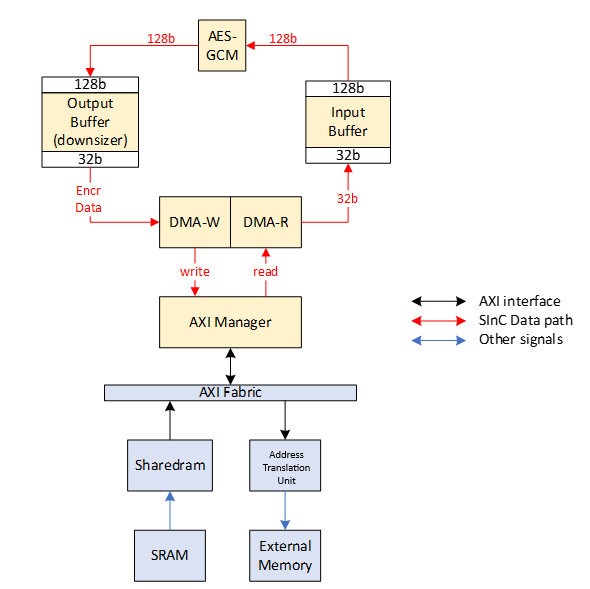
<figcaption>
Block encryption flow during initialization
</figcaption>
</figure>

###### Block decryption

Block decryption is performed when receiving block fetch request from CIU. CMU control signals Crypto wrap about this command and Crypto wrap performs multiple steps to fetch the requested block and decrypt it and verify it. These steps are detailed in [CMU Control](#cmu-control) section above.

Crypto wrap may instruct DMA-R to read the whole block in a single burst transaction or split up in multiple smaller burst transactions to maximize the throughput. This depends on the latency to fetch the data from external memory and the input buffer size. Input buffer size calculation is defined in one of the later sections. Since the latency and the input buffer size are fixed, the burst length of DMA-R is also fixed.

NOTE: Design will initially do single burst transaction to fetch the whole cache block. But it may be changed in future implementations to optimize the input buffer size.

The diagram below shows the data path during block decryption.

<figure>
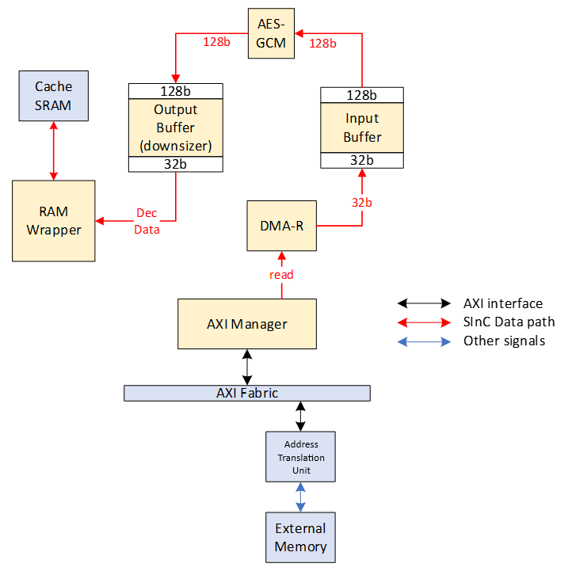
<figcaption>
Block decryption flow (on block miss)
</figcaption>
</figure>

###### AES Test mode

In test mode, Crypto wrap performs AES operation of FW provided inputs of key, IV and data and generates output data and tag. The steps performed in the test mode are described in [CMU Control](#cmu-control) section above.

Refer to [Software Programming Model](#software-programming-model) section to understand how to execute AES test mode operation.

##### AES Engine

This section talks about the AES engine to encrypt and decrypt the cache block. In SInC, AES can be used in two modes – functional and test.

In functional mode, AES is always used in GCM mode, meaning an authentication tag is generated after encrypting each block which is stored in external memory, and it is verified when the block is decrypted. Other constraints in AES functional mode are key size is fixed at 256b, message length is fixed and equal to cache block size and there is no AAD (Additional Authenticated Data).

In test mode, all the inputs to AES i.e., mode, direction, key, IV, and input block are completely controlled by FW using AES test data, control, and status registers. In test mode, AES supports GCM or ECB modes and can have variable message length, while the key size is fixed to 256b. Test mode can only be enabled in SInC Disabled state.

The AES test mode is used to perform KAT or validation testing defined by NIST.

**Initialization Vector**

A different 96-bit initialization vector (IV) needs to be generated for the encryption/decryption of each block following the deterministic construction guidelines of NISP SP 800-38D, section 8.2.1.

Except in AES test mode, the 96-bit IV is split into a fixed field of 72b written by the FW into IV Nonce\* registers and the invocation field of 24b calculated by HW which is the cache block number being processed by a particular command and AES-GCM invocation.

In AES test mode, FW writes all 96b of IV in IV Nonce\* registers which is then used by AES-GCM invocation.

<figure>
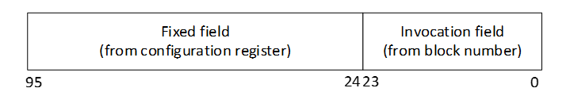
<figcaption>
AES-GCM 96b IV
</figcaption>
</figure>

The FW must set these IV Nonce\* registers before issuing set to Initialization state or AES test mode commands.

When processing encrypt block or fetch block commands CMU calculates the block number part of the IV from the command input. As the external memory is only setup once for a given key, there won’t be two invocations corresponding to different blocks with the same IV and same key.

When processing AES test mode command, CMU uses all 96b of IV from IV Nonce\* registers for AES-GCM invocation. AES test mode is meant for debugging scenarios or running KATs so there is no concern about repeating IV and key for different data blocks.

Regardless of the command being processed, the 96b IV is padded on the MSB with 32’h100_0000 as per NIST specification to make a 128b IV and this 128b IV is supplied to AES engine.

128b IV = {32'h100_0000, 96b IV}.

Writes to the IV nonce\* and block encryption key registers are enabled only in Disabled state, writes in other states don’t take effect.

##### AES seeding

The first time a command is executed out of reset, Crypto wrap will read 640b from RNG to seed the trivium in AES before executing any other operation. This is only done once, and once trivium is seeded, it doesn’t need to be re-seeded until the next reset. If there is an error while fetching the seed, SInC goes to cache-failed state and cmd_status is updated by flagging as rng_error. Note that since GP AES is not retained, every time SInC goes under power-gated retention state and comes up, GP AES needs to be re-seeded which is handled by CMU control and crypto wrap control block. If SInC comes out of power gated state in disabled state, it waits for a command to read the seed, but if it comes up in any of the non-disabled states, it immediately reads the seed from RNG. cmu_busy is asserted in both cases. In former, due to a command under process and in latter, since CMU cannot accept any other requests, and status register is also updated to indicate command in progress, which is cleared once trivium is seeded.

##### Input Buffer

The input buffer is like a FIFO, but it also converts 32b data bus connected to DMA-R to 128b data bus to match with AES block size. More importantly it is used to store block data fetched from external memory while AES is busy.

To simplify the design, input buffer is sized to store one complete cache block. Its width matches the AES block size and depth is N = BLOCK_SIZE/16. The input buffer size is parameterized and is set to match the block size.

<figure>
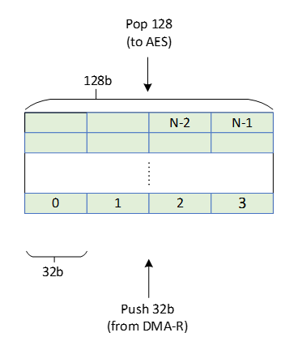
<figcaption>
Input Buffer (block size = 512B)
</figcaption>
</figure>

**Optimization of input buffer (Not implemented)**

The input buffer size needs to be carefully selected to optimize the area while not impacting AES throughput (if the buffer size was infinite). This is done by matching the latency/throughput of external memory read with the AES throughput. This primarily depends on multiple factors, the latency in fetching the block from external memory, the AES throughput, number of multiple outstanding transactions supported by AXI manager, etc.

For AES, no. of clocks to process 1 cache block = no. of clocks for one AES block \* (no. of AES blocks + 1)

Where,

No. of clocks for one AES block = 15 clocks

No. of AES blocks = Cache block size / AES block size and 1 is added AES operation the tag generation.

<u>Example</u>

If the clock frequency is 100 MHz, block size is 1024 B, and the external memory read latency is 1 us, then the no. of clocks to return the data is 100 clocks (assuming the delay between individual beats is insignificant).

No. of AES blocks = 1024/128 = 8 blocks

No. of clocks to perform encryption/decryption = 15 \* (8 + 1) = 135 clocks

To overlap read latency with AES operation, find how much data can AES process in the latency period.

No. of AES blocks within latency period = latency period (in clocks) / 15 = 100/15 = 6.67 ~7 AES blocks

Hence, the input buffer would need to store 7 AES blocks = 7 \* 128B = 896B to optimize for area.

However, in the above example, we could use the maximum buffer size of 1024 B to simplify the design without significant area cost.

##### Output Buffer

The output buffer is simply a downsizer with input data width of 128b and output data width of 32b that acts as a bridge between 128b AES output and 32b data bus in SInC. In other words, all outputs from AES are stored in output buffer temporarily before being consumed.

The buffer needs to store only 128b data at a time without impact throughput, since AES generates 128b every 15 clocks and the buffer can be read out 1 word/clock in 4 clocks (max. 12 clocks considering 1 word per 3 clocks due to RMW).

<figure>
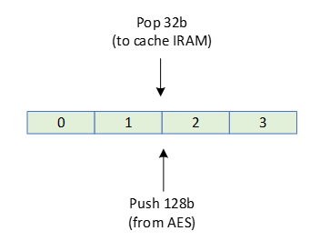
<figcaption>
Output buffer
</figcaption>
</figure>

#### DMA-R

DMA-R is the glue logic between CMU logic and AXI manager IP. It obtains a request to execute a read transaction from CMU control or Crypto wrap block and sends that request to AXI manager to initiate an appropriate single beat or a burst transaction.

At the input request side, it will obtain the start address, the length of the AXI read transaction, and the user bits to drive for the corresponding AXI transaction. DMA-R will translate this into an engine request for AXI manager, which will further translate it into an AXI transaction.

It also obtains the response read data from AXI manager and sends it to the requester.

#### DMA-W

DMA-W is like DMA-R in the terms that it is the glue logic between CMU logic and AXI manager. It obtains a request to execute a write transaction from CMU control or Crypto wrap block and sends that request to AXI manager to initiate an appropriate single beat or a burst transaction.

At the input request side, it will obtain the start address, the length of the AXI write transaction, the write data for each beat and the user bits to drive for the corresponding AXI transaction. DMA-W will translate this into an engine request for AXI manager IP, which will further translate it into an AXI transaction.

On the response side, it confirms the completion of the transaction to the requester.

#### Reg Control

Reg control instantiates the SInC registers and has additional logic surrounding the registers to support CMU functions. The main responsibilities of this block includes gating FW writes based on SInC state, checking for the valid register values, updating register values by HW, signal FW initiated commands to CMU control, update the completion or error status of FW command and contains logic for performance counter registers.

On receiving a new command, it sets the busy bit until the command completes or errors out. On receiving a state change command request, it indicates CIU about it right away and CIU ensures that it doesn’t accept any CPU request while SInC is processing a FW command. On command completion, SInC transitions to the new state, indicates CIU that command has completed (so it can start accepting new transactions) and indicates completion in status register. This process ensures that CIU is always ready to accept CPU requests before FW reads command completion and starts sending the requests to SInC.

#### AXI Subordinate

SInC implements standard AXI Subordinate IP configured to SInC application. This configuration is set using parameters driven by subsystem defines.

This block is primarily used by FW to read/write SInC registers to control different operations and read status.

| Parameter      | Value          | Description                                  |
|----------------|----------------|----------------------------------------------|
| ENGN_PARITY_EN | ENGN_PARITY_EN | Enable engine side parity                    |
| AXI_PARITY_EN  | AXI_PARITY_EN  | Enable AXI side parity                       |
| DFD            | AXI_SUB_DFD    | Data FIFO depth                              |
| CFD            | AXI_SUB_CFD    | Number of outstanding transactions supported |
| BLEN           | AXI_SUB_BLEN   | Maximum burst length                         |

#### AXI Manager

SInC implements standard AXI Manager IP configured to SInC application. This configuration is set using parameters driven by subsystem defines.

This block is primarily controlled by DMA-R/W to fetch the block from shared ram or external memory, store the block in external memory, read seed from RNG, read key from key store, etc.

| Parameter      | Value          | Description                                  |
|----------------|----------------|----------------------------------------------|
| ENGN_PARITY_EN | ENGN_PARITY_EN | Enable engine side parity                    |
| AXI_PARITY_EN  | AXI_PARITY_EN  | Enable AXI side parity                       |
| DFD            | AXI_MGR_DFD    | Data FIFO depth                              |
| BLEN           | AXI_MGR_BLEN   | Maximum burst length                         |
| ANUM           | AXI_MGR_ANUM   | Number of outstanding transactions supported |

## Interfaces

SInC communicates to multiple blocks over different interfaces as described below.

1.  CPU Interface

    1.  Interface for CPU requests and responses.

2.  AXI Manager Interface

    1.  Used to execute AXI read and write operations by SInC for different purposes e.g., fetching a block.

3.  AXI Subordinate Interface

    1.  Used by security processor to access SInC registers.

    2.  This interface is used to execute commands, read status, run KAT, etc.

4.  Memory Erase Interface

    1.  Used to wipe key cache IRAM. It is initiated either by HW or FW.

5.  Error Inject and Error Log Interface

    1.  This interface is used to inject correctable/uncorrectable errors by FW and report error corrections and uncorrectable errors to CR to be handled appropriately.

6.  Memory Interface

    1.  SInC connects to cache IRAM over this interface.

7.  MPU Interface

    1.  Used by CR to modify MPU permissions and to report MPU violations.

8.  Miscellaneous

    1.  Includes clock, reset, AEB , and relevant DFT inputs to SInC.

    2.  Includes error and interrupt outputs.

### Top-level interface

<table style="width:99%;">
<colgroup>
<col style="width: 31%" />
<col style="width: 6%" />
<col style="width: 5%" />
<col style="width: 13%" />
<col style="width: 42%" />
</colgroup>
<thead>
<tr>
<th>Signal Name</th>
<th style="text-align: left;">Size</th>
<th style="text-align: left;">I/O</th>
<th style="text-align: left;">Source/ Destination</th>
<th style="text-align: left;">Description</th>
</tr>
</thead>
<tbody>
<tr>
<td><strong>Clock/Reset/Misc</strong></td>
<td style="text-align: left;"></td>
<td style="text-align: left;"></td>
<td style="text-align: left;"></td>
<td style="text-align: left;"></td>
</tr>
<tr>
<td>clk_i</td>
<td style="text-align: left;">1</td>
<td style="text-align: left;">I</td>
<td style="text-align: left;">Top</td>
<td style="text-align: left;">Clock input</td>
</tr>
<tr>
<td>rstn_i</td>
<td style="text-align: left;">1</td>
<td style="text-align: left;">I</td>
<td style="text-align: left;">Top</td>
<td style="text-align: left;">Async active-low reset input (for retention domain)</td>
</tr>
<tr>
<td>lp_rstn_i</td>
<td style="text-align: left;">1</td>
<td style="text-align: left;">I</td>
<td style="text-align: left;">Top</td>
<td style="text-align: left;">Async active-low low power reset input (for non-retention domain)</td>
</tr>
<tr>
<td>clkg_test_mode_i</td>
<td style="text-align: left;">1</td>
<td style="text-align: left;">I</td>
<td style="text-align: left;">Top</td>
<td style="text-align: left;">Clock gate test mode input</td>
</tr>
<tr>
<td>clkg_override_i</td>
<td style="text-align: left;">1</td>
<td style="text-align: left;">I</td>
<td style="text-align: left;">CR</td>
<td style="text-align: left;">Clock gate override input. Set to disable clock gating cell (i.e., enable clocking)</td>
</tr>
<tr>
<td>sinc_disable_encr_auth_check_i</td>
<td style="text-align: left;">1</td>
<td style="text-align: left;">I</td>
<td style="text-align: left;">AEB</td>
<td style="text-align: left;">If set, it disables block encryption and authentication tag check in SInC.</td>
</tr>
<tr>
<td>sinc_err_chk_disable_i</td>
<td style="text-align: left;">1</td>
<td style="text-align: left;">I</td>
<td style="text-align: left;">AEB</td>
<td style="text-align: left;">If set, it disables ECC parity check on memory read data.</td>
</tr>
<tr>
<td>sinc_err_parity_chk_disable_i</td>
<td style="text-align: left;">1</td>
<td style="text-align: left;">I</td>
<td style="text-align: left;">AEB</td>
<td style="text-align: left;">If set, it disables bus and CSR parity check. Not used in this version of sinc.</td>
</tr>
<tr>
<td>sinc_ret_en_ni</td>
<td style="text-align: left;">1</td>
<td style="text-align: left;">I</td>
<td style="text-align: left;">Power controller (EPC)</td>
<td style="text-align: left;">
Retention enable. Set by power controller during retention state to save the state of retention flops.

1 – Save state

0 – Restore state

Must be used in UPF to define set_retention strategy.
</td>
</tr>
<tr>
<td>sinc_iso_en_i</td>
<td style="text-align: left;">1</td>
<td style="text-align: left;">I</td>
<td style="text-align: left;">Power controller (EPC)</td>
<td style="text-align: left;">
Isolation enable. Set by power controller during retention state to clamp the outputs of SInC to low.

1 – Isolation active and outputs are clamped.

0 – Isolation is not-active and outputs are not clamped.

Must be used in UPF to define set_isolation strategy.
</td>
</tr>
<tr>
<td>sinc_err_o</td>
<td style="text-align: left;">1</td>
<td style="text-align: left;">O</td>
<td style="text-align: left;">CR</td>
<td style="text-align: left;">Positive pulse indicates that sinc encountered an error. The errors are listed under CMU section in Errors. Read status register for more information.</td>
</tr>
<tr>
<td>sinc_done_o</td>
<td style="text-align: left;">1</td>
<td style="text-align: left;">O</td>
<td style="text-align: left;">CR</td>
<td style="text-align: left;">Positive pulse indicates that sinc finished a FW command successfully or finished memory erase. Not asserted on completing fetch block request as that is a HW command.</td>
</tr>
<tr>
<td>sinc_active_o</td>
<td style="text-align: left;">1</td>
<td style="text-align: left;">O</td>
<td style="text-align: left;">CR</td>
<td style="text-align: left;">If set, it indicates that SInC is currently processing a transaction and not idle. Can be used for higher level clock/power gating.</td>
</tr>
<tr>
<td>sinc_err_parity_o</td>
<td style="text-align: left;">2</td>
<td style="text-align: left;">O</td>
<td style="text-align: left;">CR</td>
<td style="text-align: left;">
If set, it indicates that parity error occurred in sinc.

[1] Bus parity error

[0] Register parity error

Tied to 2’h0 in this version of sinc.
</td>
</tr>
<tr>
<td></td>
<td style="text-align: left;"></td>
<td style="text-align: left;"></td>
<td style="text-align: left;"></td>
<td style="text-align: left;"></td>
</tr>
<tr>
<td><strong>AXI Subordinate Interface</strong></td>
<td style="text-align: left;"></td>
<td style="text-align: left;"></td>
<td style="text-align: left;"></td>
<td style="text-align: left;"></td>
</tr>
<tr>
<td>Read Address channel (AR)</td>
<td style="text-align: left;">-</td>
<td style="text-align: left;">-</td>
<td style="text-align: left;">AXI fabric</td>
<td style="text-align: left;">Read Address channel signals</td>
</tr>
<tr>
<td>Read Resp/Data channel I</td>
<td style="text-align: left;">-</td>
<td style="text-align: left;">-</td>
<td style="text-align: left;">AXI fabric</td>
<td style="text-align: left;">Read Response and Data channel signals</td>
</tr>
<tr>
<td>Write Address channel (AW)</td>
<td style="text-align: left;">-</td>
<td style="text-align: left;">-</td>
<td style="text-align: left;">AXI fabric</td>
<td style="text-align: left;">Write Address channel signals</td>
</tr>
<tr>
<td>Write Data channel (W)</td>
<td style="text-align: left;">-</td>
<td style="text-align: left;">-</td>
<td style="text-align: left;">AXI fabric</td>
<td style="text-align: left;">Write Data channel signals</td>
</tr>
<tr>
<td>Write Response channel (B)</td>
<td style="text-align: left;">-</td>
<td style="text-align: left;">-</td>
<td style="text-align: left;">AXI fabric</td>
<td style="text-align: left;">Write Response channel signals</td>
</tr>
<tr>
<td></td>
<td style="text-align: left;"></td>
<td style="text-align: left;"></td>
<td style="text-align: left;"></td>
<td style="text-align: left;"></td>
</tr>
<tr>
<td><strong>AXI Manager Interface</strong></td>
<td style="text-align: left;"></td>
<td style="text-align: left;"></td>
<td style="text-align: left;"></td>
<td style="text-align: left;"></td>
</tr>
<tr>
<td>Read Address channel (AR)</td>
<td style="text-align: left;">-</td>
<td style="text-align: left;">-</td>
<td style="text-align: left;">AXI fabric</td>
<td style="text-align: left;">Read Address channel signals</td>
</tr>
<tr>
<td>Read Resp/Data channel I</td>
<td style="text-align: left;">-</td>
<td style="text-align: left;">-</td>
<td style="text-align: left;">AXI fabric</td>
<td style="text-align: left;">Read Response and Data channel signals</td>
</tr>
<tr>
<td>Write Address channel (AW)</td>
<td style="text-align: left;">-</td>
<td style="text-align: left;">-</td>
<td style="text-align: left;">AXI fabric</td>
<td style="text-align: left;">Write Address channel signals</td>
</tr>
<tr>
<td>Write Data channel (W)</td>
<td style="text-align: left;">-</td>
<td style="text-align: left;">-</td>
<td style="text-align: left;">AXI fabric</td>
<td style="text-align: left;">Write Data channel signals</td>
</tr>
<tr>
<td>Write Response channel (B)</td>
<td style="text-align: left;">-</td>
<td style="text-align: left;">-</td>
<td style="text-align: left;">AXI fabric</td>
<td style="text-align: left;">Write Response channel signals</td>
</tr>
<tr>
<td></td>
<td style="text-align: left;"></td>
<td style="text-align: left;"></td>
<td style="text-align: left;"></td>
<td style="text-align: left;"></td>
</tr>
<tr>
<td><strong>CPU Interface</strong></td>
<td style="text-align: left;"></td>
<td style="text-align: left;"></td>
<td style="text-align: left;"></td>
<td style="text-align: left;"></td>
</tr>
<tr>
<td>sinc_cpu_busy_o</td>
<td style="text-align: left;">1</td>
<td style="text-align: left;">O</td>
<td style="text-align: left;">security processor Wrapper</td>
<td style="text-align: left;">Memory busy output</td>
</tr>
<tr>
<td>sinc_cpu_rdata_o</td>
<td style="text-align: left;">32</td>
<td style="text-align: left;">O</td>
<td style="text-align: left;">security processor Wrapper</td>
<td style="text-align: left;">Memory read data output to CPU</td>
</tr>
<tr>
<td>sinc_cpu_rdata_vld_o</td>
<td style="text-align: left;">1</td>
<td style="text-align: left;">O</td>
<td style="text-align: left;">security processor Wrapper</td>
<td style="text-align: left;">Memory read data valid</td>
</tr>
<tr>
<td>sinc_cpu_r_err_o</td>
<td style="text-align: left;">1</td>
<td style="text-align: left;">O</td>
<td style="text-align: left;">security processor Wrapper</td>
<td style="text-align: left;">Memory read error to indicate that read request didn’t complete.</td>
</tr>
<tr>
<td>sinc_cpu_non_active_state</td>
<td style="text-align: left;">1</td>
<td style="text-align: left;">O</td>
<td style="text-align: left;">security processor Wrapper</td>
<td style="text-align: left;">
If set, it indicates that SInC is not in cache-active state. Must be used by CPU address decoding logic to make different memory size regions available to CPU.

0: Entire external memory accessible

1: External memory disabled (only cache memory region accessible).
</td>
</tr>
<tr>
<td>cpu_sinc_en_i</td>
<td style="text-align: left;">1</td>
<td style="text-align: left;">I</td>
<td style="text-align: left;">security processor Wrapper</td>
<td style="text-align: left;">Memory enable (chip-select)</td>
</tr>
<tr>
<td>cpu_sinc_we_i</td>
<td style="text-align: left;">1</td>
<td style="text-align: left;">I</td>
<td style="text-align: left;">security processor Wrapper</td>
<td style="text-align: left;">
Memory write enable

0: Read

1: Write
</td>
</tr>
<tr>
<td>cpu_sinc_wdata_i</td>
<td style="text-align: left;">32</td>
<td style="text-align: left;">I</td>
<td style="text-align: left;">security processor Wrapper</td>
<td style="text-align: left;">Memory write data input from CPU</td>
</tr>
<tr>
<td>cpu_sinc_wr_byte_en_i</td>
<td style="text-align: left;">4</td>
<td style="text-align: left;">I</td>
<td style="text-align: left;">security processor Wrapper</td>
<td style="text-align: left;">Memory write byte mask</td>
</tr>
<tr>
<td>cpu_sinc_addr_i</td>
<td style="text-align: left;">*</td>
<td style="text-align: left;">I</td>
<td style="text-align: left;">security processor Wrapper</td>
<td style="text-align: left;">Word-address for the transaction, qualified by memory enable. NOTE: this is not a byte-address.</td>
</tr>
<tr>
<td>cpu_sinc_loadstore_i</td>
<td style="text-align: left;">1</td>
<td style="text-align: left;">I</td>
<td style="text-align: left;">security processor Wrapper</td>
<td style="text-align: left;">Defines if it is a load-store transaction.</td>
</tr>
<tr>
<td>cpu_sinc_priv_mode_i</td>
<td style="text-align: left;">1</td>
<td style="text-align: left;">I</td>
<td style="text-align: left;">security processor Wrapper</td>
<td style="text-align: left;">
Defines privilege mode for the transaction.

1: Privileged mode

0: User mode
</td>
</tr>
<tr>
<td></td>
<td style="text-align: left;"></td>
<td style="text-align: left;"></td>
<td style="text-align: left;"></td>
<td style="text-align: left;"></td>
</tr>
<tr>
<td><strong>VTAG Memory Interface</strong></td>
<td style="text-align: left;"></td>
<td style="text-align: left;"></td>
<td style="text-align: left;"></td>
<td style="text-align: left;"></td>
</tr>
<tr>
<td>sinc_vtag_clk_o</td>
<td style="text-align: left;">1</td>
<td style="text-align: left;">O</td>
<td style="text-align: left;">RF/SRAM</td>
<td style="text-align: left;">VTAG Memory clock</td>
</tr>
<tr>
<td>sinc_vtag_en_o</td>
<td style="text-align: left;">4</td>
<td style="text-align: left;">O</td>
<td style="text-align: left;">RF/SRAM</td>
<td style="text-align: left;">VTAG Memory enable/chip-select.</td>
</tr>
<tr>
<td>sinc_vtag_we_o</td>
<td style="text-align: left;">4</td>
<td style="text-align: left;">O</td>
<td style="text-align: left;">RF/SRAM</td>
<td style="text-align: left;">VTAG Memory write enable</td>
</tr>
<tr>
<td>sinc_vtag_addr_o</td>
<td style="text-align: left;">*</td>
<td style="text-align: left;">O</td>
<td style="text-align: left;">RF/SRAM</td>
<td style="text-align: left;">VTAG Memory address</td>
</tr>
<tr>
<td>sinc_vtag_wdata_o</td>
<td style="text-align: left;">*</td>
<td style="text-align: left;">O</td>
<td style="text-align: left;">RF/SRAM</td>
<td style="text-align: left;">VTAG Memory write data output</td>
</tr>
<tr>
<td>sinc_vtag_rdata_i</td>
<td style="text-align: left;">*</td>
<td style="text-align: left;">I</td>
<td style="text-align: left;">RF/SRAM</td>
<td style="text-align: left;">VTAG Memory read data input</td>
</tr>
<tr>
<td></td>
<td style="text-align: left;"></td>
<td style="text-align: left;"></td>
<td style="text-align: left;"></td>
<td style="text-align: left;"></td>
</tr>
<tr>
<td><strong>Cache IRAM Memory Interface</strong></td>
<td style="text-align: left;"></td>
<td style="text-align: left;"></td>
<td style="text-align: left;"></td>
<td style="text-align: left;"></td>
</tr>
<tr>
<td>sinc_ciram_clk_o</td>
<td style="text-align: left;">1</td>
<td style="text-align: left;">O</td>
<td style="text-align: left;">SRAM</td>
<td style="text-align: left;">Memory clock</td>
</tr>
<tr>
<td>sinc_ciram_en_o</td>
<td style="text-align: left;">1</td>
<td style="text-align: left;">O</td>
<td style="text-align: left;">SRAM</td>
<td style="text-align: left;">Memory enable/chip-select</td>
</tr>
<tr>
<td>sinc_ciram_we_o</td>
<td style="text-align: left;">1</td>
<td style="text-align: left;">O</td>
<td style="text-align: left;">SRAM</td>
<td style="text-align: left;">Memory write enable</td>
</tr>
<tr>
<td>sinc_ciram_addr_o</td>
<td style="text-align: left;">*</td>
<td style="text-align: left;">O</td>
<td style="text-align: left;">SRAM</td>
<td style="text-align: left;">Memory address</td>
</tr>
<tr>
<td>sinc_ciram_wdata_o</td>
<td style="text-align: left;">156</td>
<td style="text-align: left;">O</td>
<td style="text-align: left;">SRAM</td>
<td style="text-align: left;">Memory write data output</td>
</tr>
<tr>
<td>sinc_ciram_rdata_i</td>
<td style="text-align: left;">156</td>
<td style="text-align: left;">I</td>
<td style="text-align: left;">SRAM</td>
<td style="text-align: left;">Memory read data input</td>
</tr>
<tr>
<td></td>
<td style="text-align: left;"></td>
<td style="text-align: left;"></td>
<td style="text-align: left;"></td>
<td style="text-align: left;"></td>
</tr>
<tr>
<td><strong>Memory Erase Interface</strong></td>
<td style="text-align: left;"></td>
<td style="text-align: left;"></td>
<td style="text-align: left;"></td>
<td style="text-align: left;"></td>
</tr>
<tr>
<td>sinc_erase_start_i</td>
<td style="text-align: left;">1</td>
<td style="text-align: left;">I</td>
<td style="text-align: left;">CR</td>
<td style="text-align: left;">Positive edge starts memory erase operation for the memory.</td>
</tr>
<tr>
<td>sinc_erase_wdata_i</td>
<td style="text-align: left;">32</td>
<td style="text-align: left;">I</td>
<td style="text-align: left;">CR</td>
<td style="text-align: left;">
Contains random data to be written to cache IRAM during memory erase operation. This is typically driven by Trivium IP using sinc_erase_busy_o signal.

<u>Note</u>: Trivium starts generating random data one cycle after erase_busy is asserted and until one cycle after erase_busy is deasserted.
</td>
</tr>
<tr>
<td>sinc_erase_busy_o</td>
<td style="text-align: left;">1</td>
<td style="text-align: left;">O</td>
<td style="text-align: left;">CR</td>
<td style="text-align: left;">Indicates that memory erase operation is ongoing.</td>
</tr>
<tr>
<td>sinc_erase_done_o</td>
<td style="text-align: left;">1</td>
<td style="text-align: left;">O</td>
<td style="text-align: left;">CR</td>
<td style="text-align: left;">Positive pulse indicates that memory erase has finished.</td>
</tr>
<tr>
<td>sinc_err_erase_busy_o</td>
<td style="text-align: left;">1</td>
<td style="text-align: left;">O</td>
<td style="text-align: left;">CR</td>
<td style="text-align: left;">If set, it indicates an Erase busy error which is asserted when memory erase and CPU try to access the memory at the same time. Refer to section for more details.</td>
</tr>
<tr>
<td></td>
<td style="text-align: left;"></td>
<td style="text-align: left;"></td>
<td style="text-align: left;"></td>
<td style="text-align: left;"></td>
</tr>
<tr>
<td><strong>Error Inject and Error log Interface</strong></td>
<td style="text-align: left;"></td>
<td style="text-align: left;"></td>
<td style="text-align: left;"></td>
<td style="text-align: left;"></td>
</tr>
<tr>
<td>sinc_err_inject_en_i</td>
<td style="text-align: left;">1</td>
<td style="text-align: left;">I</td>
<td style="text-align: left;">CR</td>
<td style="text-align: left;">Positive pulse indicates that FW is injecting a data error</td>
</tr>
<tr>
<td>sinc_err_inject_addr_i</td>
<td style="text-align: left;">*</td>
<td style="text-align: left;">I</td>
<td style="text-align: left;">CR</td>
<td style="text-align: left;">Defines the memory address where error is being injected, qualified by mem_err_inject_en_i.</td>
</tr>
<tr>
<td>sinc_err_inject_data_i</td>
<td style="text-align: left;">156</td>
<td style="text-align: left;">I</td>
<td style="text-align: left;">CR</td>
<td style="text-align: left;">Defines the data being written into the memory during error inject, qualified by mem_err_inject_en_i.</td>
</tr>
<tr>
<td>sinc_err_inject_done_o</td>
<td style="text-align: left;">1</td>
<td style="text-align: left;">O</td>
<td style="text-align: left;">CR</td>
<td style="text-align: left;">Indicates that error injection is complete.</td>
</tr>
<tr>
<td>sinc_err_uncorr_o</td>
<td style="text-align: left;">1</td>
<td style="text-align: left;">O</td>
<td style="text-align: left;">CR</td>
<td style="text-align: left;">Indicates that memory read encountered an uncorrectable error.</td>
</tr>
<tr>
<td>sinc_err_corr_o</td>
<td style="text-align: left;">1</td>
<td style="text-align: left;">O</td>
<td style="text-align: left;">CR</td>
<td style="text-align: left;">Indicates the total number of error corrections performed in that clock cycle.</td>
</tr>
<tr>
<td>sinc_err_addr_o</td>
<td style="text-align: left;">*</td>
<td style="text-align: left;">O</td>
<td style="text-align: left;">CR</td>
<td style="text-align: left;">Indicates the address at which the memory encountered an uncorrectable or a correctable error.</td>
</tr>
<tr>
<td></td>
<td style="text-align: left;"></td>
<td style="text-align: left;"></td>
<td style="text-align: left;"></td>
<td style="text-align: left;"></td>
</tr>
<tr>
<td><strong>MPU Interface</strong></td>
<td style="text-align: left;"></td>
<td style="text-align: left;"></td>
<td style="text-align: left;"></td>
<td style="text-align: left;"></td>
</tr>
<tr>
<td>sinc_mpu_reg_addr_i</td>
<td style="text-align: left;">*</td>
<td style="text-align: left;">I</td>
<td style="text-align: left;">CR</td>
<td style="text-align: left;">MPU Register Address</td>
</tr>
<tr>
<td>sinc_mpu_reg_en_i</td>
<td style="text-align: left;">1</td>
<td style="text-align: left;">I</td>
<td style="text-align: left;">CR</td>
<td style="text-align: left;">MPU Register Enable</td>
</tr>
<tr>
<td>sinc_mpu_reg_we_i</td>
<td style="text-align: left;">1</td>
<td style="text-align: left;">I</td>
<td style="text-align: left;">CR</td>
<td style="text-align: left;">MPU Register Write Enable</td>
</tr>
<tr>
<td>sinc_mpu_reg_wdata_i</td>
<td style="text-align: left;">32</td>
<td style="text-align: left;">I</td>
<td style="text-align: left;">CR</td>
<td style="text-align: left;">MPU Register Write Data</td>
</tr>
<tr>
<td>sinc_mpu_reg_resp_o</td>
<td style="text-align: left;">2</td>
<td style="text-align: left;">O</td>
<td style="text-align: left;"> CR</td>
<td style="text-align: left;">Indicates error status of register access. Same format as AXI response.</td>
</tr>
<tr>
<td>sinc_mpu_reg_rdata_o</td>
<td style="text-align: left;">32</td>
<td style="text-align: left;">O</td>
<td style="text-align: left;"> CR</td>
<td style="text-align: left;">MPU Register Read data</td>
</tr>
<tr>
<td>sinc_mpu_reg_respvalid_o</td>
<td style="text-align: left;">1</td>
<td style="text-align: left;">O</td>
<td style="text-align: left;"> CR</td>
<td style="text-align: left;">Indicates a valid response to CR is available.</td>
</tr>
<tr>
<td>sinc_mem_err_accvio_o</td>
<td style="text-align: left;"></td>
<td style="text-align: left;"></td>
<td style="text-align: left;"></td>
<td style="text-align: left;">Memory access encountered an MPU violation.</td>
</tr>
<tr>
<td>sinc_mpu_disable_i</td>
<td style="text-align: left;"> 1</td>
<td style="text-align: left;">I</td>
<td style="text-align: left;">AEB</td>
<td style="text-align: left;">Driven by AEB to enable/disable MpU.</td>
</tr>
<tr>
<td>sinc_chkpt_spramnx_i</td>
<td style="text-align: left;"> 1</td>
<td style="text-align: left;">I</td>
<td style="text-align: left;">CR</td>
<td style="text-align: left;">
Checkpoint to enable/disable execute permissions to the memory.

0: Enable execute instruction

1: Disable execute instruction
</td>
</tr>
</tbody>
</table>

\*Depends on SInC configuration

#### AXI Subordinate access control

AXI Subordinate interface is sed by FW to access SInC registers to execute commands, read status, run AES in test mode, etc. Incoming AXI transactions over this interface are restricted in terms of address, burst length, burst size, and write strobe settings as below. If an AXI access request does not meet the requirements specified in this section, a SLVERR is returned.

- AXI sub-word accesses are not supported and will be returned with SLVERR. Any unaligned access (lower two bits of address ≠ 00) will also be returned with SLVERR.

- AxLEN must be 0.

- Burst type of FIXED or INCR is supported.

- Access is not allowed to any reserved space within SInC.

- Access is only allowed to CPU.

- FW must follow a FW command completion (either success or failed command) with status register read. Initiating a new FW command without reading the status register will result in SLVERR.

- Writing to any register while SInC is processing another command will result in SLVERR. Exception to this is writing to any register is allowed if SInC is processing AES test mode.

Note that MPU registers are accessed over sideband interface connected to CR and cannot be directly accessed by CPU over SInC AXI sub interface.

#### AXI Manager control

CMU controls AXI manager interface of SInC. This section describes different types of AXI requests SInC initiates for different purposes and corresponding AXI attributes.

Note that the current AXI manager breaks down transactions of size \> 64B into 64B chunks. For example, engine requesting a 512B transaction is broken down into 8 transactions of 64B each. This implementation is within AXI manager and future revisions of AXI manager may change this behavior which may impact how transactions are initiated on AXI interface without impacting engine interface.

<table>
<colgroup>
<col style="width: 33%" />
<col style="width: 33%" />
<col style="width: 33%" />
</colgroup>
<thead>
<tr>
<th>Transaction</th>
<th>
No. of transactions x transaction size

(engine interface)
</th>
<th>
No. of transactions x transaction length AxLen

(AXI interface)
</th>
</tr>
</thead>
<tbody>
<tr>
<td>Read RNG seed</td>
<td>2 x 320b</td>
<td>2 x 9</td>
</tr>
<tr>
<td>Read key from key store</td>
<td>1 x 256b</td>
<td>1 x 7</td>
</tr>
<tr>
<td>Read/write cache block</td>
<td>1 x Cache block size</td>
<td>(Cache block size in B/64) x 15</td>
</tr>
<tr>
<td>Read/write authentication tag</td>
<td>1 x 128b</td>
<td>1 x 3</td>
</tr>
</tbody>
</table>

#### CPU access control

Depending on SInC state, CPU requests are handled slightly differently.

- In disabled or initialization state, all CPU requests are pipelined meaning CPU can make back-to-back requests and SInC services them without any backpressure. Writes are committed on the same cycle, whereas reads are responded with the latency of 2 clock cycles.

- In cache-active state, SInC accepts the first read request and then stalls the next request by asserting sinc_cpu_busy_o output until the first request is processed and it provided the response back to CPU.

- In cache-failed state, it doesn’t service any request and flags an MPU violation.

- While CMU is processing certain commands, CPU requests are stalled until these commands are completed. Refer [CMU Control](#cmu-control) section to know these commands.

### CIU Interface

<table>
<colgroup>
<col style="width: 29%" />
<col style="width: 6%" />
<col style="width: 6%" />
<col style="width: 13%" />
<col style="width: 43%" />
</colgroup>
<thead>
<tr>
<th>Signal Name</th>
<th style="text-align: left;">Size</th>
<th style="text-align: left;">I/O</th>
<th style="text-align: left;">Source/ Destination</th>
<th style="text-align: left;">Description</th>
</tr>
</thead>
<tbody>
<tr>
<td>clk_i</td>
<td style="text-align: left;">1</td>
<td style="text-align: left;">I</td>
<td style="text-align: left;">Top</td>
<td style="text-align: left;">Clock input</td>
</tr>
<tr>
<td>rstn_i</td>
<td style="text-align: left;">1</td>
<td style="text-align: left;">I</td>
<td style="text-align: left;">Top</td>
<td style="text-align: left;">Async active-low reset input (for retention domain)</td>
</tr>
<tr>
<td>lp_rstn_i</td>
<td style="text-align: left;">1</td>
<td style="text-align: left;">I</td>
<td style="text-align: left;">Top</td>
<td style="text-align: left;">Async active-low low power reset input (for non-retention domain)</td>
</tr>
<tr>
<td>clkg_test_mode_i</td>
<td style="text-align: left;">1</td>
<td style="text-align: left;">I</td>
<td style="text-align: left;">Top</td>
<td style="text-align: left;">Clock gate test mode input</td>
</tr>
<tr>
<td>clkg_override_i</td>
<td style="text-align: left;">1</td>
<td style="text-align: left;">I</td>
<td style="text-align: left;">CR</td>
<td style="text-align: left;">Clock gate override input. Set to disable clock gating cell (i.e., enable clocking)</td>
</tr>
<tr>
<td>sinc_err_chk_disable_i</td>
<td style="text-align: left;">1</td>
<td style="text-align: left;">I</td>
<td style="text-align: left;">AEB</td>
<td style="text-align: left;">If set, it disables ECC parity check on memory read data.</td>
</tr>
<tr>
<td>sinc_err_parity_chk_disable_i</td>
<td style="text-align: left;">1</td>
<td style="text-align: left;">I</td>
<td style="text-align: left;">AEB</td>
<td style="text-align: left;">If set, it disables bus and CSR parity check. Not used in this version of sinc.</td>
</tr>
<tr>
<td></td>
<td style="text-align: left;"></td>
<td style="text-align: left;"></td>
<td style="text-align: left;"></td>
<td style="text-align: left;"></td>
</tr>
<tr>
<td></td>
<td style="text-align: left;"></td>
<td style="text-align: left;"></td>
<td style="text-align: left;"></td>
<td style="text-align: left;"></td>
</tr>
<tr>
<td><strong>CPU Interface</strong></td>
<td style="text-align: left;"></td>
<td style="text-align: left;"></td>
<td style="text-align: left;"></td>
<td style="text-align: left;"><strong>(Same as top-level)</strong></td>
</tr>
<tr>
<td><strong>Cache IRAM Memory Interface</strong></td>
<td style="text-align: left;"></td>
<td style="text-align: left;"></td>
<td style="text-align: left;"></td>
<td style="text-align: left;"><strong>(Same as top-level)</strong></td>
</tr>
<tr>
<td><strong>VTAG Memory Interface</strong></td>
<td style="text-align: left;"></td>
<td style="text-align: left;"></td>
<td style="text-align: left;"></td>
<td style="text-align: left;"><strong>(Same as top-level)</strong></td>
</tr>
<tr>
<td><strong>Memory Erase Interface</strong></td>
<td style="text-align: left;"></td>
<td style="text-align: left;"></td>
<td style="text-align: left;"></td>
<td style="text-align: left;"><strong>(Same as top-level)</strong></td>
</tr>
<tr>
<td><strong>Error Inject and Error log Interface</strong></td>
<td style="text-align: left;"></td>
<td style="text-align: left;"></td>
<td style="text-align: left;"></td>
<td style="text-align: left;"><strong>(Same as top-level)</strong></td>
</tr>
<tr>
<td><strong>MPU Interface</strong></td>
<td style="text-align: left;"></td>
<td style="text-align: left;"></td>
<td style="text-align: left;"></td>
<td style="text-align: left;"><strong>(Same as top-level)</strong></td>
</tr>
<tr>
<td></td>
<td style="text-align: left;"></td>
<td style="text-align: left;"></td>
<td style="text-align: left;"></td>
<td style="text-align: left;"></td>
</tr>
<tr>
<td><strong>CMU Interface</strong></td>
<td style="text-align: left;"></td>
<td style="text-align: left;"></td>
<td style="text-align: left;"></td>
<td style="text-align: left;"></td>
</tr>
<tr>
<td>ciu_block_fetch_req</td>
<td style="text-align: left;">1</td>
<td style="text-align: left;">O</td>
<td style="text-align: left;">CMU</td>
<td style="text-align: left;">A pulse signal requesting to fetch a block on a cache miss.</td>
</tr>
<tr>
<td>ciu_addr</td>
<td style="text-align: left;">*</td>
<td style="text-align: left;">O</td>
<td style="text-align: left;">CMU</td>
<td style="text-align: left;">Address that encountered cache miss, qualified by block_fetch_req_o</td>
</tr>
<tr>
<td>ciu_cache_hit</td>
<td style="text-align: left;">1</td>
<td style="text-align: left;">O</td>
<td style="text-align: left;">CMU</td>
<td style="text-align: left;">A pulse to indicate cache hit occurred.</td>
</tr>
<tr>
<td>ciu_reset_reinit_completed</td>
<td style="text-align: left;">1</td>
<td style="text-align: left;">O</td>
<td style="text-align: left;">CMU</td>
<td style="text-align: left;">A positive pulse to indicate the event that CIU completed sinc reset or reinit command execution.</td>
</tr>
<tr>
<td>ciu_fault_err</td>
<td style="text-align: left;">1</td>
<td style="text-align: left;">O</td>
<td style="text-align: left;">CMU</td>
<td style="text-align: left;">A positive pulse indicates that CIU encountered a fault error.</td>
</tr>
<tr>
<td></td>
<td style="text-align: left;"></td>
<td style="text-align: left;"></td>
<td style="text-align: left;"></td>
<td style="text-align: left;"></td>
</tr>
<tr>
<td>cmu_block_fetch_comp</td>
<td style="text-align: left;">1</td>
<td style="text-align: left;">I</td>
<td style="text-align: left;">CMU</td>
<td style="text-align: left;">Valid pulse indicates block fetch completion. Together with cmu_block_fetch_err, it indicates whether block fetch was successful or not.</td>
</tr>
<tr>
<td>cmu_block_fetch_err</td>
<td style="text-align: left;">1</td>
<td style="text-align: left;">I</td>
<td style="text-align: left;">CMU</td>
<td style="text-align: left;">Indicates error occurred during block fetch request. Qualified by cmu_block_fetch_comp.</td>
</tr>
<tr>
<td>cmu_busy</td>
<td style="text-align: left;">1</td>
<td style="text-align: left;">I</td>
<td style="text-align: left;">CMU</td>
<td style="text-align: left;">
Indicates that CMU is in processing a command (including fetch block request from CIU). It is lowered once SInC completes that command and moves to the new state (if applicable).

When set, cmu_sinc_state value is not valid and CPU requests are not accepted.
</td>
</tr>
<tr>
<td>cmu_sinc_state</td>
<td style="text-align: left;">8</td>
<td style="text-align: left;">I</td>
<td style="text-align: left;">CMU</td>
<td style="text-align: left;">Indicates the current state of SInC. Tied to state field of status register. Note that the AS[1] refers to it as modes.</td>
</tr>
<tr>
<td>cmu_sinc_reset</td>
<td style="text-align: left;">1</td>
<td style="text-align: left;">I</td>
<td style="text-align: left;">CMU</td>
<td style="text-align: left;">A positive pulse indicates sinc reset command executed by FW</td>
</tr>
<tr>
<td>cmu_sinc_reinit</td>
<td style="text-align: left;">1</td>
<td style="text-align: left;">I</td>
<td style="text-align: left;">CMU</td>
<td style="text-align: left;">A positive pulse indicates that sinc re-init command executed by FW.</td>
</tr>
<tr>
<td>cmu_mem_addr</td>
<td style="text-align: left;">*</td>
<td style="text-align: left;">I</td>
<td style="text-align: left;">CMU</td>
<td style="text-align: left;">Memory address driven by CMU</td>
</tr>
<tr>
<td>cmu_mem_wdata</td>
<td style="text-align: left;">32</td>
<td style="text-align: left;">I</td>
<td style="text-align: left;">CMU</td>
<td style="text-align: left;">Memory write data driven by CMU</td>
</tr>
<tr>
<td>cmu_mem_wr</td>
<td style="text-align: left;">1</td>
<td style="text-align: left;">I</td>
<td style="text-align: left;">CMU</td>
<td style="text-align: left;">Memory write driven by CMU</td>
</tr>
<tr>
<td>ciu_mem_busy</td>
<td style="text-align: left;">1</td>
<td style="text-align: left;">O</td>
<td style="text-align: left;">CMU</td>
<td style="text-align: left;">Memory busy driven by CIU</td>
</tr>
</tbody>
</table>

### CMU Interface

<table>
<colgroup>
<col style="width: 31%" />
<col style="width: 5%" />
<col style="width: 5%" />
<col style="width: 13%" />
<col style="width: 43%" />
</colgroup>
<thead>
<tr>
<th>Signal Name</th>
<th style="text-align: left;">Size</th>
<th style="text-align: left;">I/O</th>
<th style="text-align: left;">Source/ Destination</th>
<th style="text-align: left;">Description</th>
</tr>
</thead>
<tbody>
<tr>
<td><strong>Clock/Reset</strong></td>
<td style="text-align: left;"></td>
<td style="text-align: left;"></td>
<td style="text-align: left;"></td>
<td style="text-align: left;"><strong>(Same as top-level)</strong></td>
</tr>
<tr>
<td>clk_i</td>
<td style="text-align: left;">1</td>
<td style="text-align: left;">I</td>
<td style="text-align: left;">Top</td>
<td style="text-align: left;">Clock input</td>
</tr>
<tr>
<td>rstn_i</td>
<td style="text-align: left;">1</td>
<td style="text-align: left;">I</td>
<td style="text-align: left;">Top</td>
<td style="text-align: left;">Async active-low reset input (for retention domain)</td>
</tr>
<tr>
<td>lp_rstn_i</td>
<td style="text-align: left;">1</td>
<td style="text-align: left;">I</td>
<td style="text-align: left;">Top</td>
<td style="text-align: left;">Async active-low low power reset input (for non-retention domain)</td>
</tr>
<tr>
<td>clkg_test_mode_i</td>
<td style="text-align: left;">1</td>
<td style="text-align: left;">I</td>
<td style="text-align: left;">Top</td>
<td style="text-align: left;">Clock gate test mode input</td>
</tr>
<tr>
<td>clkg_override_i</td>
<td style="text-align: left;">1</td>
<td style="text-align: left;">I</td>
<td style="text-align: left;">CR</td>
<td style="text-align: left;">Clock gate override input. Set to disable clock gating cell (i.e., enable clocking)</td>
</tr>
<tr>
<td>sinc_disable_encr_auth_check_i</td>
<td style="text-align: left;">1</td>
<td style="text-align: left;">I</td>
<td style="text-align: left;">AEB</td>
<td style="text-align: left;">If set, it disables block encryption and authentication tag check in SInC.</td>
</tr>
<tr>
<td>sinc_err_o</td>
<td style="text-align: left;">1</td>
<td style="text-align: left;">O</td>
<td style="text-align: left;">CR</td>
<td style="text-align: left;">Positive pulse indicates that sinc encountered an error. The errors are listed under CMU section in Errors. Read status register for more information.</td>
</tr>
<tr>
<td>sinc_done_o</td>
<td style="text-align: left;">1</td>
<td style="text-align: left;">O</td>
<td style="text-align: left;">CR</td>
<td style="text-align: left;">Positive pulse indicates that sinc finished a FW command successfully or finished memory erase.</td>
</tr>
<tr>
<td>cmu_active</td>
<td style="text-align: left;">1</td>
<td style="text-align: left;">O</td>
<td style="text-align: left;">CR</td>
<td style="text-align: left;">If set, it indicates that CMU is active. Can be used to control clock/power gating of SInC.</td>
</tr>
<tr>
<td></td>
<td style="text-align: left;"></td>
<td style="text-align: left;"></td>
<td style="text-align: left;"></td>
<td style="text-align: left;"></td>
</tr>
<tr>
<td><strong>AXI Subordinate Interface</strong></td>
<td style="text-align: left;"></td>
<td style="text-align: left;"></td>
<td style="text-align: left;"></td>
<td style="text-align: left;"><strong>(Same as top-level)</strong></td>
</tr>
<tr>
<td><strong>AXI Manager Interface</strong></td>
<td style="text-align: left;"></td>
<td style="text-align: left;"></td>
<td style="text-align: left;"></td>
<td style="text-align: left;"><strong>(Same as top-level)</strong></td>
</tr>
<tr>
<td></td>
<td style="text-align: left;"></td>
<td style="text-align: left;"></td>
<td style="text-align: left;"></td>
<td style="text-align: left;"></td>
</tr>
<tr>
<td><strong>Memory Erase Interface</strong></td>
<td style="text-align: left;"></td>
<td style="text-align: left;"></td>
<td style="text-align: left;"></td>
<td style="text-align: left;"></td>
</tr>
<tr>
<td>sinc_erase_busy_o</td>
<td style="text-align: left;">1</td>
<td style="text-align: left;">O</td>
<td style="text-align: left;">CR</td>
<td style="text-align: left;">Indicates that memory erase operation is ongoing.</td>
</tr>
<tr>
<td>sinc_erase_done_o</td>
<td style="text-align: left;">1</td>
<td style="text-align: left;">O</td>
<td style="text-align: left;">CR</td>
<td style="text-align: left;">Positive pulse indicates that memory erase has finished.</td>
</tr>
<tr>
<td></td>
<td style="text-align: left;"></td>
<td style="text-align: left;"></td>
<td style="text-align: left;"></td>
<td style="text-align: left;"></td>
</tr>
<tr>
<td><strong>CIU Interface</strong></td>
<td style="text-align: left;"></td>
<td style="text-align: left;"></td>
<td style="text-align: left;"></td>
<td style="text-align: left;"></td>
</tr>
<tr>
<td>ciu_block_fetch_req</td>
<td style="text-align: left;">1</td>
<td style="text-align: left;">I</td>
<td style="text-align: left;">CIU</td>
<td style="text-align: left;">A pulse signal by CIU requesting to fetch a block on a cache miss.</td>
</tr>
<tr>
<td>ciu_addr</td>
<td style="text-align: left;">*</td>
<td style="text-align: left;">I</td>
<td style="text-align: left;">CIU</td>
<td style="text-align: left;">Address driven by CIU that encountered cache miss, qualified by block_fetch_req_i</td>
</tr>
<tr>
<td>ciu_cache_hit</td>
<td style="text-align: left;">1</td>
<td style="text-align: left;">I</td>
<td style="text-align: left;">CIU</td>
<td style="text-align: left;">A pulse to indicate cache hit occurred.</td>
</tr>
<tr>
<td>ciu_reset_reinit_completed</td>
<td style="text-align: left;">1</td>
<td style="text-align: left;">I</td>
<td style="text-align: left;">CIU</td>
<td style="text-align: left;">A positive pulse to indicate the event that CIU completed sinc reset or reinit command execution.</td>
</tr>
<tr>
<td>ciu_mem_busy</td>
<td style="text-align: left;">1</td>
<td style="text-align: left;">I</td>
<td style="text-align: left;">CIU</td>
<td style="text-align: left;">Memory busy driven by CIU</td>
</tr>
<tr>
<td>ciu_fault_err</td>
<td style="text-align: left;">1</td>
<td style="text-align: left;">I</td>
<td style="text-align: left;">CIU</td>
<td style="text-align: left;">A positive pulse indicates that CIU encountered a fault error. See Errors section.</td>
</tr>
<tr>
<td></td>
<td style="text-align: left;"></td>
<td style="text-align: left;"></td>
<td style="text-align: left;"></td>
<td style="text-align: left;"></td>
</tr>
<tr>
<td>cmu_block_fetch_comp</td>
<td style="text-align: left;">1</td>
<td style="text-align: left;">O</td>
<td style="text-align: left;">CIU</td>
<td style="text-align: left;">Valid pulse indicates block fetch completion</td>
</tr>
<tr>
<td>cmu_block_fetch_err</td>
<td style="text-align: left;">1</td>
<td style="text-align: left;">O</td>
<td style="text-align: left;">CIU</td>
<td style="text-align: left;">Indicates error occurred during block fetch request. Qualified by cmu_block_fetch_comp.</td>
</tr>
<tr>
<td>cmu_busy</td>
<td style="text-align: left;">1</td>
<td style="text-align: left;">O</td>
<td style="text-align: left;">CIU</td>
<td style="text-align: left;">
Indicates that CMU is in processing a command. It is lowered once SInC completes that command and moves to the new state (if applicable).

When set, cmu_sinc_state value is not valid and CPU requests are not accepted.
</td>
</tr>
<tr>
<td>cmu_sinc_state</td>
<td style="text-align: left;">8</td>
<td style="text-align: left;">O</td>
<td style="text-align: left;">CIU</td>
<td style="text-align: left;">Indicates the current state of SInC. Tied to state field of status register.</td>
</tr>
<tr>
<td>cmu_sinc_reset</td>
<td style="text-align: left;">1</td>
<td style="text-align: left;">O</td>
<td style="text-align: left;">CIU</td>
<td style="text-align: left;">Pulse indicates sinc reset command executed by FW</td>
</tr>
<tr>
<td>cmu_sinc_reinit</td>
<td style="text-align: left;">1</td>
<td style="text-align: left;">I</td>
<td style="text-align: left;">CMU</td>
<td style="text-align: left;">A positive pulse indicates that sinc re-init command executed by FW.</td>
</tr>
<tr>
<td>cmu_mem_addr</td>
<td style="text-align: left;">*</td>
<td style="text-align: left;">O</td>
<td style="text-align: left;">CIU</td>
<td style="text-align: left;">Memory address driven by CMU</td>
</tr>
<tr>
<td>cmu_mem_wdata</td>
<td style="text-align: left;">32</td>
<td style="text-align: left;">O</td>
<td style="text-align: left;">CIU</td>
<td style="text-align: left;">Memory write data driven by CMU</td>
</tr>
<tr>
<td>cmu_mem_wr</td>
<td style="text-align: left;">1</td>
<td style="text-align: left;">O</td>
<td style="text-align: left;">CIU</td>
<td style="text-align: left;">Memory write driven by CMU</td>
</tr>
</tbody>
</table>

### CIU-CMU interaction

This section talks about any rules that signals connecting CMU and CIU follows.

- CMU asserts cmu_busy while processing specific FW commands or fetch block request from CIU. While cmu_busy is asserted, cmu_sinc_state is considered invalid and sinc_cpu_busy_o is asserted to indicate that CPU requests are stalled.

- Once the command completes, CMU de-asserts cmu_busy and CIU de-asserts sinc_cpu_busy_o to start accepting CPU requests. Status register is also updated to indicate command completion or appropriate error.

- Ciu_mem_busy indicating that cache IRAM is busy, is used by CMU to hold the memory writes to cache IRAM during fetch block request.

- Cmu_active and ciu_active are OR’d at the top-level to drive sinc_active_o for clock and power gating purposes.

## Clocks

SInC logic runs on a single clock domain clk_i. This is the gated-clock used by On/Off power domain logic. This clock is gated during power-gated retention state/POWERGATE state to reduce power consumption.

This clock can also be gated during Inactive/CLKGATE power state if the subsystem supports that.

Refer to [Low Power Design](#low-power-design) for clock gating information.

## Resets

SInC logic is divided into two reset domains – rstn_i and lp_rstn_i. Both resets are asynchronously asserted and must de-assert synchronously to avoid metastability. All flops in SInC are reset asynchronously.

Typically, both resets are the warm resets of the subsystem. Lp_rstn_i is always asserted when rstn_i is asserted. However, when coming out of power-gated retention state, only lp_rstn_i is asserted to reset the logic in non-retention domain.

### Reset duration/recovery

SInC is designed to be reset asynchronously. It doesn’t have any special reset timing requirements apart from what is required by the subsystem.

### Soft reset 

SInC offers soft reset functionality using sinc reset or sinc reinit command in the cmd register. Refer to CMU section to know how these commands are executed by SInC and register spec for more details.

## Parameters

<table>
<colgroup>
<col style="width: 31%" />
<col style="width: 68%" />
</colgroup>
<thead>
<tr>
<th>Parameter</th>
<th>Description</th>
</tr>
</thead>
<tbody>
<tr>
<td>EIRAM_SIZE</td>
<td>External IRAM Size in KB</td>
</tr>
<tr>
<td>CACHE_SIZE</td>
<td>Cache memory size in KB</td>
</tr>
<tr>
<td>BLOCK_SIZE</td>
<td>Cache block size in B</td>
</tr>
<tr>
<td>INPUT_BUFFER_SIZE</td>
<td>Input buffer size in B. Not used in this version of IP.</td>
</tr>
<tr>
<td>DATA_WIDTH</td>
<td>Data bus width (CPU interface)</td>
</tr>
<tr>
<td>ADDR_WIDTH</td>
<td>Address bus width (CPU interface) for 32b words</td>
</tr>
<tr>
<td>ENGN_PARITY_EN</td>
<td>Engine parity enable parameter for AXI IPs. Enables parity on engine side of AXI IP</td>
</tr>
<tr>
<td>AXI_PARITY_EN</td>
<td>AXI parity enable parameter for AXI IPs. Enables parity for AXI interface</td>
</tr>
<tr>
<td>AXI_MGR_DFD</td>
<td>Data FIFO depth for AXI manager IP.</td>
</tr>
<tr>
<td>AXI_MGR_BLEN</td>
<td>Maximum burst length parameter for AXI manager</td>
</tr>
<tr>
<td>AXI_MGR_ANUM</td>
<td>Number of outstanding transactions supported by AXI manager</td>
</tr>
<tr>
<td>AXI_SUB_CFD</td>
<td>Control FIFO depth for AXI subordinate.</td>
</tr>
<tr>
<td>AXI_SUB_DFD</td>
<td>Data FIFO depth for AXI subordinate.</td>
</tr>
<tr>
<td>AXI_SUB_BLEN</td>
<td>Maximum burst length parameter for AXI subordinate.</td>
</tr>
<tr>
<td>KSU_KEY_SLOT_BASE_ADDR</td>
<td>key store key slot base address (32b)</td>
</tr>
<tr>
<td>RNG_SEED_BASE_ADDR</td>
<td>RNG base address for reading seed</td>
</tr>
<tr>
<td>REG_BASE_ADDR</td>
<td>Base start address for SInC registers</td>
</tr>
<tr>
<td>REG_END_ADDR</td>
<td>End address for SInC registers</td>
</tr>
<tr>
<td>CACHE_MEM_ADDR_WIDTH</td>
<td>Cache IRAM address width</td>
</tr>
<tr>
<td>CACHE_MEM_WIDTH</td>
<td>Cache IRAM memory width (includes parity bits)</td>
</tr>
<tr>
<td>CACHE_PVTAG_WIDTH</td>
<td>Cache VTAG memory data + parity bits width</td>
</tr>
<tr>
<td>CACHE_VTAG_USE_RF</td>
<td>
1 – Using RF for cache VTAG

0 – Using flops for cache VTAG
</td>
</tr>
<tr>
<td>MPU_SINGLE_CYCLE</td>
<td>
MPU violation indicator

0 – MPU violation indicated on next clock cycle of the incoming request

1 – MPU violation indicated on same clock cycle of the incoming request
</td>
</tr>
<tr>
<td></td>
<td></td>
</tr>
<tr>
<td colspan="2">Derived parameters (Do not set manually unless necessary)</td>
</tr>
<tr>
<td>CACHE_DATA_WIDTH</td>
<td>Cache IRAM data width (does not include parity bits)</td>
</tr>
<tr>
<td>CACHE_TAG_WIDTH</td>
<td>Cache tag size in b</td>
</tr>
<tr>
<td>CACHE_VTAG_WIDTH</td>
<td>Cache VTAG memory data width</td>
</tr>
<tr>
<td>CACHE_VTAG_ADDR_WIDTH</td>
<td>Cache VTAG memory address width</td>
</tr>
<tr>
<td>MPU_REG_ADDR_WIDTH</td>
<td>MPU register interface address width.</td>
</tr>
</tbody>
</table>

## Memories

There are two memories associated with SInC – Cache IRAM and VTAG.

SInC controls security processor access to external instruction memory space through cache IRAM. Cache IRAM stores part of the external memory data at any given time. VTAG stores the tag and valid bit associated with each cache line/cache block in the cache IRAM. These tags and their associated valid bits are stored in a separate memory, typically an RF.

NOTE:

Cache line is same as a cache block (typically cache line term is used in cache whereas cache block is used in external memory).

### Logical view

<figure>
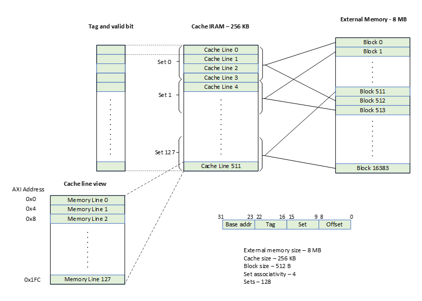
<figcaption>
Illustration of cache IRAM and external memory organization
</figcaption>
</figure>

### Physical view

<figure>
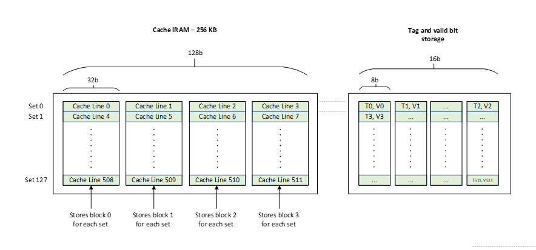
<figcaption>
Implementation of cache IRAM and tag bit storage
</figcaption>
</figure>

Here are some examples for a specific cache configuration (256 KB Cache with block size 512B, and 512 KB External Memory), respectively for Cache Active and Cache Disabled.

<figure>
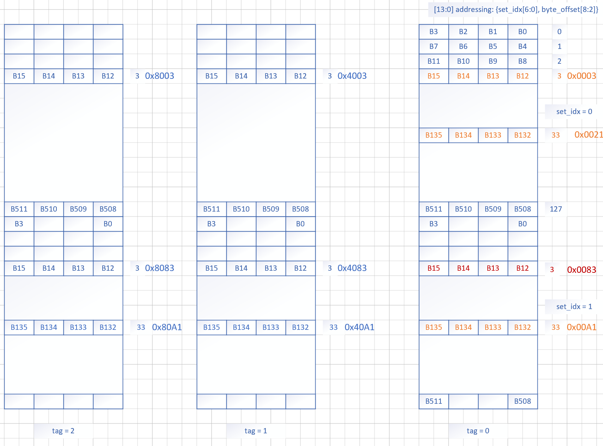
<figcaption>
256KB Cache with Block size 512B for 512KB external memory (Cache Active Mode)
</figcaption>
</figure>

In case of Cache Active, in the beginning, all VTAG invalid that means a CPU read will generate a cache miss to trigger CMU to fetch the data block from the external memory. For example, CPU read from 0x0003 will cause CMU fill the bank 00 with set_idx = 0 and tag = 0 from 32-bit word 0 to 32-bit word 127; and then CIU return the data ({B15, B14, B13, B12}) to CPU from 0x0003. Another read from 0x0021 afterward will be a cache hit this time to response with {B135, B134, B133, B132}. If then another CPU read from 0x0083, there will be another cache miss which trigger CMU fetch to fill the bank 00 with set_idx = 1 and tag = 0, and CIU return {B15, B14, B13, B12} from set_idx = 1 and tag = 0. After that, CPU read from 0x4083, this would be another cache miss to let CMU fetch data to fill bank 01 with set_idx = 1 and tag = 1, and return {B15, B14, B13, B12} from set_idx = 1 and tag = 1. Continuously, CPU read from 0x8083 will make CMU fetch and fill bank 10 with set_idx = 1 and tag = 2, and then response the read with {B15, B14, B13, B12} from set_idx = 1 and tag = 2.

In case of Cache Disabled, filling the memory entirely will walk 16 bytes across the banks from bank 00 to bank 11 (i.e., filling each 4-bytes from 0x0, 0x4, 0x8 to 0xC at address 0x0 for first 128-bit, refer to [Figure 10](#_Ref150715963)) for cache configuration of 256KB (64K 32-bit words that need 16-bit address to access each word) cache memory, 512B block size (128 32-bit words) with 512KB external memory. For 256KB cache, it consist of four 64KB in form of 4Kx16B configuration (access via address\[15:2\] from 0x0000 to 0x0FFF, 0x1000 to 0x1FFF, 0x2000 to 0x2FFF and 0x3000 to 0x3FFF). The final 4 bytes are chosen by address \[1:0\].

<figure>
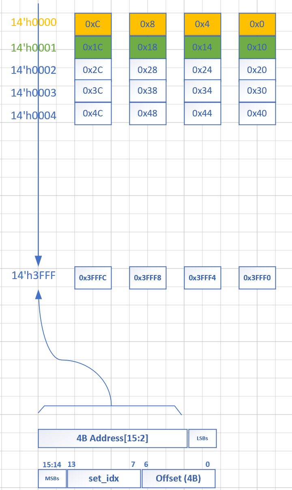
<figcaption>
256KB Cache with Block size 512B for 512KB external memory (Cache Disabled Mode)
</figcaption>
</figure>

### External memory

A contiguous region matching SInC external memory size must be allocated for SInC purposes within the external memory. For example, if SInC is configured with external memory size = 16 MB, then a contiguous 16 MB region within the external memory is to be allocated to SInC to store IRAM data.

Furthermore, a contiguous region of (EIRAM_SIZE \* 1024 / BLOCK_SIZE) \* 16 B within the external memory must be allocated to SInC to store authentication tags.

Typically, SInC accesses external memory via address translation unit. FW must setup the address translation unit and SInC to allow SInC to have access to the external memory for data and authentication tags. For SInC, FW must load See address translation unit MAS to know how to setup address translation unit.

### Memory Erase

Both cache IRAM and VTAG are wiped when executing memory erase from INIT or CR, or when executing sinc reset or sinc re-init commands. The difference between cache IRAM and VTAG is that cache IRAM is wiped with random data from Trivium whereas VTAG is wiped with all 0s to ensure all valid bits are invalidated. Memory erase logic is controlled by CIU.

## Errors

SInC has one error output called SInC error. There are multiple sources of errors that can assert this error output.

This section explains all the different errors that can occur in SInC divided into errors occurring in CIU and CMU, and how these errors are processed and reported. It also describes which errors will cause SInC error output to be asserted.

**<u>NOTE</u>:** CPU decode error - CPU should only be allowed access to lowest region matching CIRAM size in non-active SInC state (Disabled, Initialization or Cache-failed). Meaning any CPU requests outside this region should result in CPU decode error (handled outside SInC) and such requests are assumed to not reach SinC interface. SInC provides a signal “sinc_cpu_non_active_state” to implement this outside SInC. As such, any mention of CPU requests means that it didn’t encounter CPU decode error.

### CIU

There are various errors and faults to be occurring in CIU as documented in [Table 2](#_Ref149662595).

<table>
<caption>
Errors and Faults in CIU
</caption>
<colgroup>
<col style="width: 18%" />
<col style="width: 28%" />
<col style="width: 27%" />
<col style="width: 24%" />
</colgroup>
<thead>
<tr>
<th style="text-align: center;">Error/Fault</th>
<th style="text-align: center;">Cause</th>
<th style="text-align: center;">Processing</th>
<th style="text-align: center;">Port in sinc_top</th>
</tr>
</thead>
<tbody>
<tr>
<td>Uncorrectable memory error</td>
<td>Uncorrectable ECC error from reading Cache Memory</td>
<td>
1) response with ‘deadbeef’ on read data;

2) Reported to top of SINC

3) Report to CMU along with CIU SM Fault through ciu_fault_err.
</td>
<td>
Sinc_cpu_rdata_o

sinc_err_uncorr_o
</td>
</tr>
<tr>
<td>CPU read error due to block fetch error</td>
<td>CMU encountered error during block fetch and flagged it to CIU through cmu_block_fetch_err.</td>
<td>
Response CPU read error to CPU instead of read data valid with read data showing ‘deadbeef’.

Refer to CMU errors to see how CMU processes.
</td>
<td>
Sinc_cpu_r_err_o

sinc_cpu_rdata_o
</td>
</tr>
<tr>
<td>Erase Busy Error</td>
<td>CPU accessing memory while memory erase is performing</td>
<td>
1) Reported to top of SINC;

2) If CPU read, return ‘deadbeef’ on read data.

3) report to CMU through ciu_erase_busy_err if this is happening in the phase of Data Fetch.
</td>
<td>
Sinc_err_erase_busy_o

sinc_cpu_rdata_o
</td>
</tr>
<tr>
<td>MPU Violation</td>
<td>Violating MPU access policy</td>
<td>
Reported to top of SINC, and won’t perform write for CPU write, and won’t return read data valid but a CPU read data filled with ‘deadbeef’.

1) Occurs on all CPU write requests in Cache Active.

2) Occurs on all incoming CPU requests in Cache Failed (see Note above).

3) If none of the above, it occurs if MPU attributes check fails.
</td>
<td>
Sinc_mem_err_accvio_o

sinc_cpu_rdata_o

Sinc_cpu_r_err_o
</td>
</tr>
<tr>
<td>CIU SM fault</td>
<td>SM in Illegal state</td>
<td>
<del>1)</del> <del>trapped in FAULT state that could be only out by reset, either reset_na from sinc_top or a kind of soft reset cmu_sinc_reset;</del>

<del>2)</del> Reported to CMU through ciu_fault_err along with Memory Error.
</td>
<td>NA</td>
</tr>
<tr>
<td>VTAG Parity Error</td>
<td>VTAG entry has parity check error during a tag search</td>
<td>
VTAG parity cannot be controlled by sinc_err_chk_disabled like the case for ram_wrapper.

1) Read upon Cache Active with VTAG parity error will yield a read error by responding with ‘deadbeef’ on read data;

2) This parity check cannot be masked off.
</td>
<td>
sinc_cpu_rdata_o

Sinc_cpu_r_err_o
</td>
</tr>
</tbody>
</table>

#### CIU reporting errors to CMU

CIU signals errors to CMU using the following signal/s. It uses positive pulse to indicate the errors.

1.  ciu_fault_err

    1.  Uncorrectable memory error

    2.  CIU SM fault

### CMU

There are various errors that can occur in CMU, and they can be mainly divided into two types.

1.  Non-severe errors: The ones that are logged in status register but doesn’t affect SInC operation. This is a recoverable error as CPU can continue using SInC without wiping the cache IRAM or VTAG, etc.

2.  Severe errors: The ones that are also logged in status register but cause SInC to move to cache-failed state and requires a SInC reset command or a hardware reset to recover. This is sort of a non-recoverable error as it requires FW to re-initialize

CMU takes the following actions on either of the errors occurring.

1.  Ends the ongoing command.

2.  

3.  Updates status register with corresponding error. FW can read the status register to know which error occurred and take appropriate action.

4.  Generates a positive pulse on SInC error (sinc_err_o) output which is sent to CR typically. FW can choose to enable the SInC error as an interrupt, a non-sticky fatal or a sticky fatal error by setting appropriate error enable registers in CR. Refer to CR MAS and subsystem integration spec to know how fatal and sticky fatal errors are asserted and handled.

5.  Clears input buffer, output buffer and GP AES using soft reset functionality.

#### Non-severe errors

The table below describes errors that are logged in status register and SInC continues to operate.

<table>
<caption>
Non-severe errors – Logged in status reg and doesn’t affect SInC operation
</caption>
<colgroup>
<col style="width: 24%" />
<col style="width: 44%" />
<col style="width: 30%" />
</colgroup>
<thead>
<tr>
<th>Error</th>
<th>Cause</th>
<th>Processing</th>
</tr>
</thead>
<tbody>
<tr>
<td>Invalid command error</td>
<td>
Not programming cmd register to a one-hot encoded value.

OR

Status register not read (status register contains status for previous command)

OR

Requested command is not supported as per current SInC state or requested command is disabled.

OR

AES configuration is set incorrectly in AES test mode.

OR

Aes_test_en bit field not cleared before setting another bit field in cmd register.
</td>
<td>Command request is rejected.</td>
</tr>
<tr>
<td>Cache block write error during encrypt block command</td>
<td>Failed to write the cache block to external memory during encrypt block command.</td>
<td>Encrypt block command fails.</td>
</tr>
<tr>
<td>Authentication tag write error</td>
<td>Failed to write the authentication tag to external memory during encrypt block command.</td>
<td>Encrypt block command fails.</td>
</tr>
<tr>
<td></td>
<td></td>
<td></td>
</tr>
</tbody>
</table>

#### Severe errors

The table below describes the severe errors that are logged in status register and causes SInC to move to cache-failed state and which requires a SInC reset command or a reset to recover (unless fatal or sticky fatal error is triggered).

<table>
<caption>
Severe errors – Logged in status reg and causes SInC to move to cache-failed state.
</caption>
<colgroup>
<col style="width: 33%" />
<col style="width: 33%" />
<col style="width: 33%" />
</colgroup>
<thead>
<tr>
<th>Error</th>
<th>Cause</th>
<th>Processing</th>
</tr>
</thead>
<tbody>
<tr>
<td>HW fault in SInC</td>
<td>
CMU FSMs in illegal state.

OR

CIU flagged a fault error. See CIU section for more details.
</td>
<td>Ongoing command fails.</td>
</tr>
<tr>
<td>Key fetch error</td>
<td>Failed to read the key from key store.</td>
<td>Set to Init OR AES test mode command fails.</td>
</tr>
<tr>
<td>Cache block read error during encrypt block or fetch block</td>
<td>Failed to read the cache block from shared ram or external memory.</td>
<td>Encrypt block OR Fetch block command fails.</td>
</tr>
<tr>
<td>Authentication tag check error</td>
<td>Authentication tag check failed because the expected and actual tags didn’t match during fetch block command.</td>
<td>Fetch block command fails.</td>
</tr>
<tr>
<td>Authentication tag read error</td>
<td>Failed to read the authentication tag from external memory during fetch block command.</td>
<td>Fetch block command fails.</td>
</tr>
<tr>
<td>RNG seed read error</td>
<td>Failed to read the seed from RNG.</td>
<td>Set to Init OR AES test mode command fails.</td>
</tr>
<tr>
<td>Cache block write error during fetch block</td>
<td>Failed to write the cache block to CIRAM.</td>
<td>Fetch block command fails.</td>
</tr>
<tr>
<td>AES error</td>
<td>Error occurred in GP AES. Refer to GP AES MAS for more info.</td>
<td>Ongoing command fails.</td>
</tr>
</tbody>
</table>

### Error reporting

SInC itself doesn’t have any fatal or sticky fatal errors. However, if SInC encounters any of the above severe or non-severe errors, it generates a positive pulse on SInC error output which is sent to CR typically. FW can choose to enable the SInC error as a fatal or a sticky fatal error by setting crypto error enable registers in CR.

Refer to CR MAS and subsystem integration spec to know how fatal and sticky fatal errors are asserted.

## Interrupts

SInC itself doesn’t have any interrupts. However, SInC has two output ports – SInC error and SInC done which are routed to CR and can individually be enabled as interrupts by FW by setting appropriate interrupt enable registers in CR.

SInC done is asserted when SInC completes any FW command (successfully or not) or memory erase finishes.

See [Errors](#errors) section for more info on how SInC error output is asserted.

## Debug

There is no special debug logic in SInC.

For SInC debug purposes, there are two AEBs available for use. They affect SInC operation in the following manner.

AEB input “sinc_disable_encr_auth_check_i” can be used to disable encryption, and decryption and authentication tag check during encrypt block command and block fetch request respectively for aiding debug scenarios. If this AEB is set, blocks are written into external memory in plaintext during encrypt block command, and block fetched during fetch block request are not decrypted and authentication tag is skipped for these blocks, meaning AES is always bypassed functionally except when FW uses AES test mode feature.

This AEB is typically set to N/SP in TEST Security State and HWNO for all other Security states. However, this definition is subject to change and the Subsystem AEB table must be referred to get the exact AEB definition.

| Description | UNKNOWN | BLANK | TEST | PROD | SECURE | RETEST |
|----|----|----|----|----|----|----|
| SInC encryption and authentication disabled | HWNO | HWNO | N/SP | HWNO | HWNO | HWNO |

Table 5‑: AEB to disable SInC encryption and authentication.

Another AEB that impacts SInC operation is used by key store (it is not used by SInC directly). If this AEB is set, key attribute check is skipped when SInC is requesting a key from key store. This will allow security processor firmware loader to use a known key for debugging SInC.

This AEB is typically set to N/SP in TEST Security State and HWNO for all other Security States. However, this definition is subject to change and the Subsystem AEB table must be referred to get the exact AEB definition.

| Description                       | UNKNOWN | BLANK | TEST | PROD | SECURE | RETEST |
|-----------------------------------|---------|-------|------|------|--------|--------|
| SInC key attribute check disabled | HWNO    | HWNO  | N/SP | HWNO | HWNO   | HWNO   |

Table 5‑: AEB to disable SInC key attribute check in key store.

## Performance Counters

SInC has three performance counters – hit counter, miss counter and latency counter. These counters are controlled by FW using the performance counter control register.

The Hit counter counts the number of cache hits once it is enabled.

Miss counter counts the number of cache misses once it is enabled.

The latency counter counts the number of clock cycles from start of DMA fetch of a cache block during cache miss to DMA fetch completion of that block. Note that latency counter counts cumulatively meaning each cache miss will cause counter to continue counting rather than restarting from zero.

Each counter can be enabled or cleared by setting corresponding enable or clear bit in the performance counter control register.

See sinc_regs spec \[2\] for more details.

## Low Power Design

SInC implements clock gating scheme and power gating scheme to reduce active and leakage power consumption when it is not in use.

### Clock gating

SInC implements its own clock gating logic for CIU and CMU blocks separately which gates the clock to their respective logic when they are idle. This is implemented by manually instantiating clock gate cell in CIU and CMU. The enable to each clock gate cell is controlled based on whether that block is processing any transaction/command or not. CIU and CMU are separately clock-gated as both are independent modules within SInC, CIU is active any time CPU sends a request to SInC whereas CMU is only active while processing any FW command or processing a cache miss.

Note that this is different from Inactive/Clock-gate power state at subsystem level where the source clock to the whole subsystem is gated, meaning SInC input clock is also gated.

Synthesis tool is allowed to insert additional clock gating as required.

### Power gating

SInC implements a power gating scheme by dividing the design into retention domain and non-retention domain.

#### Power states

The table below shows an example of how different power states at subsystem level may affect the retention and non-retention domain in SInC. It is the subsystem’s responsibility to manage the two power domains of SInC in different power states.

| Power state | Retention power domain | Non-retention power domain |
|----|----|----|
| Active (On) | Powered on, clock un-gated. | Powered on, clock un-gated. |
| Inactive (CLKGATE) | Powered on, clock gated. | Powered on, clock gated. |
| Power Gated Retention State (POWERGATE) | Powered on, clock gated. | Powered off, clock gated. |
| Z11 State | Powered off, clock gated. | Powered off, clock gated. |
| Power Off (Off) | Powered off, clock gated. | Powered off, clock gated. |

The diagrams below show the power domain split in CIU and CMU.

<figure>
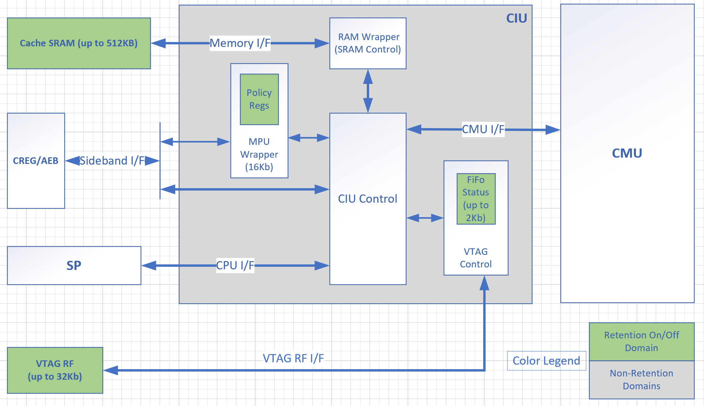
<figcaption>
CIU power domain split
</figcaption>
</figure>

<figure>
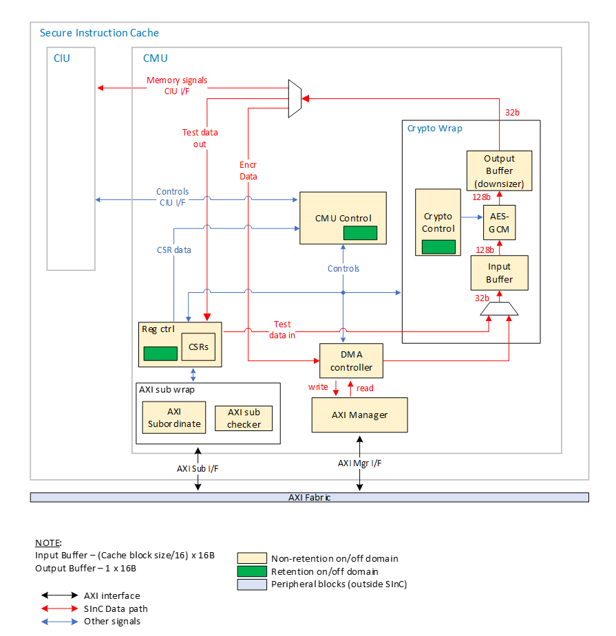
<figcaption>
CMU power domain split
</figcaption>
</figure>

#### Retention domain

**Definition**

- Powered by AON and ONOFF power rail. In power gated state, AON power rail remains on.

- In power-gated retention state

  - The sequential logic in this power domain retains the logic value and the combo logic is powered down.

  - All logic is clock gated.

- Logic uses a normal warm reset.

- Logic doesn’t get reset when coming out of power-gated retention state.

- Logic uses 0-pin retention flops.

**What is retained?**

The table below shows the portion of logic that is placed in retention domain (or deep sleep for memories).

| Logic | RTL hierarchy (from SInC top perspective) |
|----|----|
| Cache IRAM in deep sleep | Instantiated outside SInC |
| VTAG RF in deep sleep | Instantiated outside SInC |
| MPU | u_sinc_ciu/u_mpu_ret |
| FIFO counter status | u_sinc_ciu/u_ciu_vtag/u_vtag_ret |
| SInC state | u_sinc_cmu/u_cmu_ctrl/u_ret |
| Locally stored AES key | u_sinc_cmu/u_crypto_wrap/u_crypto_wrap_ctrl/u_ret |
| 96b IV in IV Nonce\* registers | u_sinc_cmu/u_reg_ctrl/u_ret |
| SInC reset disabled status | u_sinc_cmu/u_reg_ctrl/u_ret |
| SInC re-init disabled status | u_sinc_cmu/u_reg_ctrl/u_ret |
| External block base address and external auth tag base address registers | u_sinc_cmu/u_reg_ctrl/u_ret |

Table 7 Retention domain logic in SInC

#### Non-retention domain

**Definition**

- Powered by ONOFF power rail.

- In power-gated retention state

  - All logic is powered-down.

  - All logic is clock-gated.

- Logic is on a special low power warm reset, and it gets reset when coming out of power-gated retention state.

- Logic uses regular flops.

**What is not retained?**

Any logic not defined in retention domain is not retained (for e.g. performance counters are not retained and FW will need to save these counters when going to power-gated retention state if it wants to collect the data across power cycles).

#### Power-cycling requirements

SInC doesn’t require special FW save and restore mechanism to enter in and out of power-gated state.

However, FW may want to save the performance counter register values like hit counter, miss counter and latency counter values before putting SInC in power gated state, since these registers are not retained. This may help FW capture the performance data across power cycles.

## Performance Targets

SInC has the following performance numbers.

Read – 2 cycle latency if it is a cache hit. X cycles latency if it is a cache miss.

Write – Only allowed in disabled state, it is converted into read-modify-write, which is a block transaction and takes 3 cycles to finish.

MPU response for incoming CPU request is generated on the same cycle.

The performance is subject to change in case the subsystem is not able to meet the timing.

## Power and Area Estimates

The following table show the SInC logic are and is extracted from the synthesis area report at ****** for cache block size of 512B and external memory size of 512KB and 16MB. The numbers are from different synthesis runs.

<table style="width:100%;">
<caption>
Table 8 SInC logic area
</caption>
<colgroup>
<col style="width: 13%" />
<col style="width: 52%" />
<col style="width: 20%" />
<col style="width: 14%" />
</colgroup>
<thead>
<tr>
<th>Description</th>
<th>Hierarchy</th>
<th>
Area (um^2)

(External memory size 512KB)
</th>
<th>
Area (um^2)

16MB
</th>
</tr>
</thead>
<tbody>
<tr>
<td>SInC top</td>
<td>-</td>
<td>7597</td>
<td>14056</td>
</tr>
<tr>
<td>CIU</td>
<td>u_sinc_ciu</td>
<td>415</td>
<td>6911</td>
</tr>
<tr>
<td>CIU Control</td>
<td>u_sinc_ciu/u_ciu_ctrl</td>
<td>26</td>
<td>32</td>
</tr>
<tr>
<td>CIU VTAG</td>
<td>u_sinc_ciu/u_ciu_vtag</td>
<td>66</td>
<td>74</td>
</tr>
<tr>
<td>MPU</td>
<td>u_sinc_ciu/u_mpu_wrapper</td>
<td>214</td>
<td>
6695

(32x compared to 512KB)
</td>
</tr>
<tr>
<td>Ram Wrapper</td>
<td>u_sinc_ciu/u_ram_wrapper</td>
<td>109</td>
<td>110</td>
</tr>
<tr>
<td>CMU</td>
<td>u_sinc_cmu</td>
<td>7182</td>
<td>7146</td>
</tr>
<tr>
<td>CMU Control</td>
<td>u_sinc_cmu/u_cmu_ctrl</td>
<td>9</td>
<td>12</td>
</tr>
<tr>
<td>AXI Manager</td>
<td>u_sinc_cmu/u_axi_mgr</td>
<td>210</td>
<td>196</td>
</tr>
<tr>
<td>AXI Subordinate</td>
<td>u_sinc_cmu/u_axi_sub_wrap/u_axi_sub</td>
<td>90</td>
<td>87</td>
</tr>
<tr>
<td>CMU Crypto Wrap</td>
<td>u_sinc_cmu/u_crypto_wrap</td>
<td>6734</td>
<td>6681</td>
</tr>
<tr>
<td>GP AES</td>
<td>u_sinc_cmu/u_crypto_wrap/u_gp_aes</td>
<td>5779</td>
<td>5648</td>
</tr>
<tr>
<td>AES Core</td>
<td>u_sinc_cmu/u_crypto_wrap/u_gp_aes/aes_core0</td>
<td>5009</td>
<td>5107</td>
</tr>
<tr>
<td>AES GHASH</td>
<td>u_sinc_cmu/u_crypto_wrap/u_gp_aes/u_gp_aes_ghash</td>
<td>441</td>
<td>210</td>
</tr>
<tr>
<td>AES mode</td>
<td>u_sinc_cmu/u_crypto_wrap/u_gp_aes/u_gp_aes_mode</td>
<td>330</td>
<td>332</td>
</tr>
<tr>
<td>Input Buffer</td>
<td>u_sinc_cmu/u_crypto_wrap/u_input_buf</td>
<td>754</td>
<td>803</td>
</tr>
<tr>
<td>Output Buffer</td>
<td>u_sinc_cmu/u_crypto_wrap/u_output_buf</td>
<td>23</td>
<td>27</td>
</tr>
<tr>
<td>DMA</td>
<td>u_sinc_cmu/u_dma</td>
<td>14</td>
<td>24</td>
</tr>
<tr>
<td>Reg Control</td>
<td>u_sinc_cmu/u_reg_ctrl</td>
<td>125</td>
<td>147</td>
</tr>
</tbody>
</table>

The table below shows the memory area for cache IRAM and VTAG storage.

| Description  | Size                               | Area (um^2) |
|--------------|------------------------------------|-------------|
| CIRAM (SRAM) | 4 parallel instances of (16K x 39) | 95426       |
| VTAG         | 4 parallel instances of (128 x 9)  | 520         |

Table 9 Macro area

# Memory Map

SInC memory map consists of 2 regions – External instruction memory space and SInC registers. Each of these regions has its own base address and doesn’t have to be contiguous to each other. The base address is subsystem specific and usually defined in subsystem integration spec.

Let’s take an example where cache IRAM is 256KB and external memory is 8MB with the base address as 0x9000_0000.

Note that during Disabled or Initialization state, only lower region matching cache IRAM size is accessible to security processor out of the entire external instruction memory space i.e., CPU can only access region starting from 0x9000_0000 to 0x9003_FFFF (256KB region). Access to the rest of external memory region will result in access violation.

In cache-active state, CPU can access entire 8MB region.

In cache-failed state, CPU doesn’t have any access to the external instruction memory space.

The table below shows how SInC memory map looks like by arbitrarily choosing base addresses and memory sizes.

<table>
<caption>
Table 10: Example SInC memory map
</caption>
<colgroup>
<col style="width: 14%" />
<col style="width: 14%" />
<col style="width: 8%" />
<col style="width: 62%" />
</colgroup>
<thead>
<tr>
<th>Address From</th>
<th>Address To</th>
<th>Size</th>
<th>Description</th>
</tr>
</thead>
<tbody>
<tr>
<td>0x8000_0000</td>
<td>0x8000_03FF</td>
<td>1K</td>
<td>SInC registers</td>
</tr>
<tr>
<td>0x8000_0400</td>
<td>0x8FFF_FFFF</td>
<td></td>
<td>Region not assigned to SInC</td>
</tr>
<tr>
<td>0x9000_0000</td>
<td>0x907F_FFFF</td>
<td>8M</td>
<td>
External instruction memory space where CPU performs access to the cache IRAM.

Only a part of this region is stored locally in cache IRAM at any given time.
</td>
</tr>
</tbody>
</table>

# Registers

Refer to register spec at \[2\] for details on SInC registers.

The general rules to be followed by FW while programming these registers or reading them, are defined in [Software Programming Model](#software-programming-model) section.

# Software Programming Model

This section describes programming model for SInC for FW usage.

## FW Commands

FW must only initiate one command at a time. Initiating multiple commands (i.e., setting multiple bits in command register) will result in invalid command error. FW must read status register after completing previous command (if applicable), before initiating a new command. Not doing so will result in SLVERR.

Typically, all fields in command register gets cleared automatically upon completion of the command, however FW must explicitly set the aes_test_en = 0, to exit out of the AES test mode. FW must do it before initiating any other command i.e., setting any other bit in cmd register.

FW must also read the status register after each command completion, before initiating another command. Initiating a new command without reading status register will result in SLVERR.

On a valid command request, cmd_in_progress bit in status register gets set to indicate that SInC is processing the command. On command completion, either cmd_success or cmd_failed gets set. In case of cmd_failed, one of the other status bits will be set to indicate the cause of the failure.

Note that when a cache miss occurs, CMU sets the cmd_in_progress bit to indicate that SInC is processing a fetch block request, clears that bit on completing it successfully but does not set cmd_success bit since it is not a FW command. But it does set cmd_failed and another status bit if the fetch block fails.

The following sections talk about programming model for different FW commands. Not following the steps may result in unexpected behavior/results.

### Set to Initialization state

1.  FW writes to aes_iv_nonce\*, block_encr_key, block_base_addr, and tag_base_addr registers.
2.  FW sets set_init_state bit in cmd register.
3.  SInC then performs required steps to transition to Initialization state.
4.  FW reads cmd_status field in status register for command completion and state field to verify SInC state.Set to Cache-active state

### Set to Cache-active state

1.  FW sets set_cache_active_state field in cmd register.
2.  SInC then performs required steps to transition to Cache-active state.
3.  FW reads cmd_status field in status register for command completion and state field to verify SInC state.Encrypt Block

### Encrypt Block

To initiate the encrypt block command, FW must take the following steps.

Initialization state

1.  FW writes to block_encr_num, num_of_blocks, and block_encr_addr registers.
2.  FW set encr_block field in cmd register.
3.  SInC then encrypt required number of blocks and writes them to external memory.
4.  FW reads cmd_status field in status register for command completion.Run AES in test mode

### Run AES in test mode

FW should use the following sequence to use AES test mode functionality.

1.  FW sets aes_test_en field to 1 in cmd register to enter AES test mode.
2.  FW loads block_encr_key and aes_iv_nonce\* registers.
3.  FW waits for cfg_key_iv_rdy = 1 in aes_test_status register.
4.  FW loads mode, dir, key_len fields, set cfg_key_iv_vld = 1, and data_in_vld = 0 in the aes_test_ctrl register. FW loads mode, dir, key_len fields, set cfg_key_iv_vld = 1, and data_in_vld = 0 in the aes_test_ctrl register. If reuse-key = 0, SInC reads the key from key store.
5.  FW loads aes_test_data_in\* registers.
6.  FW waits for data_in_rdy = 1 in aes_test_status register.
7.  FW loads data_in_byte_cnt and data_in_last fields and set data_in_vld = 1 in the aes_test_ctrl register.
8.  FW waits for data_out_vld = 1 in aes_test_status register.
9.   FW reads aes_test_data_out\* registers to get the AES output block and then set data_out_ack field to 1 in cmd register.
10. If there are more blocks to process, repeat the process from step \#5. If the last output block is read, proceed to next step.
11. In AES in GCM mode, then FW waits for data_out_vld = 1 and tag_out = 1 in aes_test_status register.
12. FW reads aes_test_data_out\* registers to get the authentication tag and then set data_out_ack = 1 in aes_test_ctrl register.
13. FW can repeat from step \#2 for next data payload OR exit out of test mode by setting aes_test_en = 0 in cmd register.

Note, that exiting out of AES test mode is a command completion and will set cmd_success bit. When exiting out of test mode, CMU clears GP AES using soft-reset feature. This ensures that GP AES is reset to a fresh state for before performing other commands.

Also, FW must first exit out of test mode by clearing the aes_test_en bit field in cmd register before initiating another command.

## 

## Command encodings if applicable

FW must always program cmd register with one-hot encoded value. Programming any other value will cause invalid command error.

## Error Recovery

SInC goes into the Cache-failed state if it encounters a severe error. FW can recover from this error by issuing sinc reset command or by asserting HW reset input.

## Interrupt Handling

Since SInC doesn’t have any interrupts, there is no interrupt handling required in SInC.

## Debug/Performance Counter Programming

FW can control performance counters using performance counter control register. FW can also use the AEBs mentioned in [Debug](#debug) section to aid debugging in case of AEB pertinent issues.

## Low Power Programming

There is no special FW control for specifically putting SInC in low power state. Low power states are controlled at subsystem level which also controls the SInC power state.

# Implementation Details/RTL Hierarchy

## RTL hierarchy

The table below shows SInC hierarchy.

| Hierarchy | Description |
|----|----|
| \- | SInC top |
| u_sinc/u_sinc_ciu | CIU |
| u_sinc/u_sinc_ciu/u_mpu_wrapper | MPU |
| u_sinc/u_sinc_ciu/u_ciu_ctrl | CIU Control |
| u_sinc/u_sinc_ciu/u_ciu_vtag | CIU VTAG |
| u_sinc/u_sinc_ciu/u_ram_wrapper | RAM Wrapper |
| u_sinc/u_sinc_cmu | CMU |
| u_sinc/u_sinc_cmu/u_cmu_ctrl | CMU Control |
| u_sinc/u_sinc_cmu/u_axi_mgr | AXI Manager |
| u_sinc/u_sinc_cmu/u_axi_sub_wrap | AXI Subordinate Wrapper |
| u_sinc/u_sinc_cmu/u_axi_sub_wrap/u_axi_sub | AXI Subordinate |
| u_sinc/u_sinc_cmu/u_axi_sub_wrap/u_axi_sub_checker | AXI Subordinate Checker |
| u_sinc/u_sinc_cmu/u_crypto_wrap | Crypto Wrapper |
| u_sinc/u_sinc_cmu/u_crypto_wrap/u_gp_aes | GP-AES |
| u_sinc/u_sinc_cmu/u_crypto_wrap/u_input_buf | Input Buffer |
| u_sinc/u_sinc_cmu/u_crypto_wrap/u_output_buf | Output Buffer |
| u_sinc/u_sinc_cmu/u_dma | DMA Controller |
| u_sinc/u_sinc_cmu/u_reg_ctrl | Register Control |

Table SInC hierarchy

## 

## Cache Interface Unit (CIU)

Cache Interface Unit (CIU for short in next descriptions) is expected to receive the read or write requests from CPU, to apply access check through MPU on such requests. In Cache Active Mode, it performs the tag search, and executes the cache line replacement or eviction policy if cache miss event happens. Working together with the Cache Management Unit (CMU), it returns the read result back to CPU, either from Cache Memory directly if a cache hit or after CMU is instructed to fetch the data from the external memory if a cache miss. The operations of CIU depend on the cache mode which is shown in .

The CPU view of Memory Space under Different Mode (in case of Cache Size 256KB)

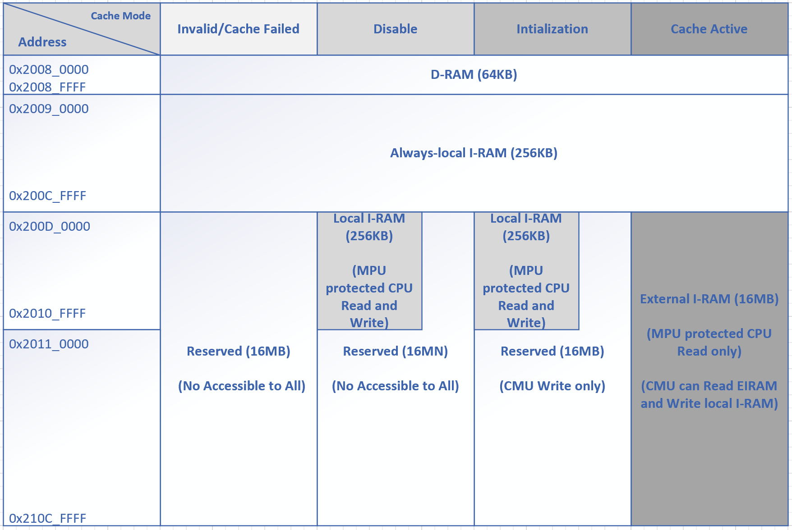

In either ‘Invalid’ or ‘Cache Failed’ cache mode, there is no functional cache. All access to Cache memory from CPU will be rejected and reported as error.

In ‘Disable’ cache mode, through CIU and under protection from MPU, CPU can access the Cache memory to which the lower address space of the external I-RAM is directly mapped.

In ‘Initialization’ mode, through CIU and under protection from MPU, like in ‘Disable’ mode, CPU can still access Cache memory. However, it’s CMU that executes the commands from CPU to read data from the shared memory, encrypts and creates the authentication tag, and then writes the data along with the tag to external IRAM.

In ‘Cache Active’ mode, CIU performs the access check through MPU for CPU read as well as the tag lookup, and directs the data back to CPU from the cache (if a cache hit) or wait until CMU writes the missed data that it read from the external I-RAM to the cache memory and returns the data back to CPU. All of CPU writes will be blocked by CIU in this mode.

### Block Diagram

CIU positions between CPU and Cache Memory as shown in [Figure 1](#_Ref139620981), so it has interfaces with both CPU (security processor) and Cache Memory. CIU has an interface with CMU so that CMU can be instructed to fetch the data from the externa IRAM and write back to Cache Memory if a cache miss in Cache Active mode, in addition to other status or state indications. One other interface is related to those sideband signals, which come mostly from CR to make global control or status collection.

Since CIU utilizes MPU to perform access control, internally it also has an interface with MPU in addition to an interface with Memory Wrapper (for SRAM Control), refer to .

CIU with all kinds of Interfaces

#### Cache Organization

Cache is organized in k-way set associate, where k is fixed to 4, and is configurable based on such parameters such as EIMS_SIZE – the size of External IRAM (up to 16MB), CACHE_SIZE – the size of Internal Cache and BLOCK_SIZE – the size of data block. As an example of k = 4, for a 16MB External I-RAM (EIMS_SIZE = 16K) with 256KB Cache Size (CACHE_SIZE = 256) and 256B Block Size (BLOCK_SIZE = 256), while the Address \[31:24\] for EIM Base, the Address \[23:16\] shall be for Tag, the Address \[15:8\] for Set Index and the Address \[7:0\] for Block Offset. Be aware that Block Offset is aligned to byte addressing. To address 4-byte alignment of the memory space, the lowest 2-bit needs to be removed.

32-bit Address with Tag, Index and Offset (k = 4)

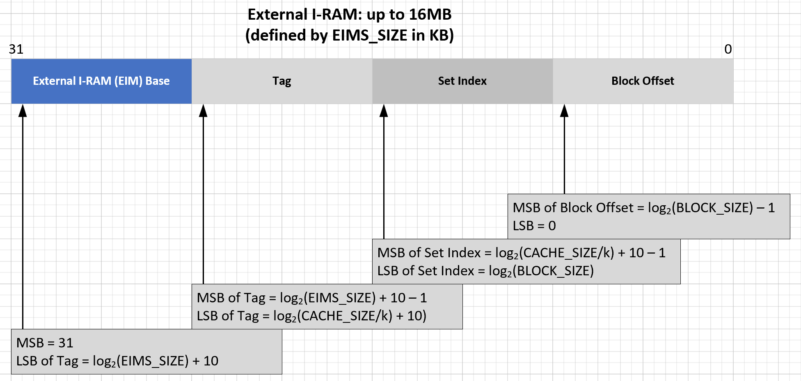

##### Configured 4-way Set Associate 

While k = 4, this is a 4-way set associate cache which has different configurations based on the parameters (EIMS_SIZE, CACHE_SIZE and BLOCK_SIZE, defined in [10.5](#parameters)) as shown in .

Different Configurations ({Set Size, 4, Block Size}) of 4-way Set Associate Cache (16MB External IRAM)

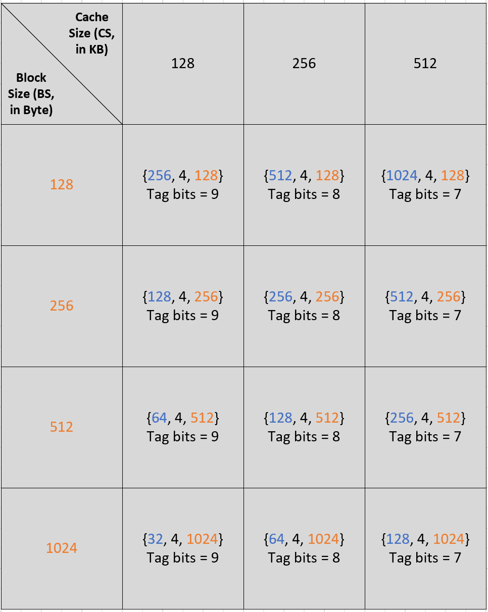

For a configured 4-way set associate cache, each set (indexed by set index field of the address) has 4 cached blocks inside cache data memory along with 2-bit separate status to indicate next block in this set to be evicted (iterating from 2’b00, 2’b01, 2’b10, 2’b11, and back to 2’b00). Each block in such a set has VTAG that consists of tag bits (Tag’) and Valid bit (‘V’).

4-way Set Associate Cache

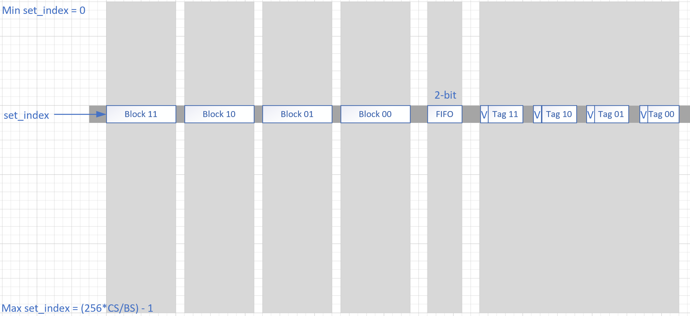

Cache memory consists logically of 4 banks of SRAM, the width and depth of which vary per configuration (refer to ). As examples, for the 128B block size, each bank could be configured as Depth\*Width from (256\*32)\*4B to (1024\*32)\*4B; and for the 1024B block size, each bank could be configured from (32\*256)\*4B to (128\*256)\*4B. Therefore, each of such banks of memory can be organized (prior to Error Protection) as 8K\*4B to 32K\*4B (refer to ).

The VTAG can be grouped together as implemented by Register Array or Register File, the size of which can be calculated by 4\*(1+(16-log2CACHE_SIZE))\*(256\*CACHE_SIZE/BLOCK_SIZE). The maximum of the VTAG could be 32\*1024 bits for 16MB External IRAM.

Data Out (4 bytes or 32-bit wide) with Cache Hit (k = 4)

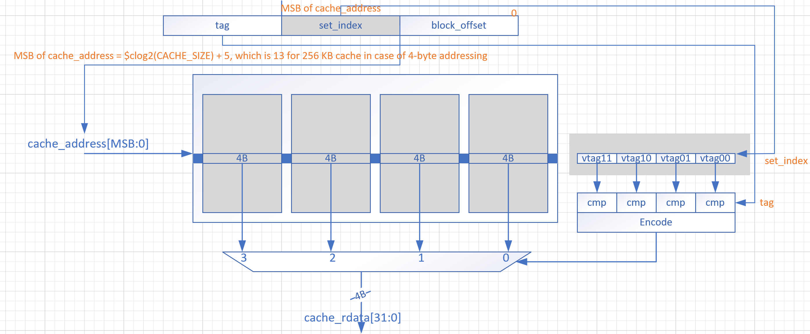

The demonstrates how a Cache Hit retrieves the data from Cache memory.

However, if this is a Cache Miss, CIU will issue a request to CMU to fetch the block that includes the missed data from External IRAM. CMU will write the block into the memory through Write Channel in Interface with CMU before acknowledging CIU the requested data already in the location. The Write address shall be using cache_address\[log2(CACHE_SIZE)+5 : 0\] while we_mask\[15:0\] for 4 banks of memory is generated (refer to ) through the 2-bit FIFO Status of the cache indexed by same set_index, for example, FIFO status = 2’b01 indicating we_mask\[15:0\] = 16’h00F0, i.e., Block1 shall be written. After all data have been written, the Tag from the address will be written into VTAG with valid bit set to 1, and the FIFO status indexed by set_index will be updated accordingly.

Write Data back to Cache Memory while a Cache Miss (k = 4)

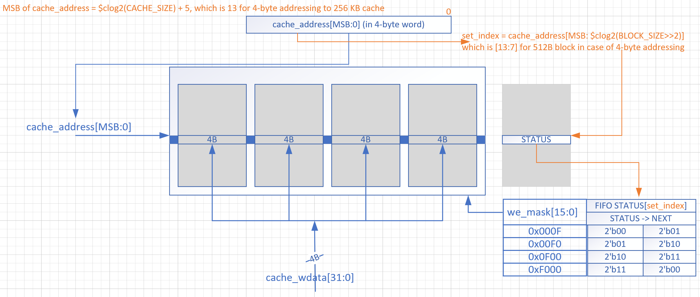

The 2-bit FIFO status of the cache is implemented by Flip-Flops which size can be calculated through 2\*(256\*CACHE_SIZE/BLOCK_SIZE), and the maximum is 2048 bits while CACHE_SIZE = 512 and BLOCK_SIZE = 128 for 16MB External IRAM.

#### Access Control

Memory Protection Unit (MPU) is utilized in this design to protect the memories (Internal Cache memory and External IRAM) from unauthorized access. MPU used by CIU divides the memory under protection into the page with the fixed 4K bytes size. The external IRAM has up to 16M bytes so there will be up to 4K pages. For each of such pages, there is one set of permission attributes that consists of 4 bits to indicate if the operations (‘LXWR’) are allowed on this page (so up to 16K bits of attributes in total), where ‘L’ for Lock (if permission can be changed), ‘X’ for Executable, ‘W’ for Writable and ‘R’ for Readable. In Cache Active, all memory space is protected by MPU. For those cases in which the cache is not active, the portion beyond Cache memory will be guarded by CIU by checking the address range i.e. any access to those address beyond the Cache memory will be blocked. The interface between CIU and MPU is described in section .

#### Cache Disabled

While the previous sections cover the topics for Cache Active, this section introduces how CIU works for inactive Cache (‘Disable’ mode or ‘Initialization’ mode): CPU can have direct access to this Cache memory under Access Control.

In case that Cache is inactive, the Cache memory is not organized as k-way associate cache but as a normal SRAM. By utilizing the same structure of the memory output, the 32-bit (4 bytes for each bank) output is chosen through the address \[1:0\] from CPU (in 4-bye word, refer to for k = 4) instead of the encoded mux selector from Tag Lookup for Cache Hit in Cache Active mode.

Direct Read in Cache Disable Mode (k = 4)

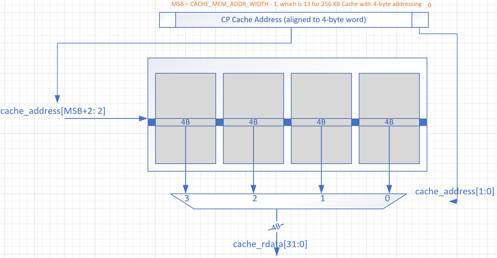

For a direct write from CPU to this memory, the address\[1: 0\] along with mem_wr_byte_en are used to create we_mask\[15:0\] corresponding to the banks of the SRAM (we\[15:12\] for Bank3 and we\[3:0\] for Bank0) while 4 banks are addressed by the address (refer to , where ‘F’ shall be ‘W’ for 4-b cpu_mem_wr_byte_en).

Direct Write in Cache Disable Mode (k = 4)

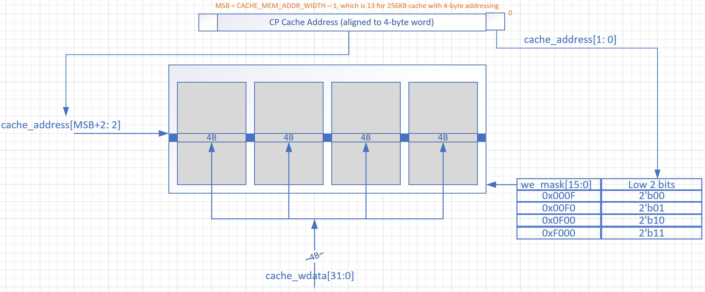

#### Memory Control Wrapper

The Memory Control Wrapper in CIU is located between CIU and the Cache Memory to help managing the SRAM operations including Memory Erase, Error Detection/Correction, Error Injection and Error Log, and Data Scrambling in addition to the engine I/F for basic Read and Write operations. It has an interface with SRAM, and an interface with the control and data paths of CIU (refer to ). The memory interface between this wrapper and the Cache Memory can be found in .

<table>
<caption>
Interface with Memory Control Wrapper
</caption>
<colgroup>
<col style="width: 39%" />
<col style="width: 19%" />
<col style="width: 10%" />
<col style="width: 29%" />
</colgroup>
<thead>
<tr>
<th style="text-align: center;"><strong>Signal Name</strong></th>
<th style="text-align: center;"><strong>Signal Width (in bit)</strong></th>
<th style="text-align: center;"><strong>Direction</strong></th>
<th style="text-align: center;"><strong>Description</strong></th>
</tr>
</thead>
<tbody>
<tr>
<td colspan="4" style="text-align: center;"><strong>CIU Access to Memory Control Wrapper (Engine I/F of RAM Wrapper)</strong></td>
</tr>
<tr>
<td style="text-align: center;">ciu_mem_wdata</td>
<td style="text-align: center;">32*4 = 128</td>
<td style="text-align: center;">Output</td>
<td style="text-align: center;">Write Data from CIU</td>
</tr>
<tr>
<td style="text-align: center;">ciu_mem_addr</td>
<td style="text-align: center;">log2(CACHE_SIZE)+6</td>
<td style="text-align: center;">Output</td>
<td style="text-align: center;">
The address size (in 4 4-byte word i.e. 128 bits) depending on CACHE_SIZE

<table style="width:27%;">
<colgroup>
<col style="width: 14%" />
<col style="width: 12%" />
</colgroup>
<thead>
<tr>
<th>CACHE_SIZE</th>
<th>Address Size</th>
</tr>
</thead>
<tbody>
<tr>
<td>128 (KB)</td>
<td>13</td>
</tr>
<tr>
<td>256 (KB)</td>
<td>14</td>
</tr>
<tr>
<td>512 (KB)</td>
<td>15</td>
</tr>
</tbody>
</table></td>
</tr>
<tr>
<td style="text-align: center;">ciu_mem_en</td>
<td style="text-align: center;">1</td>
<td style="text-align: center;">Output</td>
<td style="text-align: center;">1 – Access Enable from CIU</td>
</tr>
<tr>
<td style="text-align: center;">ciu_mem_we</td>
<td style="text-align: center;">(32*4)/8 = 16</td>
<td style="text-align: center;">Output</td>
<td style="text-align: center;">
Write Byte Mask Enable upon ciu_mem_en_o = 1 from CIU.

It shall be all 1’s (full write) for a Write in this design (no read-modify-write supported).

Ciu_mem_we_o[3:0] = 4’b0000 (no write byte enabled) means Memory Read
</td>
</tr>
<tr>
<td style="text-align: center;">mem_ciu_rdata</td>
<td style="text-align: center;">32*4 = 128</td>
<td style="text-align: center;">Input</td>
<td style="text-align: center;">Read Data from the memory wrapper</td>
</tr>
<tr>
<td style="text-align: center;">mem_ciu_rdata_valid</td>
<td style="text-align: center;">1</td>
<td style="text-align: center;">Input</td>
<td style="text-align: center;">1 – Validate mem_ciu_rdata_i. Based on the Timing Diagram of Engine Read from Memory Wrapper MAS, it takes 2 cycles to be ready after ciu_mem_en_o was observed by the memory wrapper.</td>
</tr>
<tr>
<td style="text-align: center;">mem_ciu_busy</td>
<td style="text-align: center;">1</td>
<td style="text-align: center;">Input</td>
<td style="text-align: center;">1 – Memory Wrapper busy to perform read-modify-write operation.</td>
</tr>
<tr>
<td colspan="4" style="text-align: center;"><strong>Erase Operation</strong></td>
</tr>
<tr>
<td style="text-align: center;">ciu_mem_engn_erase_start</td>
<td style="text-align: center;">1</td>
<td style="text-align: center;">Output</td>
<td style="text-align: center;">A positive pulse from CIU to start an engine erase operation.</td>
</tr>
<tr>
<td style="text-align: center;">mem_ciu_engn_erase_done</td>
<td style="text-align: center;">1</td>
<td style="text-align: center;">Input</td>
<td style="text-align: center;">A positive pulse to indicate the Engine Erase completed.</td>
</tr>
<tr>
<td style="text-align: center;">ciu_mem_erase_start</td>
<td style="text-align: center;">1</td>
<td style="text-align: center;">Output</td>
<td style="text-align: center;">A positive pulse from CR through CIU to start an erase operation. Compared to ciu_mem_engn_erase_start_o, this signal has lower priority.</td>
</tr>
<tr>
<td style="text-align: center;">mem_ciu_erase_done</td>
<td style="text-align: center;">1</td>
<td style="text-align: center;">Input</td>
<td style="text-align: center;">A positive pulse to indicate the CR Erase completed.</td>
</tr>
<tr>
<td style="text-align: center;">ciu_mem_erase_wdata</td>
<td style="text-align: center;">32*4 = 128</td>
<td style="text-align: center;">Output</td>
<td style="text-align: center;">Erase Write Data (for both Engine and CR Erases)</td>
</tr>
<tr>
<td style="text-align: center;">mem_ciu_erase_busy</td>
<td style="text-align: center;">1</td>
<td style="text-align: center;">Input</td>
<td style="text-align: center;">Erase Busy upon Memory Control Wrapper performing Erase Operation.</td>
</tr>
<tr>
<td style="text-align: center;">mem_ciu_err_erase_busy</td>
<td style="text-align: center;">1</td>
<td style="text-align: center;">Input</td>
<td style="text-align: center;">Erase Busy Error: 1 while an erase operation and a memory access happen in same time (the access will be dropped per Memory Control Wrapper MAS).</td>
</tr>
<tr>
<td colspan="4" style="text-align: center;"><strong>Error Injection</strong></td>
</tr>
<tr>
<td style="text-align: center;">ciu_mem_inject</td>
<td style="text-align: center;">1</td>
<td style="text-align: center;">Output</td>
<td style="text-align: center;">1 – Error Inject Enable from CR through CIU.</td>
</tr>
<tr>
<td style="text-align: center;">ciu_mem_inject_addr</td>
<td style="text-align: center;">log2(CACHE_SIZE)+6</td>
<td style="text-align: center;">Output</td>
<td style="text-align: center;">Error Inject Address from CR</td>
</tr>
<tr>
<td style="text-align: center;">ciu_mem_inject_data</td>
<td style="text-align: center;">(32 + 7)*4 = 156</td>
<td style="text-align: center;">Output</td>
<td style="text-align: center;">Error Inject Data from CR</td>
</tr>
<tr>
<td style="text-align: center;">mem_ciu_inject_done</td>
<td style="text-align: center;">1</td>
<td style="text-align: center;">Input</td>
<td style="text-align: center;">A positive pulse to indicate Error Injection completed.</td>
</tr>
<tr>
<td style="text-align: center;">mem_ciu_inject_busy</td>
<td style="text-align: center;">1</td>
<td style="text-align: center;">Input</td>
<td style="text-align: center;">Error Inject Busy to CR</td>
</tr>
<tr>
<td colspan="4" style="text-align: center;"><strong>Error Control/Status/Log</strong></td>
</tr>
<tr>
<td style="text-align: center;">ciu_mem_err_chk_disable</td>
<td style="text-align: center;">1</td>
<td style="text-align: center;">Output</td>
<td style="text-align: center;">1 – Disable Data Parity/Data Error Check from AEB through CIU</td>
</tr>
<tr>
<td style="text-align: center;">mem_ciu_err_uncorr</td>
<td style="text-align: center;">1</td>
<td style="text-align: center;">Input</td>
<td style="text-align: center;">A positive pulse to indicate Uncorrectable Error to CR</td>
</tr>
<tr>
<td style="text-align: center;">mem_ciu_err_addr</td>
<td style="text-align: center;">log2(CACHE_SIZE)+6</td>
<td style="text-align: center;">Input</td>
<td style="text-align: center;">The address (to CR) at which the mem_ciu_err_uncorr_i = 1 or an error correction happened.</td>
</tr>
<tr>
<td style="text-align: center;">mem_ciu_err_corr</td>
<td style="text-align: center;">log2((32*4/32) + 1) = 3</td>
<td style="text-align: center;">Input</td>
<td style="text-align: center;">With the value of total number of the correctable errors.</td>
</tr>
<tr>
<td colspan="4" style="text-align: center;"><strong>Parity Interface</strong> ()</td>
</tr>
<tr>
<td style="text-align: center;">mem_ciu_err_parity</td>
<td style="text-align: center;">1</td>
<td style="text-align: center;">Input</td>
<td style="text-align: center;">A positive pulse to indicate the parity error happened. Not used.</td>
</tr>
<tr>
<td style="text-align: center;">ciu_mem_err_parity_chk_disable</td>
<td style="text-align: center;">1</td>
<td style="text-align: center;">Output</td>
<td style="text-align: center;">1 – Disable Parity Check from AEB. Tied to 1.</td>
</tr>
<tr>
<td style="text-align: center;">ciu_mem_wechk</td>
<td style="text-align: center;">TBD</td>
<td style="text-align: center;">Output</td>
<td style="text-align: center;">Parity check bits for the ciu_mem_we_o. Tied to 0s.</td>
</tr>
<tr>
<td style="text-align: center;">ciu_mem_addrchk</td>
<td style="text-align: center;">TBD</td>
<td style="text-align: center;">Output</td>
<td style="text-align: center;">Parity check bits for ciu_mem_addr_o. Tied to 0s.</td>
</tr>
<tr>
<td style="text-align: center;">ciu_mem_wdatachk</td>
<td style="text-align: center;">TBD</td>
<td style="text-align: center;">Output</td>
<td style="text-align: center;">Parity check bits for ciu_mem_wdata_o. Tied to 0s.</td>
</tr>
<tr>
<td style="text-align: center;">mem_ciu_rdatachk</td>
<td style="text-align: center;">TBD</td>
<td style="text-align: center;">Input</td>
<td style="text-align: center;">Parity generated bits for mem_ciu_rdata_i. Not used.</td>
</tr>
</tbody>
</table>

Note: Parity protection is not enabled in SInC.

### Interfaces

There are multiple interfaces (also refer to [10.2.1](#top-level-interface) and [10.2.2](#ciu-interface)) through which CIU works with other functional modules, including the interface with CPU, the interface with Cache Memory, the interface with MPU, the interface with CMU, and the sideband interface with CR and AEB.

#### Interface with CPU

Through CPU interface, CPU accesses (reads or writes) Cache Memory.

<table>
<caption>
Interface with CPU
</caption>
<colgroup>
<col style="width: 24%" />
<col style="width: 21%" />
<col style="width: 11%" />
<col style="width: 42%" />
</colgroup>
<thead>
<tr>
<th><strong>Signal Name</strong></th>
<th><strong>Signal Width (in bit)</strong></th>
<th><strong>Direction</strong></th>
<th><strong>Description</strong></th>
</tr>
</thead>
<tbody>
<tr>
<td>mem_cpu_busy</td>
<td>1</td>
<td>Output</td>
<td>1 indicates the cache memory busy</td>
</tr>
<tr>
<td>mem_cpu_rdata_vld</td>
<td>1</td>
<td>Output</td>
<td>1 validates mem_cpu_rdata</td>
</tr>
<tr>
<td>mem_cpu_rdata</td>
<td>32</td>
<td>Output</td>
<td>Read Data back to CPU</td>
</tr>
<tr>
<td>mem_cpu_read_err</td>
<td>1</td>
<td>Output</td>
<td>CMU return error during a block fetch in case of Cache Miss for CPU read</td>
</tr>
<tr>
<td>cpu_mem_en</td>
<td>1</td>
<td>Input</td>
<td>1 – Cache Memory Access Enable that validates cpu_mem_we</td>
</tr>
<tr>
<td>cpu_mem_we</td>
<td>1</td>
<td>Input</td>
<td>1 – Write; 0 – Read</td>
</tr>
<tr>
<td>cpu_mem_addr</td>
<td>log2(EIRAM_SIZE)+8</td>
<td>Input</td>
<td>
Address to the Cache Memory (in 4 bytes) depending on EIRAM_SIZE

<table style="width:32%;">
<colgroup>
<col style="width: 15%" />
<col style="width: 15%" />
</colgroup>
<thead>
<tr>
<th style="text-align: center;">
EIRAM_SIZE

in KB
</th>
<th style="text-align: center;">Address Size In 4 bytes</th>
</tr>
</thead>
<tbody>
<tr>
<td style="text-align: center;">2048</td>
<td style="text-align: center;">19</td>
</tr>
<tr>
<td style="text-align: center;">4096</td>
<td style="text-align: center;">20</td>
</tr>
<tr>
<td style="text-align: center;">8192</td>
<td style="text-align: center;">21</td>
</tr>
<tr>
<td style="text-align: center;">16384</td>
<td style="text-align: center;">22</td>
</tr>
</tbody>
</table></td>
</tr>
<tr>
<td>cpu_mem_wdata</td>
<td>32</td>
<td>Input</td>
<td>Write Data upon cpu_mem_we = 1 and cpu_mem_en = 1</td>
</tr>
<tr>
<td>cpu_mem_wr_byte_en</td>
<td>4</td>
<td>Input</td>
<td>Indicates which bytes of 32-bit (4 bytes) cpu_mem_wdata to be written into the cache memory addressed by cpu_mem_addr</td>
</tr>
<tr>
<td>cpu_mem_loadstore</td>
<td>1</td>
<td>Input</td>
<td>Defines if this is a load-store transaction. This design doesn’t use it so tied to 0.</td>
</tr>
<tr>
<td>Cpu_mem_priv_mode</td>
<td>1</td>
<td>Input</td>
<td>Defines privilege mode for the transaction.</td>
</tr>
</tbody>
</table>

#### Interface with Cache Memory

The Cache Memory is accessed from Memory Control Wrapper (refer to ) through the interface between Cache Memory and Memory Control Wrapper. CIU doesn’t need to consider these signals but just connects them between Memory Control Wrapper and Cache Memory.

| **Signal Name** | **Signal Width (in bit)** | **Direction** | **Description** |
|----|----|----|----|
| mem_en | 1 | Output | 1 – Memory Access Enable |
| mem_we | 1 | Output | 1 – Memory Write Enable upon mem_en = 1; 0 – Memory Read Enable upon mem_en = 1. |
| Mem_addr | log2(CACHE_SIZE)+6 | Output | Address for accessing the memory |
| mem_wdata | (32 + 7)\*4 = 156 | Output | Write Data to the memory |
| mem_rdata | (32 + 7)\*4 = 156 | Input | Read Data from the memory. |

Interface with Cache Memory

#### Sideband Interface

Sideband Interface consists of the signals related to CR and AEB.

<table>
<caption>
Interface with Sideband Signals
</caption>
<colgroup>
<col style="width: 24%" />
<col style="width: 25%" />
<col style="width: 11%" />
<col style="width: 38%" />
</colgroup>
<thead>
<tr>
<th style="text-align: center;"><strong>Signal Name</strong></th>
<th style="text-align: center;"><strong>Signal Width (in bit)</strong></th>
<th style="text-align: center;"><strong>Direction</strong></th>
<th style="text-align: center;"><strong>Description</strong></th>
</tr>
</thead>
<tbody>
<tr>
<td colspan="4" style="text-align: center;"><strong>MPU Register Access</strong></td>
</tr>
<tr>
<td style="text-align: center;">mpu_reg_addr</td>
<td style="text-align: center;">MPU_REG_ADDR_WIDTH</td>
<td style="text-align: center;">Input</td>
<td style="text-align: center;">MPU Register Address passing from CR</td>
</tr>
<tr>
<td style="text-align: center;">mpu_reg_en</td>
<td style="text-align: center;">1</td>
<td style="text-align: center;">Input</td>
<td style="text-align: center;">MPU Register Enable to validate a Read or a Write.</td>
</tr>
<tr>
<td style="text-align: center;">mpu_reg_wr</td>
<td style="text-align: center;">1</td>
<td style="text-align: center;">Input</td>
<td style="text-align: center;">1 – MPU Register Write upon mpu_reg_en = 1; 0 – MPU Register Read upon mpu_reg_en = 1.</td>
</tr>
<tr>
<td style="text-align: center;">Mpu_reg_wdata</td>
<td style="text-align: center;">32<del>*4 = 128</del></td>
<td style="text-align: center;">Input</td>
<td style="text-align: center;">MPU Register Write Data qualified by mpu_reg_wr upon mpu_reg_en = 1.</td>
</tr>
<tr>
<td style="text-align: center;">Mpu_reg_rdata</td>
<td style="text-align: center;">32<del>*4 = 128</del></td>
<td style="text-align: center;">Output</td>
<td style="text-align: center;">Read data to CR from the register access</td>
</tr>
<tr>
<td style="text-align: center;">mpu_reg_resp_o</td>
<td style="text-align: center;">2</td>
<td style="text-align: center;">Output</td>
<td style="text-align: center;">Error status of the register access (with same format as AXI response).</td>
</tr>
<tr>
<td style="text-align: center;">Mpu_reg_respvalid_o</td>
<td style="text-align: center;">1</td>
<td style="text-align: center;">Output</td>
<td style="text-align: center;">1 – validates mpu_reg_resp and mpu_reg_rdata.</td>
</tr>
<tr>
<td colspan="4" style="text-align: center;"><strong>MPU Status and other Control</strong></td>
</tr>
<tr>
<td style="text-align: center;">mpu_disable</td>
<td style="text-align: center;">1</td>
<td style="text-align: center;">Input</td>
<td style="text-align: center;">This bit comes from AEB to Disable and Enable MPU.</td>
</tr>
<tr>
<td style="text-align: center;">Chkpt_spramnx</td>
<td style="text-align: center;">1</td>
<td style="text-align: center;">Input</td>
<td style="text-align: center;">Related to mpu_override_nx (TBD)</td>
</tr>
<tr>
<td colspan="4" style="text-align: center;"><strong>Erase Control and Status</strong></td>
</tr>
<tr>
<td style="text-align: center;">mem_erase_start</td>
<td style="text-align: center;">1</td>
<td style="text-align: center;">Input</td>
<td style="text-align: center;">1 – Starts memory erase operation</td>
</tr>
<tr>
<td style="text-align: center;">mem_erase_wdata</td>
<td style="text-align: center;">32*4 = 128</td>
<td style="text-align: center;">Input</td>
<td style="text-align: center;">Random data to write during memory erase operation.</td>
</tr>
<tr>
<td style="text-align: center;">Mem_erase_busy</td>
<td style="text-align: center;">1</td>
<td style="text-align: center;">Output</td>
<td style="text-align: center;">1 – indicates that memory erase operation is ongoing.</td>
</tr>
<tr>
<td style="text-align: center;">Mem_erase_done</td>
<td style="text-align: center;">1</td>
<td style="text-align: center;">Output</td>
<td style="text-align: center;">Positive pulse indicates that memory erase operation completed.</td>
</tr>
<tr>
<td style="text-align: center;">Mem_err_erase_busy</td>
<td style="text-align: center;">1</td>
<td style="text-align: center;">Output</td>
<td style="text-align: center;">1 – an erase error: CPU is accessing memory during memory erase.</td>
</tr>
<tr>
<td colspan="4" style="text-align: center;"><strong>Error Injection Control and Status</strong></td>
</tr>
<tr>
<td style="text-align: center;">mem_err_inject_en</td>
<td style="text-align: center;">1</td>
<td style="text-align: center;">Input</td>
<td style="text-align: center;">Positive pulse indicates FW is injecting data error to validate mem_err_inject_addr and mem_err_inject_data.</td>
</tr>
<tr>
<td style="text-align: center;">Mem_err_inject_addr</td>
<td style="text-align: center;">log2(CACHE_SIZE)+6</td>
<td style="text-align: center;">Input</td>
<td style="text-align: center;">Memory address into which the error is injected.</td>
</tr>
<tr>
<td style="text-align: center;">Mem_err_inject_data</td>
<td style="text-align: center;">(32+7)*4 = 156</td>
<td style="text-align: center;">Input</td>
<td style="text-align: center;">Data (including ECC) to be written into the memory addressed by mem_err_inject_addr.</td>
</tr>
<tr>
<td style="text-align: center;">Mem_err_inject_done</td>
<td style="text-align: center;">1</td>
<td style="text-align: center;">Output</td>
<td style="text-align: center;">A positive pulse to indicate Error Injection completed.</td>
</tr>
<tr>
<td colspan="4" style="text-align: center;"><strong>Error Control/Status/Log</strong></td>
</tr>
<tr>
<td style="text-align: center;">mem_err_uncorr</td>
<td style="text-align: center;">1</td>
<td style="text-align: center;">Output</td>
<td style="text-align: center;">1 – Memory Read encountered an uncorrectable error.</td>
</tr>
<tr>
<td style="text-align: center;">Mem_err_corr</td>
<td style="text-align: center;">log2((32*4/32) + 1) = 3</td>
<td style="text-align: center;">Output</td>
<td style="text-align: center;">With the value of total number of the correctable errors.</td>
</tr>
<tr>
<td style="text-align: center;">Mem_err_addr</td>
<td style="text-align: center;">log2(CACHE_SIZE)+6</td>
<td style="text-align: center;">Output</td>
<td style="text-align: center;">Memory address where an uncorrectable or correctable error happened.</td>
</tr>
<tr>
<td style="text-align: center;">Mem_err_chk_disable</td>
<td style="text-align: center;">1</td>
<td style="text-align: center;">Input</td>
<td style="text-align: center;">1 – Disable Data Parity/Data Error Check</td>
</tr>
</tbody>
</table>

#### Interface with MPU

Access control is applied by MPU module through MPU interface. To access MPU registers, refer to for Sideband signals. Here is related to Memory Access I/F as well as extra control/status signals.

<table>
<caption>
Interface with MPU
</caption>
<colgroup>
<col style="width: 26%" />
<col style="width: 25%" />
<col style="width: 11%" />
<col style="width: 36%" />
</colgroup>
<thead>
<tr>
<th style="text-align: center;"><strong>Signal Name</strong></th>
<th style="text-align: center;"><strong>Signal Width (in bit)</strong></th>
<th style="text-align: center;"><strong>Direction</strong></th>
<th style="text-align: center;"><strong>Description</strong></th>
</tr>
</thead>
<tbody>
<tr>
<td colspan="4" style="text-align: center;"><strong>MPU Register Access (refer to Sideband Signals)</strong></td>
</tr>
<tr>
<td colspan="4" style="text-align: center;"><strong>MPU Control and Status I (refer to Sideband Signals)</strong></td>
</tr>
<tr>
<td colspan="4" style="text-align: center;"><strong>MPU Control and Status II (below)</strong></td>
</tr>
<tr>
<td style="text-align: center;">mpu_priv_mode</td>
<td style="text-align: center;">1</td>
<td style="text-align: center;">Output</td>
<td style="text-align: center;">1 – Indicates Privilege Mode; 0 – User Mode (refer to cpu_mem_priv_mode in Interface with CPU)</td>
</tr>
<tr>
<td style="text-align: center;">mpu_acc_vio</td>
<td style="text-align: center;">1</td>
<td style="text-align: center;">Input</td>
<td style="text-align: center;">1 – Indicates access violation detected in MPU (used by CIU).</td>
</tr>
<tr>
<td style="text-align: center;">mpu_busy</td>
<td style="text-align: center;">1</td>
<td style="text-align: center;">Input</td>
<td style="text-align: center;">1 – indicates a wait cycle on TCM Interface that is used by CIU (refer to ).</td>
</tr>
<tr>
<td style="text-align: center;">mpu_top_page_acc_en</td>
<td style="text-align: center;">1</td>
<td style="text-align: center;">Output</td>
<td style="text-align: center;">
AEB driven to block access to top page of memory when disabled. It overrides attributes, mpu_disable and A0 bypass.

Tied to 1 due to ‘Not Applicable’ in this design.
</td>
</tr>
<tr>
<td colspan="4" style="text-align: center;"><strong>Memory Access I/F</strong></td>
</tr>
<tr>
<td style="text-align: center;">req_id</td>
<td style="text-align: center;">4</td>
<td style="text-align: center;">Output</td>
<td style="text-align: center;">ID of the requestor (only applied to Shared Memory and only used for Status report), tied to 4’b0 for this design</td>
</tr>
<tr>
<td style="text-align: center;">req_accsrc</td>
<td style="text-align: center;">1</td>
<td style="text-align: center;">Output</td>
<td style="text-align: center;">Tied to 0 due to this is request from CPU.</td>
</tr>
<tr>
<td style="text-align: center;">req_addr</td>
<td style="text-align: center;">log2(EIRAM_SIZE)+8</td>
<td style="text-align: center;">Output</td>
<td style="text-align: center;">Address to the Memory</td>
</tr>
<tr>
<td style="text-align: center;">req_en</td>
<td style="text-align: center;">1</td>
<td style="text-align: center;">Output</td>
<td style="text-align: center;">Request Enable: 1 – Enable</td>
</tr>
<tr>
<td style="text-align: center;">req_we</td>
<td style="text-align: center;">1</td>
<td style="text-align: center;">Output</td>
<td style="text-align: center;">1 – Write request if req_en = 1; 0 – Read Request if req_en = 1.</td>
</tr>
<tr>
<td style="text-align: center;">req_xe</td>
<td style="text-align: center;">1</td>
<td style="text-align: center;">Output</td>
<td style="text-align: center;">Tied to the inversed version of cpu_mem_loadstore</td>
</tr>
</tbody>
</table>

#### Interface with CMU

CIU communicates with CMU through CMU Interface, which includes those signals to fetch the missed data block, Secure Cache status from CMU, and the write channel from CMU while CMU updates Cache Memory during Initialization or Cache Active.

<table>
<caption>
Interface with CMU
</caption>
<colgroup>
<col style="width: 34%" />
<col style="width: 20%" />
<col style="width: 11%" />
<col style="width: 33%" />
</colgroup>
<thead>
<tr>
<th><strong>Signal Name</strong></th>
<th><strong>Signal Width (in bit)</strong></th>
<th><strong>Direction</strong></th>
<th><strong>Description</strong></th>
</tr>
</thead>
<tbody>
<tr>
<td>ciu_block_fetch_req</td>
<td>1</td>
<td>Output</td>
<td>A positive pulse to validate the request of fetching the missed block from the external I-RAM</td>
</tr>
<tr>
<td>ciu_addr</td>
<td>log2(EIRAM_SIZE)+8</td>
<td>Output</td>
<td>The request address (validated by ciu_block_fetch_req_o) for fetching the missed block.</td>
</tr>
<tr>
<td>ciu_cache_hit</td>
<td>1</td>
<td>Output</td>
<td>A positive pulse indicates an event of Cache Hit that used for Performance counter updates.</td>
</tr>
<tr>
<td>cmu_block_fetch_comp</td>
<td>1</td>
<td>Input</td>
<td>A positive pulse to indicate CMU completing the fetch, the data of this fetch has been written into Cache Memory</td>
</tr>
<tr>
<td>cmu_block_fetch_err</td>
<td>1</td>
<td>Input</td>
<td>1 indicates the error happened during block fetch. This bit is qualified by cmu_block_fetch_comp and used for disabling update of VTAG.</td>
</tr>
<tr>
<td>cmu_busy</td>
<td>1</td>
<td>Input</td>
<td>1 indicates CMU busy to process the command including the event that Secure Cache state (‘Mode’) under change; 0 indicates CMU idle including the Secure Cache state stable with one of the defined states in cmu_sinc_state_i.</td>
</tr>
<tr>
<td>cmu_sinc_state</td>
<td>8</td>
<td>Input</td>
<td>
Indicates Secure Cache state (‘Mode’):

<table style="width:31%;">
<colgroup>
<col style="width: 14%" />
<col style="width: 16%" />
</colgroup>
<thead>
<tr>
<th><strong>Value</strong></th>
<th><strong>Mode</strong></th>
</tr>
</thead>
<tbody>
<tr>
<td>8’h00</td>
<td>Disable</td>
</tr>
<tr>
<td>8’h0F</td>
<td>Initialization</td>
</tr>
<tr>
<td>8’hF0</td>
<td>Cache Active</td>
</tr>
<tr>
<td>9’hFF</td>
<td>Cache Failed</td>
</tr>
<tr>
<td>All others</td>
<td>Invalid</td>
</tr>
</tbody>
</table></td>
</tr>
<tr>
<td>cmu_mem_we</td>
<td>1</td>
<td>Input</td>
<td>1 indicates a write to the address that presents in cmu_mem_addr_i.</td>
</tr>
<tr>
<td>cmu_mem_addr</td>
<td>log2(CACHE_SIZE)+6</td>
<td>Input</td>
<td>The Write address to Cache Memory.</td>
</tr>
<tr>
<td>cmu_mem_wdata</td>
<td>32</td>
<td>Input</td>
<td>Write data to be expected in Write address.</td>
</tr>
<tr>
<td></td>
<td></td>
<td></td>
<td></td>
</tr>
<tr>
<td>cmu_sinc_reset</td>
<td>1</td>
<td>Input</td>
<td>1 – Erase Cache Memory (‘Engine Erase’) and reset MPU attribute settings</td>
</tr>
<tr>
<td>ciu_reset_completed</td>
<td>1</td>
<td>Output</td>
<td>A positive pulse to indicate the event that was caused by sinc_reset has completed</td>
</tr>
<tr>
<td>ciu_mem_busy</td>
<td>1</td>
<td>Output</td>
<td>1 indicates CIU busy on memory access</td>
</tr>
<tr>
<td><del>ciu_err</del></td>
<td><del>1</del></td>
<td><del>Output</del></td>
<td><del>Data Fetch</del> <del>encounters Memory Erase</del></td>
</tr>
<tr>
<td>ciu_fault_err</td>
<td>1</td>
<td>Output</td>
<td>Either Memory Uncorreable error or CIU SM fault.</td>
</tr>
</tbody>
</table>

### Clocks

CIU module uses the same pervasive signals described in [10.3](#clocks) (clk_i) and [10.4](#resets) (rstn_i). Meanwhile, there is soft reset signal from CMU to cause an event in which Cache Memory is to be erased (‘Engine Erase’ comparing to CR Erase), and MPU attribute settings are reset to default value (defined by ATTRIB_RESET).

### Timing Diagrams

As stated in previous sections, CIU is actively functional in ‘Disable’, ‘Initialization’ and ‘Cache Active’ cache modes. In either ‘Disable’ or ‘Initialization’ mode, CIU acts as a path to connect CPU and cache memory so CPU can access the cache memory to which the lower address space of the external IRAM is directly mapped. There is no writing activity from CMU to Local Cache memory in ‘Initialization’ mode since CMU is only able to write data into External IRAM in this mode.

In ‘Cache Active’ mode, CIU performs the access check and tag lookup, and directs the data back to CPU from the cache (if a cache hit) or wait until CMU writes the missed data from the external I-RAM to the cache memory and reread the data (this time always hit).

Timing for CPU Reads (A Miss followed by a Hit)

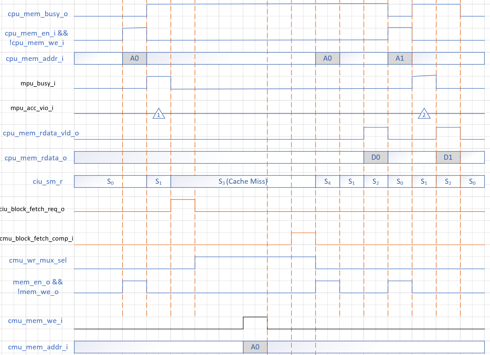

In general, CPU read takes 2 cycles after read signal is observed (such as a read from address A1 to retrieve data D1 shown in ), which could be the case of Direct CPU read in ‘Disable’ or ‘Initialization’ mode or of Cache Hit in ‘Cache Active’ mode. In ‘Cache Active’ mode, if a cache miss (such as a read from address A0 in ), CPU must wait for much longer to receive the data, while CIU has to issue a fetch request to CMU and waits for an acknowledgement from CMU to indicate the fetch completion (including a CMU write to Cache Memory).

Depending on how quick the response to the access violation check from MPU (configured by Parameter MPU_SINGLE_CYCLE), the timing of the write may be different. If the response happends at same cycle (MPU_SINGLE_CYCLE = 1) as the access is applied, the write can be passing through to memory in same cycle as long as no violation. However, if the response at next cycle (MPU_SINGLE_CYCLE = 0), the write has to wait until the indication of no violation comes out at next cycle as shown in .

In , there are two triangle-marked numbers, 1 and 2, where are potentially there indications for Access Violation to be detected, corresponding to CIU SM state ‘S1’ – that is a ‘denied’ condition that terminates Read operation (refer to section ). However, in the timing diagram above, there is no violation, so the reads continue. In case of same-cycle configuration, the violation signal needs to be passed down to determine if returning an valid data.

There are two cases to have Cache memory Write, one from CPU in Cache ‘Disable’ or ‘Initialization’ mode, and another from CMU in Cache Active mode. Due to Memory Control Wrapper has no byte-wise write enable bits in its Memory Interface, this design has to use a way of RMW operation to write a 32-bit data through 128-bit memory interface, that takes one extra cycle to read followed by the modification and write back. Since ‘RMW’ is an atomic operation, a write cannot be issued to Cache Memory (through Memory I/F) until MPU decides for this CPU write if passing the access control (refer to ).

For CMU write, although there is no need to check through MPU, to keep design consistent, it is always using same cycles as case of CPU write.

Timing for CPU Write (Two successful reads followed by one MPU failed)

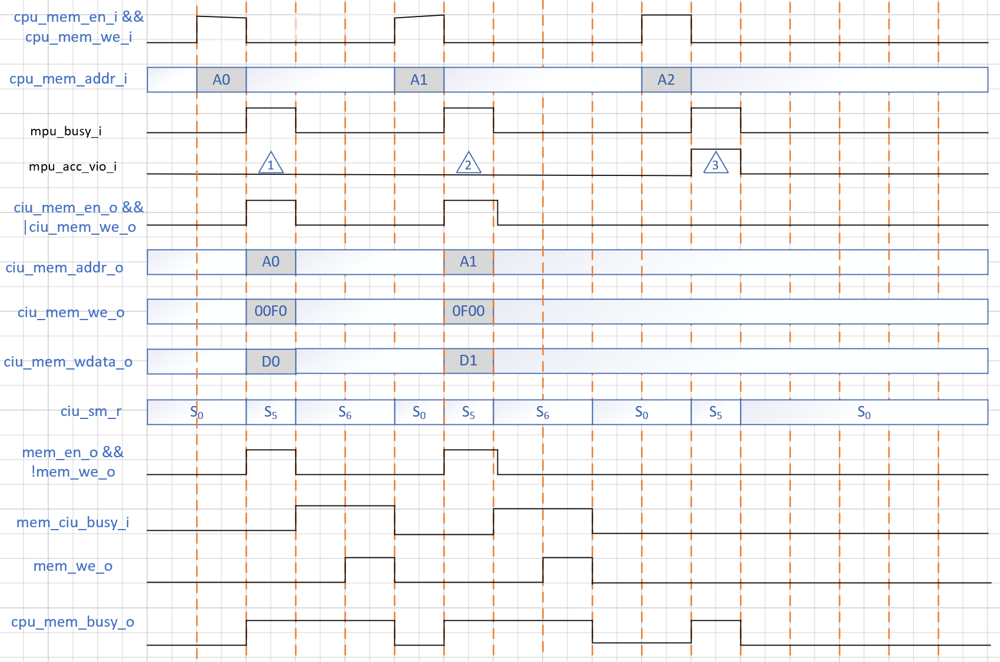

### State Machines

CIU State Machine (refer to ) controls how CPU access can be performed. It consists of 7 basic states from S0 to S6 (refer to ) to support both configuration of MPU latency (here only next-cycle case is shown. For same-cycle case, there won’t be S5 state to issue memory write; instead, the access failed to pass the permission check through MPU is not a valid access so SM stays in IDLE and for those that pass the check, the access to memory will be issued in same cycle in IDLE state so no need to transit to S5 (instead of jump directly to S6) for Memory write.).

Basic States of CIU State Machine

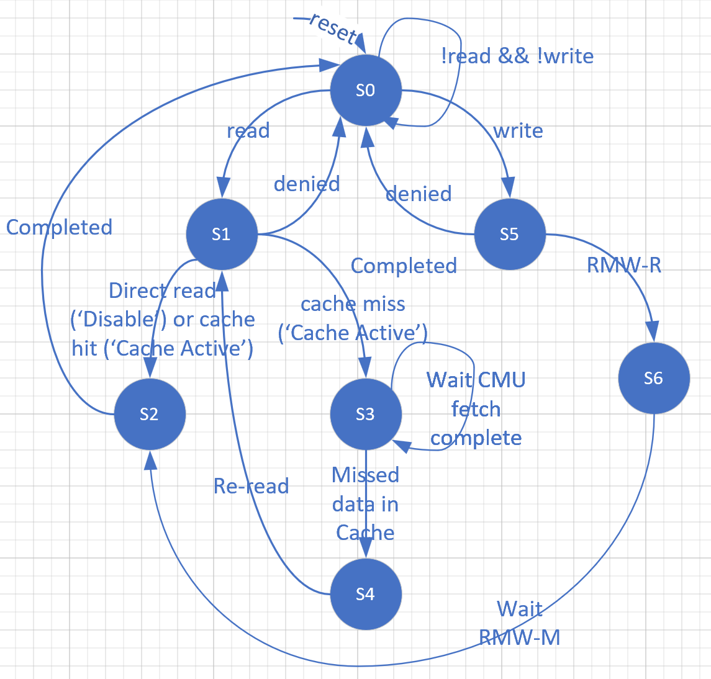

<table>
<caption>
CIU State Machine State Transitions
</caption>
<colgroup>
<col style="width: 33%" />
<col style="width: 33%" />
<col style="width: 33%" />
</colgroup>
<thead>
<tr>
<th style="text-align: center;"><strong>Current State</strong></th>
<th style="text-align: center;"><strong>Next State</strong></th>
<th style="text-align: center;"><strong>Description</strong></th>
</tr>
</thead>
<tbody>
<tr>
<td rowspan="3" style="text-align: center;">S0/IDLE</td>
<td style="text-align: center;">S0</td>
<td>IDLE state</td>
</tr>
<tr>
<td style="text-align: center;">S1</td>
<td>Valid Read</td>
</tr>
<tr>
<td style="text-align: center;">S5</td>
<td>Valid Write</td>
</tr>
<tr>
<td rowspan="3" style="text-align: center;">S1/READ</td>
<td style="text-align: center;">S0</td>
<td>Failure upon Access Control Check</td>
</tr>
<tr>
<td style="text-align: center;">S2</td>
<td>Direct read in ‘Disable’ or ‘Initialization’ mode or a cache hit in ‘Cache Active’ mode</td>
</tr>
<tr>
<td style="text-align: center;">S3</td>
<td>A cache miss in ‘Cache Active’ mode</td>
</tr>
<tr>
<td style="text-align: center;">S2/WAIT</td>
<td style="text-align: center;">S0</td>
<td>Always return back S0</td>
</tr>
<tr>
<td rowspan="2" style="text-align: center;">S3/MISS</td>
<td style="text-align: center;">S4</td>
<td>External Data back to the cache memory</td>
</tr>
<tr>
<td style="text-align: center;">S3</td>
<td>Wait for CMU to complete external data fetching</td>
</tr>
<tr>
<td style="text-align: center;">S4/RREAD</td>
<td style="text-align: center;">S1</td>
<td>Re-read Data that has been installed in Cache Memory</td>
</tr>
<tr>
<td rowspan="2" style="text-align: center;">S5/WRITE</td>
<td style="text-align: center;">S0</td>
<td>Return S0 if MPU denies</td>
</tr>
<tr>
<td style="text-align: center;">S6</td>
<td>Continue RMW if MPU passes</td>
</tr>
<tr>
<td style="text-align: center;">S6/EXTRA</td>
<td style="text-align: center;">S2</td>
<td>Wait extra cycle for RMW-M</td>
</tr>
</tbody>
</table>

## CMU

This section talks about the implementation level details of CMU.

### CMU Control

CMU Control implements the following state machine to maintain SInC state and control different operations based on it.

Any command received from FW (pre-validated by reg control block) or HW (fetch block request), goes to CMU control command FSM and this FSM handles all the commands. It forwards the request to Crypto Wrap/CIU modules as appropriate and waits for request completion before indicating command completion.

Additionally, CMU control checks whether the requested command is disabled or not, updates status register based on communication from crypto wrap or CIU, and implements active, done and error communication to internal modules and outside SInC.

The diagram below shows the transition of SInC into different states. Only severe-errors will cause SInC to move to cache-failed state.

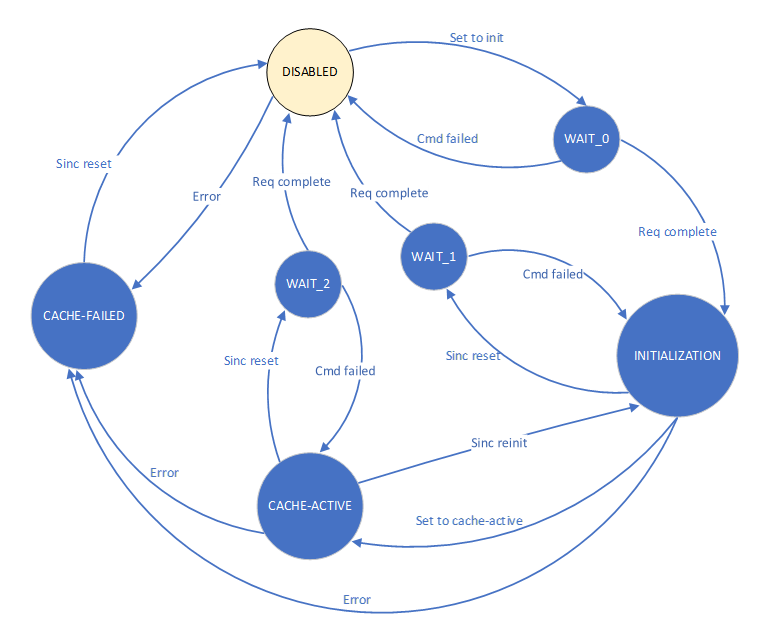

CMU Control state FSM diagram

| State | Sub-state | Description |
|----|----|----|
| IDLE | \- | FSM resets into IDLE. Waits for a command from Reg control or fetch block request from CIU. |
| FETCH_BLOCK | \- | Forward block fetch request to crypto wrap block and wait for completion. |
| SET_INIT | \- | Forward set init state request to crypto wrap block and wait for completion. |
| SET_CACHE_ACTIVE | \- | Set the state to cache-active. |
| SINC_RESET | SUB_STATE_1 | Forward SInC reset request to crypto wrap and wait for completion. Also forward the request to CIU. |
|  | SUB_STATE_2 | Wait for CIU to indicate SInC reset completion. |
| SINC_REINIT | \- | Set the state to initialization. |
| ENCR_BLOCK | \- | Forward encrypt block request to crypto wrap and wait for completion. |
| AES_TEST | \- | Forward AES test mode request to crypto wrap and wait for request to exit out of AES test mode. |

CMU Control command FSM table

### Crypto wrap control

Crypto wrap implements two FSMs, one FSM managing the AES configuration, and DMA requests, other controlling data movement in and out of GP AES. The tables below show the state tables for both the FSMs of Crypto wrap control.

<table>
<caption>
Crypto wrap control FSM 1 state table
</caption>
<colgroup>
<col style="width: 17%" />
<col style="width: 20%" />
<col style="width: 62%" />
</colgroup>
<thead>
<tr>
<th>State</th>
<th>Sub-state</th>
<th>Description</th>
</tr>
</thead>
<tbody>
<tr>
<td>IDLE</td>
<td>-</td>
<td>FSM resets into IDLE. Waits for a request from CMU control.</td>
</tr>
<tr>
<td>ENCR_BLOCK</td>
<td>1</td>
<td>
Load cfg, key, and IV into AES. Send DMA read request to fetch the cache block followed by DMA write request to write the encrypted cache block to external memory.

Write encrypted data to DMA as soon as it is available.

Wait for read request to complete.
</td>
</tr>
<tr>
<td></td>
<td>2</td>
<td>Finish writing the entire encrypted cache block to external memory.</td>
</tr>
<tr>
<td></td>
<td>3</td>
<td>Write authentication tag to external memory.</td>
</tr>
<tr>
<td>FETCH_BLOCK</td>
<td>1</td>
<td>
Load cfg, key, and IV into AES. Send DMA read request to fetch the cache block from external memory.

Write decrypted data to cache IRAM as soon as it is available.

Wait for read request to complete.
</td>
</tr>
<tr>
<td></td>
<td>2</td>
<td>Finish writing the entire cache block to cache IRAM.</td>
</tr>
<tr>
<td></td>
<td>3</td>
<td>Read authentication tag from external memory.</td>
</tr>
<tr>
<td></td>
<td>4</td>
<td>Compare authentication tag from external memory with the one generated by AES.</td>
</tr>
<tr>
<td>TEST_MODE</td>
<td>1</td>
<td>Wait for FW to set cfg, key, and IV valid bit.</td>
</tr>
<tr>
<td></td>
<td>2</td>
<td>If not seeded, send DMA read request to read the first 10 words for AES seed.</td>
</tr>
<tr>
<td></td>
<td>3</td>
<td>If not seeded, send DMA read request to read the remaining 10 words for AES seed.</td>
</tr>
<tr>
<td></td>
<td>4</td>
<td>Send DMA read request to read key from key store.</td>
</tr>
<tr>
<td></td>
<td>5</td>
<td>Load cfg, key, and IV into AES. Wait for AES test mode to complete.</td>
</tr>
<tr>
<td>SET_INIT_STATE</td>
<td>1</td>
<td>If not seeded, send DMA read request to read the first 10 words for AES seed.</td>
</tr>
<tr>
<td></td>
<td>2</td>
<td>If not seeded, send DMA read request to read the remaining 10 words for AES seed.</td>
</tr>
<tr>
<td></td>
<td>3</td>
<td>Send DMA read request to read key from key store.</td>
</tr>
<tr>
<td>SINC_RESET</td>
<td>-</td>
<td>Wipe locally stored AES key and move to IDLE.</td>
</tr>
<tr>
<td></td>
<td></td>
<td></td>
</tr>
</tbody>
</table>

<table style="width:100%;">
<caption>
Crypto wrap control FSM 2 state table
</caption>
<colgroup>
<col style="width: 22%" />
<col style="width: 12%" />
<col style="width: 65%" />
</colgroup>
<thead>
<tr>
<th>State</th>
<th>Sub-state</th>
<th>Description</th>
</tr>
</thead>
<tbody>
<tr>
<td>AES_IDLE</td>
<td>-</td>
<td>Wait for encrypt block, or fetch block or AES test mode request.</td>
</tr>
<tr>
<td>AES_IN</td>
<td>-</td>
<td>Drive data input to GP AES from input buffer.</td>
</tr>
<tr>
<td>AES_OUT</td>
<td>-</td>
<td>Capture data output from GP AES in output buffer.</td>
</tr>
<tr>
<td>AES_TAG_OUT</td>
<td></td>
<td>Wait for authentication tag generation. If encrypt block, capture it in output buffer. If fetch block, compare it with the tag read from external memory.</td>
</tr>
<tr>
<td>AES_TEST_IN</td>
<td>-</td>
<td>Drive data input to GP AES from registers.</td>
</tr>
<tr>
<td>AES_TEST_OUT</td>
<td>1</td>
<td>
Capture data output from GP AES in registers.

Move to sub-state 2, if it was first output block but not the last.

Move to sub-state 3, if it was first output block and the last.

Otherwise, move to AES_TEST_IN or AES_TEST_TAG_OUT.
</td>
</tr>
<tr>
<td></td>
<td>2</td>
<td>Wait for data out ack from registers.</td>
</tr>
<tr>
<td></td>
<td>3</td>
<td>Wait for data out ack from registers.</td>
</tr>
<tr>
<td>AES_TEST_TAG_OUT</td>
<td>-</td>
<td>Capture authentication tag from GP AES in registers.</td>
</tr>
<tr>
<td>AES_BYPASS</td>
<td>-</td>
<td>Bypass AES and send data from input buffer directly to output buffer.</td>
</tr>
</tbody>
</table>

During fetch block command, generated tag is directly obtained from AES and the expected tag is fetch from external memory and stored in the input buffer. During encrypt block command, generated tag is stored in output buffer and then written (transferred) to external memory.

Also, AES drbg seed read from RNG and AES key are stored in same set of flops as they don’t need to be stored at the same time. Also, these flops only hold data when needed, meaning once seed is read and provided to AES, it is cleared from these flops.

### AXI Attributes

SInC is both an AXI manager and subordinate to the internal AXI fabric. Being an AXI manager, it executes various transactions, and this section describes the attributes for different types of transactions it executes.

Note that the table below takes an example of SInC implementation in a security subsystem. Attributes may change if SInC is implemented in a different subsystem.

| Transaction    | Length (32b words) | Target AXI Sub |     |
|----------------|--------------------|----------------|-----|
| Read seed      | 10 (x2)            | RNG            |     |
| Read key       | 8                  | key store            |     |
| Read block     | BLOCK_SIZE/4       | shared ram     |     |
| Write block    | BLOCK_SIZE/4       | address translation unit            |     |
| Read/Write tag | 4                  | address translation unit            |     |

### Timing Diagrams

In Cache-active state, CIU can request CMU to fetch a block on a cache miss. Diagram below gives basic idea of timing of different functions/signals during a block fetch request from CMU perspective.

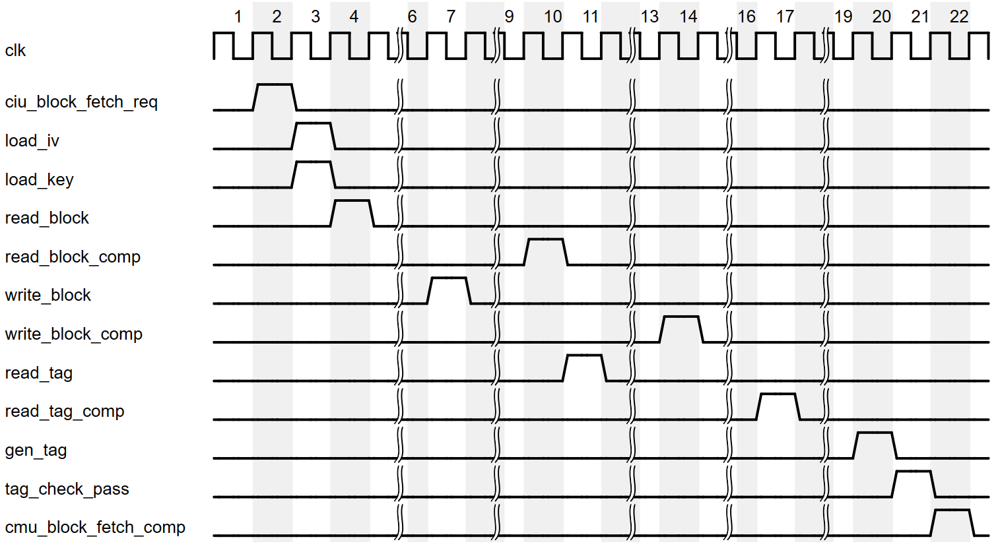

Block fetch request timing diagram

In Disabled state, FW can execute command to transition to Initialization state. The diagram below gives a basic idea of timing of different functions while servicing this command request.

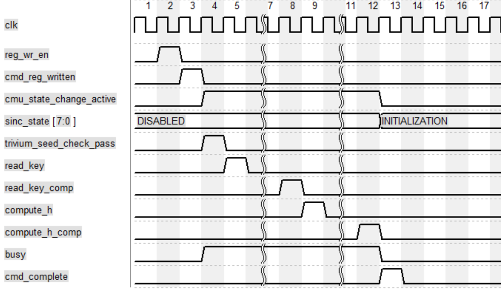

Set to Initialization command timing diagram

The timing diagram below shows how performance counter increment. Note that the diagram is meant as an example and the real latency to fetch a block may be much larger.

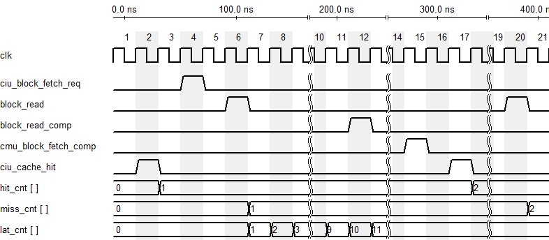

Performance counters

## Performance/FIFO/latency calculations

## RTL bring up tests

The following can be used as initial bring up tests by DV

-  Use cache IRAM as a local IRAM in disabled state.
- Change MPU attributes and repeat above test to cause MPU violations.
- Pre-load data in cache IRAM, perform memory erase and verify that the data is wiped.Future improvements

# References

1.  Secure Instruction Cache - [Security_Subsystem_Secure_Instruction_Cache_Architecture_Specification_1_0.docx]
2. SInC register spec 
3.  NIST SP 800-38D Recommendation for Block Cipher Modes of Operation: Galois/Counter Mode and GMAC (nist.gov)
4.  The Galois/Counter Mode (GCM) and GMAC Validation System (GCMVS) with the Addition of XPN Validation Testing (nist.gov)

