# 

***Secure Instruction Cache UVM Verification Plan***

Owner : SIS Design Verification Team

Version : \[Status\]

# Document Details

## Reference Documents 

| **\#** | **Document Name** | **Version** | 
|:---|----|----|
| 1 | Security_Subsystem_Secure_Instruction_Cache_Architecture_Specification_1_0_WIP | 0100 | [Security_Subsystem_Secure_Instruction_Cache_Architecture_Specification_1_0_WIP.docx] |
| 2 | SInC_0100_MAS_WIP | 1.0 | [SInC_0100_MAS_WIP.docx]|
|  |  |  |  |
|  |  |  |  |

# Contents

[1 Document Details [2](#document-details)](#document-details)

[1.1 Reference Documents [2](#reference-documents)](#reference-documents)

[2 Contents [3](#_Toc163635971)](#_Toc163635971)

[3 Glossary [8](#glossary)](#glossary)

[3.1 Acronyms and terminology [8](#acronyms-and-terminology)](#acronyms-and-terminology)

[4 Confidentiality [9](#confidentiality)](#confidentiality)

[5 Scope [10](#scope)](#scope)

[6 Testbench Interfaces [11](#testbench-interfaces)](#testbench-interfaces)

[7 Testbench Architecture [12](#testbench-architecture)](#testbench-architecture)

[7.1 Black Box View [14](#black-box-view)](#black-box-view)

[7.2 Test Bench Inheritance and Reusability [15](#test-bench-inheritance-and-reusability)](#test-bench-inheritance-and-reusability)

[7.2.1 IP level reusability [15](#ip-level-reusability)](#ip-level-reusability)

[7.2.2 SOC level reusability [16](#soc-level-reusability)](#soc-level-reusability)

[7.3 CoreWrapper Agent [16](#corewrapper-agent)](#corewrapper-agent)

[7.3.1 AXI Manager Agent \[Driver\] [17](#axi-manager-agent-driver)](#axi-manager-agent-driver)

[7.3.2 AXI Subordinate Agent \[Driver, Responder\] [18](#axi-subordinate-agent-driver-responder)](#axi-subordinate-agent-driver-responder)

[7.3.3 CPU MEM Driver \[Driver\] [21](#cpu-mem-driver-driver)](#cpu-mem-driver-driver)

[7.3.4 MPU Agent \[Driver\] [22](#mpu-agent-driver)](#mpu-agent-driver)

[7.4 Ram Wrapper Agents (Driver/Monitor) [23](#ram-wrapper-agents-drivermonitor)](#ram-wrapper-agents-drivermonitor)

[7.4.1 Mem Agent \[Monitor\] [24](#mem-agent-monitor)](#mem-agent-monitor)

[7.4.2 Mem Erase Agent \[Driver\] [24](#mem-erase-agent-driver)](#mem-erase-agent-driver)

[7.4.3 Mem Error Injection Agent \[Driver\] [24](#mem-error-injection-agent-driver)](#mem-error-injection-agent-driver)

[7.5 Sideband Agent (Driver/Monitor) (DV0.5 item) [25](#sideband-agent-drivermonitor-dv0.5-item)](#sideband-agent-drivermonitor-dv0.5-item)

[7.6 Virtual sequence-controlled Interface Behavior [25](#virtual-sequence-controlled-interface-behavior)](#virtual-sequence-controlled-interface-behavior)

[7.7 Stimulus Flow [26](#stimulus-flow)](#stimulus-flow)

[7.7.1 DUT Cache Initialization [27](#dut-cache-initialization)](#dut-cache-initialization)

[7.7.2 SInC Mode Test Flow [28](#sinc-mode-test-flow)](#sinc-mode-test-flow)

[7.7.3 Valid operation Flow [29](#valid-operation-flow)](#valid-operation-flow)

[7.7.4 Error Injection Flow [30](#error-injection-flow)](#error-injection-flow)

[7.8 Cache Storage Directory [30](#cache-storage-directory)](#cache-storage-directory)

[7.9 Scoreboard [32](#scoreboard)](#scoreboard)

[7.9.1 Scoreboard – Transaction & Event based checker [33](#scoreboard-transaction-event-based-checker)](#scoreboard-transaction-event-based-checker)

[7.9.2 Scoreboard – Check flow high level view [37](#scoreboard-check-flow-high-level-view)](#scoreboard-check-flow-high-level-view)

[7.9.3 Scoreboard - Signature based report mechanism [38](#scoreboard---signature-based-report-mechanism)](#scoreboard---signature-based-report-mechanism)

[7.10 Assertions [39](#assertions)](#assertions)

[7.11 Clock & Reset [39](#clock-reset)](#clock-reset)

[7.11.1 Clock [39](#clock)](#clock)

[7.11.2 Reset [39](#reset)](#reset)

[8 Test Scenarios (WIP) [39](#test-scenarios)](#test-scenarios)

[8.1 Test Scenarios by CMU States [40](#test-scenarios-by-cmu-states)](#test-scenarios-by-cmu-states)

[8.2 Fundamental checks aside from Expectation [40](#fundamental-checks-aside-from-expectation)](#fundamental-checks-aside-from-expectation)

[8.3 Disable State [41](#disable-state)](#disable-state)

[8.3.1 Checks When Transition into the State [42](#checks-when-transition-into-the-state)](#checks-when-transition-into-the-state)

[8.3.2 MPU R/W Access [42](#mpu-rw-access)](#mpu-rw-access)

[8.3.3 CPU MEM R/W Access [44](#cpu-mem-rw-access)](#cpu-mem-rw-access)

[8.3.4 RamWrapper Operations [49](#ramwrapper-operations)](#ramwrapper-operations)

[8.3.5 AES Engine test scenarios [50](#aes-engine-test-scenarios)](#aes-engine-test-scenarios)

[8.3.6 AXI Request to SInC [56](#axi-request-to-sinc)](#axi-request-to-sinc)

[8.3.7 Errors in this state [67](#errors-in-this-state)](#errors-in-this-state)

[8.4 Initialization State \[WIP\] [73](#initialization-state)](#initialization-state)

[8.4.1 Checks When Transition into the State [74](#checks-when-transition-into-the-state-1)](#checks-when-transition-into-the-state-1)

[8.4.2 MPU R/W Access [74](#mpu-rw-access-1)](#mpu-rw-access-1)

[8.4.3 CPU MEM R/W Access [76](#cpu-mem-rw-access-1)](#cpu-mem-rw-access-1)

[8.4.4 RamWrapper Operations [81](#ramwrapper-operations-1)](#ramwrapper-operations-1)

[8.4.5 AES Engine test scenarios [82](#aes-engine-test-scenarios-1)](#aes-engine-test-scenarios-1)

[8.4.6 AXI Request to SInC [85](#axi-request-to-sinc-1)](#axi-request-to-sinc-1)

[8.4.7 Errors in this state [99](#errors-in-this-state-1)](#errors-in-this-state-1)

[8.5 Cache Active State \[WIP\] [106](#cache-active-state)](#cache-active-state)

[8.5.1 Checks When Transition into the State [106](#checks-when-transition-into-the-state-2)](#checks-when-transition-into-the-state-2)

[8.5.2 MPU R/W Access [107](#mpu-rw-access-2)](#mpu-rw-access-2)

[8.5.3 CPU MEM R/W Access [108](#cpu-mem-rw-access-2)](#cpu-mem-rw-access-2)

[8.5.4 RamWrapper Operations [121](#ramwrapper-operations-2)](#ramwrapper-operations-2)

[8.5.5 AES Engine test scenarios [122](#aes-engine-test-scenarios-2)](#aes-engine-test-scenarios-2)

[8.5.6 AXI Request to SInC [125](#axi-request-to-sinc-2)](#axi-request-to-sinc-2)

[8.5.7 Errors in this state [135](#errors-in-this-state-2)](#errors-in-this-state-2)

[8.6 Cache Failure State \[WIP\] [141](#cache-failure-state)](#cache-failure-state)

[8.7 Reset and SInC reset cmd [141](#reset-and-sinc-reset-cmd)](#reset-and-sinc-reset-cmd)

[8.8 Register Access Restrictions [143](#register-access-restrictions)](#register-access-restrictions)

[8.8.1 Coverage Sampling on register access [143](#coverage-sampling-on-register-access)](#coverage-sampling-on-register-access)

[8.8.2 Positive test cases [144](#positive-test-cases-17)](#positive-test-cases-17)

[8.8.3 Negative test cases [146](#negative-test-cases-19)](#negative-test-cases-19)

[8.9 Memory Error Injection Request [147](#memory-error-injection)](#memory-error-injection)

[8.9.1 Single bit ECC error [147](#single-bit-ecc-error)](#single-bit-ecc-error)

[8.9.2 Double bits ECC error [147](#double-bits-ecc-error)](#double-bits-ecc-error)

[8.10 Concurrent Stimulus [148](#concurrent-stimulus)](#concurrent-stimulus)

[8.10.1 Erase & AXI MGR/MPU/CPU_MEM Request [148](#erase-axi-mgrmpucpu_mem-request)](#erase-axi-mgrmpucpu_mem-request)

[8.10.2 Erase & FW Command Operation [149](#erase-fw-command-operation)](#erase-fw-command-operation)

[8.10.3 MPU & AXI MGR/CPU_MEM [149](#mpu-axi-subcpu_mem)](#mpu-axi-subcpu_mem)

[8.10.4 CPU_MEM & AXI MGR [150](#cpu_mem-axi-mgr)](#cpu_mem-axi-mgr)

[8.10.5 AXI Read & AXI Write \[need confirmation\] [151](#axi-read-axi-write-need-confirmation)](#axi-read-axi-write-need-confirmation)

[8.11 Interrupt monitor [151](#interrupt-monitor)](#interrupt-monitor)

[8.12 Sideband Ports [152](#sideband-ports)](#sideband-ports)

[8.13 Performance Register Testing \[WIP\] [152](#performance-register-testing)](#performance-register-testing)

[9 Secure Instruction Cache Verification Plan Overview [152](#secure-instruction-cache-verification-plan-overview)](#secure-instruction-cache-verification-plan-overview)

[10 Testplan [152](#testplan)](#testplan)

[10.1 Sanity Test [154](#sanity-test)](#sanity-test)

[10.1.1 Intent [154](#intent)](#intent)

[10.1.2 Procedure [154](#procedure)](#procedure)

[10.2 SInC_legal_valid_rand Test [154](#sinc_legal_valid_rand-test)](#sinc_legal_valid_rand-test)

[10.2.1 Intent [154](#intent-1)](#intent-1)

[10.2.2 Procedure [155](#procedure-1)](#procedure-1)

[10.3 SInC_single_invalid_rand Test [155](#sinc_single_invalid_rand-test)](#sinc_single_invalid_rand-test)

[10.3.1 Intent [155](#intent-2)](#intent-2)

[10.3.2 Procedure [155](#procedure-2)](#procedure-2)

[10.4 SInC_uncor_ecc_error_rand Test [155](#sinc_uncor_ecc_error_rand-test)](#sinc_uncor_ecc_error_rand-test)

[10.4.1 Intent [155](#intent-3)](#intent-3)

[10.4.2 Procedure [155](#procedure-3)](#procedure-3)

[10.5 sinc_multiple_invalid_rand Test [155](#sinc_multiple_invalid_rand-test)](#sinc_multiple_invalid_rand-test)

[10.5.1 Intent [156](#intent-4)](#intent-4)

[10.5.2 Procedure [156](#procedure-4)](#procedure-4)

[10.6 sinc_performance_rand Test [156](#sinc_performance_rand-test)](#sinc_performance_rand-test)

[10.6.1 Intent [156](#intent-5)](#intent-5)

[10.6.2 Procedure [156](#procedure-5)](#procedure-5)

[10.7 SInC_custom Test [156](#sinc_custom-test)](#sinc_custom-test)

[10.7.1 Intent [156](#intent-6)](#intent-6)

[10.7.2 Procedure \[TBD\] [156](#procedure-tbd)](#procedure-tbd)

[11 Test List [156](#test-list)](#test-list)

[12 Randomization [156](#randomization)](#randomization)

[12.1 Randomization Weights [157](#randomization-weights)](#randomization-weights)

[13 Error Injection and Handling [158](#error-injection-and-handling)](#error-injection-and-handling)

[14 Coverage [159](#coverage)](#coverage)

[14.1 Functional Coverage [159](#functional-coverage)](#functional-coverage)

[14.2 Assert Coverage \[DV 0.8 item\] [159](#assert-coverage-dv-0.8-item)](#assert-coverage-dv-0.8-item)

[15 Configurations [159](#configurations)](#configurations)

[15.1 Parameters [159](#parameters)](#parameters)

[15.1.1 RTL Design Parameters [159](#rtl-design-parameters)](#rtl-design-parameters)

[15.1.2 Verification Environment Instance Parameters [160](#verification-environment-instance-parameters)](#verification-environment-instance-parameters)

[15.2.1 Verification Environment Runtime Parameters [161](#verification-environment-runtime-parameters)](#verification-environment-runtime-parameters)

[15.3 Defines [161](#_Toc163636087)](#_Toc163636087)

[16 Assumptions [162](#assumptions)](#assumptions)

[17 IS Not [162](#is-not)](#is-not)

[18 Subsystem Specific Details [163](#subsystem-specific-details)](#subsystem-specific-details)

[19 References [164](#_Toc163636092)](#_Toc163636092)

# Glossary

## Acronyms and terminology 

| IP   | Intellectual property                                              |
|------|--------------------------------------------------------------------|
| VIP  | Verification intellectual property                                 |
| UVM  | Universal Verification Methodology (SystemVerilog based framework) |
| UVC  | UVM verification component                                         |
| SinC | Secure Instruction Cache                                           |
|      |                                                                    |
|      |                                                                    |
|      |                                                                    |

# Confidentiality

All the information contained in this document is confidential.

This document refers to intellectual property (IP) that Microsoft may develop or purchase. Microsoft’s interest in this IP is confidential information. Do not reveal or discuss the information in this document or Microsoft’s interest in this IP with third parties except as specifically authorized by Microsoft.

Product names and specifications referenced in this document may be trademarks of Microsoft, other companies, or standards setting organizations.

# Scope

This document elaborates Secure Instruction Cache IP verification methology at L1 level, using a Systemverilog and UVM based verification environment. It contains details on the SInC testbench architecture and includes high level details on tests, randomization, scoreboarding, and error injection and handling capabilities.

The Secure Instruction Cache Arch and MAS in the Reference Documents are the base reference documents for the proposed verification plan.

This document can be used for DV and Design for understanding how the test bench works and how to use it to help debug process.

# Testbench Interfaces

SInC Verification Environment uses the following list of interfaces to interact with SInC DUT:

<table style="width:96%;">
<colgroup>
<col style="width: 12%" />
<col style="width: 19%" />
<col style="width: 18%" />
<col style="width: 30%" />
<col style="width: 15%" />
</colgroup>
<thead>
<tr>
<th>
<strong>Connection</strong>

<strong>Type</strong>
</th>
<th><strong>DUT Interface</strong></th>
<th>
<strong>Connects with</strong>

<strong>TB Component</strong>
</th>
<th><strong>Description</strong></th>
<th><strong>Testbench Connection</strong></th>
</tr>
</thead>
<tbody>
<tr>
<td>Interface Driver</td>
<td>AXI Subordinate</td>
<td>AXI MGR UVC</td>
<td>Access SinC registers</td>
<td>TBD</td>
</tr>
<tr>
<td>Interface Driver</td>
<td>AXI Manager</td>
<td>AXI SUB UVC</td>
<td>Access key store/RNG/shared ram/address translation unit</td>
<td>TBD</td>
</tr>
<tr>
<td>Interface Monitor</td>
<td>Memory Interface</td>
<td>RamWrapper UVC - Memory Monitor</td>
<td>Monitor CIU memory interface with Cache SRAM</td>
<td>TBD</td>
</tr>
<tr>
<td>Interface Driver</td>
<td>CPU Memory Interface</td>
<td>
CoreWrapper UVC -

CPU Memory Driver
</td>
<td>Access address map within SInC</td>
<td>TBD</td>
</tr>
<tr>
<td>Interface Driver</td>
<td>MPU Interface</td>
<td>
CoreWrapper UVC -

MPU Driver
</td>
<td>Program SInC MPU</td>
<td>TBD</td>
</tr>
<tr>
<td>Interface Driver</td>
<td><ul>
<li>
Mem Erase Interface
</li>
<li>
Err Inject Interface
</li>
</ul></td>
<td>
RamWrapper UVC -

<ul>
<li>
Erase Driver
</li>
<li>
Err Inj Driver
</li>
</ul></td>
<td>Firmware Memory Erase and Error Injection behavior</td>
<td>TBD</td>
</tr>
<tr>
<td>Backdoor</td>
<td>MEM Backdoor</td>
<td>Cache SRAM</td>
<td>Backdoor access to memories for scoreboard check and error injection (bad ECC).</td>
<td>TBD</td>
</tr>
<tr>
<td>Misc</td>
<td>Miscellaneous interface input</td>
<td><ul>
<li>
Clock UVC
</li>
<li>
CoreWrapper UVC - AEB Driver
</li>
</ul></td>
<td>Clock, Reset, AEB and misc. inputs</td>
<td>TBD</td>
</tr>
<tr>
<td>Misc</td>
<td>Miscellaneous interface output</td>
<td>SInC Event Monitor (SInC L1 TB Virtual Interface)</td>
<td>SInC output ports not listed in above interfaces</td>
<td>TBD</td>
</tr>
</tbody>
</table>

# Testbench Architecture 

SInC UVM verification environment is built with UVM and Systemverilog.

The SInC test bench:

- instantiates Secure Instruction top level IP as DUT,

- creates FPGA memory modules as Cache SRAM connect with the DUT,

- mimics the inputs to SInC, with randomized CPU Memory, AXI MGR/SUB transactions, and sideband signals - with the goal of exercising input interface under all possible scenarios,

- monitors the under tested input/output sideband and memory interfaces,

- treats the SInC DUT as a Blackbox for SInC level scoreboard, stimulus and checks are mostly done by interacting with the DUT at its interface,

- treats the AES Engine inside SInC DUT as a Blackbox for AES Engine level scoreboard, stimulus are done by interacting with the SInC DUT at its interface, monitors will be applied to AES Engine peripherals,

- only do backdoor peeking for status register for more precise scoreboard checks,

- only do forcing when it is impossible to create certain scenarios for security check purpose,

- checks the SInC IP’s behavior with prediction model (from the testbench), which is derived from SInC MAS and Architecture SPEC,

- checks the AES Engine module’s behavior with prediction model (from the testbench), which is derived from AES Engine MAS and Architecture SPEC,

- provides debug helper for DV and Design teams to better understand and allocate the TB and RTL issues.

> Below figures show how SInC L1 TB transfer SInC IP into DUT with peripheral environments.

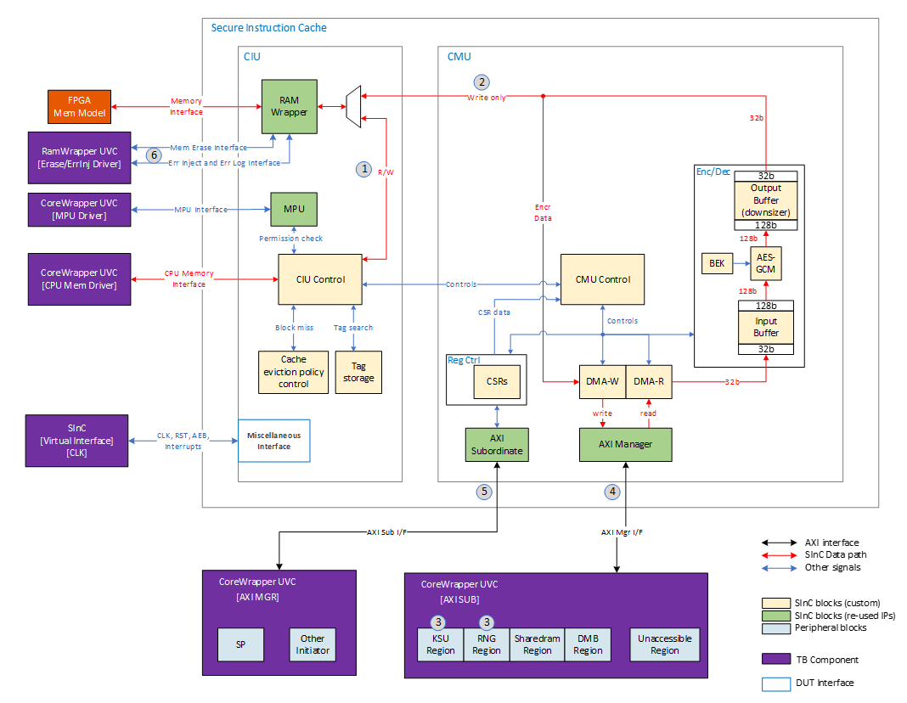
<figcaption>
Figure 1 SInC Testbench DUT Architecture HL
</figcaption>

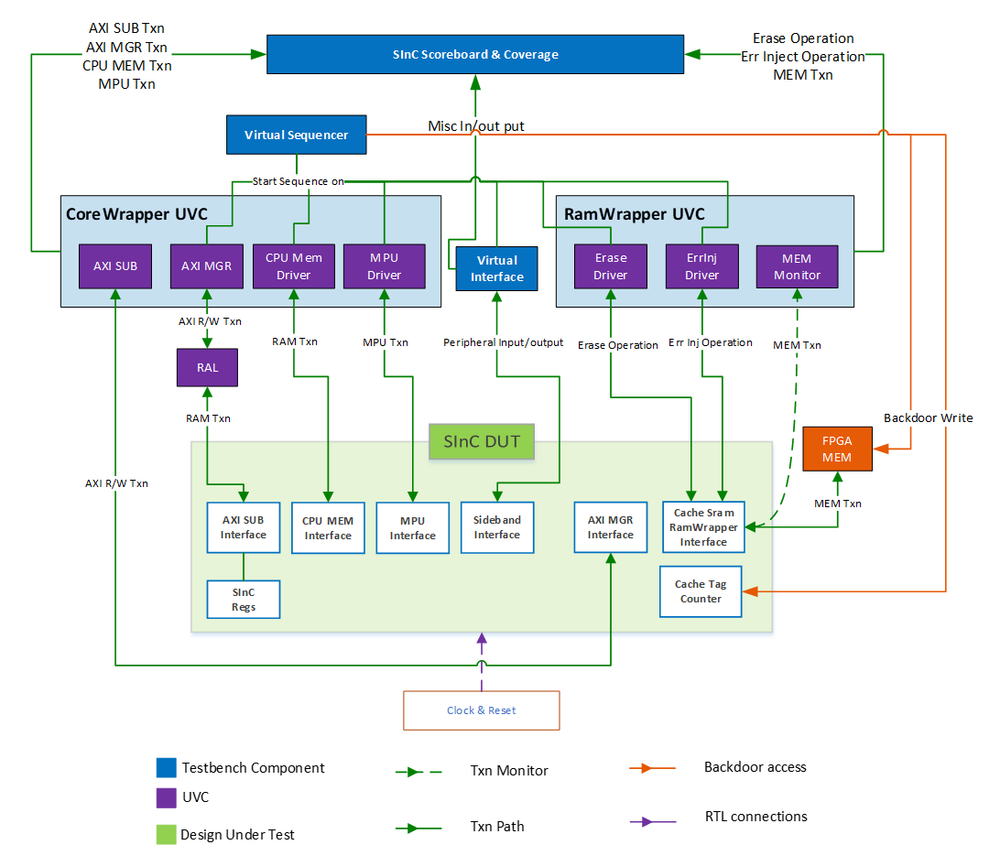
<figcaption>
Figure 2 SInC UVM Verification Stimulus Environment
</figcaption>

## Black Box View

In SInC verification, DV will treat the DUT as a black box for the most of stimulus and checkers except for verification of AES module.

As AES Engine module is a special module \[TBD, link to AES Engine MAS\] created for SInC design, it is a light version of general AES module used at security subsystem.

Unlick AXI MGR/SUB modules or RamWrapper modules, which have standalone TB at L1. For more sophisticated verification on a sub module of SInC DUT, DV will have to break into the black box of CMU module to monitor the AES Engine’s ports. However, the AES Engine’s check does not interfere with SInC DUT level verification at all. The AES Engine’s scoreboard actively works on transactions/interactions at AES Engine instance level.

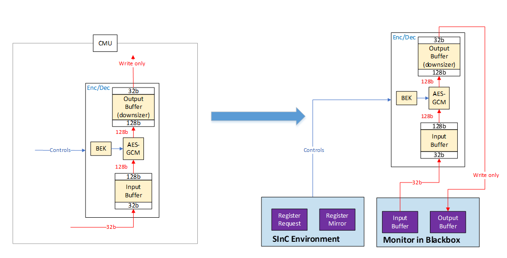

Figure 3 Break the SInC Blackbox, View on AES monitors/checkers

## Test Bench Inheritance and Reusability 

Secure Instruction Cache (SInC) UVM test bench is a stand-alone environment for Secure Instruction Cache IP verification at L1. It contains stimuluses, monitors, and scoreboards as major components for the test. Many of the stimuluses and monitors’ modules can be inherited from already existing and verified components, to achieve reusability of our existing test benches.

This test bench can be reused at L2 verification, by replacing:

- AXI SUB UVC \[Driver\] -\> AXI SUB UVC \[Monitor\] with Real RTL module and memory for key store, RNG, shared ram and address translation unit,

- MPU UVC \[Driver\] -\> MPU UVC \[Monitor\] with CR module,

- RamWrapper UVC \[Driver\] -\> RamWrapper UVC \[Monitor\] with CR module.

The SInC UVC TB’s prediction model and scoreboard is reusable at any higher-level test benches.

### IP level reusability

From IP level (stand-alone)’s view, below verification component for interface or IP are verified and will be reused:

- AXI Agent - Manager/Subordinate \[Driver\]

<!-- -->

- Refer to \[[AXI Protocol Spec](http://www.gstitt.ece.ufl.edu/courses/fall15/eel4720_5721/labs/refs/AXI4_specification.pdf)\]

- One AXI MGR agent will be instantiated for SInC L1 TB. It is derived from AXI UVC for generation of AXI stimulus on the SinC AXI SUB interface, monitor of AXI transactions.

- One AXI SUB agent will be instantiated for SInC L1 TB. It is derived from AXI UVC for responding AXI request from the SinC AXI MGR interface, monitor of AXI transactions.

<!-- -->

- MPU Access Initiator \[Driver\]

<!-- -->

- Refer to \[[MPU Arch Spec]\]

- The program of MPU is done by MPU Agent \[Driver\] through the MPU interface at SInC.

<!-- -->

- CPU Memory Access Initiator\[Driver\]

<!-- -->

- Refer to \[[security processor Wrapper MAS]\]

- CoreWrapper CPU Memory interface to SInC (CIU) .

<!-- -->

- RamWrapper Agent - Erase/Error Inject/Mem

<!-- -->

- Refer to \[[RamWrapper MAS]\]

- There is one Ram Wrapper instances(RTL) instantiated in SInC IP. For this SInC TB, we treat the RamWrapper instances as verified IP. Therefore, the Ram Wrapper agents(UVC) will be instantiated at test top for sending stimulus(error injection) and monitoring(mem interface, error log) the memory interactions through the ports of SInC interfaces.

### SOC level reusability

From security subsystem level’s view, the SInC L1 TB can be used at passive mode for monitoring behaviors of SInC within the whole security subsystem environment, at L2/L3.

## CoreWrapper Agent 

CoreWrapper Agent is used to represent the security processor Wrapper in security subsystem. It is a configurable agent that is versatile to work at different IP level TB and L2 level TB. In SInC UVM TB, CoreWrapper Agent is instantiated with enabled

- AXI MGR Agent

- AXI SUB Agent

- MPU Agent

- CPU Memory Agent

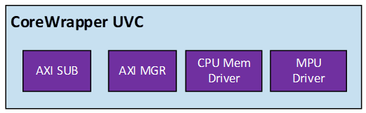

- Figure 4 CoreWrapper Agent

### AXI Manager Agent \[Driver\]

AXI interface connected with SInC AXI Subordinate will be driven by AXI MGR UVC in active mode. It provides driver and monitor to the AXI Subordinate interface.

TB will be responsible for creating AXI transaction items under constraint random based UVM objects. It is TB’s responsibility to:

- Represent the critical path from security processor -\> Fabric -\> AXI SUB in SInC (CMU)

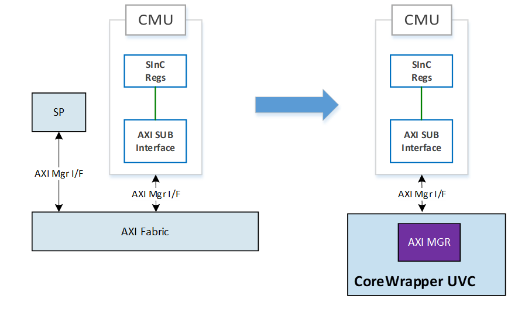

- Figure 5 AXI MGR Agent

- Control the stimulus sequence on AXI read and write channel.

SInC can take concurrent AXI read and write transactions. Thus, AXI UVC(Master) is supposed to drive valid read and write transactions in any order - including transactions arriving at the same time. More details of the sequence randomization can be referred to in \[*Section TBD AXI Request\]*. However, the AXI SUB module inside SInC will triage read and write requests, only one active request is allowed at a time.

- Set up UVM RAL model with AXI MGR’s sequencer

RAL will be used to help TB stimulus easily access SInC registers. RAL model can be extended with multiple address space and RAL2AXI adapter to help improve TB code efficiency.

- Use proper constraints to generate random AXI transactions to perform behaviors in below list. Valid transactions mean they are expected to be completed with AXI Response OKAY; invalid transactions mean they are expected to be responded with SLV_ERR.

1.  Valid Read and Write transaction to SInC Register,

2.  Invalid Read or Write transaction to access SInC with illegal cmd, AXI attributes or bad address.

More details of the AXI item randomization can be referred to in \[*Section TBD AXI Request\]*.

- Subscribe to AXI MGR Agent’s Monitor and perform checks in the scoreboards (SInC and AES scoreboard) by using the received (broadcast) AXI transactions. More details of checks can be found in \[*Section TBD \]For an AXI request*.

<!-- -->

- Option 1: use RAL Reg Callbacks to perform checks on expect register vs. actual register.

- Option 2: use register TLB for update and check local register copy vs. actual register.

<!-- -->

- Use AXI UVC’s functional coverage and assertions as reference to check the quality of the SInC AXI MGR’s usage.

> Note: Aside from function coverage from SInC IP TB, AXI UVC also provides its own functional coverage from AXI interface’s point of view that is usually not checked at higher level. For example: initial, intra, and response delays.

### AXI Subordinate Agent \[Driver, Responder\]

AXI interface connected with SInC AXI Manager will be driven by AXI SUB UVC in active mode. It provides driver and monitor to the SInC AXI Manager interface.

The AXI Sub Agent will be responsible for responding to AXI read and write requests matching AXI protocol. It is TB’s responsibility to use AXI Sub Agent:

- Represent the critical path from SInC to security subsystem components that SInC has access to.

Including key store, RNG, shared ram and address translation unit.

- Preload virtual memories for key store, shared ram and address translation unit.

<!-- -->

- To have valid stimulus, key store needs to preload valid keys that can be accessed by SInC. Refer to \[TBD link to key store MAS\] for more information about Key data.

- The shared ram data can be fetched by SInC, encrypted by AES-GCM within SInC, then write to address translation unit external memory. TB needs to make sure that the data critical path and virtual memory are consistent.

<!-- -->

- Return random data when access RNG region to mimic RNG behavior.

- Set up slave response regions depending on the address range of each IP.

<!-- -->

- There are supposed to be 4 regions (key store, RNG, shared ram and address translation unit) that can be accessed by SInC, with 1 region that is illegal to access by SInC.

- The address of each region should match with Subsystem defined address map to mimic the realistic SOC environment.

<!-- -->

- The scoreboard will have handler to the memories to help check on the data paths’ propagation logics.

<figure>
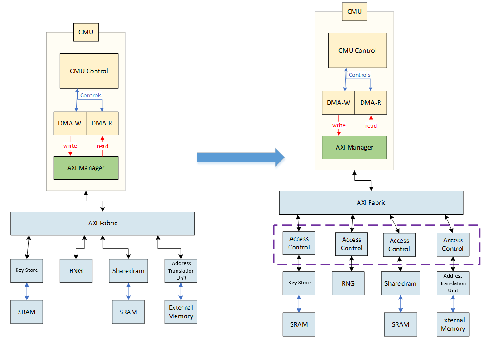
<figcaption><blockquote>

Figure 6.1 DUT View for AXI Sub Agent

</blockquote></figcaption>
</figure>

The AXI Sub agent is not capable of mimicking the access control of each destination’s IP. To verify the functionality of SInC to these IP components, L1 TB uses the scoreboard to check the correctness of AXI requests coming out of SInC, with different prediction model on different address ranges. The AXI Sub Agent would simply provide responder and virtual memory to present each IP, which are similar to each other. The set up can be found in later sections in 7.3.2.

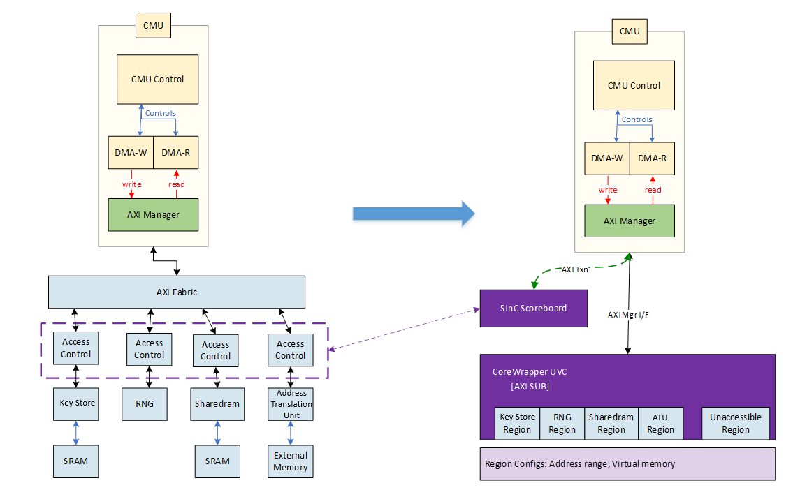

> Figure 6.2 Checks and AXI Sub Agent set up

#### AXI Responder Set Up

Each AXI Sub address region has a virtual memory, which makes R/W access to be data consistent. From L1 SInC TB’s view, the access control logic within key store/RNG/shared ram/address translation unit does not matter, refer to 7.3.2.2 AXI Responder Response section for more information.

| **Responder Region** | **Data Type**                                   |
|:--------------------:|-------------------------------------------------|
|         key store          | Preloaded Random Data representing 256 bits key |
|         RNG          | Random Data on each access                      |
|      shared ram       | Preloaded Random data                           |
|         address translation unit          | Preloaded Random data                           |

#### AXI Responder Responses

Each AXI Responder can be configured to return SLVERR on the request. The table below shows how to interpret the SLVERR in each of the regions.

| **Responder Region** | **SLVERR on** |
|:--:|----|
| key store | Key Attribute does not match with requirement/Internal Issues. |
| RNG | RNG internal issues. TBD |
| shared ram | shared ram internal issues. TBD |
| address translation unit | address translation unit internal issues. TBD |

#### AXI MGR Monitor Checks 

When AXI MGR Interface activities are monitored, SInC scoreboard will perform checks on the request to make sure they are matching the requirements on all the AXI attributes.

Refer to MAS 10.1.2.1.1 Disabled state: “

On a SInC request to read the key, key store must check the following key attributes before providing the key.

- KeySize384 is not set.

- IsDeviceSecret, AESEncryptAllowed, and AESDecryptAllowed are set.

”

\[TBD\] need other AXI Sub region access requirements.

| **Responder Region** | **AXI Attributes** |
|:--:|----|
| key store | key store MAS for Access control(burst_size, len, burst_type, axuser … ) |
| RNG | RNG MAS for Access control |
| shared ram | shared ram MAS for Access control |
| address translation unit | address translation unit MAS for Access control |

### CPU MEM Driver \[Driver\]

CPU Memory Interface connected with SInC (CIU) will be driven by CPU MEM Driver. It provides driver and monitor to the CPU Memory interface.

The CPU MEM Driver will be responsible for creating valid transactions matching \[MSFT CPU Memory Interface\] protocol. It is TB’s responsibility to use CPU MEM Driver to:

- Represent the security processor Wrapper’s CPU Memory Interface to SInC.

At this TB, security processor Wrapper IP is not instantiated. L1 will use the CPU MEM Driver UVC to mimic security processor Wrapper requests to CIU by CPU Memory Interface.

- Use proper constraints to generate random mem transactions to access memory through SInC. Valid transactions (positive cases) mean they are expected to be granted and completed without causing errors in the RTL; invalid transactions (negative cases) mean they are expected to be rejected/dropped or cause error scenarios.

As the access permission are limited by both MPU and different states of CMU. Constraints for Valid transactions are varied by the state of DUT’s status.

- Subscribe to CPU MEM Driver’s Monitor and perform checks in the scoreboard by using the received (broadcast) CPU MEM transactions. More details of checks can be found in \[*Section TBD \]For a CPU MEM request*.

<figure>
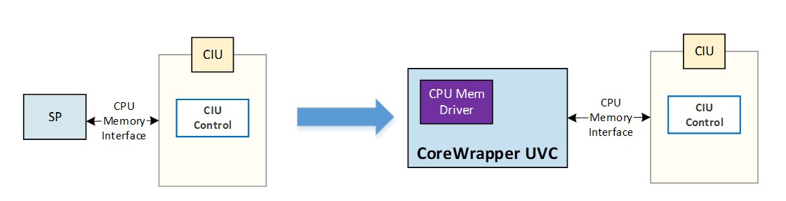
<figcaption><blockquote>

Figure 7. CPU Mem Driver [CoreWrapper Agent]

</blockquote></figcaption>
</figure>

### MPU Agent \[Driver\]

MPU Interface connected with SInC (CIU) will be driven by MPU Agent. MPU Agent provides driver and monitor to the MPU interface. It also provide MPU configuration under subsystem’s param for user to configure the stimulus.

The MPU Driver will be responsible for creating valid transactions matching \[MPU Interface\] protocol. It is TB’s responsibility to use MPU Agent to:

- Represent the CR’s MPU Interface to SInC.

At this TB, CR IP is not instantiated. L1 will use the MPU Driver UVC to mimic CR requests to CIU by MPU Interface.

- Configure the MPU before issuing CPU MEM requests. The MPU will be mapped to entire external memory space and as a result it needs to hold permission attributes for the entire external memory. The permission attributes are abstracted to TB class variable under randomization. For each test, at configuration phase, the MPU configuration shall be randomized before program to the MPU RTL within SInC.

- Scoreboard’s prediction model will be relying on MPU settings to predict CPU MEM requests’ result to SInC.

<figure>
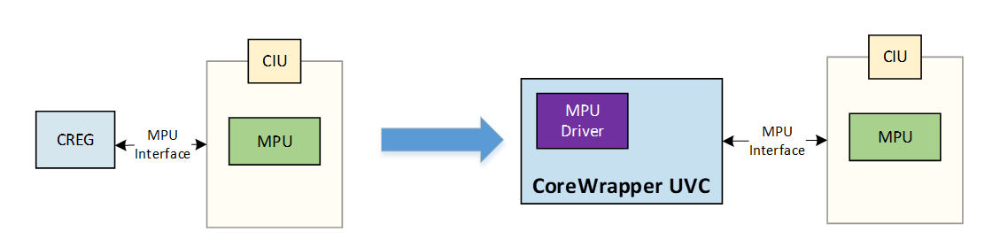
<figcaption><blockquote>

Figure 8. MPU Driver [CoreWrapper Agent]

</blockquote></figcaption>
</figure>

## Ram Wrapper Agents (Driver/Monitor) 

SInC has one Ram Wrapper instances, Cache SRAM Ram Wrapper. A RamWrapper agent instance will be created to mimic requests to Cache SRAM RamWrapper and monitor the Memory Interface between RamWrapper and Cache SRAM. The RamWrapper UVC environment has: 1 memory interface monitor, 1 erase interface driver and 1 Err Inject and Err Log interface driver.

<figure>
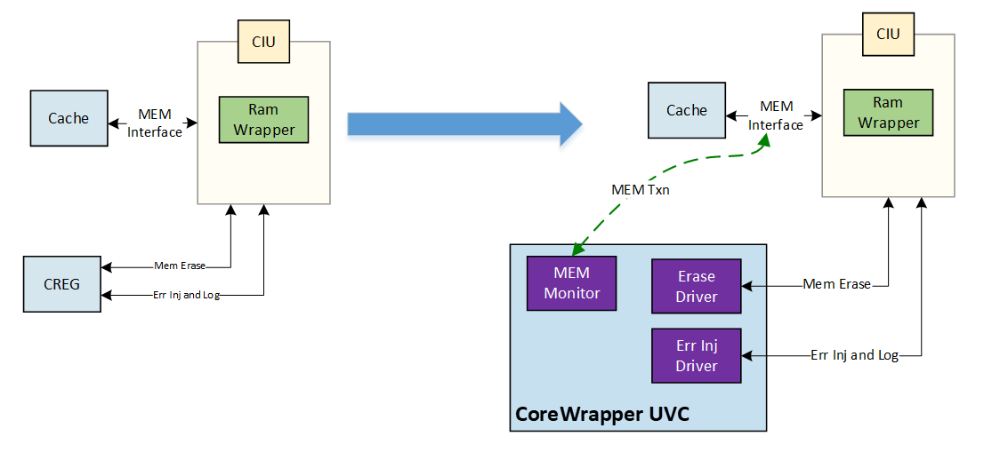
<figcaption><blockquote>

Figure 9. RamWrapper Agent [CoreWrapper Agent]

</blockquote></figcaption>
</figure>

### Mem Agent \[Monitor\]

The Mem Agent’s monitor is instantiated monitoring the transactions at any simulation time on Memory Interface to Cache SRAM.

The observed transaction on Cache SRAM Memory Interface will be broadcasted to SInC scoreboard ready to be checked.

### Mem Erase Agent \[Driver\]

The Mem Erase Agent’s driver and monitor are instantiated and connected to Cache SRAM RamWrapper Erase interface.

The erase start, and erase done event with collected information are broadcasted to SinC scoreboard and TB virtual sequence.

### Mem Error Injection Agent \[Driver\]

The Mem Error Injection Agent’s driver and monitor are instantiated and connected to Cache SRAM RamWrapper Error Inject interface.

The Error Inject interface is used by firmware to inject Memory ECC error from front door, which will never happen in a realistic circumstance except firmware debugging test. At L1, we only test the error injection interface’s behavior making sure that the error injection is done correctly.

SInC scoreboard shall subscribe to the Mem Error Injection monitor to keep track of the corrupted memory lines.

## Sideband Agent (Driver/Monitor) (DV0.5 item)

Sideband interface is a DV controlled miscellaneous ports, connected with SInC DUT. It includes miscellaneous interface signals: error, done, active, clock_override, scan_mode.

It is the DV’s responsibility to:

- Use broadcasted events (done, error) to check the completeness and correctness of a request.

- Control the clock gate override input for power testing with sinc_active_o monitor.

## Virtual sequence-controlled Interface Behavior 

Sideband interface, CPU Memory interface and AXI Subordinate interface can be operated at same time. There should not be any dependency on one on the other. However, to have more realistic and corner cases exercised, a virtual sequence technic will be used to coordinate these interfaces. Below cases are specially taken care of. Note: below are test scenarios the bench is architected to support, it doesn’t mean they are supported by the DUT.

- Contention of Erase interface and CPU Memory Interface:

1.  Erase start and Mem request arrive the same cycle.

2.  Erase start during Mem transaction.

3.  Mem request arrives during Erase process.

- Contention with channels of AXI SUB interface :

> AXI READ and WRITE channel can work simultaneously with concurrent transactions to SInC. SInC uses AXI Sub module to arbitrate the priority of read and write transaction, with one transaction at a time. The lower priority transaction will be held in a register-based pipeline. According to AXI Slave MAS for RTL 0103, “if a read and write transaction arrives at AXI slave on the same cycle on Ax channel, read will take priority”:

1.  AXI read and write requests arrive at SInC at same cycle.

2.  During one AXI request, another request from another channel was issued to SInC concurrently.

3.  If the concurrent transaction depth is bigger than one, Back-to-back non-blocking AXI requests should be tested on the corresponding channels.

- Contention of CPU Memory interface with AXI Sub interface

Supposably SInC can only be able to handle a CPU Memory request or a FW command at a time. Below scenarios have to be tested in this TB to help find corner cases when state machine transitioning:

1.  Mem request arrives at same time as FW command.

2.  Mem request arrives when SInC is busy (set by FW command).

3.  FW command register written (try to write) when mem request is in progress.

- Interface interaction during FW commands

When executing FW commands, requests from each interface and input ports should be actively driven to test the DUT behavior.

- Interface interaction during CMU state transitioning

Ongoing and upcoming requests to SInC when state transitioning is critical test scenario in L1 verification. L3 tests are limited by the core C modeling behavior, thus it is L1’s response to fully test the corner cases during CMU state transitioning. For example,

1.  Ongoing transaction result when receive state change command.

2.  State change command result vs. DUT status (state transition is relying on current CMU state).

3.  DUT system status after state transition. Right after state transition, certain registers and memories should be wiped/reset. It is TB’s response to check the system status with the strategy considering DUT as black box design. (There shouldn’t be any backdoor poking to the design to verify the system status, instead use DV mirrored design status that can reflected by prediction model.)

- Requests/Stimulus to the DUT shall not be relying on the state of CMU

<!-- -->

- As SInC has Disabled/Initialization/Cache-active/Cache-failed states, TB shall not stop generation of certain stimulus at certain states. For example, when in non-initialization state, DV shall keep trying to write command register start “Set to Cache-active” command. Or when in Cache-active state, the MPU program requests can still be sent by MPU driver. It is up to scoreboard’s prediction model to decide what will happen and check the expectation with monitored RTL behavior.

- DV should also abstract error scenarios mentioned in the SInC MAS making sure they are being tested.

## Stimulus Flow 

SInC L1 TB stimulus flow is controlled by the virtual sequence (sinc_v_seq), which has handles to all the input interface drivers’ sequencers. It is a configurable sequence class for the user, that can serve the purpose for each test defined in the test plan, by using different run time options.

Requests into the SInC DUT are based on the constraint random sequence item. The virtual sequence would not only random each interface’s upcoming request, but also random the timing of the requests that can be happen at same time or overlapping on each other.

The virtual sequence can issue requests to SInC DUT in different flavors to have:

- Concurrent requests from all the interfaces except RamWrapper Error Injection interface.

- Overlapping requests from all the interfaces. Extendable transaction (transaction time varied by different dut status) like a CPU MEM request during Cache-Active State, other interface should have overlapping requests given different circumstance of the CPU MEM request. For example, register R/W access should have overlap with CPU MEM request that is MPU access violation, Cache Hit or Cache Miss.

- Enumerate interface interactions in random sequential order in each of the CMU states.

- Exercise FW commands with random constraints register data, at random constraint time. The goal is to make sure any back-to-back scenarios are tested, including back-to-back FW commands, FW command and other requests.

- Focusing on state transitioning, take advantage of functional coverage to make sure different flavor of test scenarios, especially the first request after entering a new CMU state.

- In cache-active mode, fully test cache policy implemented given the subsystem configuration.

- Ability to have random error injection be asserted at each test scenario from transaction level and interfaces level point of views.

The virtual sequence and virtual sequencer are critical TB component to let interactions between requests and system status happen.

For example, given back-to-back CPU MEM requests, virtual sequence can inform second CPU MEM request with previous CPU MEM transaction’s address. Which can help stimulus reach more corner cases.

Given the situation of memory error injection and detection, virtual sequence can control the error injection timing and inform next read operation to check on the bad memory.

### DUT Cache Initialization

For CMU Cache Active Mode verification, SInC TB introduces two ways of initializing the DUT Cache - hands-free mode and random mode. At beginning of the test, the initialization mode is randomized with more weight on doing random mode than hands free mode. However, users of the TB can use the run time option to control which mode you’d like to run the test by “+init_rand_mode”.

#### Hands-Free Mode

For hands free mode, after SInC TB asserts the reset for SInC DUT, no further memory backdoor writes will be performed by TB.

First, before entering Cache Active Mode, the RamWrapper erase agent will drive ERASE signals on RamWrapper erase interface to set all Cache SRAM data with all zeros.

After entering the Cache Active Mode, all the Tag and Replace counter should be in reset value.

The intention of this Hands-Free Mode is to mimic the realistic way the Cache shall work at SOC level. But it will take a lot of time to “warm up” the cache SRAM and Tags in the CIU. All the sets will start with invalid tags, resulting in cache misses for most accesses in the early stage of Cache Active mode. Test will have to extend simulation time to exercise different cache policy.

#### Random Mode

For random mode, after reset is asserted, no erase will be asserted on Cache SRAM. SInC TB will initialize the DUT’s memory (Cache SRAM) and Tags with random data by backdoor writes. Stimulus in Cache-Active mode can be started on pre-randomized cache states.

The whole preload process can happen instantly. It can save simulation time for exercising cache design in SInC.

The preload should make sure:

- Preload Tag should match with SInC cache replacement policy.

- If not all the 4 tags are valid within a 4-way set associated cache lines, FIFO index needs to be matched with preload tag.

<!-- -->

- For example (given FIFO replace policy), if line 1, 2 and 3 are preloaded with valid tags, then the FIFO counter needs to be preloaded with 2’b11 indicating on the next cache miss, the 4th cache line should be replaced with new tag.

<!-- -->

- Preload data for Cache SRAM should match with external virtual memory in address translation unit AXI Sub UVC.

### SInC Mode Test Flow

As the access control of SInC is heavily relying on the CMU state. L1 TB will have different stimulus flows aiming for test scenarios and functional coverages.

Each test need to define the SInC Mode test flow option depending on the test focus. By default, the Mode Test Flow is defined as sequential.

#### Sequential Flow

In Sequential Flow, TB would start with Disable State, then transition into Initialization State -\> Cache-Active State. The Cache-failed state will not be entered at valid operation flow but will randomly enter in Error Injection Flow.

Test will end at either Cache-Active State or Cache-Failed State if error injection causing Cache-Failed State transition happened. The stimulus will not issue SInC re-init FW command to rewind CMU state transition.

As the most basic CMU state transition flow, this flow is used by the base/sanity test to mimic the realistic test scenario at SOC level.

#### Fixed State Flow

In Fixed Sate Flow, TB would start with Disable State, then transition into a desired CMU state define as test run time option. The desired state can be any states within Disable state, Initialization state, Cache-Active state or Cache-failed state. The goal is to

- transition into desired state ASAP,

- do not introduce simulation that will leave the desired CMU state before end of test,

- at end of test, make sure leave the desired state on to next state.

Test will end after check system status when entering new CMU state.

In this test flow, the goal is to focus simulation time on one of the CMU states, try to hit as many corner cases as possible within a state. TB should also use functional coverage to sample the last transaction before leaving desired state to the new state.

#### Random State Flow

In Random Sate Flow, TB would start with Disable State, then transition into a random CMU state; from the new state, then transition into another random CMU state. This process will keep going until end of the test. The iteration number of Random State Flow test is indicating how many states have changed during the test.

At each state, random requests should be sent out before leaving the current state (make sure to have transactions done between state transitions).

The goal of the Random State Flow is to exercise the corner cases that would happen at ongoing/upcoming state transitions. TB should use functional coverage to sample the last transaction before leaving desired state to the new state.

### Valid operation Flow 

A valid operation is a legal and valid request that receives a positive response. At transaction level, the constraints for random objects are based on valid operations by default. A valid operation should not cause any error in the response or in the SInC status (error_cmd, error_fault). Refer to *Section 9, for positive test scenarios* for more details on valid operations.

Note: A legal and valid CPU MEM request needs to consider the current status of SInC module. For example, a legal and valid CPU MEM write at SInC Initialization state can cause violation in SInC Cache-active state.

### Error Injection Flow 

Error injection flow is based on valid operation flow, with modification (error injection) on the legal and valid requests at transaction level.

Error scenarios can be introduced by wrong AXI attributes (like un-recognized AxUSER, unsupported transaction size, unaligned address), CPU MEM read access with MPU violation, write to command register with unexpected data, read to a memory that has pre-installed ECC error, etc. For more details on error scenarios, refer to *Section 9,* for negative test scenarios.

SInC UVM TB is responsible for creating each single error scenario, monitoring RTL behavior and results, then checking them with prediction from behavior model in the scoreboard. This will make sure each error case can cause error.

TB will also randomly introduce more than one error scenario in one transaction. Error is supposed to be reported by the priority on the error case. This will make sure any combination of error cases will still cause expected error. For example, a valid read access to SRAM can be injected with unmapped address, AES DMA-R Dec violation and double bit ECC error in the destination memory. A MPU error will be set in this case instead of double bit ECC error or AES error, due to MPU error asserted before SInC issues read to the memory. It is SInC SB’s responsibility to tell what kind of error is expected and keep track of SInC status mirrored in the SB.

## Cache Storage Directory

Cache storage directory is created for abstraction of SInC design’s cache policy and mirroring of cache states (cache memory and tag).

Cache storage directory includes N (configurable) numbers of cache set state (refer to DV component) within the SInC design, each cache set state is data abstract of the information about the 4 cache line within the set.

Given a 4-way associated cache, below diagram shows the key attributes and connections of the Cache Storage Directory.

<figure>
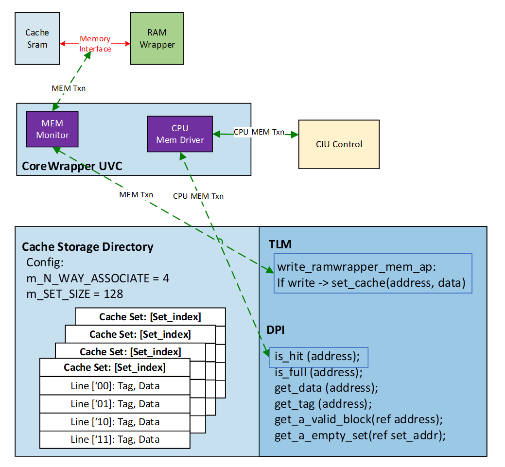
<figcaption><blockquote>

Figure 10. Cache Storage Directory

</blockquote></figcaption>
</figure>

TLM: The TLM subscribed to the RamWrapper MEM Interface monitor. If it’s a write (at CMU cache active state), the set_cache (address, data) shall be called to install a cache line at given cache set at DV mirror.

DPI: The DPIs are used by TB stimulus and scoreboard.

- For stimulus, it is important for virtual sequencer to understand the current cache states in order to issue mem requests that exercise desired hit/miss conditions. Such micro control not only can help improve verification efficiency, but also able to find more corner cases by introducing different back-to-back scenarios.

- For scoreboard, the cache storage directory will be used as mirror of the real cache in the DUT. Once there is a mismatch, either it’s data mismatch, hit/miss mismatch, cache replacement mismatch, scoreboard will fire errors.

In general, It is used by TB’s

- Stimulus

<!-- -->

- Random the initial state of cache SRAM and TAG for Random Initialization Mode.

- Provide API for random sequence item when creating CPU MEM transactions.

<!-- -->

- Scoreboard

<!-- -->

- Provide API for cache policy check with current request and cache state, as prediction of CPU MEM transaction’s result.

- Accessed by SB for DUT status check when entering new CMU state and EOT.

The cache storage directory is generic enough to maintain itself by observing cache related TLMs. The TLMs includes CPU Memory Monitor, Mem Agent Monitor, and SInC ENV broadcasted events for CMU state change.

## Scoreboard 

SInC scoreboard (SB) serves the major role of checking SInC IP’s behavior. The other DV components that have checker is the SInC virtual interface, where assertions exist (refer to *Section TBD Assertions*). The test sequences/stimulus only have limited role in checking, for example status register pull sequence needs to implement timeout check to prevent simulation deadlock.

The methodology mindset for SInC SB is treating the DUT as a black box, except for backdoor preloading and error injection. Once the test configuration is done, the predication model is working based only on the inputs to the DUT.

SInC SB is a transaction-based checker. Each request that the DUT takes, and DUT IP’s outputs, will be monitored and abstracted into transactions. This means SInC SB is a no time consuming, no RTL poking checker.

The SInC scoreboard performs the checks on:

- Legal/Illegal CPU MEM transactions.

- Legal/Illegal MPU transactions.

- Legal/Illegal AXI transactions.

- Valid/Invalid register access.

- FW operations.

- Erase process.

- Memory error injection operation.

- Order and arbitration of requests. \[DV.5\]

- SInC sideband events for done/active/error. \[DV.5\]

- Register updates.

- Cold Reset.

- System Performance evaluation

- Clock gating

### Scoreboard – Transaction & Event based checker

Interactions with SInC DUT will be monitored by the monitors on the interfaces (CPU MEM Interface, AXI Mgr interface, AXI Sub interface, Sideband, MEM interface, MEM Erase interface, Ram Wrapper Error Inject interface) and broadcasted to the SInC SB. At the transaction level, the information we tracked for each interface is:

General information:

- System status when request accepted by SinC: status register, memory mirror, contention ports activity, busy, CMU state

MPU Interface:

- Monitor the MPU read and write access with its result.

- Monitor the memory access violation event.

CPU MEM Interface:

- Monitor the memory read and write access.

AXI Interface (Mgr and Sub):

- Address phase AXI item (axi_req_item). Including AXI request attributes, time of request accepted by the DUT.

- Response phase AXI item (axi_resp_item). Including AXI response, read data, write data, time of the response valid set by the DUT.

Sideband Interface:

- Command done (done) timing.

- Error interrupt (error) timing.

Cache SRAM Memory interface:

- Memory read, with address, read data, read valid and time.

- Memory write, with address, write data and time.

Cache SRAM Memory Erase Interface:

- Erase start time.

- Memory writes operations with data.

- Erase done time.

RAM Wrapper Error injection interface:

- RAM Wrapper error injection Enable, with details on inject_addr, inject_mask, and time.

- RAM Wrapper error injection done time.

- RAM Wrapper error log changed status.

RAL (UVM Register Abstraction Layer) callbacks:

- SInC Register changes

#### Packet Scoreboard Item

SInC SB collects and packs the information from the above interface monitors into an abstracted class called sinc_sb_item, which has the key components below and ready to check:

- Command Start information (MPU r/w, CPU Memory r/w, Address phase AXI items, Erase start, Error injection start, Data phase AXI SUB write to command register that trigger FW operations).

- System status when command starts. The status includes a snapshot of copy for SInC Register, Memory (Cache SRAM, AXI Sub virtual memory), and peripheral input and output status (et: reset status, error/done/active).

- Expected consequence/result by behavior model. It can be any system status when the command is finished, like changes to memories/register/miscellaneous output.

- Command finish information (Response phase AXI items, Erase end, Error injection end, Ram Wrapper Memory interface r/w transactions, done interrupt for FW operations).

- Monitored system status when command finished. After the command is finished, the result of the command should be reflected on the SInC register change (by register call back), Cache SRAM Memory update, error logging (error register/interrupt events).

Each request will result in a sinc_sb_item instance, it will be piped into a queue (sinc_sb_item_q) in the SB ready to be checked. It is SInC SB’s responsibility to a) keep a mirrored system status, b) construct a behavior model based on the SInC MAS) then use them to predict the result of a request transaction and d) compare the prediction with the actual result monitored/backdoor accessed information of the DUT.

The packed scoreboard item can be used as:

1.  Verifying the integrity of a request for its life cycles.

> Given a packed scoreboard item, the expectation of following transactions and result is set. Error will be reported if any of the transaction is missing, even if the result is matched.

2.  Verifying the sequence of events.

> With more information like time and unexpected events, the completion order can be tracked easier.

3.  Understanding and reviewing behavior models better.

> The check flow can be reviewed easily by packed item, all the predictions and results are put at the same object ready to be checked.

4.  Information reports can be done for all the live cycles of a transaction for easier debug process.

> When an error is reported, the whole packed scoreboard item will also be reported. Users/debuggers can allocate the issue by looking into the request’s packed item easily.

#### Packet Scoreboard Item for CPU MEM request

The scoreboard item is created when a request is received/monitored by the SInC scoreboard. At creation of the scoreboard item, the “entry” of the scoreboard item needs to be set.

The “entries” can be any group of activities that is abstracted, these activities are related to each other.

The “entries” are:

- MPU Request. Including:

<!-- -->

- MPU request’s response,

- DV mirror updates when this item is done.

<!-- -->

- CPU MEM Request. Including:

<!-- -->

- R/W, data attributes,

- If hit, RamWrapper reads,

- If miss, AXI reads to address translation unit, RamWrapper reads.

AXI MGR Requests are separated into different sub entries by different destinations

- Non CMD Register Request. Including:

<!-- -->

- Register updates in RTL,

- DV mirror updates when write done.

<!-- -->

- CMU Command Register Request. Including:

<!-- -->

- Predicted status on next read on status,

- CMU state transition when write is done.

<!-- -->

- AES Command Register Request. Including:

<!-- -->

- Snapshot of configuration AES registers,

- AXI activities,

- Predicted status on next read on status.

#### Packet Scoreboard Item for CPU MEM request \[Example\]

The figure below shows how a *<u>valid CPU MEM Read</u>* request’s live cycle translated into sinc_sb_item.

<figure>
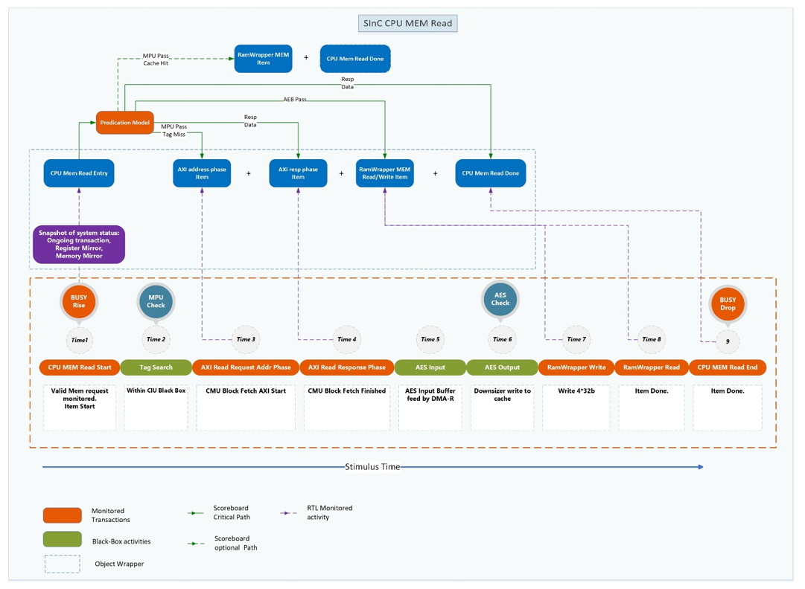
<figcaption>
Figure 11 Valid CPU mem read miss to sinc_sb_item
</figcaption>
</figure>

#### Self-correction of Packet Scoreboard Item 

NOTE: Below example has not been mentioned at MAS yet. Need to confirm.

After an CPU MEM request is issued to SInC, an CPU MEM request’s sinc_sb_item is created with expected behaviors. During the MEM request, if an Erase was asserted. The MEM request will be abandoned, all the transactions received will be ignored, and any un-received transactions are expected to not be monitored.

Figure below shows how MEM read request with cache miss, transferred into a sinc_sb_item, then self-correct its expectation on unexpected system inputs.

<figure>
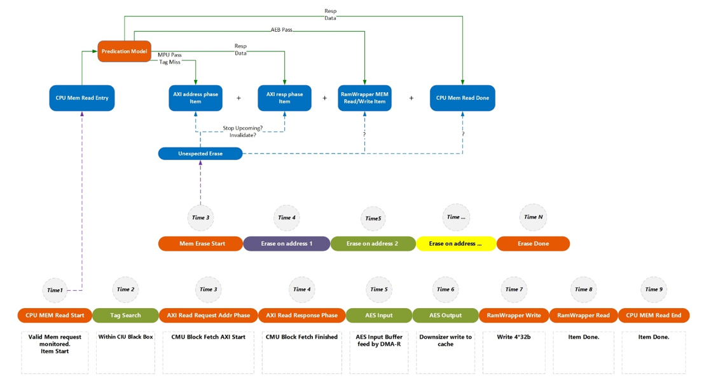
<figcaption>
Figure 12 Self-correction of sinc_sb_item Usage of Packeted Scoreboard Item
</figcaption>
</figure>

### Scoreboard – Check flow high level view

As described in the previous section, SInC SB will perform checks at:

- Beginning of the request, for correctness check

- End of the request, for a request’s live time, by all the transactions collected

- The end of simulation.

#### For Reset/Erase

- After reset asserted, all registers should be set to their reset value.

- From Erase start to Erase done, Ram Wrapper activities will be collected and checked when Erase is done.

- After Erase done. SInC SB will perform backdoor check on cache memory. Error will be reported if there is any memory address that has non-zero data.

#### For an AXI MGR request

- AXI address phase will be used for setting up predictions.

- All activities from other interface will be collected from address phase to response phase of the AXI request.

- Further checks will be performed on AXI response phase. For AXI read, read data and response type are checked. For AXI write, prediction will be further updated by write strobes and data. Its write response is then checked.

- RAL call backs will be used to check on SInC register updates.

#### For FW operations

> FW operations are triggered by setting up CMU CMD Register and AES Test Control Register. Write to command registers need to be verified by the scoreboard to predict whether the write is valid. At the address of the AXI write to command register, a snapshot of current system status is logged for prediction of result of the FW operation.
>
> TBD: Not all the firmware operations are defined yet, keep filling this section when new operation defined.

##### Set to Initialization state \[DV 0.5 item\]

#### For Register

SInC registers can be changed by reset, AXI read and write, and SInC internal logics. Thus, the registers can be changed multiple times during a single transaction. The check flow for registers can be varied depending on the transactions. The TB will not only issue front door reads, but also use backdoor monitoring mechanism for micro behaviors under transaction level.

- Status updates will be checked by RAL model backdoor peek function.

- Intercept status register reads will be issued randomly by the AXI sequence.

Stimulus sequence will keep monitoring the sideband ports, a status register read will be issued (with randomized chance) when a command is done.

- RAL callbacks with predictions will be collected for all the register fields.

### Scoreboard - Signature based report mechanism

In order to deliver the best usage of the SInC L1 TB, SInC SB will report error based on the signature elaborated in *Section 8 Test Scenarios*. Each signature will be labeled with keywords. Audience of this verification plan can search for the \[keyword\] in this documentation to find details on the stimulus for occurred error reported by the SInC scoreboard.

## Assertions

DV 0.8 item.

Assertions should be added for:

- Gated clock propagation

- Performance requirment

## Clock & Reset 

### Clock

SInC DUT clock is provided by Clock Agent (UVC). The clock Agent’s configuration is responsible for controlling frequency for the DUT at given range, default frequency is 1.2Ghz according to KMP AS.

Clock gating override side band signal is supported.

### Reset

Reset can be randomly asserted during tests. Once a reset is performed, the stimulus below and checks will be triggered:

1.  Any finished requests before reset should be checked by the scoreboard.

2.  Any ongoing requests during reset will be abandoned.

3.  Scoreboard queues are deleted.

4.  The register mirror is reset to default value.

5.  Backdoor read registers to make sure they are set to default value.

6.  Any transactions after reset will be monitored and checked.

# Test Scenarios

This section will elaborate all the test cases and error reporting mechanisms correspondingly by providing signature names.

The positive test case means, the stimulus under the given constraint should not cause error, but under the condition that there are no other negative cases asserted at same time that can affect the request result.

The negative test case means, the stimulus under the given constraint will always cause one of the errors to be asserted. The result should not be affected by how many other negative cases are asserted at the same time.

For any stimulus, it is DV’s duty to exercise the stimulus by randomization on all different aspects given a test case. For example (8.3.6.2.1.1.1), when a positive test scenario say, “Program block_encr_add

r with correct value before Encrypt block”. It means the 32 bits of block_encr_addr register should be programed with any value that will not trigger error handling.

When a positive test case happens, but SInC SB observes unexpected error response, a UVM_ERROR will be reported with details on the corresponding sinc_sb_packed_item. (with its start time, request’s command type and attributes, expected result. )

When a negative test case happens, SInC SB observes there is no error asserted, a UVM_ERROR will be reported with an error signature expected according to the test case. Users of SInC TB can search for the keyword in the error message in this verification plan to find the test case.

When a request is finished, but SInC SB collects more or less transactions than expected during the live time of this request, a UVM_ERROR will be reported for unexpected transactions. With details of the diffs on the expectation vs. actual monitored transactions.

## Test Scenarios by CMU States

In SInC DUT verification, the stimulus and expectation model of the TB is relying on the current CMU state. Given the same stimulus, it can be positive test case in one of the CMU states but negative test case in other CMU states. The TB owner should use the rest of sections as reference to construct the stimulus constraint and scoreboard’s prediction model.

Each test scenario is relying on the \[[SInC_0100_MAS_WIP.docx]\] descriptions.

## Fundamental checks aside from Expectation

All the interfaces activity need to be monitored, for example:

- RamWrapper MEM interface activity match expectation (transaction if disallowed transaction by MPU)

- Outbound/inbound AXI activities

- Interrupts, sidebands

- …

Refer to 7.9.1 [Scoreboard – Transaction & Event based checker](#scoreboard-transaction-event-based-checker), any transactions or events shall be monitored and send to scoreboard to check. There are two types of interactions to DUT from DV perspective, interactions that can initiate hardware behavior or part of hardware behavior.

If the transaction or event will initiate hardware behavior, then a scoreboard entrance object is created with sinc_sb_pkt_item class. Which includes the initiating transaction, snapshot of current DUT status, most important : the expectation of RTL behavior at transaction & event level. The scoreboard entry also keeps track of expected RTL behavior as seen, when the actual RTL behavior match with expectation, the scoreboard entry will stop expecting corresponding RTL behavior. For example, for CPU MEM Read request result in a cache miss, the scoreboard entry is expecting ~~256b~~ 512b encrypted data and 128b tag (the size depends on block size parameter) of data fetch from address translation unit. When expected data has been monitored, the scoreboard entry will stop expecting data fetch from address translation unit. If hardware keep fetching after all expected be received (no new CPU MEM request), scoreboard will report signature “could not find scoreboard entry for HW AXI read transaction”.

If the transaction or event is part of RTL behavior at transaction level & event level mentioned above, they will be monitored and send to scoreboard. Scoreboard must find and match its scoreboard entry which was created earlier. It will be reporting error if scoreboard couldn’t find a match. If a match is found, then scoreboard will compare this transaction or event with the expectation set earlier when creating the scoreboard entry. An error will be reported if the actual (monitored) behavior does not match with expectation.

Additionally, a scoreboard entry object will be retired after receiving all its expectation. If one or more expected RTL behavior has not been seen for a scoreboard entry, the scoreboard will find a good fit of timing to report error for such scenario. For example, a CPU Read MEM request’s scoreboard’s entry has not seen enough number of MEM interface transactions, by the time CPU MEM response data, the scoreboard will report error with signature that not seeing enough MEM activities.

## Introducing CMU Busy

MAS: “When processing certain commands (FW or HW), CMU asserts cmu_busy to let CIU indicate the busy back to CPU (using sinc_cpu_busy_o) to stall any new requests until cmu_busy is lowered. These commands are Set to cache-active, SInC reset, SInC re-init, fetch block, disable reset, and disable re-init.”

## Disable State

Refer to MAS 10.1.2.1.1 : “

CMU (and SInC) comes out of reset in disabled state. In this state, CMU is inactive, meaning the cache mechanism is inactive, the cache SRAM is directly accessible by security processor and acts as an extension to local IRAM, and it is mapped to the lowest address region of the external memory space. The rest of the external memory space is inaccessible. In this state, there is no concept of cache hit or miss and CIU completely controls the accesses to cache IRAM using MPU.

Additionally, FW can also use AES in test mode and execute known test vectors only in this state.

CMU is idle in this state until it receives any FW command. Commands supported in this state are as follows.

1.  Set to Initialization state.

2.  Run AES in test mode.

<u>NOTE</u>: The first time a command (from above list) is executed out of reset, Enc wrapper will read the RNG to seed the trivium in AES before executing any other operation. This is only done once and once trivium is seeded, it doesn’t need to be re-seeded until the next reset. If there is an error while fetching the seed, SInC goes to cache-failed state and cmd_status is updated by flagging as rng_error.

“

### Checks When Transition into the State

Below checks will be performed when SInC ‘out of reset’ entering CMU Disabled State.

<table>
<colgroup>
<col style="width: 34%" />
<col style="width: 21%" />
<col style="width: 44%" />
</colgroup>
<thead>
<tr>
<th style="text-align: center;"><strong>Stimulus</strong></th>
<th style="text-align: center;"><strong>Expectation</strong></th>
<th style="text-align: center;"><strong>Signature</strong></th>
</tr>
</thead>
<tbody>
<tr>
<td><blockquote>

SInC Status read

</blockquote></td>
<td>state should be 0 – “Disabled”</td>
<td>Status read mismatch expectation, exp state [Disable State], act [*]</td>
</tr>
<tr>
<td><blockquote>

Backdoor/Front door read registers

</blockquote></td>
<td>Register should be reset value defined in CSR</td>
<td>Register read not match with expectation</td>
</tr>
<tr>
<td>Cache SRAM erase started by HW from security subsystem INIT</td>
<td>Cache SRAM be erased to <del>‘h0</del> Randomized data from RNG</td>
<td>SRAM value does not match with expectation</td>
</tr>
<tr>
<td>Erase should also erase VTAG</td>
<td>
<del>Randomized</del> <del>data from RNG</del>

Erase to 0
</td>
<td></td>
</tr>
<tr>
<td>MPU configuration/access permission register read</td>
<td>should match with reset value of MPU SPEC</td>
<td>
MPU [*] not match with expectation after reset …

Note: MPU should be reset by SInC top reset.
</td>
</tr>
</tbody>
</table>

### MPU R/W Access

MPU ports are driven by CR from security subsystem. During Disable State, MPU is used to control access to SInC Cache SRAM.

Default value out of reset for the attribute for all pages is to allow read, write, executable and not locked.

Each MPU is allocated 8kB of register address space. The first half of each location address space is intended for control and status registers. The second half is for memory attributes. The MPU local address map is shown below:

| Offset | Title                         |
|--------|-------------------------------|
| 0x0    | First access violation status |
| 0x4-   | Reserved                      |
| 0x1000 | MPU attributes                |

#### Positive test cases

**MPU can be programmed at Disable State, Initialization State.**

The MPU divides the memory it is protected into fixed sized 4KB pages. For each page, there are at least two set of permission attributes. A set of attribute consists of the following bits:

- \[0\]: R -- 0 = read are not allowed, 1 = read allowed

- \[1\]: W -- 0 = write are not allowed, 1 = write allowed

- \[2\]: X -- 0 = execute are not allowed, 1 = execute allowed

- \[3\]: L -- 0 = permissions can be changed, 1 = lock permission attributes such that attributes can be changed only after the security subsystem is reset.

For subsystem with 256 KB IRAM SInC design, MPU stimulus needs to be configured to program each 4K page.

For subsystem with 8 MB external memory, MPU stimulus needs to be configured to program each 4K page.

Below MPU access with offset 0x1000 to MPU attributes.

<table>
<colgroup>
<col style="width: 35%" />
<col style="width: 27%" />
<col style="width: 36%" />
</colgroup>
<thead>
<tr>
<th style="text-align: center;"><strong>Stimulus</strong></th>
<th style="text-align: center;"><strong>Expectation</strong></th>
<th style="text-align: center;"><strong>Signature</strong></th>
</tr>
</thead>
<tbody>
<tr>
<td>
Read/Write MPU attributes

<ul>
<li>
address 0x1000 – 0x7FC for user attributes
</li>
<li>
address 0x1800 – 0x1FFC for privilege attributes
</li>
<li>
address 0x2000 – 0x27FC for crypto attributes
</li>
</ul></td>
<td><ul>
<li>
read/write success
</li>
<li>
(mpu_reg_resp_o == 0)
</li>
<li>
RD data match shadow register
</li>
</ul></td>
<td>Expect MPU Access [Read] success, but …</td>
</tr>
<tr>
<td>
Write MPU Registers

<ul>
<li>
address 0x0
</li>
<li>
wdata[31] == 1
</li>
</ul></td>
<td><ul>
<li>
write success
</li>
<li>
write to clear the status register
</li>
</ul></td>
<td>Expect MPU Access [Write] success, but …</td>
</tr>
</tbody>
</table>

Below MPU access with offset 0x0 to MPU ‘First access violation status’ register.

<table>
<colgroup>
<col style="width: 35%" />
<col style="width: 27%" />
<col style="width: 36%" />
</colgroup>
<thead>
<tr>
<th style="text-align: center;"><strong>Stimulus</strong></th>
<th style="text-align: center;"><strong>Expectation</strong></th>
<th style="text-align: center;"><strong>Signature</strong></th>
</tr>
</thead>
<tbody>
<tr>
<td>Read MPU status Registers</td>
<td><ul>
<li>
read success
</li>
<li>
mpu_reg_resp_o == 0)
</li>
<li>
RD data match violation
</li>
</ul></td>
<td>Expect MPU Access [Read] success, but …</td>
</tr>
</tbody>
</table>

#### Negative test cases

Below MPU access with offset 0x1000 to MPU attributes.

<table>
<colgroup>
<col style="width: 35%" />
<col style="width: 27%" />
<col style="width: 36%" />
</colgroup>
<thead>
<tr>
<th style="text-align: center;"><strong>Stimulus</strong></th>
<th style="text-align: center;"><strong>Expectation</strong></th>
<th style="text-align: center;"><strong>Signature</strong></th>
</tr>
</thead>
<tbody>
<tr>
<td>
Read/Write MPU Registers to reserved region

<ul>
<li>
address to reserved region (addr &gt; 0, addr &lt; 0x1000)
</li>
<li>
Access to Crypto attribute region (confirmed existed, so this is not reserved region.)
</li>
</ul></td>
<td><ul>
<li>
read/write fail
</li>
<li>
(mpu_reg_resp_o == 2)
</li>
</ul></td>
<td>Expect MPU Access [Read] fail, but …</td>
</tr>
</tbody>
</table>

### CPU MEM R/W Access

Refer to MAS “In this state, there is no concept of cache hit or miss and CIU completely controls the accesses to cache IRAM using MPU.”. The whole external instruction memory space is within the CPU MEM R/W access range.

“In this state, CIU is looking for incoming requests from CPU. On a new request, it checks if the request is allowed by MPU and simultaneously sends the request to cache SRAM. Read data is sent back to CPU only if there is no uncorrectable error or MPU violation. For the write request, the write is only committed after MPU allows it. Tag search is not performed, and cache replacement policy control block is also inactive in this state.”

CPU MEM access is relying on the MPU access control.

Note: CPU MEM access can happen at same time of MPU access, refer to concurrent test scenario section for details.

Note: The CPU MEM interface represents security processor Wrapper, which should always send valid request not violating the bus protocols.

Address Map refers to:

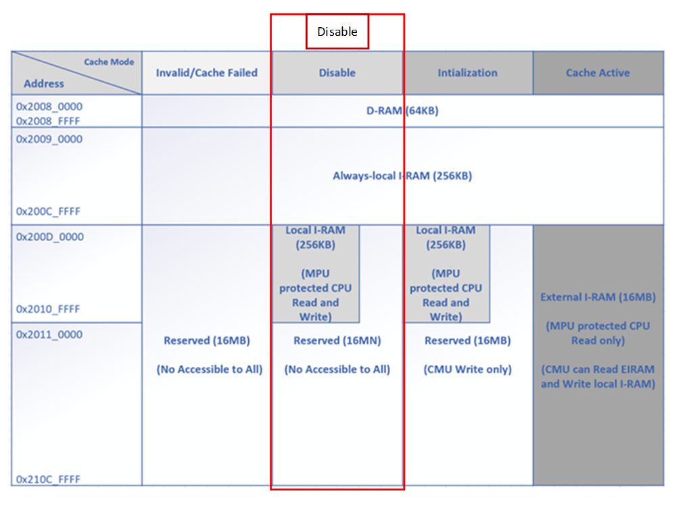

#### Positive test cases

In this state, cache SRAM acts as just another local IRAM, meaning caching mechanism is disabled. The cache sits at the lowest address region of the entire external cache memory space. MPU is active and implements access restrictions for typical IRAM. FW can choose to change these permissions if needed.

In this state, CIU is looking for incoming requests from CPU. On a new request, it checks if the request is allowed by MPU and simultaneously sends the request to cache SRAM. Read data is sent back to CPU only if there is no uncorrectable error or MPU violation. For the write request, the write is only committed after MPU allows it. Tag search is not performed, and cache replacement policy control block is also inactive in this state.

In case of Cache Disabled, filling the memory entirely will walk 16 bytes across the banks from bank 00 to bank 11 (i.e., filling each 4-bytes from 0x0, 0x4, 0x8 to 0xC at address 0x0 for first 128-bit, refer to Figure below) for cache configuration of 256KB (64K 32-bit words that need 16-bit address to access each word) cache memory, 512B block size (128 32-bit words) with 512KB external memory. For 256KB cache, it consist of four 64KB in form of 4Kx16B configuration (access via address\[15:2\] from 0x0000 to 0x0FFF, 0x1000 to 0x1FFF, 0x2000 to 0x2FFF and 0x3000 to 0x3FFF). The final 4 bytes are chosen by address \[1:0\].

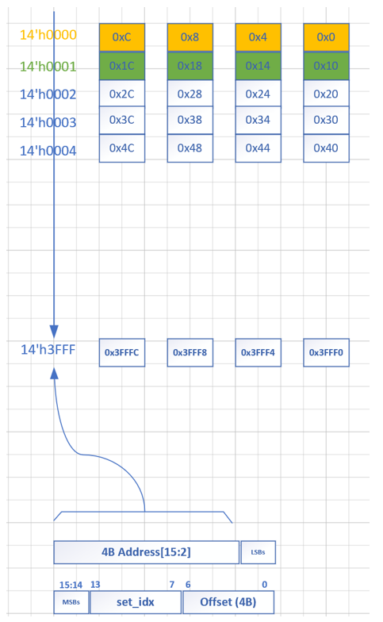

<table>
<colgroup>
<col style="width: 34%" />
<col style="width: 40%" />
<col style="width: 25%" />
</colgroup>
<thead>
<tr>
<th style="text-align: center;"><strong>Stimulus</strong></th>
<th style="text-align: center;"><strong>Expectation</strong></th>
<th style="text-align: center;"><strong>Signature</strong></th>
</tr>
</thead>
<tbody>
<tr>
<td>
Read to local I-RAM address allowed by MPU.

<ul>
<li>
Lower address
</li>
</ul>

0x0000_0000

<ul>
<li>
Upper address
</li>
</ul>

0x0000_FFFF

<ul>
<li>
Privmode
</li>
<li>
loadstore
</li>
</ul></td>
<td>
Read success.

Data width 128

Data match with DV mirror.

<ul>
<li>
RamWrapper MEM interface activity match expectation (number of transactions, considering the ECC error scenarios)
</li>
</ul></td>
<td>Expect CPU Access [write] success, but …</td>
</tr>
<tr>
<td>
Write to local I-RAM address allowed by MPU.

<ul>
<li>
Lower address
</li>
</ul>

0x0000_0000

<ul>
<li>
Upper address
</li>
<li>
0x0003_FFFF
</li>
<li>
privmode
</li>
<li>
loadstore
</li>
</ul></td>
<td>
Write success.

Backdoor read after write finish to confirm.

<ul>
<li>
RamWrapper MEM interface activity match expectation (number of transactions)
</li>
</ul></td>
<td>Expect CPU Access [read] success, but …</td>
</tr>
</tbody>
</table>

#### Negative test cases

Note: Interface violation is not considered.

<table>
<colgroup>
<col style="width: 34%" />
<col style="width: 37%" />
<col style="width: 27%" />
</colgroup>
<thead>
<tr>
<th style="text-align: center;"><strong>Stimulus</strong></th>
<th style="text-align: center;"><strong>Expectation</strong></th>
<th style="text-align: center;"><strong>Signature</strong></th>
</tr>
</thead>
<tbody>
<tr>
<td>Read to local I-RAM address not allowed by MPU.</td>
<td><ol type="1">
<li>
Read fail.
</li>
</ol>

( Sinc_mem_err_accvio_o asserted)

<ol start="2" type="1">
<li>
won’t return read data valid but a CPU read data filled with ‘deadbeef’.
</li>
</ol></td>
<td>Expect CPU Access [read] fail in [state], [MPU: disallow], but …</td>
</tr>
<tr>
<td>Write to local I-RAM address not allowed by MPU.</td>
<td><ol type="1">
<li>
Write fail.
</li>
</ol>

( Sinc_mem_err_accvio_o asserted)

<ol start="2" type="1">
<li>
won’t perform write.
</li>
<li>
Backdoor check to confirm
</li>
</ol></td>
<td>Expect CPU Access [read] fail in [state], [MPU: disallow], but …</td>
</tr>
<tr>
<td>
<del>Read to External address, disallow by MPU.</del>

<ul>
<li>
<del>Lower address</del>
</li>
</ul>

<del>0x2011_0000 parameter me</del>

<ul>
<li>
<del>Upper address</del>
</li>
</ul>

<del>0x210C_FFFF</del>

<ul>
<li>
This is not test case anymore
</li>
</ul></td>
<td><ol type="1">
<li>
Read fail.
</li>
<li>
Check by internal range check instead of MPU
</li>
<li>
Fixme-MPU violation ?
</li>
</ol></td>
<td>Expect CPU Access [read] fail in [state], [MPU: disallow], [internal range check: disallow], but …</td>
</tr>
<tr>
<td>
<del>Read to External address, allowed by MPU.</del>

<ul>
<li>
<del>Lower address</del>
</li>
</ul>

<del>0x2011_0000</del>

<ul>
<li>
<del>Upper address</del>
</li>
</ul>

<del>0x210C_FFFF</del>
</td>
<td><ol type="1">
<li>
Read fail.
</li>
<li>
Check by internal range check instead of MPU
</li>
</ol></td>
<td>Expect CPU Access [read] fail in [state], [MPU: allow], [internal range check: disallow], but …</td>
</tr>
<tr>
<td>
<del>Write to External address, disallow by MPU.</del>

<ul>
<li>
<del>Lower address</del>
</li>
</ul>

<del>0x2011_0000</del>

<ul>
<li>
<del>Upper address</del>
</li>
<li>
<del>0x210C_FFFF</del>
</li>
</ul></td>
<td><ol type="1">
<li>
Write fail.
</li>
<li>
Check by internal range check instead of MPU
</li>
</ol></td>
<td>Expect CPU Access [read] fail in [state], [MPU: disallow], [internal range check: disallow], but …</td>
</tr>
<tr>
<td>
<del>Write to External address, allow by MPU.</del>

<ul>
<li>
<del>Lower address</del>
</li>
</ul>

<del>0x2011_0000</del>

<ul>
<li>
<del>Upper address</del>
</li>
<li>
<del>0x210C_FFFF</del>
</li>
</ul></td>
<td><ol type="1">
<li>
Write fail.
</li>
<li>
Check by internal range check instead of MPU
</li>
</ol></td>
<td>Expect CPU Access [read] fail in [state], [MPU: allow], [internal range check: disallow], but …</td>
</tr>
<tr>
<td>
<del>R/W to reserved address space</del>

<ul>
<li>
<del>Address lower than</del>
</li>
</ul>

<del>0x200D_0000</del>

<ul>
<li>
<del>Address higher than</del>
</li>
</ul>

<del>0x210C_FFFF</del>
</td>
<td><ol type="1">
<li>
Transaction fail.
</li>
<li>
sinc_mem_err_accvio_o be asserted on MPU interface
</li>
</ol></td>
<td></td>
</tr>
<tr>
<td>
Read to local I-RAM address allowed by MPU

<ul>
<li>
with correctable ECC error
</li>
</ul></td>
<td>
Read success.

Data match with DV mirror.

Any single bit ECC error should be reported? YES. Error inj &amp; log interface.
</td>
<td></td>
</tr>
<tr>
<td>
Read to local I-RAM address allowed by MPU

<ul>
<li>
with uncorrectable ECC error
</li>
</ul></td>
<td>
Read fail.

<ol type="1">
<li>
Use ECC error injection mem interface to corrupt cache mem.
</li>
<li>
CPU MEM R access to corrupted mem location.
</li>
<li>
Detect of uncorrectable ECC error.
</li>
<li>
CPU MEM R read data respond with ‘hdead_beaf.
</li>
<li>
Severe Error logged: HW fault in SInC
</li>
<li>
sinc_err_uncorr_o be asserted.
</li>
</ol></td>
<td></td>
</tr>
<tr>
<td>
R/W access while CMU busy

<del>DV: need to track down the RTL change on this.</del>
</td>
<td><ol type="1">
<li>
Pick one of the behaviors below that can make CMU busy
</li>
</ol>
<ul>
<li>
Write to SInC register
</li>
<li>
<del>Read to SInC register (Won’t)</del>
</li>
<li>
set_init_state/ sinc_reset/sinc_reinit cmd
</li>
<li>
test_en is 1 (YES)
</li>
<li>
AES test mode cmd (TBD)
</li>
</ul>
<ol start="2" type="1">
<li>
Issue CPU R/W request
</li>
<li>
R, response CPU read error to CPU instead of read data valid and data ‘hdead_beaf
</li>
<li>
W, write will not change memory
</li>
<li>
Once CMU is busy, the CPU request is stalled by “busy” indicated by SINC. It is CPU_MEM UVC’s job to not send request when “busy” is being asserted.
</li>
</ol></td>
<td></td>
</tr>
<tr>
<td>R/W access while Erase is busy</td>
<td><ol type="1">
<li>
Reported to top of SINC with Sinc_err_erase_busy_o
</li>
<li>
If CPU read, return ‘deadbeef’ on read data.
</li>
<li>
<del>report to</del> <del>CMU through ciu_erase_busy_err if this is happening in the phase of Data Fetch.</del>
</li>
<li>
In Cache Disable state, will Erase busy error be logged? If yes, then above description is not accurate.
</li>
<li>
Fixme:Double check if this is still the case
</li>
<li>
Even if it does exist for CMU use, there won’t be logged error
</li>
</ol></td>
<td></td>
</tr>
<tr>
<td>Erase while R/W access in progress</td>
<td><ol type="1">
<li>
Reported to top of SINC with Sinc_err_erase_busy_o
</li>
<li>
If CPU read, return ‘deadbeef’ on read data.
</li>
<li>
report to CMU through ciu_erase_busy_err if this is happening in the phase of Data Fetch. (doubtable)
</li>
<li>
Erase busy before read response, then read error
</li>
</ol></td>
<td></td>
</tr>
</tbody>
</table>

### RamWrapper Operations

Refer to MAS diagram about Cache SRAM RamWrapper. This section describes the test scenario on the Cache SRAM RamWrapper only.

The Erase and Error Injection operations are controlled by Firmware through CR module. SInC will not arbitrate either Erase or Error Injection operation. Firmware needs to

- Perform erase when there is no CPU requests pending. Erase should be started when there is no memory access otherwise the erase request will be dropped.

- Perform error injection when SINC is not active. It is FW’s response to only do error injection when there is no other transactions to SInC.

#### Positive test cases

<table>
<colgroup>
<col style="width: 34%" />
<col style="width: 42%" />
<col style="width: 23%" />
</colgroup>
<thead>
<tr>
<th style="text-align: center;"><strong>Stimulus</strong></th>
<th style="text-align: center;"><strong>Expectation</strong></th>
<th style="text-align: center;"><strong>Signature</strong></th>
</tr>
</thead>
<tbody>
<tr>
<td>Erase</td>
<td>
Cache IRAM will be erased with “random wdata”

<ul>
<li>
The random wdata is driven by RNG. At L1, the wdata can be of any value. Erase Engine Agent’s configuration should be set to random value for erase write data.
</li>
</ul></td>
<td>IRAM data not erased with random value</td>
</tr>
<tr>
<td>Error Inject</td>
<td>Correctable/Uncorrectable error injected to IRAM through Error Injection Interface</td>
<td>N/A, as there is no check on whether error be injected until a mem access is sent.</td>
</tr>
</tbody>
</table>

#### Negative test cases

<table>
<colgroup>
<col style="width: 34%" />
<col style="width: 31%" />
<col style="width: 33%" />
</colgroup>
<thead>
<tr>
<th style="text-align: center;"><strong>Stimulus</strong></th>
<th style="text-align: center;"><strong>Expectation</strong></th>
<th style="text-align: center;"><strong>Signature</strong></th>
</tr>
</thead>
<tbody>
<tr>
<td>
Erase &amp; CPU MEM req at same time

DV note: If happen at same time. Either erase or the CPU req need to be intercepted.
</td>
<td><ol type="1">
<li>
CPU MEM request will be dropped, with error
</li>
<li>
sinc_err_erase_busy_o be asserted
</li>
<li>
Erase should not be affected
</li>
</ol></td>
<td></td>
</tr>
<tr>
<td>CPU MEM req during Erase</td>
<td><ol type="1">
<li>
CPU MEM request will be dropped, with error
</li>
<li>
mem_err_erase_busy be asserted
</li>
<li>
Erase should not be affected
</li>
</ol></td>
<td>Expect MEM request error during erase operation, actual …</td>
</tr>
<tr>
<td>Erase req during CPU MEM operation</td>
<td><ol type="1">
<li>
CPU MEM request will fail, if read return ‘deadbeaf.
</li>
</ol></td>
<td>Expect Erase request fail during MEM operation, actual …</td>
</tr>
</tbody>
</table>

### AES Engine test scenarios

This section elaborates all the possible test scenarios interact with AES Engine in SInC DUT.

- AES Register access

<!-- -->

- Legal/illegal access to Programable registers

- Legal/illegal access to RO registers

- Legal/illegal AES test control register set up

<!-- -->

- AES Tests

<!-- -->

- Under legal AES test control register set up

- Various AES register set up

- Test result prediction

- ENC/DEC process

- FW can run KAT in this state using AES test mode. AES test mode can only be enabled in cache disable state.

The stimulus (from SInC ports’ view) are identical in each CMU state, only the expectations are different.

Each expectation is also elaborated from SInC and AES Engine point of views, as the expectations will be used as prediction model inside SInC and AES Engine Scoreboards

Each register will be backdoor or front door checked with its reset value.

For write register, random value will be written through front door.

For readable register, read request will be issued through front door to check with TB mirror value.

#### AES Register access

In Disable State, AES registers are accessible by AXI SUB interface from SInC Top.

The register access rules/scenarios can be referred to [Register Access Restrictions](#register-access-restrictions).

##### Positive test cases

R/W to register below. The access control is relying on CSR register “rights”. This section only elaborates test scenarios out of AES Test Mode.

<table>
<colgroup>
<col style="width: 34%" />
<col style="width: 21%" />
<col style="width: 44%" />
</colgroup>
<thead>
<tr>
<th style="text-align: center;"><strong>Stimulus</strong></th>
<th style="text-align: center;"><strong>Expectation</strong></th>
<th style="text-align: center;"><strong>Signature</strong></th>
</tr>
</thead>
<tbody>
<tr>
<td>
aes_iv_nonce_0/1/2,

<ul>
<li>
write with random value
</li>
<li>
read
</li>
</ul></td>
<td style="text-align: center;">AXI Resp OKAY</td>
<td>Expect AXI [write/read] request to register [*] success, actual …</td>
</tr>
<tr>
<td>
aes_test_data_in_0/1/2/3

<ul>
<li>
write with random value
</li>
<li>
read
</li>
</ul></td>
<td style="text-align: center;">AXI Resp OKAY</td>
<td>Expect AXI [write/read] request to register [*] success, actual …</td>
</tr>
<tr>
<td>
aes_test_data_out_0/1/2/3

<ul>
<li>
read
</li>
</ul></td>
<td style="text-align: center;">AXI Resp OKAY</td>
<td>Expect AXI [write/read] request to register [*] success, actual …</td>
</tr>
<tr>
<td>
aes_test_ctrl

<ul>
<li>
write with random value, except test_en field is ‘0 in write data (<a href="#aes-test">AES Test</a> section will perform further test on test_en)
</li>
<li>
read
</li>
</ul></td>
<td style="text-align: center;">
AXI Resp OKAY

Write to this register will be discarded.

The discard is behavior on each field has been added in CSR.
</td>
<td>Expect AXI [write/read] request to register [*] success, actual …</td>
</tr>
<tr>
<td>
aes_test_status

<ul>
<li>
read
</li>
</ul></td>
<td style="text-align: center;">AXI Resp OKAY</td>
<td>Expect AXI [write/read] request to register [*] success, actual …</td>
</tr>
<tr>
<td>
Enter test mode:

<ul>
<li>
write cmd register with test_en set
</li>
</ul></td>
<td style="text-align: center;">AXI Resp OKAY</td>
<td>Expect AXI [write] request to register [*] success, actual …</td>
</tr>
</tbody>
</table>

##### Negative test cases

In Disable State, there is no negative test cases except [Register Access Restrictions](#register-access-restrictions) violation test scenarios.

| **Stimulus**     | **Expectation** | **Signature** |
|------------------|:---------------:|---------------|
| Reserve for edit |                 |               |
| Reserve for edit |                 |               |

#### AES Test

As part of submodule in SInC, basic functions for AES testing need to be tested. However, it is not SInC IP level TB’s response to verify AES to achieve coverage closure on this submodule.

In this section, test scenarios will be elaborated as much as possible. The test bench implementation priority on each test scenario can be varied, DV should focus on implementing high priority tests at DV 0.5 and 0.8. Leave rest of test cases to DV 1.0.

The AES test flow is recommended in SInC MAS:

1.  FW sets aes_test_en field to 1 in cmd register to enter AES test mode.

2.  FW loads block_encr_key and aes_iv_nonce\* registers.

3.  FW waits for cfg_key_iv_rdy = 1 in aes_test_status register.

4.  FW loads mode, dir, key_len fields, set cfg_key_iv_vld = 1, and data_in_vld = 0 in the aes_test_ctrl register. FW can additionally set reuse_key = 1 if it wants to reuse previously loaded key.

    1.  If reuse-key = 0, SInC reads the key from key store.

5.  FW loads aes_test_data_in\* registers.

6.  FW waits for data_in_rdy = 1 in aes_test_status register.

7.  FW loads data_in_byte_cnt and data_in_last fields and set data_in_vld = 1 in the aes_test_ctrl register.

8.  FW waits for data_out_vld = 1 in aes_test_status register.

9.  FW reads aes_test_data_out\* registers to get the AES output block and then set data_out_ack field to 1 in cmd register.

10. If there are more blocks to process, repeat the process from step \#5. If the last output block is read, proceed to next step.

11. In AES in GCM mode, then FW waits for data_out_vld = 1 and tag_out = 1 in aes_test_status register.

12. FW reads aes_test_data_out\* registers to get the authentication tag and then set data_out_ack = 1 in aes_test_ctrl register.

13. FW can repeat from step \#2 for next data payload OR exit out of test mode by setting aes_test_en = 0 in cmd register.

FW must first exit out of test mode by clearing the aes_test_en bit field in cmd register before initiating another command.

More details can be found in SInC MAS: 10.1.2.2.3 Test mode.

##### Positive test cases

Any positive AES test fail will be reported with signature : “AES command result mismatch with expectation, see details : … ”

<table>
<colgroup>
<col style="width: 39%" />
<col style="width: 34%" />
<col style="width: 25%" />
</colgroup>
<thead>
<tr>
<th style="text-align: center;"><strong>Stimulus</strong></th>
<th style="text-align: center;"><strong>Expectation</strong></th>
<th style="text-align: center;"><strong>Signature</strong></th>
</tr>
</thead>
<tbody>
<tr>
<td>Set CMD register to enable AES_TEST_MODE</td>
<td></td>
<td></td>
</tr>
<tr>
<td>Load prepared valid test data for block_encr_key, aes_iv_nonce*, and aes_test_data_in*</td>
<td>FW command result should match with predictor model expectation</td>
<td></td>
</tr>
<tr>
<td><ul>
<li>
Write aes_test_ctrl filed cfg_key_iv_vld (with any data and cfg_key_iv_vld == 1) before cfg_key_iv_rdy
</li>
<li>
Write aes_test_ctrl filed cfg_key_iv_vld (with any data and cfg_key_iv_vld == 0) before cfg_key_iv_rdy
</li>
<li>
Add specific register test for aes_test_ctrl write discard behavior check
</li>
</ul></td>
<td><ul>
<li>
AXI write will be responded with OKAY
</li>
<li>
If cfg_key_iv_rdy is not set, setting this bit won't have any effect (SInC will not do anything)
</li>
</ul></td>
<td></td>
</tr>
<tr>
<td>Write aes_test_ctrl filed cfg_key_iv_vld (with valid data and cfg_key_iv_vld == 1) after cfg_key_iv_rdy</td>
<td>
Steps mentioned will be performed:

<ul>
<li>
SInC loads mode and dir in AES.
</li>
<li>
SInC reads the key from key store key slot # based on value in block encryption key register, stores it locally and loads it in AES. If reuse_key is set along with this bit, SInC skips reading the key from key store and reuses previously fetched key.
</li>
<li>
SInC loads IV from IV nonce* registes in AES.
</li>
<li>
HW clears this bit after above steps are completed.
</li>
<li>
HW also clears this bit after AES provides the last output data/tag block.
</li>
</ul></td>
<td></td>
</tr>
<tr>
<td><ul>
<li>
AES test with reuse_key = 0,
</li>
<li>
When no Key fetched yet
</li>
</ul></td>
<td>SInC will read the key from key store</td>
<td></td>
</tr>
<tr>
<td><ul>
<li>
AES test with reuse_key = 1,
</li>
<li>
When no Key fetched yet
</li>
</ul></td>
<td>SInC will read the key from key store</td>
<td></td>
</tr>
<tr>
<td><ul>
<li>
AES test with reuse_key = 0,
</li>
<li>
When Key already fetched
</li>
</ul></td>
<td>SInC will read the key from key store</td>
<td></td>
</tr>
<tr>
<td><ul>
<li>
AES test with reuse_key = 1,
</li>
<li>
When already Key fetched
</li>
</ul></td>
<td>SInC will not read the key from key store, DV should use last fetched Key as reference</td>
<td></td>
</tr>
<tr>
<td><ul>
<li>
AES test with data_in_byte_cnt set to valid value (16)
</li>
</ul></td>
<td>Should not see AES error</td>
<td></td>
</tr>
<tr>
<td><ul>
<li>
AES test with mode == ‘h1 or ‘h7
</li>
</ul></td>
<td>Perform ECB or GCM test, result should match with predictor model or given result</td>
<td></td>
</tr>
<tr>
<td><ul>
<li>
AES test with key_len == ‘h2 (256 byte)
</li>
</ul></td>
<td>Result should match expectation</td>
<td></td>
</tr>
<tr>
<td><ul>
<li>
data_in_vld set when data_in_rdy is set
</li>
</ul></td>
<td>
If data_in_rdy is set, setting this field causes SInC to load data from AES test data in 0..3 as AES input block.

HW clears this bit after one clock of data_in_vld and data_in_rdy handshake.
</td>
<td></td>
</tr>
<tr>
<td><ul>
<li>
data_in_last set with data_in_vld
</li>
</ul></td>
<td>Result should match expectation</td>
<td></td>
</tr>
<tr>
<td><ul>
<li>
data_in_aad_sel set to ‘h0 - PT/CT
</li>
</ul></td>
<td>it indicates the input data block is PT/CT</td>
<td></td>
</tr>
<tr>
<td><ul>
<li>
data_out_ack set to 1
</li>
</ul></td>
<td>HW clears this field after data_out_vld and data_out_ack handshake.</td>
<td></td>
</tr>
</tbody>
</table>

##### Negative test cases

<table>
<colgroup>
<col style="width: 34%" />
<col style="width: 21%" />
<col style="width: 44%" />
</colgroup>
<thead>
<tr>
<th style="text-align: center;"><strong>Stimulus</strong></th>
<th style="text-align: center;"><strong>Expectation</strong></th>
<th style="text-align: center;"><strong>Signature</strong></th>
</tr>
</thead>
<tbody>
<tr>
<td>
block_encr_key is programmed more than key slot number

<ul>
<li>
16 bits width
</li>
<li>
IP only has 64 keys. Program bigger number would be FW’s response not to do it.
</li>
<li>
L1 can try to set other key slot that not mapping to deisgn
</li>
</ul></td>
<td style="text-align: center;">Key fetch failure?</td>
<td></td>
</tr>
<tr>
<td>ndata_in_byte_cnt set to invalid value</td>
<td style="text-align: center;"><ul>
<li>
Non-severe errors
</li>
<li>
Invalid command error
</li>
<li>
Command request is rejected
</li>
</ul></td>
<td></td>
</tr>
<tr>
<td>
AES Mode set to not supported CMD other than:

<ul>
<li>
4'h1 - ECB
</li>
<li>
4'h7 - GCM
</li>
</ul></td>
<td style="text-align: center;"><ul>
<li>
Non-severe errors
</li>
<li>
Invalid command error
</li>
<li>
Command request is rejected
</li>
</ul></td>
<td></td>
</tr>
<tr>
<td>key_len field is set to reserved sel</td>
<td style="text-align: center;"><ul>
<li>
Non-severe errors
</li>
<li>
Invalid command error
</li>
<li>
Command request is rejected
</li>
</ul></td>
<td></td>
</tr>
<tr>
<td>data_in_byte_cnt field set to unmatched value</td>
<td style="text-align: center;"><ul>
<li>
Non-severe errors
</li>
<li>
Invalid command error
</li>
<li>
Command request is rejected
</li>
</ul></td>
<td></td>
</tr>
<tr>
<td>AES test with key_len !== ‘h2 (256 byte)</td>
<td style="text-align: center;"><ul>
<li>
Non-severe errors
</li>
<li>
Invalid command error
</li>
</ul>

- Command request is rejected
</td>
<td></td>
</tr>
<tr>
<td>data_in_vld set before data_in_rdy is set</td>
<td style="text-align: center;">
<del>Not mentioned in MAS.</del>

write discarded
</td>
<td></td>
</tr>
<tr>
<td>data_in_last never be set with data_in_vld</td>
<td style="text-align: center;">
<del>Not mentioned in MAS</del>

Design will set data_in_rdy and expect FW to send more blocks.
</td>
<td></td>
</tr>
<tr>
<td>data_in_aad_sel set to ‘h1 - Reserved</td>
<td style="text-align: center;">Indicating data is not support AAD.</td>
<td></td>
</tr>
</tbody>
</table>

### AXI Request to SInC

The rest 8.2.5.\* sections describes AXI requests test scenarios.

#### General access to DUT spaces

AXI requests are derived from the Arm® AMBA® AXI 4 specification, it is AXI Fabric’s response to only pass request that is allowed by the bus protocols. However AXI request with attributes that failed at AXI Access Control in SInC shall return with SLV_ERR response.

Refer to MAS 10.2.1.1 AXI Access Control:

“If an AXI access request does not meet the requirements specified in this section, a SLVERR is returned.

- AXI sub-word accesses are not supported and will be returned with SLVERR. Any unaligned access (lower two bits of address ≠ 00) will also be returned with SLVERR.

- AxLEN must be 0.

- Burst type of FIXED or INCR is supported.

- Access is not allowed to any reserved space within SInC.

- Access is not allowed to anything other than the status register read while memory erase is being executed.

“

In summary of above negative test scenarios

<table>
<colgroup>
<col style="width: 39%" />
<col style="width: 25%" />
<col style="width: 34%" />
</colgroup>
<thead>
<tr>
<th style="text-align: center;"><strong>AXI Req Stimulus</strong></th>
<th style="text-align: center;"><strong>Expectation</strong></th>
<th style="text-align: center;"><strong>Signature</strong></th>
</tr>
</thead>
<tbody>
<tr>
<td>AxSIZE !== BYTE_4</td>
<td style="text-align: center;">AXI SLVERR</td>
<td></td>
</tr>
<tr>
<td>AxADDR [1:0] !== 2’b00</td>
<td style="text-align: center;">AXI SLVERR</td>
<td></td>
</tr>
<tr>
<td>AxLEN &gt; 0</td>
<td style="text-align: center;">AXI SLVERR</td>
<td></td>
</tr>
<tr>
<td>Burst type not inside {FIXED, INCR}</td>
<td style="text-align: center;">AXI SLVERR</td>
<td></td>
</tr>
<tr>
<td>
Reserved SInC Register Address range (offset)

<ul>
<li>
32‘h74
</li>
<li>
32’h3FC
</li>
</ul></td>
<td style="text-align: center;">AXI SLVERR</td>
<td></td>
</tr>
<tr>
<td>R/W valid Request to non-status register during erase</td>
<td style="text-align: center;">AXI SLVERR</td>
<td></td>
</tr>
<tr>
<td>R request to status register during erase</td>
<td style="text-align: center;">
AXI OKAY

Read data match expected status
</td>
<td></td>
</tr>
<tr>
<td>Erase during SInC CMD register write</td>
<td style="text-align: center;">
FW command will not be affected <del>?</del>

Erase is accepted
</td>
<td></td>
</tr>
<tr>
<td>Erase during SInC register R/W</td>
<td style="text-align: center;">
Register access not affected?

Erase is accepted
</td>
<td></td>
</tr>
<tr>
<td>Erase during status register read</td>
<td style="text-align: center;">
AXI OKAY

Read data match expected status
</td>
<td></td>
</tr>
</tbody>
</table>

AXI MGR requests are used to access SInC registers. Refer to \[[Register Test Scenario](#register-access-restrictions)\] on the general register test cases. As long as the CMU state allow AXI request to the registers, there is no difference on the register access except for writes to command register.

In this section, the focus is on the supported commands by program SInC command registers:

- Secure Instruction Cache Command Register

- AES test control register

##### Positive test cases

Positive test cases listed here are for AXI requests that not violating the access restrictions, with no other error scenarios introduced during the request.

<table>
<colgroup>
<col style="width: 39%" />
<col style="width: 25%" />
<col style="width: 34%" />
</colgroup>
<thead>
<tr>
<th style="text-align: center;"><strong>Stimulus</strong></th>
<th style="text-align: center;"><strong>Expectation</strong></th>
<th style="text-align: center;"><strong>Signature</strong></th>
</tr>
</thead>
<tbody>
<tr>
<td>Program ‘Secure Instruction Cache Command Register’ with [*] command supported at current state [*]</td>
<td><ul>
<li>
Command be accepted.
</li>
<li>
RTL behavior match expectation of scoreboard’s prediction on output ports/memory/register
</li>
<li>
Refer to 8.2.6.2 for Legal command test cases
</li>
</ul></td>
<td></td>
</tr>
<tr>
<td>Program ‘AES test control register’ with [*] command supported at current state [*]</td>
<td><ul>
<li>
RTL behavior match with 8.2.5 AES Engine test scenarios
</li>
</ul></td>
<td></td>
</tr>
<tr>
<td>
R/W to register:

<ul>
<li>
block_encr_num register
</li>
<li>
num_of_blocks
</li>
<li>
block_encr_addr
</li>
</ul></td>
<td>
Read success

Write is discarded
</td>
<td></td>
</tr>
<tr>
<td>
R/W to register:

<ul>
<li>
block_encr_key
</li>
</ul></td>
<td>
Read success

Write success

[block_encr_key is used for key store key slot number, any key store access address should match with block_encr_key*key_size + key store base address]

<td></td>
</tr>
<tr>
<td>
R/W to register:

<ul>
<li>
aes_iv_nonce_0/1/2
</li>
</ul></td>
<td>
Read success

Write success

[aes_iv_nonce registers are used by AES module for encryption/decryption]
</td>
<td></td>
</tr>
<tr>
<td>
R/W to register:

<ul>
<li>
ext_block_base_addr
</li>
<li>
Lower bits be 0 to aligned to block boundary

<ul>
<li>
Lower 9 bits should set 0
</li>
</ul></li>
</ul></td>
<td>
Read success

Write success

[Base address of outbound AXI request, MAS does not mention how address is translated]
</td>
<td></td>
</tr>
<tr>
<td>
R/W to register:

<ul>
<li>
ext_auth_tag_base_addr
</li>
<li>
The lower 4 bits of this register must be set to 0 as the authentication tag base address must be aligned to tag size (16B).
</li>
</ul></td>
<td>
Read success

Write success

[Base address targeting address translation unit to access authentication tag in external memory]
</td>
<td></td>
</tr>
<tr>
<td>
R/W to performance registers

<ul>
<li>
*_cnt_*
</li>
<li>
perf_cnt_ctrl
</li>
</ul></td>
<td>
Only under restriction of register access, refer to 8.6 Register Access Restrictions.

Not restricted by cache state.
</td>
<td></td>
</tr>
<tr>
<td>R/W to AES registers</td>
<td>
R/W under restriction of register access, refer to 8.6 Register Access Restrictions.

AES test mode can only be enabled in cache disable state.

Refer to section 8.2.5 AES Engine test scenarios.
</td>
<td></td>
</tr>
</tbody>
</table>

##### Negative test cases

Negative test cases listed here are for AXI requests that violate the access restrictions, that cause RTL reject the request.

<table>
<colgroup>
<col style="width: 39%" />
<col style="width: 25%" />
<col style="width: 34%" />
</colgroup>
<thead>
<tr>
<th style="text-align: center;"><strong>Stimulus</strong></th>
<th style="text-align: center;"><strong>Expectation</strong></th>
<th style="text-align: center;"><strong>Signature</strong></th>
</tr>
</thead>
<tbody>
<tr>
<td>Non security processor access register</td>
<td>SLV_ERR be set</td>
<td></td>
</tr>
<tr>
<td>Program ‘Secure Instruction Cache Command Register’ with [*] command not supported at current state [*]</td>
<td><ul>
<li>
Invalid command error
</li>
</ul></td>
<td></td>
</tr>
<tr>
<td>Program ‘AES test control register’ with [*] command not supported at current state [*]</td>
<td><ul>
<li>
Invalid command error
</li>
</ul></td>
<td></td>
</tr>
<tr>
<td>
R/W to register:

<ul>
<li>
ext_block_base_addr
</li>
<li>
Lower bits be not aligned to block boundary

<ul>
<li>
lower 9 bits not equal to 0
</li>
</ul></li>
</ul></td>
<td><ul>
<li>
MAS does not mention
</li>
<li>
Should this be an outbound AXI request failure (SLV_ERR)?
</li>
</ul></td>
<td></td>
</tr>
<tr>
<td>
R/W to register:

<ul>
<li>
ext_auth_tag_base_addr
</li>
<li>
The lower 4 bits of this register not set to 0
</li>
</ul></td>
<td>
Read success

Write success

<ul>
<li>
[Authentication tag write error will be asserted when SInC write authentication tag to external memory during encrypt block command]
</li>
</ul></td>
<td></td>
</tr>
<tr>
<td>
Access to address space outside of Register space?

<ul>
<li>
Below 32’h8000_0000
</li>
<li>
Above 32’h8000_0400
</li>
</ul></td>
<td>
<del>Can fabric issue such request to SInC?</del>

Fabric will eliminate this test case. Thus L1 will not test it, nor RTL will support it.
</td>
<td></td>
</tr>
</tbody>
</table>

#### Legal/illegal command test cases

Refer to MAS 10.1.2.1.1 Disabled state: “

CMU is idle in this state until it receives any FW command. Commands supported in this state are as follows.

1.  Set to Initialization state.

2.  Run AES in test mode.

“

The table below indicates what command scenarios should be tested in this state.

Each command should at least be tested in each state. The expectation is varied by the cache states.

Stimulus and scoreboard together needed to verify the RTL behavior behind setting the command registers.

<table>
<colgroup>
<col style="width: 35%" />
<col style="width: 41%" />
<col style="width: 22%" />
</colgroup>
<thead>
<tr>
<th style="text-align: center;"><strong>CMD</strong></th>
<th style="text-align: center;">
<strong>Is Allowed in</strong>

<strong>[Disable State]</strong>
</th>
<th style="text-align: center;">
<strong>Additional</strong>

<strong>Description</strong>
</th>
</tr>
</thead>
<tbody>
<tr>
<td>set_init_state</td>
<td>
Yes.

Only allowed in Disabled state.
</td>
<td>HW clears this bit after transition completes or SInC encounters an error.</td>
</tr>
<tr>
<td>set_cache_active_state</td>
<td><blockquote>

No.

Only allowed in Initialization state.

</blockquote></td>
<td><blockquote>

HW clears this bit after transition completes or SInC encounters an error.

</blockquote></td>
</tr>
<tr>
<td>sinc_reset</td>
<td><blockquote>

No.

Only allowed in Initialization, Cache-Active and Cache-Failed state

</blockquote></td>
<td><blockquote>

If sinc_reset_disabled is set to 0 in status register, setting this bit will cause SInC to erase the cache IRAM, erase the BEK, reset the MPU permissions and move to Disabled state.

HW clears this bit after transition completes or SInC encounters an error.

If sinc_reset_disabled is set, writing this bit will result in invalid command error.

</blockquote></td>
</tr>
<tr>
<td>sinc_reinit</td>
<td><blockquote>

No.

Only allowed in Cache-Active state

</blockquote></td>
<td><blockquote>

If sinc_reinit_disabled is set to 0 in status register, setting this bit will cause SInC to move to Initialization state without erasing the cache, the BEK, or the MPU permissions.

HW clears this bit after transition completes or SInC encounters an error.

If sinc_reinit_disabled is set, writing this bit will result in invalid command error.

</blockquote></td>
</tr>
<tr>
<td>encr_block</td>
<td><blockquote>

YES.

Only allowed in Initialization state.

</blockquote></td>
<td><blockquote>

Initiates block encryption operation by reading the blocks from shared ram, encrypting it and writing it along with authentication tags to external memory.

It uses block_encr_num, num_of_blocks and block_encr_addr registers to execute this command.

HW clears this bit after all blocks and authentication tags are written to external memory.

</blockquote></td>
</tr>
<tr>
<td>disable_reset</td>
<td><blockquote>

YES.

Allowed in all states.

</blockquote></td>
<td><blockquote>

It sets the sinc_reset_disabled status to 1 and doesn't allow SInC reset command until next reset.

HW clears this bit after one clock cycle.

</blockquote></td>
</tr>
<tr>
<td>disable_reinit</td>
<td><blockquote>

YES.

Allowed in all states.

</blockquote></td>
<td><blockquote>

It sets the sinc_reinit_disabled status to 1 and doesn't allow SInC Re-Initialization command until next reset.

HW clears this bit after one clock cycle.

</blockquote></td>
</tr>
<tr>
<td>aes_test_en</td>
<td><blockquote>

YES.

Only allowed in Disabled state.

</blockquote></td>
<td><blockquote>

Set this bit to enable AES test mode.

Clear this bit to exit out of AES test mode. HW doesn't modify this bit.

This bit must be cleared before setting any other bit in cmd register.

</blockquote></td>
</tr>
</tbody>
</table>

##### Positive test cases

Rest sections elaborates SInC command and AES command test scenarios will not trigger error handling in SInC.

###### SInc Command

Refer to MAS 10.1.2.1.1 Disabled state: “

FW must load aes_iv_nonce\* registers (typically from RNG), block_encr_key register, block_base_addr register, and auth_tag_base_addr register before setting set_init_mode bit in cmd register to execute set initialization state command.

Incorrect programming of the above registers may lead to unexpected behavior.

On receiving set to initialization command request, the following steps are performed.

- CMU asserts cmu_state_change_active signal and indicates busy in status register.

- Enc wrapper

  - Reads the seed from RNG to seed the trivium in AES (if not already seeded).

  - Reads the key store key slot defined in block_encr_key register and stores the key locally.

  - Pre-computes the hash subkey H for GHASH operation

- SInC transitions to Initialization state, CMU de-asserts cmu_state_change_active and indicates completion in status register.

On a SInC request to read the key, key store must check the following key attributes before providing the key.

- KeySize384 is not set.

- IsDeviceSecret, AESEncryptAllowed, and AESDecryptAllowed are set.

“

<table>
<colgroup>
<col style="width: 39%" />
<col style="width: 27%" />
<col style="width: 32%" />
</colgroup>
<thead>
<tr>
<th style="text-align: center;"><strong>Stimulus</strong></th>
<th style="text-align: center;"><strong>Expectation</strong></th>
<th style="text-align: center;"><strong>Signature</strong></th>
</tr>
</thead>
<tbody>
<tr>
<td>
Program ‘Secure Instruction Cache Command Register’ with [<strong>Set to Initialization</strong>] command supported at current state [Disabled]

+ aes registers been programmed

+ block_encr_key register, block_base_addr register, and auth_tag_base_addr register be programmed

+ RNG seed fetched success

+ Key fetched success
</td>
<td><ol type="1">
<li>
Status.cmd_in_progress be set
</li>
<li>
AXI Read RNG seed (address defined by subsystem RNG start address)
</li>
<li>
AXI Read key store key (The address is based on KSU_KEY_BASE_ADDRESS + key_num *’h80)
</li>
<li>
Sinc_done_o pulse be seen
</li>
<li>
Below should be see if status register read after command is finished.
</li>
<li>
Status.cmd_success = 1
</li>
<li>
Status.state in ‘hF Initialization state
</li>
<li>
Other status fields should match the expectation
</li>
<li>
RNG and KEY fetch data in total should match with spec
</li>
</ol></td>
<td></td>
</tr>
<tr>
<td>
For above stimulus, <strong>if RNG seed has been fetched</strong> when

<ul>
<li>
Cache state has moved to init state before
</li>
<li>
Has done AES command in test mode.
</li>
</ul></td>
<td>No AXI Read to RNG should be seen.</td>
<td></td>
</tr>
<tr>
<td>read status register after completing a command before new command</td>
<td></td>
<td></td>
</tr>
</tbody>
</table>

###### AES Command

Refer to MAS 10.1.2.1.1 Disabled state: “

**Run AES in test-mode**

FW can also enable AES test mode to run AES and AES-GCM validation tests required by NIST. This is essentially an extension to running a single KAT test on every boot. In the test mode, FW can run known test vectors of input, output, key, and IV through AES to test AES engine in hardware. Essentially, FW provides know input vectors like input data, key and IV in AES test registers and uses test control and status registers to run the AES on those input vectors and obtain the output for comparison.

On receiving AES test mode command request, the following steps are performed.

- Enc Wrapper

  - Reads the seed from RNG to seed the trivium in AES (if not already seeded).

  - Loads the AES mode, direction (encryption or decryption), key length from AES test control register.

  - Loads the IV from IV Nonce\* registers.

  - Reads the key from key store, loads it into BEK and AES.

  - Loads the data from AES test data input\* registers as 128b AES input block and performs the AES operation.

  - Generates the 128b AES output block and stores in AES test data output\* registers.

  - Also generates the authentication tag and stores in AES test data output\* registers once the last output block is read by FW.

“

<table>
<colgroup>
<col style="width: 39%" />
<col style="width: 27%" />
<col style="width: 32%" />
</colgroup>
<thead>
<tr>
<th style="text-align: center;"><strong>Stimulus</strong></th>
<th style="text-align: center;"><strong>Expectation</strong></th>
<th style="text-align: center;"><strong>Signature</strong></th>
</tr>
</thead>
<tbody>
<tr>
<td>
Program ‘AES test control register’ with [GCM] command supported at current state [Disabled]

+ aes registers been programmed

+ RNG seed fetched success

+ Key fetched success
</td>
<td><ol type="1">
<li>
Busy be set
</li>
<li>
AXI Read RNG seed (if not already)
</li>
<li>
AXI Read key store key
</li>
<li>
Data output register updates
</li>
<li>
Status: complete
</li>
</ol></td>
<td></td>
</tr>
<tr>
<td>Follow above by output register read</td>
<td>Tag should have been generated [in Blackbox]</td>
<td></td>
</tr>
<tr>
<td>Follow by another AES command in test mode</td>
<td><ol start="6" type="1">
<li>
Busy be set
</li>
<li>
AXI Read RNG seed should not be seen
</li>
<li>
AXI Read key store key
</li>
<li>
Data output register updates
</li>
<li>
Status: complete
</li>
</ol></td>
<td></td>
</tr>
<tr>
<td>Follow above by output register read</td>
<td>Tag should have been generated [in Blackbox]</td>
<td></td>
</tr>
</tbody>
</table>

##### Negative test cases

Rest sections elaborates SInC command and AES command test scenarios that will introduce error handling in SInC.

###### SInc Command

Below table covers test scenarios when program ‘Secure Instruction Cache Command Register’ with:

<table>
<colgroup>
<col style="width: 39%" />
<col style="width: 27%" />
<col style="width: 32%" />
</colgroup>
<thead>
<tr>
<th style="text-align: center;"><strong>Stimulus</strong></th>
<th style="text-align: center;"><strong>Expectation</strong></th>
<th style="text-align: center;"><strong>Signature</strong></th>
</tr>
</thead>
<tbody>
<tr>
<td>Command other than [Set to Initialization] in state [Disabled]</td>
<td>invalid command in status register</td>
<td></td>
</tr>
<tr>
<td>
<del>[Set to Initialization] command supported at current state [Disabled]</del>

<ul>
<li>
<del>aes registers not been programmed</del>
</li>
</ul></td>
<td></td>
<td></td>
</tr>
<tr>
<td>
[Set to Initialization] command supported at current state [Disabled]

<ul>
<li>
RNG seed fetched unsuccess
</li>
</ul></td>
<td></td>
<td></td>
</tr>
<tr>
<td>
[Set to Initialization] command supported at current state [Disabled]

<ul>
<li>
Key fetched unsuccess
</li>
<li>
Or KeySize384 is not set.
</li>
<li>
Or IsDeviceSecret, AESEncryptAllowed, and AESDecryptAllowed are set.
</li>
</ul></td>
<td></td>
<td></td>
</tr>
<tr>
<td>Write cmd register with non-one-hot data.</td>
<td><ul>
<li>
Command request is rejected.
</li>
<li>
AXI write response with [SLV_ERR]?
</li>
<li>
sinc_err_o asserted as pulse
</li>
</ul></td>
<td></td>
</tr>
<tr>
<td>
[start valid cmd that supported in this state]

<ul>
<li>
Aes_test_en bit field not cleared
</li>
</ul></td>
<td><ul>
<li>
SInC legal command is rejected
</li>
<li>
AXI write response with [OKAY]?
</li>
<li>
sinc_err_o asserted as pulse
</li>
</ul></td>
<td></td>
</tr>
<tr>
<td>Start new cmd without read status register</td>
<td>AXI response with SLV_ERR</td>
<td></td>
</tr>
</tbody>
</table>

###### AES Command

Below table elaborates the test scenarios when write AES test control register:

More details can be found at 8.4.5 AES Engine test scenarios (Disable state).

<table>
<colgroup>
<col style="width: 39%" />
<col style="width: 27%" />
<col style="width: 32%" />
</colgroup>
<thead>
<tr>
<th style="text-align: center;"><strong>Stimulus</strong></th>
<th style="text-align: center;"><strong>Expectation</strong></th>
<th style="text-align: center;"><strong>Signature</strong></th>
</tr>
</thead>
<tbody>
<tr>
<td>not supported command other than [GCM] at current state [Disabled]</td>
<td></td>
<td></td>
</tr>
<tr>
<td>
[GCM] command supported at current state [Disabled]

<ul>
<li>
aes registers not been programmed properly
</li>
</ul></td>
<td></td>
<td></td>
</tr>
<tr>
<td>
[GCM] command supported at current state [Disabled]

<ul>
<li>
RNG seed fetched unsuccess
</li>
</ul></td>
<td></td>
<td></td>
</tr>
<tr>
<td>
[GCM] command supported at current state [Disabled]

<ul>
<li>
Key fetched unsuccess
</li>
</ul></td>
<td></td>
<td></td>
</tr>
<tr>
<td>
[GCM] command supported at current state [Disabled]

<ul>
<li>
input register programmed not matching with AES test result
</li>
</ul></td>
<td></td>
<td></td>
</tr>
</tbody>
</table>

### Errors in this state

Due to the amount of error scenarios in SInC design is many, in this section, errors that can be reported or injected in this state will be listed. Each error case should either be referred to negative test scenarios mentioned in previous sections or be documented in general error injection section (this section only summarize the error scenario and add reference to other section in the document).

The SInC MAS 10.7 Errors is the reference to this section.

#### CIU errors

Below table elaborates the errors that could happen to CIU, which has security processor’s MEM and AXI interface interactions.

<table>
<colgroup>
<col style="width: 39%" />
<col style="width: 27%" />
<col style="width: 15%" />
<col style="width: 18%" />
</colgroup>
<thead>
<tr>
<th style="text-align: center;"><strong>Error Type</strong></th>
<th style="text-align: center;"><strong>Stimulus &amp; Expectation</strong></th>
<th style="text-align: center;"><strong>Apply to state [Disable]</strong></th>
<th style="text-align: center;"><strong>Refer section</strong></th>
</tr>
</thead>
<tbody>
<tr>
<td>Memory error</td>
<td><ol type="1">
<li>
Use ECC error injection mem interface to corrupt cache mem.
</li>
<li>
CPU MEM R access to corrupted mem location.
</li>
<li>
Detect of uncorrectable ECC error.
</li>
<li>
CPU MEM R read data respond with ‘hdead_beaf.
</li>
<li>
Severe Error logged: HW fault in SInC
</li>
<li>
sinc_err_uncorr_o be asserted.
</li>
</ol></td>
<td>YES</td>
<td>
8.2.3 CPU MEM R/W Access:

“Read to local I-RAM address allowed by MPU - with uncorrectable ECC error “
</td>
</tr>
<tr>
<td>CPU read error due to block fetch error</td>
<td>
CMU encountered error during block fetch and flagged it to CIU through cmu_block_fetch_err.

In disable state, the CPU access is directly to cache mem.
</td>
<td>NO</td>
<td>N/A</td>
</tr>
<tr>
<td>CPU request rejected due to CMU busy</td>
<td>cpu req will be stalled</td>
<td>YES</td>
<td>Refer to 8.2.3 CPU MEM R/W Access “R/W access while CMU busy”</td>
</tr>
<tr>
<td>Erase Busy Error</td>
<td>CPU accessing memory while memory erase is performing</td>
<td>YES</td>
<td>Refer to 8.2.3 CPU MEM R/W Access “R/W access while Erase busy” and “Erase while R/W access inprogress”</td>
</tr>
<tr>
<td>MPU Violation</td>
<td><ol type="1">
<li>
CPU access violating MPU access policy
</li>
<li>
Sinc_mem_err_accvio_o be asserted at top
</li>
<li>
R/W will not be performed
</li>
<li>
R response with ‘hdead_beaf
</li>
</ol></td>
<td>YES</td>
<td>Refer to 8.2.3.2 CPU MEM R/W negative test cases “* to local I-RAM address not allowed by MPU.”</td>
</tr>
<tr>
<td>CIU SM fault</td>
<td><ol type="1">
<li>
Backdoor forcing CIU state machine’s next state with invalid state
</li>
<li>
CMU log status with: HW fault in SInC
</li>
</ol></td>
<td>YES</td>
<td>
Not mentioned else sections.

At DV 0.8, need at least one SM fault be tested.

At DV 1.0, all the branch need to be tested for code coverage closure.
</td>
</tr>
</tbody>
</table>

#### CMU errors

MAS 10.7.2 Errors – CMU: “There are various errors that can occur in CMU, and they can be mainly divided into two types.

1.  Non-severe errors: The ones that are logged in status register but doesn’t affect SInC operation.

2.  Severe errors: The ones that are also logged in status register but cause SInC to move to cache-failed state and requires a SInC reset command or a reset to recover.

3.  In both the error scenarios, FW can read the status register to know which error occurred and take appropriate action.

4.  If SInC encounters any severe or non-severe errors defined below, it generates a positive pulse on SInC error (sinc_err_o) output which is sent to CR typically.

5.  FW can choose to enable the SInC error as an interrupt, a non-sticky fatal or a sticky fatal error by setting appropriate error enable registers in CR.

“

Note: “FW can choose to enable the SInC error as an interrupt, a non-sticky fatal or a sticky fatal error by setting appropriate error enable registers in CR.” It is not part of the L1 test scenarios.

##### Non-severe errors

The table below describes errors that are logged in status register and SInC continues to operate.

<table>
<colgroup>
<col style="width: 39%" />
<col style="width: 27%" />
<col style="width: 15%" />
<col style="width: 18%" />
</colgroup>
<thead>
<tr>
<th style="text-align: center;"><strong>Error Type</strong></th>
<th style="text-align: center;"><strong>Stimulus &amp; Expectation</strong></th>
<th style="text-align: center;"><strong>Apply to state [Disable]</strong></th>
<th style="text-align: center;"><strong>Refer section</strong></th>
</tr>
</thead>
<tbody>
<tr>
<td>
Invalid command error

<ul>
<li>
Cmd register is programmed to be not one-hot encoded.
</li>
</ul></td>
<td><ul>
<li>
Write to cmd register with non-one-hot data.
</li>
<li>
Command request is rejected.
</li>
<li>
AXI write response with [SLV_ERR]?
</li>
<li>
sinc_err_o asserted as pulse
</li>
</ul></td>
<td>YES</td>
<td>
8.2.6.2.2.1: AXI

Request to SInc – Legal/illegal command test cases

<a href="#sinc-command-1">SInc Command</a>
</td>
</tr>
<tr>
<td>
Invalid command error

<ul>
<li>
Requested SInC command is not supported as per current SInC state or it is disabled.
</li>
</ul></td>
<td><ul>
<li>
Write cmd register to start random cmd that not supported in Disable State
</li>
<li>
Command request is rejected.
</li>
<li>
AXI write response with [OKAY]?
</li>
<li>
sinc_err_o asserted as pulse
</li>
</ul></td>
<td>YES</td>
<td>
8.2.6.2.2.1: AXI

Request to SInc – Legal/illegal command test cases

<a href="#sinc-command-1">SInc Command</a>
</td>
</tr>
<tr>
<td>
Invalid command error

<ul>
<li>
Requested AES command with incorrect configuration
</li>
</ul></td>
<td><ul>
<li>
Write aes cmd register with unsupported configuration
</li>
<li>
Command request is rejected.
</li>
<li>
AXI write response with [OKAY]?
</li>
<li>
sinc_err_o asserted as pulse
</li>
</ul></td>
<td>YES</td>
<td><a href="#aes-command-1">Illegal AES Command</a></td>
</tr>
<tr>
<td>
Invalid command error

<ul>
<li>
Aes_test_en bit field not cleared before setting another bit field in cmd register.
</li>
</ul></td>
<td><ul>
<li>
Enter AES test mode by setting aes_test_en
</li>
<li>
Start SInC cmd (legal command)
</li>
<li>
SInC legal command is rejected
</li>
<li>
AXI write response with [OKAY]?
</li>
<li>
sinc_err_o asserted as pulse
</li>
</ul></td>
<td>YES</td>
<td><a href="#sinc-command-1">Illegal SInc Command</a></td>
</tr>
<tr>
<td>
Erase busy error

<ul>
<li>
Erase during CPU access
</li>
</ul></td>
<td><ul>
<li>
Fetch block request interrupted by cache IRAM memory erase.
</li>
</ul></td>
<td>YES</td>
<td><a href="#negative-test-cases-1">Erase while CPU access</a></td>
</tr>
<tr>
<td>
Erase busy error

<ul>
<li>
CPU access during Erase
</li>
</ul></td>
<td><ul>
<li>
Fetch block request when cache IRAM memory erase.
</li>
</ul></td>
<td>YES</td>
<td><a href="#negative-test-cases-1">Erase while CPU access</a></td>
</tr>
<tr>
<td>Cache block write error during encrypt block command</td>
<td><ul>
<li>
Failed to write the cache block to external memory during encrypt block command.
</li>
<li>
AXI MGR write to external memory fail
</li>
<li>
AXI MGR responder UVC return SLV_ERR
</li>
<li>
Failed to write the cache block to external memory during encrypt block command.
</li>
<li>
Status set: cache_block_w_err_encr_block
</li>
</ul></td>
<td>NO</td>
<td>encrypt block cannot happen at Disable State</td>
</tr>
<tr>
<td>Authentication tag write error</td>
<td><ul>
<li>
Failed to write the authentication tag to external memory during encrypt block command.
</li>
<li>
Status set: auth_tag_w_err
</li>
</ul></td>
<td>Yes</td>
<td>encrypt block cannot happen at Disable State</td>
</tr>
</tbody>
</table>

##### Severe errors

The table below describes the severe errors that are logged in status register and causes SInC to move to cache-failed state and which requires a SInC reset command or a reset to recover (unless fatal or sticky fatal error is triggered).

With Severe errors – Logged in status reg and causes SInC to move to cache-failed state.

sinc_err_o should be asserted, not mentioned in MAS 10.7.2.

<table style="width:100%;">
<colgroup>
<col style="width: 39%" />
<col style="width: 27%" />
<col style="width: 12%" />
<col style="width: 20%" />
</colgroup>
<thead>
<tr>
<th style="text-align: center;"><strong>Error Type</strong></th>
<th style="text-align: center;"><strong>Stimulus &amp; Expectation</strong></th>
<th style="text-align: center;"><strong>Apply to state [Disable]</strong></th>
<th style="text-align: center;"><strong>Refer section</strong></th>
</tr>
</thead>
<tbody>
<tr>
<td>
HW fault in SInC

<ul>
<li>
CIU FSMs in illegal state.
</li>
</ul></td>
<td>Cause CIU SM fault</td>
<td>YES</td>
<td><a href="#ciu-errors">CIU fault error</a></td>
</tr>
<tr>
<td>
HW fault in SInC

<ul>
<li>
CMU FSMs in illegal state.
</li>
</ul></td>
<td><ul>
<li>
Backdoor forcing CMU state machine’s next state with invalid state
</li>
<li>
CMU log status with: HW fault in SInC
</li>
<li>
Sinc_reset cmd can clear this status
</li>
</ul></td>
<td>YES</td>
<td>
Not mentioned else sections.

At DV 0.8, need at least one SM fault be tested.

At DV 1.0, all the branch need to be tested for code coverage closure.
</td>
</tr>
<tr>
<td>
Key fetch error

<ul>
<li>
Failed to read the key from key store.
</li>
</ul></td>
<td><ul>
<li>
Set to Init with AES cmd OR
</li>
<li>
AES test mode command fails with key fetch fail
</li>
<li>
Sinc_reset cmd can clear this status
</li>
</ul></td>
<td>YES</td>
<td><a href="#aes-command-1">AES Command fail with key fetch fail</a></td>
</tr>
<tr>
<td>Cache block read error during encrypt block or fetch block</td>
<td>
Failed to read the

<ul>
<li>
cache block from shared ram
</li>
<li>
or external memory.
</li>
</ul></td>
<td>NO</td>
<td>This error can only be seen at Initialization state or Cache active state</td>
</tr>
<tr>
<td>Authentication tag check error</td>
<td>
Authentication tag check failed due to

<ul>
<li>
In Cache Active, the expected and actual tags didn’t match during fetch block command.
</li>
</ul></td>
<td>NO</td>
<td>This error can only be seen at Cache Active state</td>
</tr>
<tr>
<td>Authentication tag read error</td>
<td>
Failed to read the authentication tag from external memory during fetch block command.

<ul>
<li>
The authentication tag itself is fail. This is done at TB by make AXI request responder response SLV_ERR on authentication tag read.
</li>
</ul></td>
<td>NO</td>
<td>This error can only be seen at Cache Active state</td>
</tr>
<tr>
<td>RNG seed read error</td>
<td>
Failed to read the seed from RNG.

<ul>
<li>
Set to Init OR
</li>
<li>
AES test mode command fails.
</li>
</ul></td>
<td>YES</td>
<td>
Can be tested by RNG read failure during AES command.

<a href="#negative-test-cases-4">AES Command Negative test cases</a>
</td>
</tr>
<tr>
<td>Cache block write error during fetch block</td>
<td>
Failed to write the cache block to CIRAM.

<ul>
</ul></td>
<td>NO</td>
<td>This error can only be seen at Cache Active state</td>
</tr>
<tr>
<td>AES error</td>
<td>
Error in AES. Refer to AES MAS for more info.

<ul>
<li>
Corrupting AES FSM during ongoing command
</li>
</ul></td>
<td>YES</td>
<td>
Not mentioned in previous sections.

Can be test in Cache Disable state by back door forcing bad FSM in AES module.

<mark>This can happen at any time, not necessary during a command.</mark>
</td>
</tr>
</tbody>
</table>

## Initialization State

Refer to MAS 10.1.2.1.2 Initialization State : “

In initialization state, CMU is idle (like Disabled state), but the main purpose of this state is to initialize external memory with encrypted FW image. CMU does that by reading the requested number of cache blocks from shared ram on an FW request, encrypt the blocks, and write them in external memory along with their authentication tags.

The cache IRAM region still acts as an extension to local IRAM, and rest of external memory is inaccessible (same as in Disabled state).

Before requesting transition to cache-active state, FW must ensure that it completed the initialization of external memory with the FW image it requires until next initialization.

Commands supported in this state are as follows.

1.  Encrypt block/s.

2.  Set to Cache-active state.

3.  SInc reset

“

### Checks When Transition into the State

Below checks will be performed when SInC out of reset entering CMU Initialization State.

The check stimulus is issued randomly for each row.

<table>
<colgroup>
<col style="width: 34%" />
<col style="width: 21%" />
<col style="width: 44%" />
</colgroup>
<thead>
<tr>
<th style="text-align: center;"><strong>Stimulus</strong></th>
<th style="text-align: center;"><strong>Expectation</strong></th>
<th style="text-align: center;"><strong>Signature</strong></th>
</tr>
</thead>
<tbody>
<tr>
<td><blockquote>

SInC Status read

</blockquote></td>
<td>state should be ‘hF – “Initialization”</td>
<td>Status read mismatch expectation, exp state [Initialization State], act [*]</td>
</tr>
<tr>
<td><blockquote>

Backdoor/Front door read registers

</blockquote></td>
<td>Register should not be changed during transition from Disable to Initialization State</td>
<td>Register read not match with expectation</td>
</tr>
<tr>
<td>Cache SRAM erase started by HW from security subsystem INIT</td>
<td>Cache SRAM be erased to ‘h0</td>
<td>SRAM value does not match with expectation</td>
</tr>
<tr>
<td>MPU configuration/access permission register read.</td>
<td>MPU setting should not change transition from Disable to Initialization State</td>
<td>MPU [*] does not match with expectation</td>
</tr>
</tbody>
</table>

### MPU R/W Access

MPU ports are driven by CR from security subsystem. During **Initialization State**, MPU test scenarios are **exactly same as Disable State**.

*<u>Below Positive/Negative test cases are identical with disable state, reviewers and users of this verification plan can skip them if read disable state scenarios already. (leave the test scenario sections for future delta changes)</u>*

#### Positive test cases

**MPU can be programmed at Disable State, Initialization State.**

The MPU divides the memory it is protected into fixed sized 4KB pages. For each page, there are at least two sets of permission attributes. A set of attribute consists of the following bits:

- \[0\]: R -- 0 = read are not allowed, 1 = read allowed

- \[1\]: W -- 0 = write are not allowed, 1 = write allowed

- \[2\]: X -- 0 = execute are not allowed, 1 = execute allowed

- \[3\]: L -- 0 = permissions can be changed, 1 = lock permission attributes such that attributes can be changed only after the security subsystem is reset.

For subsystem with 256 KB IRAM SInC design, MPU stimulus needs to be configured to program each 4K page.

For subsystem with 8 MB external memory, MPU stimulus needs to be configured to program each 4K page.

Below MPU access with offset 0x1000 to MPU attributes.

<table>
<colgroup>
<col style="width: 35%" />
<col style="width: 27%" />
<col style="width: 36%" />
</colgroup>
<thead>
<tr>
<th style="text-align: center;"><strong>Stimulus</strong></th>
<th style="text-align: center;"><strong>Expectation</strong></th>
<th style="text-align: center;"><strong>Signature</strong></th>
</tr>
</thead>
<tbody>
<tr>
<td>
Read MPU Registers with valid attributes

<ul>
<li>
address 0x0 – 0x7FC
</li>
</ul></td>
<td><ul>
<li>
read success
</li>
<li>
(mpu_reg_resp_o == 0)
</li>
<li>
RD data match shadow register
</li>
</ul></td>
<td>Expect MPU Access [Read] success, but …</td>
</tr>
<tr>
<td>
Write MPU Registers

<ul>
<li>
address 0x0 – 0x7FC
</li>
</ul></td>
<td><ul>
<li>
write success
</li>
<li>
(mpu_reg_resp_o == 0)
</li>
</ul></td>
<td>Expect MPU Access [Write] success, but …</td>
</tr>
</tbody>
</table>

Below MPU access with offset 0x0 to MPU ‘First access violation status’ register.

<table>
<colgroup>
<col style="width: 35%" />
<col style="width: 27%" />
<col style="width: 36%" />
</colgroup>
<thead>
<tr>
<th style="text-align: center;"><strong>Stimulus</strong></th>
<th style="text-align: center;"><strong>Expectation</strong></th>
<th style="text-align: center;"><strong>Signature</strong></th>
</tr>
</thead>
<tbody>
<tr>
<td>Read MPU status Registers</td>
<td><ul>
<li>
read success
</li>
<li>
mpu_reg_resp_o == 0)
</li>
<li>
RD data match violation
</li>
</ul></td>
<td>Expect MPU Access [Read] success, but …</td>
</tr>
</tbody>
</table>

#### Negative test cases

Below MPU access with offset 0x1000 to MPU attributes.

<table>
<colgroup>
<col style="width: 35%" />
<col style="width: 27%" />
<col style="width: 36%" />
</colgroup>
<thead>
<tr>
<th style="text-align: center;"><strong>Stimulus</strong></th>
<th style="text-align: center;"><strong>Expectation</strong></th>
<th style="text-align: center;"><strong>Signature</strong></th>
</tr>
</thead>
<tbody>
<tr>
<td>
Read MPU Registers with invalid attributes

<ul>
<li>
address out of 0x0 – 0x7FC
</li>
</ul></td>
<td><ul>
<li>
read fail
</li>
<li>
(mpu_reg_resp_o == 2)
</li>
</ul></td>
<td>Expect MPU Access [Read] fail, but …</td>
</tr>
<tr>
<td>
Write MPU Registers with invalid attributes

<ul>
<li>
address out of 0x0 – 0x7FC
</li>
</ul></td>
<td><ul>
<li>
write fail
</li>
<li>
(mpu_reg_resp_o == 2)
</li>
</ul></td>
<td>Expect MPU Access [Read] fail, but …</td>
</tr>
</tbody>
</table>

<table>
<colgroup>
<col style="width: 35%" />
<col style="width: 27%" />
<col style="width: 36%" />
</colgroup>
<thead>
<tr>
<th style="text-align: center;"><strong>Stimulus</strong></th>
<th style="text-align: center;"><strong>Expectation</strong></th>
<th style="text-align: center;"><strong>Signature</strong></th>
</tr>
</thead>
<tbody>
<tr>
<td>Write MPU status register 0x0</td>
<td><ul>
<li>
write fail ?
</li>
<li>
(mpu_reg_resp_o == 2)
</li>
</ul></td>
<td>Expect MPU Access [write] fail, but …</td>
</tr>
<tr>
<td>
Write/Read MPU reserved region

<ul>
<li>
Address range [0x4 – 0xFFC]
</li>
</ul></td>
<td><ul>
<li>
Write/read fail
</li>
<li>
(mpu_reg_resp_o == 2)
</li>
</ul></td>
<td>Expect MPU Access [Write/Read] fail, but …</td>
</tr>
</tbody>
</table>

### CPU MEM R/W Access

Refer to MAS for Initialization State of CIU’s hardware description: “CIU behaves in the exact same way as Disabled state.”

*<u>Below Positive/Negative test cases are identical with disable state, reviewers and users of this verification plan can skip them if read disable state scenarios already. (leave the test scenario sections for future delta changes)</u>*

Address Map refers to:

#### Positive test cases

In this state, cache SRAM acts as just another local IRAM, meaning caching mechanism is disabled. The cache sits at the lowest address region of the entire external cache memory space. MPU is active and implements access restrictions for typical IRAM. FW can choose to change these permissions if needed.

In this state, CIU is looking for incoming requests from CPU. On a new request, it checks if the request is allowed by MPU and simultaneously sends the request to cache SRAM. Read data is sent back to CPU only if there is no uncorrectable error or MPU violation. For the write request, the write is only committed after MPU allows it. Tag search is not performed, and cache replacement policy control block is also inactive in this state.

In case of Cache Disabled, filling the memory entirely will walk 16 bytes across the banks from bank 00 to bank 11 (i.e., filling each 4-bytes from 0x0, 0x4, 0x8 to 0xC at address 0x0 for first 128-bit, refer to Figure below) for cache configuration of 256KB (64K 32-bit words that need 16-bit address to access each word) cache memory, 512B block size (128 32-bit words) with 512KB external memory. For 256KB cache, it consist of four 64KB in form of 4Kx16B configuration (access via address\[15:2\] from 0x0000 to 0x0FFF, 0x1000 to 0x1FFF, 0x2000 to 0x2FFF and 0x3000 to 0x3FFF). The final 4 bytes are chosen by address \[1:0\].

#### Negative test cases

Note: Interface violation is not considered.

<table>
<colgroup>
<col style="width: 34%" />
<col style="width: 37%" />
<col style="width: 27%" />
</colgroup>
<thead>
<tr>
<th style="text-align: center;"><strong>Stimulus</strong></th>
<th style="text-align: center;"><strong>Expectation</strong></th>
<th style="text-align: center;"><strong>Signature</strong></th>
</tr>
</thead>
<tbody>
<tr>
<td>
Read to local I-RAM address not allowed by MPU.

0 - FFFF
</td>
<td><ol type="1">
<li>
Read fail.
</li>
</ol>

( Sinc_mem_err_accvio_o asserted)

<ol start="2" type="1">
<li>
won’t return read data valid but a CPU read data filled with ‘deadbeef’.
</li>
</ol></td>
<td>Expect CPU Access [read] fail in [state], [MPU: disallow], but …</td>
</tr>
<tr>
<td>Write to local I-RAM address not allowed by MPU.</td>
<td><ol start="4" type="1">
<li>
Write fail.
</li>
</ol>

( Sinc_mem_err_accvio_o asserted)

<ol start="5" type="1">
<li>
won’t perform write.
</li>
<li>
Backdoor check to confirm
</li>
</ol></td>
<td>Expect CPU Access [read] fail in [state], [MPU: disallow], but …</td>
</tr>
<tr>
<td>
Fabric prevent case below:

<del>Read to External address, disallow by MPU.</del>
</td>
<td><ol start="4" type="1">
<li>
Read fail.
</li>
<li>
Check by internal range check instead of MPU
</li>
</ol></td>
<td>Expect CPU Access [read] fail in [state], [MPU: disallow], [internal range check: disallow], but …</td>
</tr>
<tr>
<td>
Fabric prevent case below:

<del>Read to External address, allowed by MPU.</del>
</td>
<td><ol start="3" type="1">
<li>
Read fail.
</li>
<li>
Check by internal range check instead of MPU
</li>
</ol></td>
<td>Expect CPU Access [read] fail in [state], [MPU: allow], [internal range check: disallow], but …</td>
</tr>
<tr>
<td>
Fabric prevent case below:

<del>Write to External address, disallow by MPU.</del>
</td>
<td><ol start="3" type="1">
<li>
Write fail.
</li>
<li>
Check by internal range check instead of MPU
</li>
</ol></td>
<td>Expect CPU Access [read] fail in [state], [MPU: disallow], [internal range check: disallow], but …</td>
</tr>
<tr>
<td>
Fabric prevent case below:

<del>Write to External address, allow by MPU.</del>
</td>
<td><ol start="3" type="1">
<li>
Write fail.
</li>
<li>
Check by internal range check instead of MPU
</li>
</ol></td>
<td>Expect CPU Access [read] fail in [state], [MPU: allow], [internal range check: disallow], but …</td>
</tr>
<tr>
<td>
R/W to reserved address space

(not applicable stimulus for current design)
</td>
<td><ol start="3" type="1">
<li>
Transaction fail.
</li>
<li>
sinc_mem_err_accvio_o be asserted on MPU interface
</li>
</ol></td>
<td></td>
</tr>
<tr>
<td>
Read to local I-RAM address allowed by MPU

<ul>
<li>
with correctable ECC error
</li>
</ul></td>
<td>
Read success.

Data match with DV mirror.

<mark>Any single bit ECC error should be reported?</mark>
</td>
<td></td>
</tr>
<tr>
<td>
Read to local I-RAM address allowed by MPU

<ul>
<li>
with uncorrectable ECC error
</li>
</ul></td>
<td>
Read fail.

<ol start="7" type="1">
<li>
Use ECC error injection mem interface to corrupt cache mem.
</li>
<li>
CPU MEM R access to corrupted mem location.
</li>
<li>
Detect of uncorrectable ECC error.
</li>
<li>
CPU MEM R read data respond with ‘hdead_beaf.
</li>
<li>
Severe Error logged: HW fault in SInC
</li>
<li>
sinc_err_uncorr_o be asserted.
</li>
</ol></td>
<td></td>
</tr>
<tr>
<td>R/W access while CMU busy</td>
<td><ol start="7" type="1">
<li>
Pick one of the behaviors below that can make CMU busy
</li>
</ol>
<ul>
<li>
Write to SInC register
</li>
<li>
Read to SInC register
</li>
<li>
set_init_state/ sinc_reset/sinc_reinit cmd
</li>
<li>
test_en is 1 (???)
</li>
<li>
AES test mode cmd
</li>
</ul>
<ol start="8" type="1">
<li>
Issue CPU R/W request
</li>
<li>
R, response CPU read error to CPU instead of read data valid and data ‘hdead_beaf
</li>
<li>
W, write will not change memory
</li>
<li>
<mark>No Status reflected on this test case. MAS hint the CMU will log this error but it is not mentioned</mark>.
</li>
</ol></td>
<td></td>
</tr>
<tr>
<td>R/W access while Erase is busy</td>
<td><ol start="7" type="1">
<li>
Reported to top of SINC with Sinc_err_erase_busy_o
</li>
<li>
If CPU read, return ‘deadbeef’ on read data.
</li>
<li>
report to CMU through ciu_erase_busy_err if this is happening in the phase of Data Fetch.
</li>
<li>
In Cache Disable state, will Erase busy error be logged? If yes, then above description is not accurate.
</li>
</ol></td>
<td></td>
</tr>
<tr>
<td>Erase while R/W access in progress</td>
<td><ol start="5" type="1">
<li>
Reported to top of SINC with Sinc_err_erase_busy_o
</li>
<li>
If CPU read, return ‘deadbeef’ on read data.
</li>
<li>
report to CMU through ciu_erase_busy_err if this is happening in the phase of Data Fetch.
</li>
</ol></td>
<td></td>
</tr>
</tbody>
</table>

### RamWrapper Operations

Refer to MAS diagram about Cache SRAM RamWrapper. This section describes the test scenario on the Cache SRAM RamWrapper only.

The Erase and Error Injection operations are controlled by Firmware through CR module. SInC will not arbitrate either Erase or Error Injection operation. Firmware needs to

- Perform erase during? Erase should be started when there is no memory access otherwise the erase request will be dropped.

- Perform error injection during? It is FW’s response to only do error injection when there is no other transactions to SInC.

*<u>Below Positive/Negative test cases are identical with **Disable State**, reviewers and users of this verification plan can skip them if read disable state scenarios already. (leave the test scenario sections for future delta changes)</u>*

#### Positive test cases

<table>
<colgroup>
<col style="width: 34%" />
<col style="width: 42%" />
<col style="width: 23%" />
</colgroup>
<thead>
<tr>
<th style="text-align: center;"><strong>Stimulus</strong></th>
<th style="text-align: center;"><strong>Expectation</strong></th>
<th style="text-align: center;"><strong>Signature</strong></th>
</tr>
</thead>
<tbody>
<tr>
<td>Erase</td>
<td>
Cache IRAM will be erased with “random wdata”

<ul>
<li>
The random wdata is driven by RNG. At L1, the wdata can be of any value. Erase Engine Agent’s configuration should be set to random value for erase write data.
</li>
</ul></td>
<td>IRAM data not erased with random value</td>
</tr>
<tr>
<td>Error Inject</td>
<td>Correctable/Uncorrectable error injected to IRAM through Error Injection Interface</td>
<td>N/A, as there is no check on whether error be injected until a mem access is sent.</td>
</tr>
</tbody>
</table>

#### Negative test cases

<table>
<colgroup>
<col style="width: 34%" />
<col style="width: 31%" />
<col style="width: 33%" />
</colgroup>
<thead>
<tr>
<th style="text-align: center;"><strong>Stimulus</strong></th>
<th style="text-align: center;"><strong>Expectation</strong></th>
<th style="text-align: center;"><strong>Signature</strong></th>
</tr>
</thead>
<tbody>
<tr>
<td>Erase &amp; CPU MEM req at same time</td>
<td><ol type="1">
<li>
CPU MEM request will be dropped, with error
</li>
<li>
sinc_err_erase_busy_o be asserted
</li>
<li>
Erase should not be affected
</li>
</ol></td>
<td></td>
</tr>
<tr>
<td>CPU MEM req during Erase</td>
<td><ol type="1">
<li>
CPU MEM request will be dropped, with error
</li>
<li>
mem_err_erase_busy be asserted
</li>
<li>
Erase should not be affected
</li>
</ol></td>
<td>Expect MEM request error during erase operation, actual …</td>
</tr>
<tr>
<td>Erase req during CPU MEM operation</td>
<td>CPU MEM request will fail, if read return ‘deadbeaf.</td>
<td>Expect Erase request fail during MEM operation, actual …</td>
</tr>
</tbody>
</table>

### AES Engine test scenarios

This section elaborates all the possible test scenarios interact with AES Engine in SInC DUT.

- AES Register access

<!-- -->

- Legal/illegal access to Programable registers

- Legal/illegal access to RO registers

- Legal/illegal AES test control register set up

<!-- -->

- AES Tests

<!-- -->

- MAS mention “FW can run KAT in this state using AES test mode. AES test mode can only be enabled in this state.”

- Starting AES operation while not in test mode will be ignored.

Each register will be backdoor or front door checked with its mirrored value.

For write register, random value will be written through front door.

For readable register, read request will be issued through front door to check with TB mirror value.

#### AES Register access

In Initialization State, AES registers are accessible by AXI SUB interface from SInC Top.

The register access rules/scenarios can be referred to [Register Access Restrictions](#register-access-restrictions).

##### Positive test cases

R/W to register below. The access control is relying on CSR register “rights”. This section only elaborates test scenarios out of AES Test Mode.

<table>
<colgroup>
<col style="width: 34%" />
<col style="width: 21%" />
<col style="width: 44%" />
</colgroup>
<thead>
<tr>
<th style="text-align: center;"><strong>Stimulus</strong></th>
<th style="text-align: center;"><strong>Expectation</strong></th>
<th style="text-align: center;"><strong>Signature</strong></th>
</tr>
</thead>
<tbody>
<tr>
<td>
aes_iv_nonce_0/1/2,

<ul>
<li>
read
</li>
</ul></td>
<td><ul>
<li>
AXI Resp OKAY
</li>
<li>
read value match expectation
</li>
</ul></td>
<td>Expect AXI [read] request to register [*] success, actual …</td>
</tr>
<tr>
<td>
aes_iv_nonce_0/1/2,

<ul>
<li>
write with random value
</li>
</ul>

read
</td>
<td><ul>
<li>
AXI Resp OKAY
</li>
<li>
<strong>Write is ignored</strong>
</li>
<li>
<strong>MAS: Writes to this register are discarded if SInC is not in Disabled state.</strong>
</li>
</ul></td>
<td>Expect AXI [write] request to register [*] ignored, actual register data after write [*]…</td>
</tr>
<tr>
<td>
aes_test_data_in_0/1/2/3

<ul>
<li>
write with random value
</li>
<li>
read
</li>
</ul></td>
<td><ul>
<li>
AXI Resp OKAY
</li>
</ul></td>
<td>Expect AXI [write/read] request to register [*] success, actual …</td>
</tr>
<tr>
<td>
aes_test_data_out_0/1/2/3

<ul>
<li>
read
</li>
</ul></td>
<td><ul>
<li>
AXI Resp OKAY
</li>
</ul></td>
<td>Expect AXI [write/read] request to register [*] success, actual …</td>
</tr>
<tr>
<td>
aes_test_ctrl

<ul>
<li>
write with random value, except test_en field is ‘0 in write data (<a href="#aes-test">AES Test</a> section will perform further test on test_en)
</li>
<li>
read
</li>
</ul></td>
<td><ul>
<li>
AXI Resp OKAY
</li>
<li>
Write to this register will be discarded
</li>
</ul></td>
<td>
Expect AXI [write/read] request to register [*] success, actual …

TBD on discard write data check.
</td>
</tr>
<tr>
<td>
aes_test_status

<ul>
<li>
read
</li>
</ul></td>
<td><ul>
<li>
AXI Resp OKAY
</li>
</ul></td>
<td>Expect AXI [write/read] request to register [*] success, actual …</td>
</tr>
</tbody>
</table>

##### Negative test cases

In Initialization State, SInC restrict FW to enter test mode.

<table>
<colgroup>
<col style="width: 34%" />
<col style="width: 21%" />
<col style="width: 44%" />
</colgroup>
<thead>
<tr>
<th style="text-align: center;"><strong>Stimulus</strong></th>
<th style="text-align: center;"><strong>Expectation</strong></th>
<th style="text-align: center;"><strong>Signature</strong></th>
</tr>
</thead>
<tbody>
<tr>
<td>
Enter test mode:

write cmd register with test_en set
</td>
<td style="text-align: center;">
AXI Response Okay

CMD error be set
</td>
<td>Expect AXI [write] request to register [*] fail, actual …</td>
</tr>
<tr>
<td>Reserve for edit</td>
<td style="text-align: center;"></td>
<td></td>
</tr>
</tbody>
</table>

#### AES Test

In initialization state, below test scenarios will be exercised to make sure that AES command for test mode should not be started.

From Stimulus perspective, the TB should reuse the sequence for AES testing in Disable mode. The checker and expectation shall be different.

Note: below negative test cases can also be used in Disable(or any other) mode, when test_en is not set before starting AES cmd.

Note: the depth of verifying AES test mode is TBD. It is low priority for SInC TB test AES module with exhausted strategy on stimulus.

##### Negative test cases

Any positive AES test fail will be reported with signature : “AES command result mismatch with expectation, see details : … ”

<table>
<colgroup>
<col style="width: 39%" />
<col style="width: 34%" />
<col style="width: 25%" />
</colgroup>
<thead>
<tr>
<th style="text-align: center;"><strong>Stimulus</strong></th>
<th style="text-align: center;"><strong>Expectation</strong></th>
<th style="text-align: center;"><strong>Signature</strong></th>
</tr>
</thead>
<tbody>
<tr>
<td>Load prepared valid test data for block_encr_key, aes_iv_nonce*, and aes_test_data_in*</td>
<td>
Read should be successful.

Write to register that only allow W in Disable State should be discarded.
</td>
<td></td>
</tr>
<tr>
<td><ul>
<li>
Write aes_test_ctrl filed cfg_key_iv_vld (with any data and cfg_key_iv_vld == 1) before cfg_key_iv_rdy
</li>
<li>
Write aes_test_ctrl filed cfg_key_iv_vld (with any data and cfg_key_iv_vld == 0) before cfg_key_iv_rdy
</li>
</ul></td>
<td><ul>
<li>
AXI write will be responded with OKAY
</li>
<li>
If cfg_key_iv_rdy is not set, setting this bit won't have any effect (SInC will not do anything)
</li>
<li></li>
</ul></td>
<td></td>
</tr>
<tr>
<td>Write aes_test_ctrl filed cfg_key_iv_vld (with valid data and cfg_key_iv_vld == 1) after cfg_key_iv_rdy</td>
<td><ul>
<li>
AES status should never be asserted to 1
</li>
<li>
DV sequence need to wait enough time for scoreboard to check AES status
</li>
<li>
Sequence should timeout wait for cfg_key_iv_rdy but without reporting error
</li>
</ul></td>
<td></td>
</tr>
<tr>
<td><ul>
<li>
AES test with reuse_key = 0,
</li>
<li>
When no Key fetched yet
</li>
</ul></td>
<td>Not achievable in this state.</td>
<td></td>
</tr>
<tr>
<td><ul>
<li>
AES test with reuse_key = 1,
</li>
<li>
When no Key fetched yet
</li>
</ul></td>
<td>Not achievable in this state.</td>
<td></td>
</tr>
<tr>
<td><ul>
<li>
AES test with reuse_key = 0,
</li>
<li>
When Key already fetched
</li>
</ul></td>
<td>Not achievable in this state.</td>
<td></td>
</tr>
<tr>
<td><ul>
<li>
AES test with reuse_key = 1,
</li>
<li>
When already Key fetched
</li>
</ul></td>
<td>Not achievable in this state.</td>
<td></td>
</tr>
<tr>
<td><ul>
<li>
AES test with data_in_byte_cnt set to valid value
</li>
</ul></td>
<td>Not achievable in this state.</td>
<td></td>
</tr>
<tr>
<td><ul>
<li>
AES test with mode == ‘h1 or ‘h7
</li>
</ul></td>
<td>Not achievable in this state.</td>
<td></td>
</tr>
<tr>
<td><ul>
<li>
AES test with key_len == ‘h2 (256 byte)
</li>
</ul></td>
<td>Not achievable in this state.</td>
<td></td>
</tr>
<tr>
<td><ul>
<li>
data_in_vld set when data_in_rdy is set
</li>
</ul></td>
<td>Not achievable in this state.</td>
<td></td>
</tr>
<tr>
<td><ul>
<li>
data_in_last set with data_in_vld
</li>
</ul></td>
<td>Not achievable in this state.</td>
<td></td>
</tr>
<tr>
<td><ul>
<li>
data_in_aad_sel set to ‘h0 - PT/CT
</li>
</ul></td>
<td>Not achievable in this state.</td>
<td></td>
</tr>
<tr>
<td><ul>
<li>
data_out_ack set to 1
</li>
</ul></td>
<td>Not achievable in this state..</td>
<td></td>
</tr>
<tr>
<td>
The AES command fields:

<ul>
<li>
data_in_byte_cnt set to invalid value
</li>
<li>
AES Mode set to not supported CMD
</li>
<li>
…
</li>
</ul></td>
<td>RTL shall not proceed with any AES command. Setting AES command fields has no effect on the RTL behavior.</td>
<td></td>
</tr>
</tbody>
</table>

### AXI Request to SInC

The rest 8.2.5.\* sections describes AXI requests test scenarios.

#### General access to DUT spaces

AXI requests are derived from the Arm® AMBA® AXI 4 specification, it is AXI Fabric’s response to only pass request that is allowed by the bus protocols. However AXI request with attributes that failed at AXI Access Control in SInC shall return with SLV_ERR response.

Refer to MAS 10.2.1.1 AXI Access Control:

“If an AXI access request does not meet the requirements specified in this section, a SLVERR is returned.

- AXI sub-word accesses are not supported and will be returned with SLVERR. Any unaligned access (lower two bits of address ≠ 00) will also be returned with SLVERR.

- AxLEN must be 0.

- Burst type of FIXED or INCR is supported.

- Access is not allowed to any reserved space within SInC.

- Access is not allowed to anything other than the status register read while memory erase is being executed.

“

AXI MGR requests are used to access SInC registers. Refer to \[TDB. Register Test Scenario\] on the general register test cases. As long as the CMU state allow AXI request to the registers, there is no difference on the register access except for writes to command register.

In this section, the focus is on the supported commands by program SInC command registers:

- Secure Instruction Cache Command Register

- AES test control register

##### Positive test cases

Positive test cases listed here are for AXI requests that not violating the access restrictions, with no other error scenarios introduced during the request.

<table>
<colgroup>
<col style="width: 39%" />
<col style="width: 25%" />
<col style="width: 34%" />
</colgroup>
<thead>
<tr>
<th style="text-align: center;"><strong>Stimulus</strong></th>
<th style="text-align: center;"><strong>Expectation</strong></th>
<th style="text-align: center;"><strong>Signature</strong></th>
</tr>
</thead>
<tbody>
<tr>
<td>Program ‘Secure Instruction Cache Command Register’ with [*] command supported at current state [*]</td>
<td><ul>
<li>
Command be accepted.
</li>
<li>
RTL behavior match expectation of scoreboard’s prediction on output ports/memory/register
</li>
<li>
Refer to 8.3.6.2 [<a href="#_Legal/illegal_command_test">Legal/illegal command test cases</a> ]for Legal command test cases
</li>
</ul></td>
<td></td>
</tr>
<tr>
<td>Program ‘AES test control register’ with [*] command supported at current state [*]</td>
<td><ul>
<li>
RTL behavior match with 8.3.5.2 AES Engine test scenarios
</li>
</ul></td>
<td></td>
</tr>
<tr>
<td>
R/W to register:

<ul>
<li>
block_encr_num register
</li>
<li>
num_of_blocks
</li>
<li>
block_encr_addr
</li>
</ul></td>
<td>
Read success

Write success
</td>
<td></td>
</tr>
<tr>
<td>
R/W to register:

<ul>
<li>
block_encr_key
</li>
</ul></td>
<td>
Read success

Write success

[block_encr_key is used for key store key slot number, any key store access address should match with block_encr_key*key_size + key store base address]

<td></td>
</tr>
<tr>
<td>
R/W to register:

<ul>
<li>
aes_iv_nonce_0/1/2
</li>
</ul></td>
<td>
Read success

Write discarded.
</td>
<td></td>
</tr>
<tr>
<td>
R/W to register:

<ul>
<li>
ext_block_base_addr
</li>
<li>
Lower bits be 0 to aligned to block boundary
</li>
</ul></td>
<td>
Read success

Write discarded.
</td>
<td></td>
</tr>
<tr>
<td>
R/W to register:

<ul>
<li>
ext_auth_tag_base_addr
</li>
<li>
The lower 4 bits of this register must be set to 0 as the authentication tag base address must be aligned to tag size (16B).
</li>
</ul></td>
<td>
Read success

Write discarded
</td>
<td></td>
</tr>
<tr>
<td>
R/W to performance registers

<ul>
<li>
*_cnt_*
</li>
<li>
perf_cnt_ctrl
</li>
</ul></td>
<td>
Only under restriction of register access, refer to 8.6 Register Access Restrictions.

Not restricted by cache state.
</td>
<td></td>
</tr>
<tr>
<td>R/W to AES registers</td>
<td>
R/W under restriction of register access, refer to 8.6 Register Access Restrictions.

AES test mode can only be enabled in cache disable state.

Refer to section 8.2.5 AES Engine test scenarios.
</td>
<td></td>
</tr>
</tbody>
</table>

##### Negative test cases

Negative test cases listed here are for AXI requests that violate the access restrictions, that cause RTL reject the request.

<table>
<colgroup>
<col style="width: 39%" />
<col style="width: 25%" />
<col style="width: 34%" />
</colgroup>
<thead>
<tr>
<th style="text-align: center;"><strong>Stimulus</strong></th>
<th style="text-align: center;"><strong>Expectation</strong></th>
<th style="text-align: center;"><strong>Signature</strong></th>
</tr>
</thead>
<tbody>
<tr>
<td>Program ‘Secure Instruction Cache Command Register’ with [*] command not supported at current state [*]</td>
<td><ul>
<li>
Invalid command error
</li>
</ul></td>
<td></td>
</tr>
<tr>
<td>Program ‘AES test control register’ with [*] command not supported at current state [*]</td>
<td><ul>
<li>
Write will be discarded
</li>
<li>
This is fenced out by register access regulation
</li>
</ul></td>
<td></td>
</tr>
<tr>
<td>
R/W to register:

<ul>
<li>
ext_block_base_addr
</li>
<li>
Lower bits be not aligned to block boundary
</li>
</ul></td>
<td>
NA

Write is discarded
</td>
<td></td>
</tr>
<tr>
<td>
R/W to register:

<ul>
<li>
ext_auth_tag_base_addr
</li>
<li>
The lower 4 bits of this register not set to 0
</li>
</ul></td>
<td>
Read success

Write is discarded
</td>
<td></td>
</tr>
</tbody>
</table>

#### Legal/illegal command test cases

Refer to MAS 10.1.2.1.2 Initialization state: “

Commands supported in this state are as follows.

1.  Encrypt block/s.

2.  Set to Cache-active state.

3.  SInc reset

“

Rest sections elaborates SInC command test scenarios will not trigger error handling. Negative test scenarios will always trigger error handling in SInC.

##### SInc Commands

The table below indicates what command scenarios should be tested in this state.

Each command should at least be tested in each state. The expectation is varied by the cache states.

Stimulus and scoreboard together needed to verify the RTL behavior behind setting the command registers.

<table>
<colgroup>
<col style="width: 35%" />
<col style="width: 41%" />
<col style="width: 22%" />
</colgroup>
<thead>
<tr>
<th style="text-align: center;"><strong>CMD</strong></th>
<th style="text-align: center;">
<strong>Is Allowed in</strong>

<strong>[Disable State]</strong>
</th>
<th style="text-align: center;">
<strong>Additional</strong>

<strong>Description</strong>
</th>
</tr>
</thead>
<tbody>
<tr>
<td>set_init_state</td>
<td>
No.

Only allowed in Disabled state.
</td>
<td>HW clears this bit after transition completes or SInC encounters an error.</td>
</tr>
<tr>
<td>set_cache_active_state</td>
<td><blockquote>

Yes.

Only allowed in Initialization state.

</blockquote></td>
<td><blockquote>

HW clears this bit after transition completes or SInC encounters an error.

</blockquote></td>
</tr>
<tr>
<td>sinc_reset</td>
<td><blockquote>

Yes.

Only allowed in Initialization, Cache-Active and Cache-Failed state

</blockquote></td>
<td><blockquote>

If sinc_reset_disabled is set to 0 in status register, setting this bit will cause SInC to erase the cache IRAM, erase the BEK, reset the MPU permissions and move to Disabled state.

HW clears this bit after transition completes or SInC encounters an error.

If sinc_reset_disabled is set, writing this bit will result in invalid command error.

</blockquote></td>
</tr>
<tr>
<td>sinc_reinit</td>
<td><blockquote>

No.

Only allowed in Cache-Active state

</blockquote></td>
<td><blockquote>

If sinc_reinit_disabled is set to 0 in status register, setting this bit will cause SInC to move to Initialization state without erasing the cache, the BEK, or the MPU permissions.

HW clears this bit after transition completes or SInC encounters an error.

If sinc_reinit_disabled is set, writing this bit will result in invalid command error.

</blockquote></td>
</tr>
<tr>
<td>encr_block</td>
<td><blockquote>

Yes.

Only allowed in Initialization state.

</blockquote></td>
<td><blockquote>

Initiates block encryption operation by reading the blocks from shared ram, encrypting it and writing it along with authentication tags to external memory.

It uses block_encr_num, num_of_blocks and block_encr_addr registers to execute this command.

HW clears this bit after all blocks and authentication tags are written to external memory.

</blockquote></td>
</tr>
<tr>
<td>disable_reset</td>
<td><blockquote>

Yes.

Allowed in all states.

</blockquote></td>
<td><blockquote>

It sets the sinc_reset_disabled status to 1 and doesn't allow SInC reset command until next reset.

HW clears this bit after one clock cycle.

</blockquote></td>
</tr>
<tr>
<td>disable_reinit</td>
<td><blockquote>

Yes.

Allowed in all states.

</blockquote></td>
<td><blockquote>

It sets the sinc_reinit_disabled status to 1 and doesn't allow SInC Re-Initialization command until next reset.

HW clears this bit after one clock cycle.

</blockquote></td>
</tr>
<tr>
<td>aes_test_en</td>
<td><blockquote>

No.

Only allowed in Disabled state.

</blockquote></td>
<td><blockquote>

Set this bit to enable AES test mode.

Clear this bit to exit out of AES test mode. HW doesn't modify this bit.

This bit must be cleared before setting any other bit in cmd register.

</blockquote></td>
</tr>
</tbody>
</table>

###### Encrypt Block Command

Refer to MAS 10.1.2.1.2 Initialization state: “

**Encrypt block**

To execute encrypt block command i.e., encrypt the blocks and initialize the external memory, FW must program the first block number, number of blocks and block encryption address registers, and then set the encrypt_block bit in command register.

On receiving encrypt block command request, the following steps are performed.

- CMU indicates busy in status register.

- Crypto wrap

  - Starts reading the cache block starting from address stored in block encryption address register (typically targeting shared ram) via DMA-R and loads the read data in the input buffer.

  - Simultaneously, it loads AES mode, direction, locally stored key, and 128b IV combined using IV Nonce\* registers and from block encryption number register into AES.

  - Encrypts the input buffer data with AES-GCM and writes the encrypted block via DMA-W and address translation unit to external memory.

  - Generates the authentication tag for each cache block and writes it to external memory using base address loaded in authentication tag base address register.

  - It repeats these steps for as many blocks as the value loaded in number of blocks register and pipelines the process to have the maximum throughput.

- CMU indicates completion in status register.

“

Notes for scoreboard expectations other than mentioned detail in tables below.

See MAS “The authentication tags are stored contiguously in external memory starting from address loaded in tag base address register which stores the authentication tag for block number 0.” (comment in MAS to resolve – both encrypt blocks and tags should store contiguously)

- The address should be calculated by \[base block/tag address + block/tag size \* block_number\]

- This is FW response to program it correctly, RTL does do further constraints on this.

####### Encrypt Block Command Positive test cases

Note: Encrypt Block Command is not required if external address translation unit region has already been encrypted. This can be mimic by backdoor loads encrypted data in dummy memory that represent address translation unit region in test bench environment.

Below test scenarios are in order, top to bottom.

<table>
<colgroup>
<col style="width: 38%" />
<col style="width: 47%" />
<col style="width: 14%" />
</colgroup>
<thead>
<tr>
<th style="text-align: center;"><strong>Stimulus/RTL behavior</strong></th>
<th style="text-align: center;"><strong>Expectation</strong></th>
<th style="text-align: center;"><strong>Signature</strong></th>
</tr>
</thead>
<tbody>
<tr>
<td>
[stimulus] Set up registers used by Encrypt Block correctly:

<ul>
<li>
There is no RTL protection on these, so DV can program them with whatever can be.
</li>
<li>
first block number [block_encr_num],
</li>
</ul>

constraint – within address map

<ul>
<li>
number of blocks [num_of_blocks]
</li>
</ul>

constraint – within address map

<ul>
<li>
block encryption address [block_encr_addr]
</li>
</ul>

This is FW’s response, bad address will result block encrypt fail
</td>
<td>Encrypt Block command should success</td>
<td></td>
</tr>
<tr>
<td>
[stimulus] SInC encrypt block command:

<ul>
<li>
Write cmd register with one hot, encr_block field set 1.
</li>
</ul></td>
<td>
MAS “CMU indicates busy in status register.”

<ul>
<li>
cmd_in_progress should be set.
</li>
<li>
After CMD register write until encrypt block cmd finished, status register read should have cmd_in_progress set.
</li>
</ul></td>
<td></td>
</tr>
<tr>
<td>
[RTL behavior] Crypto wrap

<ul>
<li>
starts reading the cache block starting from address stored in block encryption address register (typically targeting shared ram) via DMA-R and loads the read data in the input buffer.
</li>
</ul></td>
<td>
Scoreboard is expecting

<ul>
<li>
AXI MGR issue read request with correct attributes.
</li>
<li>
MAS 14.3.4 BLOCK_SIZE/4, L1 scoreboard should check every attribute on the AXI MGR request and make sure it is correct, including potential XPROP issue.
</li>
<li>
The DMA-R and input buffer are inside the Blackbox, DV is not planning to check
</li>
</ul></td>
<td></td>
</tr>
<tr>
<td>
[RTL behavior] Crypto wrap

<ul>
<li>
Simultaneously, it loads AES mode, direction, locally stored key, and 128b IV combined using IV Nonce* registers and from block encryption number register into AES.
</li>
</ul></td>
<td>
Scoreboard is expecting

<ul>
<li>
AES mode should be GCM
</li>
<li>
If RNG seed has not been retrieved, expect AXI MGR Read RNG seed. AXI address and attributes correct.
</li>
<li>
If RNG seed has been retrieved from AES tests in Disabled State, expecting NO AXI MGR Read RNG seed
</li>
<li>
<del>AXI MGR Read the key store key slot, AXI request address match with block_encr_key register, other attributes correct.</del>
</li>
<li>
The expected encrypted data is calculated with AES C model with inputs of [Original read data from shared ram/KEY/IV Nonce* Register from Disable State/block_encr_num(get mirrored cache block data)].
</li>
<li>
The authentication tag is calculated with AES C model with inputs of [Original read data from shared ram/KEY/IV Nonce* Register from Disable State/block_encr_num(get mirrored cache block data)].
</li>
<li></li>
</ul></td>
<td></td>
</tr>
<tr>
<td>
[RTL behavior] Crypto wrap

<ul>
<li>
Simultaneously, it loads AES mode, direction, locally stored key, and 128b IV combined using IV Nonce* registers and from block encryption number register into AES.
</li>
<li>
AEB sinc_disable_encr_auth_check_i asserted 1
</li>
<li>
MAS 10.9 Debug: “If this AEB is set, blocks are written into external memory in plaintext during encrypt block command, and block fetched during fetch block request are not decrypted and authentication tag is skipped for these blocks, meaning AES is always bypassed functionally except when FW uses AES test mode feature.”
</li>
</ul></td>
<td>
Scoreboard is expecting

<ul>
<li>
AES mode should be GCM
</li>
<li>
If RNG seed has not been retrieved, expect AXI MGR Read RNG seed. AXI address and attributes correct.
</li>
<li>
If RNG seed has been retrieved from AES tests in Disabled State, expecting NO AXI MGR Read RNG seed
</li>
<li>
<del>AXI MGR Read the key store key slot, AXI request address match with block_encr_key register, other attributes correct.</del>
</li>
</ul>

<del>The AEB shall not affect KEY fetch behavior</del>

<ul>
<li>
The expected encrypted data is plaintext from shared ram.
</li>
<li>
The expected authentication tag is predicted by AES C model
</li>
</ul></td>
<td></td>
</tr>
<tr>
<td>
[RTL behavior] Crypto wrap

<ul>
<li>
Encrypts the input buffer data with AES-GCM and writes the encrypted block via DMA-W and address translation unit to external memory.
</li>
</ul></td>
<td>
Scoreboard is expecting

<ul>
<li>
AXI MGR write encrypted data from above step to address translation unit external memory
</li>
<li>
AXI write request’s address should match with ext_block_base_addr
</li>
<li>
AXI write request’s attributes are correct
</li>
<li>
Total of data/data value transferred is match expectation
</li>
</ul></td>
<td></td>
</tr>
<tr>
<td>
[RTL behavior] Crypto wrap

<ul>
<li>
Generates the authentication tag for each cache block and writes it to external memory using base address loaded in authentication tag base address register.
</li>
<li>
AEB_DISABLE_CRYPTION/AUTHENTICATION
</li>
</ul></td>
<td>
Scoreboard is expecting

<ul>
<li>
AXI MGR write authentication tag from above step to address translation unit external memory using base address from ext_auth_tag_base_addr
</li>
<li>
Does authentication tag write behavior affected by AEB? Yes. When disabled, no tag will be written, data will not be encrypted.
</li>
<li>
No tag will be written.
</li>
<li>
shared ram data will be write to address translation unit without encryption.
</li>
</ul></td>
<td></td>
</tr>
<tr>
<td>
[RTL behavior] Crypto wrap

<ul>
<li>
It repeats these steps for as many blocks as the value loaded in number of blocks register and pipelines the process to have the maximum throughput.
</li>
</ul></td>
<td>
Scoreboard is expecting

<ul>
<li>
The number of times N should be equal to num_of_blocks
</li>
<li>
The order of the AXI MGR read/write: 512 bytes original data fetch -&gt; 512 bytes encrypted data write -&gt; 128 bits tag
</li>
<li>
Do N (num_of_blocks) times
</li>
</ul></td>
<td></td>
</tr>
<tr>
<td>
[RTL behavior]

<ul>
<li>
Status register update
</li>
</ul></td>
<td>
Status register should set cmd_success.

sinc_done_o pulse
</td>
<td></td>
</tr>
</tbody>
</table>

Above steps are expected for each encrypt block command. As MAS mentioned 10.1.2.1.2 Initialization State “FW can repeat encrypt block command as many times as it wants however, it is advised to run it once and encrypt all the blocks required to save time. FW can choose not to encrypt any blocks if the external memory is already initialized.”. Below test scenarios should be done before entering the Cache Active State.

<table>
<colgroup>
<col style="width: 38%" />
<col style="width: 47%" />
<col style="width: 14%" />
</colgroup>
<thead>
<tr>
<th style="text-align: center;"><strong>Stimulus/RTL behavior</strong></th>
<th style="text-align: center;"><strong>Expectation</strong></th>
<th style="text-align: center;"><strong>Signature</strong></th>
</tr>
</thead>
<tbody>
<tr>
<td>Done encrypt block command 0 time</td>
<td>The address translation unit external space should be default random data (0/random).</td>
<td></td>
</tr>
<tr>
<td>
Done encrypt block command 1 – N times

<ul>
<li>
N is smaller than total of block number
</li>
</ul></td>
<td>Certain address translation unit external space are not encrypted, still with default random data (0/random).</td>
<td></td>
</tr>
<tr>
<td>
Done encrypt block command N times

N is total of block number
</td>
<td>All address translation unit external space are encrypted.</td>
<td></td>
</tr>
</tbody>
</table>

####### Encrypt Block Command Negative test cases

See MAS 10.1.2.1.1 Disabled state: “

FW must load aes_iv_nonce\* registers (typically from RNG), block_encr_key register, block_base_addr register, and auth_tag_base_addr register before setting set_init_mode bit in cmd register to execute set initialization state command.

**Incorrect programming of the above registers may lead to unexpected behavior.**

“

According to MAS, it is FW’s responsibility to correctly set up the registers before change to Initialization state. Having incorrect register set up will lead to unexpected behavior.

For DV to test the negative test scenarios here, certain bad set up will be tested. Expectation should be varied but the state transition should fail.

<table>
<colgroup>
<col style="width: 38%" />
<col style="width: 47%" />
<col style="width: 14%" />
</colgroup>
<thead>
<tr>
<th style="text-align: center;"><strong>Stimulus/RTL behavior</strong></th>
<th style="text-align: center;"><strong>Expectation</strong></th>
<th style="text-align: center;"><strong>Signature</strong></th>
</tr>
</thead>
<tbody>
<tr>
<td>
[stimulus] Set up registers used by Encrypt Block incorrectly:

<ul>
<li>
first block number [block_encr_num],
</li>
</ul>

constraint - TBD

<ul>
<li>
number of blocks [num_of_blocks]
</li>
</ul>

constraint - TBD

<ul>
<li>
block encryption address [block_encr_addr] - TBD
</li>
</ul></td>
<td>
There will not be command error.

May be error during the process but never command error.
</td>
<td></td>
</tr>
<tr>
<td>
Crypto wrap

<ul>
<li>
By introducing AXI SLV_ERR when crypto wrapper use DMA-R/DMA-W, tag write… AXI access to shared ram and address translation unit (Test yaml config randomly assert error on AXI response)
</li>
</ul></td>
<td><ol type="1">
<li>
Does the RTL procedure stop when the first error is seen?
</li>
</ol>

For example, when DMA R shared ram responded SLV_ERR, the DMA-W and authentication tag should not be done.

YES.

<ol start="2" type="1">
<li>
cmd_failed should be set in status register
</li>
<li>
Sinc_done should not be pulse
</li>
<li>
Sinc_error should pulse
</li>
</ol></td>
<td></td>
</tr>
</tbody>
</table>

###### Set to Cache-active state

Refer to MAS 10.1.2.1.2 Initialization state: “

**Set to Cache-active state**

FW can set set_cache_active_state bit in cmd register to execute set cache-active state command. On receiving this command, SInC transitions to cache-active state and sets the success bit in status register.

FW can execute this command any time while SInC is in Initialization state if CMU is not processing any other command.

“

####### Set to Cache-active Positive test cases

Below test scenarios are in order, top to bottom.

<table>
<colgroup>
<col style="width: 38%" />
<col style="width: 47%" />
<col style="width: 14%" />
</colgroup>
<thead>
<tr>
<th style="text-align: center;"><strong>Stimulus/RTL behavior</strong></th>
<th style="text-align: center;"><strong>Expectation</strong></th>
<th style="text-align: center;"><strong>Signature</strong></th>
</tr>
</thead>
<tbody>
<tr>
<td>
[stimulus] Write cmd register correctly:

<ul>
<li>
set_cache_active_state filed set 1
</li>
<li>
While CMU is not busy
</li>
</ul></td>
<td>
Command should success.

Status register indicating cmd_success.

Status register indicating cache-active state.
</td>
<td></td>
</tr>
<tr>
<td>
Set to Cache-active

<ul>
<li>
Before Encrypt block is done
</li>
<li>
Negative scenario?
</li>
</ul></td>
<td></td>
<td></td>
</tr>
</tbody>
</table>

####### Set to Cache-active Negative test cases

Below test scenarios are in order, top to bottom.

<table>
<colgroup>
<col style="width: 38%" />
<col style="width: 47%" />
<col style="width: 14%" />
</colgroup>
<thead>
<tr>
<th style="text-align: center;"><strong>Stimulus/RTL behavior</strong></th>
<th style="text-align: center;"><strong>Expectation</strong></th>
<th style="text-align: center;"><strong>Signature</strong></th>
</tr>
</thead>
<tbody>
<tr>
<td>
[stimulus] Write cmd register correctly:

<ul>
<li>
set_cache_active_state filed set 1
</li>
<li>
When CMU is busy
</li>
</ul></td>
<td>
MAS has not mentioned this would be error. So discarded? Or been hold?

<ul>
<li>
When CMU is busy, you can not write to CMD register, the write will return with SLV_ERR.
</li>
</ul></td>
<td></td>
</tr>
<tr>
<td></td>
<td></td>
<td></td>
</tr>
</tbody>
</table>

###### SInC Reset

Refer to MAS 10.1.2.1.2 Initialization state with DV notes: “

FW can issue a request to move SInC back to Disabled state by setting sinc_reset bit in cmd register.

On receiving sinc reset command request, the following steps are performed.

- CMU asserts cmu_busy signal and indicates busy in status register.

  - DV: cmu_busy will not be monitored. Cmd_in_progress status should be set if read status register.

<!-- -->

- CIU wipes the cache IRAM and reset the MPU permissions.

  - DV: when done, backdoor check will be performed on IRAM and MPU.

- Crypto wrap clears the locally stored BEK.

  - DV: clear the TB’s BEK, will not backdoor poke RTL’s logic.

- SInC transitions to Disabled state, CMU de-asserts cmu_busy and indicates completion in status register.

  - DV: issue status register read to confirm.

The ability of FW to perform a SInC reset command can be disabled by setting disable_sinc_reset bit in cmd register. This is reflected by setting sinc_reset_disabled field in status register. Once disabled, any attempt to execute a SInC reset command will result in an invalid command error. The disabled status can only be cleared by a reset.

“

####### SInC Reset Positive test cases

Below test scenarios are in order, top to bottom.

<table>
<colgroup>
<col style="width: 38%" />
<col style="width: 47%" />
<col style="width: 14%" />
</colgroup>
<thead>
<tr>
<th style="text-align: center;"><strong>Stimulus/RTL behavior</strong></th>
<th style="text-align: center;"><strong>Expectation</strong></th>
<th style="text-align: center;"><strong>Signature</strong></th>
</tr>
</thead>
<tbody>
<tr>
<td>
[stimulus] Write cmd register correctly:

<ul>
<li>
Set sinc_reset field
</li>
<li>
While status [disable_reset] is not set
</li>
</ul></td>
<td>
Command should success.

Status register indicating cmd_success.

Status register indicating cache-active state.
</td>
<td></td>
</tr>
<tr>
<td>
[RTL behavior] success write cmd register

<ul>
<li>
IRAM write operations to each line
</li>
</ul></td>
<td>
Random data will be written.

<ul>
<li>
erase busy should trigger Trivium random data feed for erase operation
</li>
</ul></td>
<td></td>
</tr>
<tr>
<td>
[RTL behavior] success write cmd register

<ul>
<li>
MPU permissions reset
</li>
<li>
MPU status reset
</li>
</ul></td>
<td>Backdoor read or front door read should reflect reset value.</td>
<td></td>
</tr>
<tr>
<td>
[RTL behavior] success write cmd register

<ul>
<li>
Clear local BEK
</li>
</ul></td>
<td>Use scoreboard to clear BEK saved locally in config class object.</td>
<td></td>
</tr>
<tr>
<td>
[RTL behavior] success write cmd register

<ul>
<li>
Sinc_done asserted
</li>
</ul></td>
<td>Scoreboard should expect sinc_done pulse seen, sinc_error pulse not seen, status read should show Disabled State.</td>
<td></td>
</tr>
<tr>
<td>
[Implicit RTL behavior]

<ul>
<li>
Status register
</li>
</ul></td>
<td>
Sinc_reset cmd can clear disable_reset and disable_reinit.

Cache tag cleared.
</td>
<td></td>
</tr>
</tbody>
</table>

####### SInC Reset Negative test cases

Below test scenarios are in order, top to bottom.

<table>
<colgroup>
<col style="width: 38%" />
<col style="width: 47%" />
<col style="width: 14%" />
</colgroup>
<thead>
<tr>
<th style="text-align: center;"><strong>Stimulus/RTL behavior</strong></th>
<th style="text-align: center;"><strong>Expectation</strong></th>
<th style="text-align: center;"><strong>Signature</strong></th>
</tr>
</thead>
<tbody>
<tr>
<td>
[stimulus] Write cmd register correctly:

<ul>
<li>
Set sinc_reset filed set 1
</li>
<li>
When status [disable_reset] is set
</li>
<li>
Note: DV needs to write CMD register with [disable_reset] before above steps
</li>
</ul></td>
<td>
CMD error should be seen.

IRAM/MPU/local BEK should not be changed.

Above can be test give the scenario that

<ol type="1">
<li>
Enter Initialization State
</li>
<li>
Do Encrypt block
</li>
<li>
Set CMD [disable_reset]
</li>
<li>
Do sinc_reset cmd
</li>
<li>
Set to Cache-active State
</li>
</ol></td>
<td></td>
</tr>
<tr>
<td></td>
<td></td>
<td></td>
</tr>
</tbody>
</table>

### Errors in this state

Due to the amount of error scenarios in SInC design is many, in this section, errors that can be reported or injected in this state will be listed. Each error case should either be referred to negative test scenarios mentioned in previous sections or be documented in general error injection section (this section only summarize the error scenario and add reference to other section in the document).

The SInC MAS 10.7 Errors is the reference to this section.

#### CIU errors

Below table elaborates the errors that could happen to CIU, which has security processor’s MEM and AXI interface interactions.

<table>
<colgroup>
<col style="width: 36%" />
<col style="width: 28%" />
<col style="width: 17%" />
<col style="width: 18%" />
</colgroup>
<thead>
<tr>
<th style="text-align: center;"><strong>Error Type</strong></th>
<th style="text-align: center;"><strong>Stimulus &amp; Expectation</strong></th>
<th style="text-align: center;"><strong>Apply to state [Initialization]</strong></th>
<th style="text-align: center;"><strong>Refer section</strong></th>
</tr>
</thead>
<tbody>
<tr>
<td>Memory error</td>
<td><ol type="1">
<li>
Use ECC error injection mem interface to corrupt cache mem.
</li>
<li>
CPU MEM R access to corrupted mem location.
</li>
<li>
Detect of uncorrectable ECC error.
</li>
<li>
CPU MEM R read data respond with ‘hdead_beaf.
</li>
<li>
Severe Error logged: HW fault in SInC
</li>
<li>
sinc_err_uncorr_o be asserted.
</li>
</ol></td>
<td>YES</td>
<td>
8.2.3 CPU MEM R/W Access:

“Read to local I-RAM address allowed by MPU - with uncorrectable ECC error “
</td>
</tr>
<tr>
<td>CPU read error due to block fetch error</td>
<td>
CMU encountered error during block fetch and flagged it to CIU through cmu_block_fetch_err.

In Init state, the CPU access is directly to cache mem.
</td>
<td>NO</td>
<td>N/A</td>
</tr>
<tr>
<td>CPU request error due to CMU busy</td>
<td>
If read request, response CPU read error to CPU instead of read data valid with read data showing ‘deadbeef’.

Report error to CMU through ciu_req_err irrespective of read or write request. Refer to CMU errors section.
</td>
<td>YES</td>
<td>Refer to 8.2.3 CPU MEM R/W Access “R/W access while CMU busy”</td>
</tr>
<tr>
<td>Erase Busy Error</td>
<td>CPU accessing memory while memory erase is performing</td>
<td>YES</td>
<td>Refer to 8.2.3 CPU MEM R/W Access “R/W access while Erase busy” and “Erase while R/W access inprogress”</td>
</tr>
<tr>
<td>MPU Violation</td>
<td><ol type="1">
<li>
CPU access violating MPU access policy
</li>
<li>
Sinc_mem_err_accvio_o be asserted at top
</li>
<li>
R/W will not be performed
</li>
<li>
R response with ‘hdead_beaf
</li>
</ol></td>
<td>YES</td>
<td>Refer to 8.2.3.2 CPU MEM R/W negative test cases “* to local I-RAM address not allowed by MPU.”</td>
</tr>
<tr>
<td>CIU SM fault</td>
<td><ol type="1">
<li>
Backdoor forcing CIU state machine’s next state with invalid state
</li>
<li>
CMU log status with: HW fault in SInC
</li>
</ol></td>
<td>YES</td>
<td>
Not mentioned else sections.

At DV 0.8, need at least one SM fault be tested.

At DV 1.0, all the branch need to be tested for code coverage closure.
</td>
</tr>
</tbody>
</table>

#### CMU errors

MAS 10.7.2 Errors – CMU: “There are various errors that can occur in CMU, and they can be mainly divided into two types.

1.  Non-severe errors: The ones that are logged in status register but doesn’t affect SInC operation.

2.  Severe errors: The ones that are also logged in status register but cause SInC to move to cache-failed state and requires a SInC reset command or a reset to recover.

3.  In both the error scenarios, FW can read the status register to know which error occurred and take appropriate action.

4.  If SInC encounters any severe or non-severe errors defined below, it generates a positive pulse on SInC error (sinc_err_o) output which is sent to CR typically.

5.  FW can choose to enable the SInC error as an interrupt, a non-sticky fatal or a sticky fatal error by setting appropriate error enable registers in CR.

“

Note: “FW can choose to enable the SInC error as an interrupt, a non-sticky fatal or a sticky fatal error by setting appropriate error enable registers in CR.” It is not part of the L1 test scenarios.

##### Non-severe errors

The table below describes errors that are logged in status register and SInC continues to operate.

<table>
<colgroup>
<col style="width: 39%" />
<col style="width: 27%" />
<col style="width: 15%" />
<col style="width: 18%" />
</colgroup>
<thead>
<tr>
<th style="text-align: center;"><strong>Error Type</strong></th>
<th style="text-align: center;"><strong>Stimulus &amp; Expectation</strong></th>
<th style="text-align: center;"><strong>Apply to state [Init]</strong></th>
<th style="text-align: center;"><strong>Refer section</strong></th>
</tr>
</thead>
<tbody>
<tr>
<td>
Invalid command error

<ul>
<li>
Cmd register is programmed to be not one-hot encoded.
</li>
</ul></td>
<td><ul>
<li>
Write to cmd register with non-one-hot data.
</li>
<li>
Command request is rejected.
</li>
<li>
AXI write response with [SLV_ERR]?
</li>
<li>
sinc_err_o asserted as pulse
</li>
</ul></td>
<td>YES</td>
<td>
8.2.6.2.2.1: AXI

Request to SInc – Legal/illegal command test cases

<a href="#sinc-command-1">SInc Command</a>
</td>
</tr>
<tr>
<td>
Invalid command error

<ul>
<li>
Requested SInC command is not supported as per current SInC state or it is disabled.
</li>
</ul></td>
<td><ul>
<li>
Write cmd register to start random cmd that not supported in Disable State
</li>
<li>
Command request is rejected.
</li>
<li>
AXI write response with [OKAY]?
</li>
<li>
sinc_err_o asserted as pulse
</li>
</ul></td>
<td>YES</td>
<td>
8.2.6.2.2.1: AXI

Request to SInc – Legal/illegal command test cases

<a href="#sinc-command-1">SInc Command</a>
</td>
</tr>
<tr>
<td>
Invalid command error

<ul>
<li>
Requested AES command with incorrect configuration
</li>
</ul></td>
<td><ul>
<li>
Write aes cmd register with unsupported configuration
</li>
<li>
Command request is rejected.
</li>
<li>
AXI write response with [OKAY]?
</li>
<li>
sinc_err_o asserted as pulse
</li>
</ul></td>
<td>YES</td>
<td><a href="#aes-command-1">Illegal AES Command</a></td>
</tr>
<tr>
<td>
Invalid command error

<ul>
<li>
Aes_test_en bit field not cleared before setting another bit field in cmd register.
</li>
</ul></td>
<td><ul>
<li>
Enter AES test mode by setting aes_test_en
</li>
<li>
Start SInC cmd (legal command)
</li>
<li>
SInC legal command is rejected
</li>
<li>
AXI write response with [OKAY]?
</li>
<li>
sinc_err_o asserted as pulse
</li>
</ul></td>
<td>YES</td>
<td><a href="#sinc-command-1">Illegal SInc Command</a></td>
</tr>
<tr>
<td>
Erase busy error

<ul>
<li>
Erase during CPU access
</li>
</ul></td>
<td><ul>
<li>
Fetch block request interrupted by cache IRAM memory erase.
</li>
</ul></td>
<td>YES</td>
<td><a href="#negative-test-cases-1">Erase while CPU access</a></td>
</tr>
<tr>
<td>
Erase busy error

<ul>
<li>
CPU access during Erase
</li>
</ul></td>
<td><ul>
<li>
Fetch block request when cache IRAM memory erase.
</li>
</ul></td>
<td>YES</td>
<td><a href="#negative-test-cases-1">Erase while CPU access</a></td>
</tr>
<tr>
<td>Cache block write error during encrypt block command</td>
<td><ul>
<li>
Failed to write the cache block to external memory during encrypt block command.
</li>
<li>
AXI MGR write to external memory fail
</li>
<li>
AXI MGR responder UVC return SLV_ERR
</li>
<li>
Failed to write the cache block to external memory during encrypt block command.
</li>
<li>
Status set: cache_block_w_err_encr_block
</li>
</ul></td>
<td>YES</td>
<td>8.3.6.2.1.1.2 Encrypt Block Command negative test cases</td>
</tr>
<tr>
<td>Authentication tag write error</td>
<td><ul>
<li>
Failed to write the authentication tag to external memory during encrypt block command.
</li>
<li>
Status set: auth_tag_w_err
</li>
</ul></td>
<td>YES</td>
<td>8.3.6.2.1.1.2 Encrypt Block Command negative test cases</td>
</tr>
</tbody>
</table>

##### Severe errors

The table below describes the severe errors that are logged in status register and causes SInC to move to cache-failed state and which requires a SInC reset command or a reset to recover (unless fatal or sticky fatal error is triggered).

With Severe errors – Logged in status reg and causes SInC to move to cache-failed state.

sinc_err_o should be asserted, not mentioned in MAS 10.7.2.

<table style="width:100%;">
<colgroup>
<col style="width: 39%" />
<col style="width: 27%" />
<col style="width: 12%" />
<col style="width: 20%" />
</colgroup>
<thead>
<tr>
<th style="text-align: center;"><strong>Error Type</strong></th>
<th style="text-align: center;"><strong>Stimulus &amp; Expectation</strong></th>
<th style="text-align: center;"><strong>Apply to state [Init]</strong></th>
<th style="text-align: center;"><strong>Refer section</strong></th>
</tr>
</thead>
<tbody>
<tr>
<td>
HW fault in SInC

<ul>
<li>
CIU FSMs in illegal state.
</li>
</ul></td>
<td>Cause CIU SM fault</td>
<td>YES</td>
<td><a href="#ciu-errors">CIU fault error</a></td>
</tr>
<tr>
<td>
HW fault in SInC

<ul>
<li>
CMU FSMs in illegal state.
</li>
</ul></td>
<td><ul>
<li>
Backdoor forcing CMU state machine’s next state with invalid state
</li>
<li>
CMU log status with: HW fault in SInC
</li>
<li>
Sinc_reset cmd can clear this status
</li>
</ul></td>
<td>YES</td>
<td>
Not mentioned else sections.

At DV 0.8, need at least one SM fault be tested.

At DV 1.0, all the branch need to be tested for code coverage closure.
</td>
</tr>
<tr>
<td>
Key fetch error

<ul>
<li>
Failed to read the key from key store.
</li>
</ul></td>
<td><ul>
<li>
Set to Init with AES cmd OR
</li>
<li>
AES test mode command fails with key fetch fail
</li>
<li>
Sinc_reset cmd can clear this status
</li>
</ul></td>
<td>YES</td>
<td><a href="#aes-command-1">AES Command fail with key fetch fail</a></td>
</tr>
<tr>
<td>Cache block read error during encrypt block or fetch block</td>
<td>
Failed to read the

<ul>
<li>
cache block from shared ram
</li>
<li>
or external memory.
</li>
</ul></td>
<td>YES</td>
<td>8.3.6.2.1.1.2 Encrypt Block Command negative test cases</td>
</tr>
<tr>
<td>Authentication tag check error</td>
<td>
Authentication tag check failed due to

<ul>
<li>
In Cache Active, the expected and actual tags didn’t match during fetch block command.
</li>
<li></li>
</ul></td>
<td>YES</td>
<td>8.3.6.2.1.1.2 Encrypt Block Command negative test cases</td>
</tr>
<tr>
<td>Authentication tag read error</td>
<td>
Failed to read the authentication tag from external memory during fetch block command.

<ul>
<li>
The authentication tag itself is fail. This is done at TB by make AXI request responder response SLV_ERR on authentication tag read.
</li>
</ul></td>
<td>NO</td>
<td>This error can only be seen at Cache Active state</td>
</tr>
<tr>
<td>RNG seed read error</td>
<td>
Failed to read the seed from RNG.

<ul>
<li>
Set to Init OR
</li>
<li>
AES test mode command fails.
</li>
</ul></td>
<td>NO</td>
<td>This can only happen in Disable State by in AES test mode.</td>
</tr>
<tr>
<td>Cache block write error during fetch block</td>
<td>
Failed to write the cache block to CIRAM.

<ul>
</ul></td>
<td>NO</td>
<td>This error can only be seen at Cache Active state</td>
</tr>
<tr>
<td>AES error</td>
<td>
Error in AES. Refer to AES MAS for more info.

<ul>
<li>
Corrupting AES FSM during ongoing command
</li>
</ul></td>
<td>NO</td>
<td>This can only happen in Disable State by in AES test mode.</td>
</tr>
</tbody>
</table>

## Cache Active State

Refer to MAS 10.1.2.1.3 Cache-active State : “

In cache-active state, the main task of CMU is to service block fetch requests from CIU on cache misses by fetching block from external memory, decrypting it, and storing it in cache IRAM. security processor doesn’t have write access to cache IRAM in this state, which will be covered in section [14.1](#_Ref139617370).

Commands supported in this state are as follows.

1.  Block fetch request from CIU (initiated by HW)

2.  SInC re-init

3.  SInC reset – Same as in Initialization state.

“

### Checks When Transition into the State

SInC entering CMU Cache-active State.

The check stimulus is issued randomly for each row.

<table>
<colgroup>
<col style="width: 34%" />
<col style="width: 21%" />
<col style="width: 44%" />
</colgroup>
<thead>
<tr>
<th style="text-align: center;"><strong>Stimulus</strong></th>
<th style="text-align: center;"><strong>Expectation</strong></th>
<th style="text-align: center;"><strong>Signature</strong></th>
</tr>
</thead>
<tbody>
<tr>
<td><blockquote>

SInC Status read

</blockquote></td>
<td>state should be ‘hF – “Cache-active”</td>
<td>Status read mismatch expectation, exp state [Cache-active State], act [*]</td>
</tr>
<tr>
<td><blockquote>

Backdoor/Front door read registers

</blockquote></td>
<td>Register should not be changed during transition from any state to Cache-active State</td>
<td>Register read not match with expectation</td>
</tr>
<tr>
<td>Cache SRAM erase started by HW from security subsystem INIT</td>
<td>Cache SRAM be erased to ‘h0</td>
<td>SRAM value does not match with expectation</td>
</tr>
<tr>
<td>MPU configuration/access permission register read.</td>
<td>MPU setting should not change transition to Cache-active State</td>
<td>MPU [*] does not match with expectation</td>
</tr>
</tbody>
</table>

### MPU R/W Access

MPU ports are driven by CR from security subsystem. During **Cache-active State**, MPU test scenarios are **exactly same as Disable State**.

*<u>Below Positive/Negative test cases are identical with disable state, reviewers and users of this verification plan can skip them if read disable state scenarios already. (leave the test scenario sections for future delta changes)</u>*

#### Positive test cases

**MPU can be programmed at Disable State, Initialization State.**

The MPU divides the memory it is protected into fixed sized 4KB pages. For each page, there are at least two sets of permission attributes. A set of attribute consists of the following bits:

- \[0\]: R -- 0 = read are not allowed, 1 = read allowed

- \[1\]: W -- 0 = write are not allowed, 1 = write allowed

- \[2\]: X -- 0 = execute are not allowed, 1 = execute allowed

- \[3\]: L -- 0 = permissions can be changed, 1 = lock permission attributes such that attributes can be changed only after the security subsystem is reset.

For subsystem with 256 KB IRAM SInC design, MPU stimulus needs to be configured to program each 4K page.

For subsystem with 8 MB external memory, MPU stimulus needs to be configured to program each 4K page.

Below MPU access with offset 0x1000 to MPU attributes.

<table>
<colgroup>
<col style="width: 35%" />
<col style="width: 27%" />
<col style="width: 36%" />
</colgroup>
<thead>
<tr>
<th style="text-align: center;"><strong>Stimulus</strong></th>
<th style="text-align: center;"><strong>Expectation</strong></th>
<th style="text-align: center;"><strong>Signature</strong></th>
</tr>
</thead>
<tbody>
<tr>
<td>
Read MPU Registers with valid attributes

<ul>
<li>
address 0x0 – 0x7FC
</li>
</ul></td>
<td><ul>
<li>
read success
</li>
<li>
(mpu_reg_resp_o == 0)
</li>
<li>
RD data match shadow register
</li>
</ul></td>
<td>Expect MPU Access [Read] success, but …</td>
</tr>
<tr>
<td>
Write MPU Registers

<ul>
<li>
address 0x0 – 0x7FC
</li>
</ul></td>
<td><ul>
<li>
write success
</li>
<li>
(mpu_reg_resp_o == 0)
</li>
</ul></td>
<td>Expect MPU Access [Write] success, but …</td>
</tr>
</tbody>
</table>

Below MPU access with offset 0x0 to MPU ‘First access violation status’ register.

<table>
<colgroup>
<col style="width: 35%" />
<col style="width: 27%" />
<col style="width: 36%" />
</colgroup>
<thead>
<tr>
<th style="text-align: center;"><strong>Stimulus</strong></th>
<th style="text-align: center;"><strong>Expectation</strong></th>
<th style="text-align: center;"><strong>Signature</strong></th>
</tr>
</thead>
<tbody>
<tr>
<td>Read MPU status Registers</td>
<td><ul>
<li>
read success
</li>
<li>
mpu_reg_resp_o == 0)
</li>
<li>
RD data match violation
</li>
</ul></td>
<td>Expect MPU Access [Read] success, but …</td>
</tr>
</tbody>
</table>

#### Negative test cases

Below MPU access with offset 0x1000 to MPU attributes.

<table>
<colgroup>
<col style="width: 35%" />
<col style="width: 27%" />
<col style="width: 36%" />
</colgroup>
<thead>
<tr>
<th style="text-align: center;"><strong>Stimulus</strong></th>
<th style="text-align: center;"><strong>Expectation</strong></th>
<th style="text-align: center;"><strong>Signature</strong></th>
</tr>
</thead>
<tbody>
<tr>
<td>
Read MPU Registers with invalid attributes

<ul>
<li>
address out of 0x0 – 0x7FC
</li>
</ul></td>
<td><ul>
<li>
read fail
</li>
<li>
(mpu_reg_resp_o == 2)
</li>
</ul></td>
<td>Expect MPU Access [Read] fail, but …</td>
</tr>
<tr>
<td>
Write MPU Registers with invalid attributes

<ul>
<li>
address out of 0x0 – 0x7FC
</li>
</ul></td>
<td><ul>
<li>
write fail
</li>
<li>
(mpu_reg_resp_o == 2)
</li>
</ul></td>
<td>Expect MPU Access [Read] fail, but …</td>
</tr>
</tbody>
</table>

<table>
<colgroup>
<col style="width: 35%" />
<col style="width: 27%" />
<col style="width: 36%" />
</colgroup>
<thead>
<tr>
<th style="text-align: center;"><strong>Stimulus</strong></th>
<th style="text-align: center;"><strong>Expectation</strong></th>
<th style="text-align: center;"><strong>Signature</strong></th>
</tr>
</thead>
<tbody>
<tr>
<td>Write MPU status register 0x0</td>
<td><ul>
<li>
write fail ?
</li>
<li>
(mpu_reg_resp_o == 2)
</li>
</ul></td>
<td>Expect MPU Access [write] fail, but …</td>
</tr>
<tr>
<td>
Write/Read MPU reserved region

<ul>
<li>
Address range [0x4 – 0xFFC]
</li>
</ul></td>
<td><ul>
<li>
Write/read fail
</li>
<li>
(mpu_reg_resp_o == 2)
</li>
</ul></td>
<td>Expect MPU Access [Write/Read] fail, but …</td>
</tr>
</tbody>
</table>

### CPU MEM R/W Access

Refer to MAS for Initialization State of CIU’s hardware description: “

In this state, caching mechanism is enabled. CIU is looking for incoming requests from CPU and checks each request for hit/miss as described below. CPU write requests are not allowed in this state.

On a new incoming request, it asserts the busy output, checks if the request is allowed by MPU and simultaneously sends the request to cache. At the same time, it also sends the request to tag storage block for tag search. If tag search returns successful, MPU allows it and there is no uncorrectable error, then the read data is sent back to CPU. If the tag is found but there is either MPU violation or uncorrectable error, then the CPU request is responded with error. If the valid tag is not found, then a block fetch request is sent to CMU and busy is kept high. Once CMU responds with block fetch completion, CIU reads the cache again and then sends the read data to CPU (lowering the busy as well).

Apart from this, CIU stalls all incoming requests from CPU while SInC is in the process of transitioning from one state to another.

”

Address Map refers to:

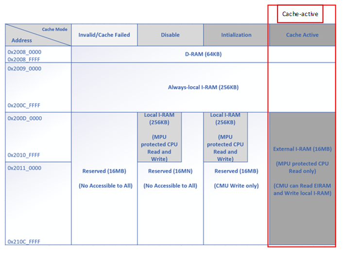

#### Test Bench implementation detail

Below figure illustrates the cache IRAM and how it relates to external memory with arbitrarily chosen memory sizes and block sizes (referred from SInC MAS).

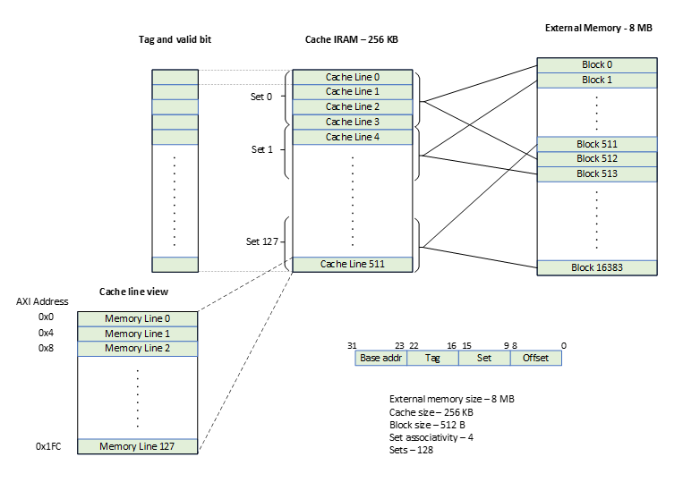

##### Create reasonable stimulus for CPU request in Cache-active state

In Cache-active state, the CPU stimulus will be further constrained to mimic the real-life test scenarios. CPU sequence need to interactive with [Cache Storage Directory](#cache-storage-directory) with provided DPI to fetch desired address to the external memory instruction.

CPU test sequence needs to cover different flavors of hit or miss scenarios by randomization. It must cover continuous miss, continuous hit, miss then hit, hit then miss for coverage requirement and performance evaluation.

The Cache Storage Directory will “do its best” to find the desired address for sequence to use on hit or miss requirement. For example, when sequence use cache_storage_directory::get_hit_address(), the Cache Storage Directory will search for any valid cache line that has been tracked by it, return the address to the sequence. Furthermore, Cache Storage Directory can track the most recent and most visited cache line, sequence can interactive with corresponding DPI cache_storage_directory::get_most_recent_line(), cache_storage_directory::get_most_visit_line() to construct the incoming CPU request to SInC.

##### Interpreting the CPU request in Cache-active state

On a CPU request to SInC, under the condition MPU permission is pass, CIU will first interpret the address for Cache model attributes. The test bench will do the same for stimulus and checkers.

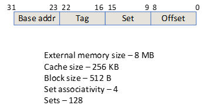

The Cache Storage Directory model will be configured to be 4 way set associate cache, with Tag 7-bit width, Set 7-bit width (128 entries), Offset bit selection is \[8:0\].

Note: The byte location is \[8:2\] with lower 2 bits trimmed.

For examples:

1.  First read.

CPU first read with address : 32’h 0031_9CB4.

Tag = address\[22:16\] = ‘h31 (‘b011_0001),

Set = address\[15:9\] = ‘d78 (‘b1001_110),

Offset = address\[8:0\] = ‘hB4 (‘b0_1011_0100),

byte_offset = address\[8:2\] = ‘d45 ('b10_1101).

If this request is a miss. Cache Ram shall be updated for Tag ‘h31. By reading the external memory with total of 512B (Cache Line size), then write it to local cache ram. As the first entry of 4-way associated array, the cache line will have valid set for: Set\[‘d78\], Tag \[h31\].

After cache is written, CIU will fetch the cache line and return the data to CPU read request by the byte offset. For a total of 512B cache line, with byte_offset equals to ‘d45, it will be the byte count B45, B46, B47, B48 that used to respond to CPU read request.

Updated cache line:

<table style="width:90%;">
<colgroup>
<col style="width: 24%" />
<col style="width: 24%" />
<col style="width: 25%" />
<col style="width: 16%" />
</colgroup>
<thead>
<tr>
<th style="text-align: center;"><strong>Set</strong></th>
<th style="text-align: center;"><strong>Tag</strong></th>
<th style="text-align: center;"><strong>fifo_idx</strong></th>
<th style="text-align: center;"><strong>fifo_cnt</strong></th>
</tr>
</thead>
<tbody>
<tr>
<td style="text-align: center;">‘d78</td>
<td style="text-align: center;">‘h31</td>
<td style="text-align: center;">0</td>
<td rowspan="4" style="text-align: center;">b00 -&gt; b01</td>
</tr>
<tr>
<td style="text-align: center;">‘d78</td>
<td style="text-align: center;">invalid</td>
<td style="text-align: center;">1</td>
</tr>
<tr>
<td style="text-align: center;">‘d78</td>
<td style="text-align: center;">invalid</td>
<td style="text-align: center;">2</td>
</tr>
<tr>
<td style="text-align: center;">‘d78</td>
<td style="text-align: center;">invalid</td>
<td style="text-align: center;">3</td>
</tr>
</tbody>
</table>

Set\[‘d78\], Tag \[h31\].

2.  Read hit.

CPU issue read request with address : 32’h 0031_9C0C.

Tag = ‘h31 (‘b011_0001), Set = ‘d78 (‘b1001_110), Offset = ‘hC (‘b0_0000_1100), byte_offset = ‘d3 ('b00_0011).

CIU will check for Set and Tag look for a match. With the first valid cache line result in the first read, it has matched Set\[‘d78\] and Tag \[h31\]. Thus, this read (32’h 0031_9C0C) will result in a cache hit. There will not be cache data fetch from external memory. The read data is responded with cache line by the byte count B12, B13, B14, B15.

Updated cache line:

Set\[‘d78\], Tag \[h31\].

Updated cache line:

<table style="width:89%;">
<colgroup>
<col style="width: 24%" />
<col style="width: 24%" />
<col style="width: 25%" />
<col style="width: 15%" />
</colgroup>
<thead>
<tr>
<th style="text-align: center;"><strong>Set</strong></th>
<th style="text-align: center;"><strong>Tag</strong></th>
<th style="text-align: center;"><strong>fifo_idx</strong></th>
<th style="text-align: center;"><strong>fifo_cnt</strong></th>
</tr>
</thead>
<tbody>
<tr>
<td style="text-align: center;">‘d78</td>
<td style="text-align: center;">invalid -&gt; ‘h31</td>
<td style="text-align: center;">0</td>
<td rowspan="4" style="text-align: center;">b01 - &gt; b01</td>
</tr>
<tr>
<td style="text-align: center;">‘d78</td>
<td style="text-align: center;">invalid</td>
<td style="text-align: center;">1</td>
</tr>
<tr>
<td style="text-align: center;">‘d78</td>
<td style="text-align: center;">invalid</td>
<td style="text-align: center;">2</td>
</tr>
<tr>
<td style="text-align: center;">‘d78</td>
<td style="text-align: center;">invalid</td>
<td style="text-align: center;">3</td>
</tr>
</tbody>
</table>

3.  Read miss on tag with existing set.

CPU issue read request with address : 32’h 004F_9C0C.

Tag = ‘h4F (‘b100_1111), Set = ‘d78 (‘b1001_110), Offset = ‘hC (‘b0_0000_1100), byte_offset = ‘d3 ('b00_0011).

CIU could not find tag match within set ‘d78, thus a read miss. By reading the external memory with total of 512B (Cache Line size), then write it to local cache ram. As the first entry of 4-way associated array, the cache line will have valid set for: Set\[‘d78\], Tag \[h4F\].

After cache is written, CIU will fetch the cache line and return the data to CPU read request by the byte offset. In this case, it will be the byte count B12, B13, B14, B15.

Updated cache line:

<table style="width:89%;">
<colgroup>
<col style="width: 24%" />
<col style="width: 24%" />
<col style="width: 25%" />
<col style="width: 15%" />
</colgroup>
<thead>
<tr>
<th style="text-align: center;"><strong>Set</strong></th>
<th style="text-align: center;"><strong>Tag</strong></th>
<th style="text-align: center;"><strong>fifo_idx</strong></th>
<th style="text-align: center;"><strong>fifo_cnt</strong></th>
</tr>
</thead>
<tbody>
<tr>
<td style="text-align: center;">‘d78</td>
<td style="text-align: center;">‘h31</td>
<td style="text-align: center;">0</td>
<td rowspan="4" style="text-align: center;">b01 - &gt; b10</td>
</tr>
<tr>
<td style="text-align: center;">‘d78</td>
<td style="text-align: center;">invalid -&gt; ‘h4F</td>
<td style="text-align: center;">1</td>
</tr>
<tr>
<td style="text-align: center;">‘d78</td>
<td style="text-align: center;">invalid</td>
<td style="text-align: center;">2</td>
</tr>
<tr>
<td style="text-align: center;">‘d78</td>
<td style="text-align: center;">invalid</td>
<td style="text-align: center;">3</td>
</tr>
</tbody>
</table>

Notice that with FIFO eviction policy control (MAS 10.1.1.4 Cache eviction policy control), the valid cache line fifo_cnt is increased.

4.  Read miss on tag with existing set.

CPU issue read request with address : 32’h 002D_9C02, 32’h 007F_9C00.

Tags are varied but sets are the same as previous requests.

CIU will keep performing cache fetch, just like condition ‘c’.

Updated cache line:

<table style="width:91%;">
<colgroup>
<col style="width: 24%" />
<col style="width: 24%" />
<col style="width: 25%" />
<col style="width: 17%" />
</colgroup>
<thead>
<tr>
<th style="text-align: center;"><strong>Set</strong></th>
<th style="text-align: center;"><strong>Tag</strong></th>
<th style="text-align: center;"><strong>fifo_idx</strong></th>
<th style="text-align: center;"><strong>fifo_cnt</strong></th>
</tr>
</thead>
<tbody>
<tr>
<td style="text-align: center;">‘d78</td>
<td style="text-align: center;">‘h31</td>
<td style="text-align: center;">0</td>
<td rowspan="4">
b10 - &gt; b11

b11 -&gt; b00
</td>
</tr>
<tr>
<td style="text-align: center;">‘d78</td>
<td style="text-align: center;">‘h4F</td>
<td style="text-align: center;">1</td>
</tr>
<tr>
<td style="text-align: center;">‘d78</td>
<td style="text-align: center;">invalid -&gt; ‘h2D</td>
<td style="text-align: center;">2</td>
</tr>
<tr>
<td style="text-align: center;">‘d78</td>
<td style="text-align: center;">invalid -&gt; ‘h7F</td>
<td style="text-align: center;">3</td>
</tr>
</tbody>
</table>

The fifo_cnt is 4, indicating the cache set for ‘d78 is filled up, the next miss on this set shall result in a cache line eviction.

5.  Read miss on tag with existing set, by evicting oldest cache line

CPU issue read request with address : 32’h 005F_9C0C.

Tag = ‘h5F (‘b101_1111), Set = ‘d78 (‘b1001_110), Offset = ‘hC (‘b0_0000_1100), byte_offset = ‘d3 ('b00_0011).

CIU could not find tag match within set ‘d78, thus a read miss. By reading the external memory with total of 512B (Cache Line size), then write it to local cache ram. As the first entry of 4-way associated array, the cache line will have valid set for: Set\[‘d78\], Tag \[h5F\].

After cache is written, CIU will fetch the cache line and return the data to CPU read request by the byte offset. In this case, it will be the byte count B12, B13, B14, B15.

Since the fifo_cnt is ‘b00, indicating the 4-way cache lines are all been used. In-order to cache the latest read request cache line, CIU needs to evict the oldest cache line with fifo_idx \[0\]. The fifo_idx\[0\] is pointing to the Tag ‘h31.

Note: In current implementation, write is not allowed in cache active state, thus the eviction of cache line won’t result in write-back or write-through mechanics.

Updated cache line:

<table style="width:89%;">
<colgroup>
<col style="width: 24%" />
<col style="width: 24%" />
<col style="width: 25%" />
<col style="width: 15%" />
</colgroup>
<thead>
<tr>
<th style="text-align: center;"><strong>Set</strong></th>
<th style="text-align: center;"><strong>Tag</strong></th>
<th style="text-align: center;"><strong>fifo_idx</strong></th>
<th style="text-align: center;"><strong>fifo_cnt</strong></th>
</tr>
</thead>
<tbody>
<tr>
<td style="text-align: center;">‘d78</td>
<td style="text-align: center;">‘h31 -&gt; ‘h5F</td>
<td style="text-align: center;">0</td>
<td rowspan="4" style="text-align: center;">b00 -&gt; b01</td>
</tr>
<tr>
<td style="text-align: center;">‘d78</td>
<td style="text-align: center;">‘h4F</td>
<td style="text-align: center;">1</td>
</tr>
<tr>
<td style="text-align: center;">‘d78</td>
<td style="text-align: center;">‘h2D</td>
<td style="text-align: center;">2</td>
</tr>
<tr>
<td style="text-align: center;">‘d78</td>
<td style="text-align: center;">‘h7F</td>
<td style="text-align: center;">3</td>
</tr>
</tbody>
</table>

6.  Entering Cache Active implicit RTL behaviors

MAS mentioned the fifo_cnt shall be set to 0 when entering Cache Active State from another state.

What if the cache 4-way lines are not filled up yet. Do we start evicting the first line?

- Whenever leave Cache Active, the VTAG memory shall be wipe to all 0. So the fifo_cnt doesn’t matter, it should restore to 0 as well.

##### Scoreboard and monitor’s responsibility

On observe CPU request, a snapshot of current DUT status will be saved and used to predict the results. The results are not only for the CPU request itself, it also includes any DUT behavior that can be monitored.

Note on the expectation details.

RamWrapper read:

- It is monitored by RamWrapper Monitor UVC on ports to local IRAM. It is abstract into transaction level with attributes for R/W, address, data… All the attributes need to be checked by the scoreboard with expectation, which is set when observe CPU request.

- Attributes:

  - Address depends on the set and available cache line idx

  - Total data should be 512B

AXI_MGR address translation unit read:

- it is monitored by AXI Monitor on outbound AXI ports from SInC. It is abstract into transaction level with attributes for R/W, address, data… All the attributes need to be checked by the scoreboard with expectation, which is set when observe CPU request.

- Attributes:

  - Address equals to the block’s start address – CPU address \[31:9\]

  - Other attributes are not mentioned by MAS

  - The total beats of data write or fetch should match with spec

Crypto Wrap operations are treated as internal behavior, the scoreboard will not directly poke into the design to monitor them. But the expectation on whether the Crypto Wrap operation would be success depending on snapshot AES configuration, IV from IV Nonce\* registers and the BEK previously fetched. If any Crypto operation fail on the prediction, the expectation of CPU read should be fail. Corresponding error handling behaviors are predicted as well.

#### Positive test cases

Below table elaborates test scenarios that will result in a successful read of CPU read request during cache active state.

All these scenarios are read to external I-RAM address range (0x200D_0000 to 0x210C_FFFF), under the permission of MPU. There is no other operation intercept or TB stimulus cause error in CMU.

Note: The order of each expectation matters. The ‘expectation’ column listing the expectations in order.

Note: In functional mode, AES is always used in GCM mode.

<table>
<colgroup>
<col style="width: 26%" />
<col style="width: 48%" />
<col style="width: 25%" />
</colgroup>
<thead>
<tr>
<th style="text-align: center;"><strong>Stimulus</strong></th>
<th style="text-align: center;"><strong>Expectation</strong></th>
<th style="text-align: center;"><strong>Signature</strong></th>
</tr>
</thead>
<tbody>
<tr>
<td>
Read miss

<ul>
<li>
None cache line valid for the set
</li>
<li>
Most basic cache miss behavior
</li>
</ul></td>
<td>
CPU request accepted. [time stamped]

<ul>
<li>
Snapshot of DUT status
</li>
<li>
Snapshot of Cache Directory.
</li>
</ul>

RamWrapper read (prefetch).

<ul>
<li>
depends on MPU, if MPU allowed, the RamWrapper read will be issued to fetch the data.
</li>
<li>
Read address match cache set physical address
</li>
</ul>

AXI_MGR address translation unit read based on CPU address for input buffer(block fetch by CMU).

AXI_MGR address translation unit read (authentication tag fetch by CMU).

<ul>
<li>
Address depends on authentication tag base address register
</li>
</ul>

<strong>Below steps happens after authentication tag comparison match.</strong>

RamWrapper write (write to local RAM)

<ul>
<li>
Start with set’s first cache line
</li>
<li>
One word a time
</li>
</ul>

RamWrapper read (fetch cache line).

<ul>
<li>
Address determined by set number, matched cache line index by looking at tag
</li>
</ul>

CPU request responded. [time stamped]

<ul>
<li>
Update DUT mirror
</li>
<li>
Update Cache Directory (use for next stimulus).
</li>
<li>
Response okay
</li>
<li>
Responded data match dummy data in SLV UVC
</li>
</ul></td>
<td>Cache read mismatch expectation : …</td>
</tr>
<tr>
<td>
Read misses with same set address

<ul>
<li>
Fill up 4-way cache lines
</li>
</ul></td>
<td>
Same as “read miss”

<ul>
<li>
Cache storage directory keeps updating
</li>
</ul>

RamWrapper write (write to local RAM).

<ul>
<li>
Write to corresponding set’s next cache line (not hit 4 valid cache line yet)
</li>
</ul></td>
<td></td>
</tr>
<tr>
<td>
Read misses with same set address

<ul>
<li>
Exercise 4-way associate cache model’s evict policy.
</li>
</ul></td>
<td>
Same as “read miss”

<ul>
<li>
Cache storage directory keeps updating
</li>
<li>
Evict does not affect SInC ports at top level.
</li>
<li>
New cache line will write to the fifo_cnt location
</li>
</ul></td>
<td></td>
</tr>
<tr>
<td>Read hit</td>
<td>
CPU request accepted. [time stamped]

<ul>
<li>
Snapshot of DUT status
</li>
<li>
Snapshot of Cache Directory.
</li>
</ul>

RamWrapper read (prefetch).

<ul>
<li>
Read address match cache set
</li>
<li>
Fetch the whole set
</li>
</ul>

CPU request responded. [time stamped]

<ul>
<li>
Response okay
</li>
<li>
Responded data match dummy data in SLV UVC
</li>
</ul>

Cache Directory remain the same.
</td>
<td></td>
</tr>
</tbody>
</table>

#### Negative test cases

Note: Interface violation is not considered.

‘cache_block_r_err’ status will be set for all the scenarios.

<table>
<colgroup>
<col style="width: 34%" />
<col style="width: 37%" />
<col style="width: 27%" />
</colgroup>
<thead>
<tr>
<th style="text-align: center;"><strong>Stimulus</strong></th>
<th style="text-align: center;"><strong>Expectation</strong></th>
<th style="text-align: center;"><strong>Signature</strong></th>
</tr>
</thead>
<tbody>
<tr>
<td>
CPU Write request

<ul>
<li>
With full address range the address width allowed
</li>
</ul></td>
<td><ul>
<li>
Response error
</li>
</ul>

Status register updates

<ul>
<li>
‘cache_block_r_err’ set 1
</li>
<li>
‘cmd_failed’ set 1
</li>
<li>
‘erase_busy_err’ set 0
</li>
<li>
‘cache_block_w_err_fetch_block’ set 0
</li>
<li>
‘auth_tag_r_err’ set 0
</li>
<li>
‘auth_tag_chk_err’ set 0
</li>
</ul></td>
<td style="text-align: center;"></td>
</tr>
<tr>
<td>
Fabric prevent case below:

<del>Read to address range not in SInC scope:</del>

<ul>
<li>
<del>Address lower than</del>
</li>
</ul>

<del>0x200D_0000</del>

<ul>
<li>
<del>Address higher than</del>
</li>
</ul>

<del>0x210C_FFFF</del>
</td>
<td><ul>
<li>
Response error
</li>
</ul>

Status register updates

<ul>
<li>
‘cache_block_r_err’ set 1
</li>
<li>
‘cmd_failed’ set 1
</li>
<li>
‘erase_busy_err’ set 0
</li>
<li>
‘cache_block_w_err_fetch_block’ set 0
</li>
<li>
‘auth_tag_r_err’ set 0
</li>
<li>
‘auth_tag_chk_err’ set 0
</li>
</ul></td>
<td style="text-align: center;"></td>
</tr>
<tr>
<td>
Fabric prevent case below:

<del>Read to valid external address range</del>

<ul>
<li>
<del>MPU not allow</del>
</li>
</ul></td>
<td>
CPU request accepted. [time stamped]

<ul>
<li>
Snapshot of DUT status
</li>
<li>
Snapshot of Cache Directory.
</li>
</ul>

CPU request responded. [time stamped]

<ul>
<li>
Response error
</li>
<li>
Responded data ‘hdead_beaf
</li>
</ul>

Status register updates

<ul>
<li>
‘cache_block_r_err’ set 1
</li>
<li>
‘cmd_failed’ set 1
</li>
<li>
‘erase_busy_err’ set 0
</li>
<li>
‘cache_block_w_err_fetch_block’ set 0
</li>
<li>
‘auth_tag_r_err’ set 0
</li>
<li>
‘auth_tag_chk_err’ set 0
</li>
</ul></td>
<td style="text-align: center;">Expect CPU Access [read] fail in [state], [MPU: disallow], but …</td>
</tr>
<tr>
<td>
Read to valid address range

<ul>
<li>
Uncorrectable ECC error found in cache ram
</li>
<li>
It is done by RamWrapper error injection front door
</li>
</ul></td>
<td>
CPU request accepted. [time stamped]

<ul>
<li>
Snapshot of DUT status
</li>
<li>
Snapshot of Cache Directory.
</li>
</ul>

CPU request responded. [time stamped]

<ul>
<li>
Response error
</li>
<li>
Responded data ‘hdead_beaf
</li>
</ul>

sinc_err_uncorr_o be asserted

sinc_hw_fault status set

<ul>
<li>
Severe error
</li>
<li>
RC register
</li>
<li>
Move to Cache-failed state
</li>
</ul>

Status register updates

<ul>
<li>
‘cache_block_r_err’ set 1
</li>
<li>
‘cmd_failed’ set 1
</li>
<li>
‘erase_busy_err’ set 0
</li>
<li>
‘cache_block_w_err_fetch_block’ set 0
</li>
<li>
‘auth_tag_r_err’ set 0
</li>
<li>
‘auth_tag_chk_err’ set 0
</li>
</ul></td>
<td style="text-align: center;">Expect CPU Access [read] fail in [state], but …</td>
</tr>
<tr>
<td>
Read to valid address range

<ul>
<li>
CMU become busy
</li>
<li>
This can be done by

<ul>
<li>
Write CMD register for example disable_reset
</li>
<li>
Any other realistic cases?
</li>
</ul></li>
</ul>
<blockquote>

Try sinc-reset

</blockquote></td>
<td>
CPU request accepted. [time stamped]

<ul>
<li>
Snapshot of DUT status
</li>
<li>
Snapshot of Cache Directory.
</li>
</ul>

CPU request responded. [time stamped]

<ul>
<li>
Response error
</li>
<li>
Responded data ‘hdead_beaf
</li>
</ul>

Status register updates

<ul>
<li>
‘cache_block_r_err’ set 1
</li>
<li>
‘cmd_failed’ set 1
</li>
<li>
‘erase_busy_err’ set 0
</li>
<li>
‘cache_block_w_err_fetch_block’ set 0
</li>
<li>
‘auth_tag_r_err’ set 0
</li>
<li>
‘auth_tag_chk_err’ set 0
</li>
</ul></td>
<td style="text-align: center;"></td>
</tr>
<tr>
<td>R access while CMU busy</td>
<td>
Pick one of the behaviors below that can make CMU busy

<ul>
<li>
Write to SInC register
</li>
<li>
Read to SInC register
</li>
<li>
set_init_state/ sinc_reset/sinc_reinit cmd
</li>
<li>
AES test mode cmd
</li>
<li>
Any other realistic cases? Design recommend sinc_reset command
</li>
</ul>

Issue CPU R/W request

R, response CPU read error to CPU instead of read data valid and data ‘hdead_beaf

<mark>No Status reflected on this test case. MAS hint the CMU will log this error but it is not mentioned</mark>.

Status register updates

<ul>
<li>
‘cache_block_r_err’ set 1
</li>
<li>
‘cmd_failed’ set 1
</li>
<li>
‘erase_busy_err’ set 0
</li>
<li>
‘cache_block_w_err_fetch_block’ set 0
</li>
<li>
‘auth_tag_r_err’ set 0
</li>
<li>
‘auth_tag_chk_err’ set 0
</li>
</ul></td>
<td style="text-align: center;"></td>
</tr>
<tr>
<td>R access while Erase is busy</td>
<td>
Reported to top of SINC with Sinc_err_erase_busy_o

If CPU read, return ‘deadbeef’ on read data.

report to CMU through ciu_erase_busy_err if this is happening in the phase of Data Fetch.

Status register updates

<ul>
<li>
‘cache_block_r_err’ set 1
</li>
<li>
‘cmd_failed’ set 1
</li>
<li>
‘erase_busy_err’ set 0
</li>
<li>
‘cache_block_w_err_fetch_block’ set 0
</li>
<li>
‘auth_tag_r_err’ set 0
</li>
<li>
‘auth_tag_chk_err’ set 0
</li>
</ul></td>
<td style="text-align: center;"></td>
</tr>
<tr>
<td>Erase while R/W access in progress</td>
<td>
Reported to top of SINC with Sinc_err_erase_busy_o

If CPU read, return ‘deadbeef’ on read data.

report to CMU through ciu_erase_busy_err if this is happening in the phase of Data Fetch.

Status register updates

<ul>
<li>
‘cache_block_r_err’ set 1
</li>
<li>
‘cmd_failed’ set 1
</li>
<li>
‘erase_busy_err’ set 1
</li>
<li>
‘cache_block_w_err_fetch_block’ set 0
</li>
<li>
‘auth_tag_r_err’ set 0
</li>
<li>
‘auth_tag_chk_err’ set 0
</li>
</ul></td>
<td style="text-align: center;"></td>
</tr>
<tr>
<td>
CPU Read

<ul>
<li>
MPU allow
</li>
<li>
Cache Miss
</li>
<li>
SInC failed to write the cache block to CIRAM during fetch block command.
</li>
<li>
Do a CR erase
</li>
</ul></td>
<td>
Status register updates

<ul>
<li>
‘cache_block_r_err’ set 1
</li>
<li>
‘cmd_failed’ set 1
</li>
<li>
‘erase_busy_err’ set 0
</li>
<li>
‘cache_block_w_err_fetch_block’ set 1
</li>
<li>
‘auth_tag_r_err’ set 0
</li>
<li>
‘auth_tag_chk_err’ set 0
</li>
</ul></td>
<td style="text-align: center;"></td>
</tr>
<tr>
<td>
CPU Read

<ul>
<li>
MPU allow
</li>
<li>
Cache Miss
</li>
<li>
SINC failed to read the encrypted data from address translation unit
</li>
</ul></td>
<td>
Status register updates

<ul>
<li>
‘cache_block_r_err’ set 1
</li>
<li>
‘cmd_failed’ set 1
</li>
<li>
‘erase_busy_err’ set 0
</li>
<li>
‘cache_block_w_err_fetch_block’ set 0
</li>
<li>
‘auth_tag_r_err’ set 1
</li>
</ul>

‘auth_tag_chk_err’ set 0
</td>
<td style="text-align: center;"></td>
</tr>
<tr>
<td>
CPU Read

<ul>
<li>
MPU allow
</li>
<li>
Cache Miss
</li>
<li>
SInC failed to read the authentication tag from external memory during fetch block command.
</li>
<li>
What if the read/write authentication tag/address translation unit “timeout”? Does SInC provide watch dog prevent system hang?
</li>
</ul>

Arch answer: CR can be configured to trigger fatal error.

Design answer: no WDT implemented in current SINC design.
</td>
<td>
Status register updates

<ul>
<li>
‘cache_block_r_err’ set 1
</li>
<li>
‘cmd_failed’ set 1
</li>
<li>
‘erase_busy_err’ set 0
</li>
<li>
‘cache_block_w_err_fetch_block’ set 0
</li>
<li>
‘auth_tag_r_err’ set 1
</li>
<li>
‘auth_tag_chk_err’ set 0
</li>
</ul></td>
<td style="text-align: center;"></td>
</tr>
<tr>
<td>
CPU Read

<ul>
<li>
MPU allow
</li>
<li>
Cache Miss
</li>
<li>
Generated authentication tag didn't match the expected authentication tag (fetched from external memory) during fetch block command.
</li>
<li>
Above is done by backdoor corrupting VTAG
</li>
</ul></td>
<td>
Status register updates

<ul>
<li>
‘cache_block_r_err’ set 1
</li>
<li>
‘cmd_failed’ set 1
</li>
<li>
‘erase_busy_err’ set 0
</li>
<li>
‘cache_block_w_err_fetch_block’ set 0
</li>
<li>
‘auth_tag_r_err’ set 0
</li>
<li>
‘auth_tag_chk_err’ set 1
</li>
</ul></td>
<td style="text-align: center;"></td>
</tr>
<tr>
<td>
CPU Read

<ul>
<li>
MPU allow
</li>
<li>
Cache Miss
</li>
<li>
Access to external memory that has not been encrypted. (this is equivalent to access a cache block that is not encrypted)
</li>
<li>
The encrypt command in Initialization state does not initialize the whole external memory
</li>
</ul></td>
<td>
Status register updates

<ul>
<li>
‘cache_block_r_err’ set 1
</li>
<li>
‘cmd_failed’ set 1
</li>
<li>
‘erase_busy_err’ set 0
</li>
<li>
‘cache_block_w_err_fetch_block’ set 0
</li>
<li>
‘auth_tag_r_err’ set 0
</li>
<li>
‘auth_tag_chk_err’ set 1
</li>
</ul></td>
<td style="text-align: center;"></td>
</tr>
</tbody>
</table>

### RamWrapper Operations

Refer to MAS diagram about Cache SRAM RamWrapper. This section describes the test scenario on the Cache SRAM RamWrapper only.

The Erase and Error Injection operations are controlled by Firmware through CR module. SInC will not arbitrate either Erase or Error Injection operation. Firmware needs to

- Perform erase during? Erase should be started when there is no memory access otherwise the erase request will be dropped.

- Perform error injection during? It is FW’s response to only do error injection when there is no other transactions to SInC.

*<u>Below Positive/Negative test cases are identical with **Disable State**, reviewers and users of this verification plan can skip them if read disable state scenarios already. (leave the test scenario sections for future delta changes)</u>*

#### Positive test cases

<table>
<colgroup>
<col style="width: 34%" />
<col style="width: 42%" />
<col style="width: 23%" />
</colgroup>
<thead>
<tr>
<th style="text-align: center;"><strong>Stimulus</strong></th>
<th style="text-align: center;"><strong>Expectation</strong></th>
<th style="text-align: center;"><strong>Signature</strong></th>
</tr>
</thead>
<tbody>
<tr>
<td>Erase</td>
<td>
Cache IRAM will be erased with “random wdata”

<ul>
<li>
The random wdata is driven by RNG. At L1, the wdata can be of any value. Erase Engine Agent’s configuration should be set to random value for erase write data.
</li>
</ul></td>
<td>IRAM data not erased with random value</td>
</tr>
<tr>
<td>Error Inject</td>
<td>Correctable/Uncorrectable error injected to IRAM through Error Injection Interface</td>
<td>N/A, as there is no check on whether error be injected until a mem access is sent.</td>
</tr>
</tbody>
</table>

#### Negative test cases

<table>
<colgroup>
<col style="width: 34%" />
<col style="width: 31%" />
<col style="width: 33%" />
</colgroup>
<thead>
<tr>
<th style="text-align: center;"><strong>Stimulus</strong></th>
<th style="text-align: center;"><strong>Expectation</strong></th>
<th style="text-align: center;"><strong>Signature</strong></th>
</tr>
</thead>
<tbody>
<tr>
<td>Erase &amp; CPU MEM req at same time</td>
<td><ol type="1">
<li>
CPU MEM request will be dropped, with error
</li>
<li>
sinc_err_erase_busy_o be asserted
</li>
<li>
Erase should not be affected
</li>
</ol></td>
<td></td>
</tr>
<tr>
<td>CPU MEM req during Erase</td>
<td><ol type="1">
<li>
CPU MEM request will be dropped, with error
</li>
<li>
mem_err_erase_busy be asserted
</li>
<li>
Erase should not be affected
</li>
</ol></td>
<td>Expect MEM request error during erase operation, actual …</td>
</tr>
<tr>
<td>Erase req during CPU MEM operation</td>
<td><ol type="1">
<li>
CPU MEM request will fail, if read return ‘deadbeaf.
</li>
</ol></td>
<td>Expect Erase request fail during MEM operation, actual …</td>
</tr>
</tbody>
</table>

### AES Engine test scenarios

This section elaborates all the possible test scenarios interact with AES Engine in SInC DUT.

- AES Register access

<!-- -->

- Legal/illegal access to Programable registers

- Legal/illegal access to RO registers

- Legal/illegal AES test control register set up

<!-- -->

- AES Tests

<!-- -->

- MAS mention “FW can run KAT in this state using AES test mode. AES test mode can only be enabled in this state.”

- Starting AES operation while not in test mode will be ignored.

Each register will be checked backdoor or front door with its mirrored value.

For write register, random value will be written through front door.

For readable register, read request will be issued through front door to check with TB mirror value.

#### AES Register access

In Cache Active State, AES registers are accessible by AXI SUB interface from SInC Top.

The register access rules/scenarios can be referred to [Register Access Restrictions](#register-access-restrictions).

##### Positive test cases

R/W to register below. The access control is relying on CSR register “rights”. This section only elaborates test scenarios out of AES Test Mode.

<table>
<colgroup>
<col style="width: 34%" />
<col style="width: 21%" />
<col style="width: 44%" />
</colgroup>
<thead>
<tr>
<th style="text-align: center;"><strong>Stimulus</strong></th>
<th style="text-align: center;"><strong>Expectation</strong></th>
<th style="text-align: center;"><strong>Signature</strong></th>
</tr>
</thead>
<tbody>
<tr>
<td>
aes_iv_nonce_0/1/2,

<ul>
<li>
read
</li>
</ul></td>
<td><ul>
<li>
AXI Resp OKAY
</li>
<li>
read value match expectation
</li>
</ul></td>
<td>Expect AXI [read] request to register [*] success, actual …</td>
</tr>
<tr>
<td>
aes_iv_nonce_0/1/2,

<ul>
<li>
write with random value
</li>
</ul>

read
</td>
<td><ul>
<li>
AXI Resp OKAY
</li>
<li>
<strong>Write is ignored</strong>
</li>
<li>
<strong>MAS: Writes to this register are discarded if SInC is not in Disabled state.</strong>
</li>
</ul></td>
<td>Expect AXI [write] request to register [*] ignored, actual register data after write [*]…</td>
</tr>
<tr>
<td>
aes_test_data_in_0/1/2/3

<ul>
<li>
write with random value
</li>
<li>
read
</li>
</ul></td>
<td><ul>
<li>
AXI Resp OKAY
</li>
</ul></td>
<td>Expect AXI [write/read] request to register [*] success, actual …</td>
</tr>
<tr>
<td>
aes_test_data_out_0/1/2/3

<ul>
<li>
read
</li>
</ul></td>
<td><ul>
<li>
AXI Resp OKAY
</li>
</ul></td>
<td>Expect AXI [write/read] request to register [*] success, actual …</td>
</tr>
<tr>
<td>
aes_test_ctrl

<ul>
<li>
write with random value, except test_en field is ‘0 in write data (<a href="#aes-test">AES Test</a> section will perform further test on test_en)
</li>
<li>
read
</li>
</ul></td>
<td><ul>
<li>
AXI Resp OKAY
</li>
<li>
Write to this register will be discarded
</li>
</ul></td>
<td>
Expect AXI [write/read] request to register [*] success, actual …

</tr>
<tr>
<td>
aes_test_status

<ul>
<li>
read
</li>
</ul></td>
<td><ul>
<li>
AXI Resp OKAY
</li>
</ul></td>
<td>Expect AXI [write/read] request to register [*] success, actual …</td>
</tr>
</tbody>
</table>

##### Negative test cases

In Initialization State, SInC restrict FW to enter test mode.

<table>
<colgroup>
<col style="width: 34%" />
<col style="width: 21%" />
<col style="width: 44%" />
</colgroup>
<thead>
<tr>
<th style="text-align: center;"><strong>Stimulus</strong></th>
<th style="text-align: center;"><strong>Expectation</strong></th>
<th style="text-align: center;"><strong>Signature</strong></th>
</tr>
</thead>
<tbody>
<tr>
<td>
Enter test mode:

write cmd register with test_en set
</td>
<td style="text-align: center;">AXI Resp OKEY 
CMD fail be set</td>
<td>Expect AXI [write] request to register [*] fail, actual …</td>
</tr>
<tr>
<td>Reserve for edit</td>
<td style="text-align: center;"></td>
<td></td>
</tr>
</tbody>
</table>

#### AES Test

In Cache Active state, below test scenarios will be exercised to make sure that AES command for test mode should not be started.

From Stimulus perspective, the TB should reuse the sequence for AES testing in Disable mode. The checker and expectation shall be different.

Note: below negative test cases can also be used in Disable(or any other) mode, when test_en is not set before starting AES cmd.

Note: the depth of verifying AES test mode is TBD. It is low priority for SInC TB test AES module with exhausted strategy on stimulus.

##### Negative test cases

Any positive AES test fail will be reported with signature : “AES command result mismatch with expectation, see details : … ”

<table>
<colgroup>
<col style="width: 39%" />
<col style="width: 34%" />
<col style="width: 25%" />
</colgroup>
<thead>
<tr>
<th style="text-align: center;"><strong>Stimulus</strong></th>
<th style="text-align: center;"><strong>Expectation</strong></th>
<th style="text-align: center;"><strong>Signature</strong></th>
</tr>
</thead>
<tbody>
<tr>
<td>Load prepared valid test data for block_encr_key, aes_iv_nonce*, and aes_test_data_in*</td>
<td>
Read should be successful.

Write to register that only allow W in Disable State should be discarded.
</td>
<td></td>
</tr>
<tr>
<td><ul>
<li>
Write aes_test_ctrl filed cfg_key_iv_vld (with any data and cfg_key_iv_vld == 1) before cfg_key_iv_rdy
</li>
<li>
Write aes_test_ctrl filed cfg_key_iv_vld (with any data and cfg_key_iv_vld == 0) before cfg_key_iv_rdy
</li>
</ul></td>
<td><ul>
<li>
AXI write will be responded with OKAY
</li>
<li>
If cfg_key_iv_rdy is not set, setting this bit won't have any effect (SInC will not do anything)
</li>
<li>
MAS didn’t mention whether write aes_test_ctrl is allowed when not in test mode.
</li>
</ul></td>
<td></td>
</tr>
<tr>
<td>Write aes_test_ctrl filed cfg_key_iv_vld (with valid data and cfg_key_iv_vld == 1) after cfg_key_iv_rdy</td>
<td><ul>
<li>
AES status should never be asserted to 1
</li>
<li>
DV sequence need to wait enough time for scoreboard to check AES status
</li>
<li>
Sequence should timeout wait for cfg_key_iv_rdy but without reporting error
</li>
</ul></td>
<td></td>
</tr>
<tr>
<td><ul>
<li>
AES test with reuse_key = 0,
</li>
<li>
When no Key fetched yet
</li>
</ul></td>
<td>Not achievable in this state.</td>
<td></td>
</tr>
<tr>
<td><ul>
<li>
AES test with reuse_key = 1,
</li>
<li>
When no Key fetched yet
</li>
</ul></td>
<td>Not achievable in this state.</td>
<td></td>
</tr>
<tr>
<td><ul>
<li>
AES test with reuse_key = 0,
</li>
<li>
When Key already fetched
</li>
</ul></td>
<td>Not achievable in this state.</td>
<td></td>
</tr>
<tr>
<td><ul>
<li>
AES test with reuse_key = 1,
</li>
<li>
When already Key fetched
</li>
</ul></td>
<td>Not achievable in this state.</td>
<td></td>
</tr>
<tr>
<td><ul>
<li>
AES test with data_in_byte_cnt set to valid value
</li>
</ul></td>
<td>Not achievable in this state.</td>
<td></td>
</tr>
<tr>
<td><ul>
<li>
AES test with mode == ‘h1 or ‘h7
</li>
</ul></td>
<td>Not achievable in this state.</td>
<td></td>
</tr>
<tr>
<td><ul>
<li>
AES test with key_len == ‘h2 (256 byte)
</li>
</ul></td>
<td>Not achievable in this state.</td>
<td></td>
</tr>
<tr>
<td><ul>
<li>
data_in_vld set when data_in_rdy is set
</li>
</ul></td>
<td>Not achievable in this state.</td>
<td></td>
</tr>
<tr>
<td><ul>
<li>
data_in_last set with data_in_vld
</li>
</ul></td>
<td>Not achievable in this state.</td>
<td></td>
</tr>
<tr>
<td><ul>
<li>
data_in_aad_sel set to ‘h0 - PT/CT
</li>
</ul></td>
<td>Not achievable in this state.</td>
<td></td>
</tr>
<tr>
<td><ul>
<li>
data_out_ack set to 1
</li>
</ul></td>
<td>Not achievable in this state..</td>
<td></td>
</tr>
<tr>
<td>
The AES command fields:

<ul>
<li>
data_in_byte_cnt set to invalid value
</li>
<li>
AES Mode set to not supported CMD
</li>
<li>
…
</li>
</ul></td>
<td>RTL shall not proceed with any AES command. Setting AES command fields has no effect on the RTL behavior.</td>
<td></td>
</tr>
</tbody>
</table>

### AXI Request to SInC

The rest 8.2.5.\* sections describes AXI requests test scenarios.

#### General access to DUT spaces

AXI requests are derived from the Arm® AMBA® AXI 4 specification, it is AXI Fabric’s response to only pass request that is allowed by the bus protocols. However AXI request with attributes that failed at AXI Access Control in SInC shall return with SLV_ERR response.

Refer to MAS 10.2.1.1 AXI Access Control:

“If an AXI access request does not meet the requirements specified in this section, a SLVERR is returned.

- AXI sub-word accesses are not supported and will be returned with SLVERR. Any unaligned access (lower two bits of address ≠ 00) will also be returned with SLVERR.

- AxLEN must be 0.

- Burst type of FIXED or INCR is supported.

- Access is not allowed to any reserved space within SInC.

- Access is not allowed to anything other than the status register read while memory erase is being executed.

“

AXI MGR requests are used to access SInC registers. Refer to \[TDB. Register Test Scenario\] on the general register test cases. As long as the CMU state allow AXI request to the registers, there is no difference on the register access except for writes to command register.

In this section, the focus is on the supported commands by program SInC command registers:

- Secure Instruction Cache Command Register

- AES test control register

##### Positive test cases

Positive test cases listed here are for AXI requests that not violating the access restrictions, with no other error scenarios introduced during the request.

<table>
<colgroup>
<col style="width: 39%" />
<col style="width: 25%" />
<col style="width: 34%" />
</colgroup>
<thead>
<tr>
<th style="text-align: center;"><strong>Stimulus</strong></th>
<th style="text-align: center;"><strong>Expectation</strong></th>
<th style="text-align: center;"><strong>Signature</strong></th>
</tr>
</thead>
<tbody>
<tr>
<td>Program ‘Secure Instruction Cache Command Register’ with [*] command supported at current state [*]</td>
<td><ul>
<li>
Command be accepted.
</li>
<li>
RTL behavior match expectation of scoreboard’s prediction on output ports/memory/register
</li>
<li>
Refer to 8.3.6.2 [<a href="#_Legal/illegal_command_test">Legal/illegal command test cases</a> ]for Legal command test cases
</li>
</ul></td>
<td></td>
</tr>
<tr>
<td>Program ‘AES test control register’ with [*] command supported at current state [*]</td>
<td><ul>
<li>
RTL behavior match with 8.3.5.2 AES Engine test scenarios
</li>
</ul></td>
<td></td>
</tr>
<tr>
<td>
R/W to register:

<ul>
<li>
block_encr_num register
</li>
<li>
num_of_blocks
</li>
<li>
block_encr_addr
</li>
</ul></td>
<td>
Read success

Write discarded
</td>
<td></td>
</tr>
<tr>
<td>
R/W to register:

<ul>
<li>
block_encr_key
</li>
</ul></td>
<td>
Read success

Write discarded
</td>
<td></td>
</tr>
<tr>
<td>
R/W to register:

<ul>
<li>
aes_iv_nonce_0/1/2
</li>
</ul></td>
<td>
Read success

Write discarded.
</td>
<td></td>
</tr>
<tr>
<td>
R/W to register:

<ul>
<li>
ext_block_base_addr
</li>
<li>
Lower bits be 0 to aligned to block boundary
</li>
</ul></td>
<td>
Read success

Write discarded.
</td>
<td></td>
</tr>
<tr>
<td>
R/W to register:

<ul>
<li>
ext_auth_tag_base_addr
</li>
<li>
The lower 4 bits of this register must be set to 0 as the authentication tag base address must be aligned to tag size (16B).
</li>
</ul></td>
<td>
Read success

Write discarded
</td>
<td></td>
</tr>
<tr>
<td>
R/W to performance registers

<ul>
<li>
*_cnt_*
</li>
<li>
perf_cnt_ctrl
</li>
</ul></td>
<td>
Only under restriction of register access, refer to 8.6 Register Access Restrictions.

Not restricted by cache state.
</td>
<td></td>
</tr>
<tr>
<td>R/W to AES registers</td>
<td>
R/W under restriction of register access, refer to 8.6 Register Access Restrictions.

AES test mode can only be enabled in cache disable state.

Refer to section 8.2.5 AES Engine test scenarios.
</td>
<td></td>
</tr>
</tbody>
</table>

##### Negative test cases

Negative test cases listed here are for AXI requests that violate the access restrictions, that cause RTL reject the request.

<table>
<colgroup>
<col style="width: 39%" />
<col style="width: 25%" />
<col style="width: 34%" />
</colgroup>
<thead>
<tr>
<th style="text-align: center;"><strong>Stimulus</strong></th>
<th style="text-align: center;"><strong>Expectation</strong></th>
<th style="text-align: center;"><strong>Signature</strong></th>
</tr>
</thead>
<tbody>
<tr>
<td>Program ‘Secure Instruction Cache Command Register’ with [*] command not supported at current state [*]</td>
<td><ul>
<li>
Invalid command error
</li>
</ul></td>
<td></td>
</tr>
<tr>
<td>Program ‘AES test control register’ with [*] command not supported at current state [*]</td>
<td><ul>
<li>
Invalid command error
</li>
</ul></td>
<td></td>
</tr>
<tr>
<td>
R/W to register:

<ul>
<li>
ext_block_base_addr
</li>
<li>
Lower bits be not aligned to block boundary
</li>
</ul></td>
<td>
NA

Write is discarded
</td>
<td></td>
</tr>
<tr>
<td>
R/W to register:

<ul>
<li>
ext_auth_tag_base_addr
</li>
<li>
The lower 4 bits of this register not set to 0
</li>
</ul></td>
<td>
Read success

Write is discarded
</td>
<td></td>
</tr>
</tbody>
</table>

#### Legal/illegal command test cases

Refer to MAS 10.1.2.1.3 Cache-active state: “

In cache-active state, the main task of CMU is to service block fetch requests from CIU on cache misses by fetching block from external memory, decrypting it, and storing it in cache IRAM. security processor doesn’t have write access to cache IRAM in this state, which will be covered in section [14.1](#_Ref139617370).

Commands supported in this state are as follows.

1.  Block fetch request from CIU (initiated by HW)

2.  SInC re-init

3.  SInC reset – Same as in Initialization state.

“

Rest sections elaborates SInC command test scenarios will not trigger error handling. Negative test scenarios will always trigger error handling in SInC.

##### SInc Commands

The table below indicates what command scenarios should be tested in this state.

Each command should at least be tested in each state. The expectation is varied by the cache states.

Stimulus and scoreboard together needed to verify the RTL behavior behind setting the command registers.

<table>
<colgroup>
<col style="width: 35%" />
<col style="width: 41%" />
<col style="width: 22%" />
</colgroup>
<thead>
<tr>
<th style="text-align: center;"><strong>CMD</strong></th>
<th style="text-align: center;">
<strong>Is Allowed in</strong>

<strong>[Active State]</strong>
</th>
<th style="text-align: center;">
<strong>Additional</strong>

<strong>Description</strong>
</th>
</tr>
</thead>
<tbody>
<tr>
<td>set_init_state</td>
<td>
No.

Only allowed in Disabled state.
</td>
<td>HW clears this bit after transition completes or SInC encounters an error.</td>
</tr>
<tr>
<td>set_cache_active_state</td>
<td><blockquote>

No.

Only allowed in Initialization state.

</blockquote></td>
<td><blockquote>

HW clears this bit after transition completes or SInC encounters an error.

</blockquote></td>
</tr>
<tr>
<td>sinc_reset</td>
<td><blockquote>

Yes.

Only allowed in Initialization, Cache-Active and Cache-Failed state

</blockquote></td>
<td><blockquote>

If sinc_reset_disabled is set to 0 in status register, setting this bit will cause SInC to erase the cache IRAM, erase the BEK, reset the MPU permissions and move to Disabled state.

HW clears this bit after transition completes or SInC encounters an error.

If sinc_reset_disabled is set, writing this bit will result in invalid command error.

</blockquote></td>
</tr>
<tr>
<td>sinc_reinit</td>
<td><blockquote>

Yes.

Only allowed in Cache-Active state

</blockquote></td>
<td><blockquote>

If sinc_reinit_disabled is set to 0 in status register, setting this bit will cause SInC to move to Initialization state without erasing the cache, the BEK, or the MPU permissions.

HW clears this bit after transition completes or SInC encounters an error.

If sinc_reinit_disabled is set, writing this bit will result in invalid command error.

</blockquote></td>
</tr>
<tr>
<td>encr_block</td>
<td><blockquote>

No.

Only allowed in Initialization state.

</blockquote></td>
<td><blockquote>

Initiates block encryption operation by reading the blocks from shared ram, encrypting it and writing it along with authentication tags to external memory.

It uses block_encr_num, num_of_blocks and block_encr_addr registers to execute this command.

HW clears this bit after all blocks and authentication tags are written to external memory.

</blockquote></td>
</tr>
<tr>
<td>disable_reset</td>
<td><blockquote>

Yes.

Allowed in all states.

</blockquote></td>
<td><blockquote>

It sets the sinc_reset_disabled status to 1 and doesn't allow SInC reset command until next reset.

HW clears this bit after one clock cycle.

</blockquote></td>
</tr>
<tr>
<td>disable_reinit</td>
<td><blockquote>

Yes.

Allowed in all states.

</blockquote></td>
<td><blockquote>

It sets the sinc_reinit_disabled status to 1 and doesn't allow SInC Re-Initialization command until next reset.

HW clears this bit after one clock cycle.

</blockquote></td>
</tr>
<tr>
<td>aes_test_en</td>
<td><blockquote>

No.

Only allowed in Disabled state.

</blockquote></td>
<td><blockquote>

Set this bit to enable AES test mode.

Clear this bit to exit out of AES test mode. HW doesn't modify this bit.

This bit must be cleared before setting any other bit in cmd register.

</blockquote></td>
</tr>
</tbody>
</table>

###### SInC re-init

Refer to MAS 10.1.2.1.3 Cache-active state: “

**SInC re-init**

FW can issue a request to move SInC back to Initialization state by setting sinc_reinit bit in cmd register. Upon receiving this command, CMU will change the state back to Initialization without affecting the cache IRAM content or BEK. It sets the complete bit in status register after transitioning to Initialization state.

The SInC re-init command is intended to allow FW to extend or modify code and data previously loaded to external memory. A partial image can be loaded in a first initialization stage, then executed in cache-active mode and be later extended or modified in a subsequent initialization stage with the same key.

The ability of FW to perform a SInC re-init command can be disabled by setting disable_sinc_reinit bit in cmd register. This is reflected by setting sinc_reinit_disabled field in status register. Once disabled, any attempt to execute a SInC reinit command will result in an invalid command error. The disabled status can only be cleared by a reset.

“

####### SInC Re-init Positive test cases

Below test scenarios are in order, top to bottom.

<table>
<colgroup>
<col style="width: 38%" />
<col style="width: 47%" />
<col style="width: 14%" />
</colgroup>
<thead>
<tr>
<th style="text-align: center;"><strong>Stimulus/RTL behavior</strong></th>
<th style="text-align: center;"><strong>Expectation</strong></th>
<th style="text-align: center;"><strong>Signature</strong></th>
</tr>
</thead>
<tbody>
<tr>
<td>
[stimulus] Write cmd register correctly:

<ul>
<li>
Sinc_reinit filed set 1
</li>
<li>
While CMU is not busy
</li>
</ul></td>
<td>
Command should success.

Status register indicating cmd_success.

Status register indicating Cache Init state.

Snapshot Cache – Iram, MPU when write to cmd register.

<ul>
<li>
Compare Cache-Iram and MPU right after in Init state front-door or backdoor(front-door is not always happen, randomly checked.)
</li>
<li>
Expect not be changed
</li>
<li>
Tag will be wiped to 0
</li>
<li>
Eviction fifo is reset to 0
</li>
<li>
CMU asserts cmu_busy signal and indicates busy in status register.
</li>
<li>
CIU wipes the cache IRAM and reset the VTAG. MPU permissions are preserved.
</li>
<li>
SInC transitions to Initialization state, CMU de-asserts cmu_busy and indicates completion in status register.
</li>
</ul>

(What about cache tag? Eviction fifo counter?)
</td>
<td></td>
</tr>
<tr>
<td>Re-run Stimulus mentioned in Initialization State SInC Commands</td>
<td>Transition Cache State by Re-init cmd should not affect RTL behavior/test scenario expectations in Init state.</td>
<td></td>
</tr>
</tbody>
</table>

####### SInC Re-init Negative test cases

Below test scenarios are in order, top to bottom.

<table>
<colgroup>
<col style="width: 38%" />
<col style="width: 47%" />
<col style="width: 14%" />
</colgroup>
<thead>
<tr>
<th style="text-align: center;"><strong>Stimulus/RTL behavior</strong></th>
<th style="text-align: center;"><strong>Expectation</strong></th>
<th style="text-align: center;"><strong>Signature</strong></th>
</tr>
</thead>
<tbody>
<tr>
<td>
[stimulus] Write cmd register correctly sinc_reinit filed set 1

<ul>
<li>
When CMU is busy
</li>
</ul></td>
<td>Write fail, response with SLV_ERR</td>
<td></td>
</tr>
<tr>
<td>
[stimulus] Write cmd register correctly sinc_reinit filed set 1

<ul>
<li>
When sinc_reinit_disable status register is set
</li>
</ul></td>
<td>
AXI Response OKAY

Invalid Command Error status set
</td>
<td></td>
</tr>
</tbody>
</table>

###### SInC Reset

MAS 10.1.2.1.3 Cache-active state : “

SInC reset – Same as in Initialization state.

“

Test scenarios and expectations are identical with [SInC Reset](#sinc-reset) .

Refer to MAS 10.1.2.1.2 Initialization state with DV notes: “

FW can issue a request to move SInC back to Disabled state by setting sinc_reset bit in cmd register.

On receiving sinc reset command request, the following steps are performed.

- CMU asserts cmu_busy signal and indicates busy in status register.

  - DV: cmu_busy will not be monitored. Cmd_in_progress status should be set if read status register.

<!-- -->

- CIU wipes the cache IRAM and reset the MPU permissions.

  - DV: when done, backdoor check will be performed on IRAM and MPU.

- Crypto wrap clears the locally stored BEK.

  - DV: clear the TB’s BEK, will not backdoor poke RTL’s logic.

- SInC transitions to Disabled state, CMU de-asserts cmu_busy and indicates completion in status register.

  - DV: issue status register read to confirm.

The ability of FW to perform a SInC reset command can be disabled by setting disable_sinc_reset bit in cmd register. This is reflected by setting sinc_reset_disabled field in status register. Once disabled, any attempt to execute a SInC reset command will result in an invalid command error. The disabled status can only be cleared by a reset.

“

####### SInC Reset Positive test cases

Below test scenarios are in order, top to bottom.

<table>
<colgroup>
<col style="width: 38%" />
<col style="width: 47%" />
<col style="width: 14%" />
</colgroup>
<thead>
<tr>
<th style="text-align: center;"><strong>Stimulus/RTL behavior</strong></th>
<th style="text-align: center;"><strong>Expectation</strong></th>
<th style="text-align: center;"><strong>Signature</strong></th>
</tr>
</thead>
<tbody>
<tr>
<td>
[stimulus] Write cmd register correctly:

<ul>
<li>
Set sinc_reset field
</li>
<li>
While status [disable_reset] is not set
</li>
</ul></td>
<td>
Command should success.

Status register indicating cmd_success.

Status register indicating cache-active state.
</td>
<td></td>
</tr>
<tr>
<td>
[RTL behavior] success write cmd register

<ul>
<li>
IRAM write operations to each line
</li>
</ul></td>
<td>Random write to cache like CR ERASE.</td>
<td></td>
</tr>
<tr>
<td>
[RTL behavior] success write cmd register

<ul>
<li>
MPU permissions reset
</li>
</ul></td>
<td>Backdoor read or front door read should reflect reset value.</td>
<td></td>
</tr>
<tr>
<td>
[RTL behavior] success write cmd register

<ul>
<li>
Clear local BEK
</li>
</ul></td>
<td>Use scoreboard to clear BEK saved locally in config class object.</td>
<td></td>
</tr>
<tr>
<td>
[RTL behavior] success write cmd register

<ul>
<li>
Sinc_done asserted
</li>
<li>
Read status register
</li>
</ul></td>
<td>Scoreboard should expect sinc_done pulse seen, sinc_error pulse not seen, status read should show Disabled State.</td>
<td></td>
</tr>
</tbody>
</table>

####### SInC Reset Negative test cases

Below test scenarios are in order, top to bottom.

<table>
<colgroup>
<col style="width: 38%" />
<col style="width: 47%" />
<col style="width: 14%" />
</colgroup>
<thead>
<tr>
<th style="text-align: center;"><strong>Stimulus/RTL behavior</strong></th>
<th style="text-align: center;"><strong>Expectation</strong></th>
<th style="text-align: center;"><strong>Signature</strong></th>
</tr>
</thead>
<tbody>
<tr>
<td>
[stimulus] Write cmd register correctly:

<ul>
<li>
Set sinc_reset filed set 1
</li>
<li>
When status [disable_reset] is set
</li>
<li>
Note: DV needs to write CMD register with [disable_reset] before above steps
</li>
</ul></td>
<td>
CMD error should be seen.

IRAM/MPU/local BEK should not be changed.

Above can be test give the scenario that

<ol start="6" type="1">
<li>
Enter Initialization State
</li>
<li>
Do Encrypt block
</li>
<li>
Set CMD [disable_reset]
</li>
<li>
Do sinc_reset cmd
</li>
<li>
Set to Cache-active State
</li>
</ol></td>
<td></td>
</tr>
<tr>
<td></td>
<td></td>
<td></td>
</tr>
</tbody>
</table>

### Errors in this state

Due to the amount of error scenarios in SInC design is many, in this section, errors that can be reported or injected in this state will be listed. Each error case should either be referred to negative test scenarios mentioned in previous sections or be documented in general error injection section (this section only summarize the error scenario and add reference to other section in the document).

The SInC MAS 10.7 Errors is the reference to this section.

#### CIU errors

Below table elaborates the errors that could happen to CIU, which has security processor’s MEM and AXI interface interactions.

<table>
<colgroup>
<col style="width: 36%" />
<col style="width: 28%" />
<col style="width: 17%" />
<col style="width: 18%" />
</colgroup>
<thead>
<tr>
<th style="text-align: center;"><strong>Error Type</strong></th>
<th style="text-align: center;"><strong>Stimulus &amp; Expectation</strong></th>
<th style="text-align: center;"><strong>Apply to state [Cache-active]</strong></th>
<th style="text-align: center;"><strong>Refer section</strong></th>
</tr>
</thead>
<tbody>
<tr>
<td>Memory error</td>
<td><ol type="1">
<li>
Use ECC error injection mem interface to corrupt cache mem.
</li>
<li>
CPU MEM R access to corrupted mem location.
</li>
<li>
Detect of uncorrectable ECC error.
</li>
<li>
CPU MEM R read data respond with ‘hdead_beaf.
</li>
<li>
Severe Error logged: HW fault in SInC
</li>
<li>
sinc_err_uncorr_o be asserted.
</li>
</ol></td>
<td>YES</td>
<td>MAS 10.7.1 CIU errors</td>
</tr>
<tr>
<td>CPU read error due to block fetch error</td>
<td>
CMU encountered error during block fetch and flagged it to CIU through cmu_block_fetch_err.

In Init state, the CPU access is directly to cache mem.
</td>
<td>YES</td>
<td>MAS 10.1.2.1.3 Cache-active state</td>
</tr>
<tr>
<td>CPU request error due to CMU busy</td>
<td>
If read request, response CPU read error to CPU instead of read data valid with read data showing ‘deadbeef’.

Report error to CMU through ciu_req_err irrespective of read or write request. Refer to CMU errors section.
</td>
<td>YES</td>
<td>Refer to 8.2.3 CPU MEM R/W Access “R/W access while CMU busy”</td>
</tr>
<tr>
<td>Erase Busy Error</td>
<td>CPU accessing memory while memory erase is performing</td>
<td>YES</td>
<td>Refer to 8.2.3 CPU MEM R/W Access “R/W access while Erase busy” and “Erase while R/W access inprogress”</td>
</tr>
<tr>
<td>MPU Violation</td>
<td><ol type="1">
<li>
CPU access violating MPU access policy
</li>
<li>
Sinc_mem_err_accvio_o be asserted at top
</li>
<li>
R/W will not be performed
</li>
<li>
R response with ‘hdead_beaf
</li>
</ol></td>
<td>YES</td>
<td>Refer to 8.2.3.2 CPU MEM R/W negative test cases “* to local I-RAM address not allowed by MPU.”</td>
</tr>
<tr>
<td>CIU SM fault</td>
<td><ol type="1">
<li>
Backdoor forcing CIU state machine’s next state with invalid state
</li>
<li>
CMU log status with: HW fault in SInC
</li>
</ol></td>
<td>YES</td>
<td>
Not mentioned else sections.

At DV 0.8, need at least one SM fault be tested.

At DV 1.0, all the branch need to be tested for code coverage closure.
</td>
</tr>
</tbody>
</table>

#### CMU errors

MAS 10.7.2 Errors – CMU: “There are various errors that can occur in CMU, and they can be mainly divided into two types.

1.  Non-severe errors: The ones that are logged in status register but doesn’t affect SInC operation.

2.  Severe errors: The ones that are also logged in status register but cause SInC to move to cache-failed state and requires a SInC reset command or a reset to recover.

3.  In both the error scenarios, FW can read the status register to know which error occurred and take appropriate action.

4.  If SInC encounters any severe or non-severe errors defined below, it generates a positive pulse on SInC error (sinc_err_o) output which is sent to CR typically.

5.  FW can choose to enable the SInC error as an interrupt, a non-sticky fatal or a sticky fatal error by setting appropriate error enable registers in CR.

“

Note: “FW can choose to enable the SInC error as an interrupt, a non-sticky fatal or a sticky fatal error by setting appropriate error enable registers in CR.” It is not part of the L1 test scenarios.

##### Non-severe errors

The table below describes errors that are logged in status register and SInC continues to operate.

<table>
<colgroup>
<col style="width: 39%" />
<col style="width: 27%" />
<col style="width: 15%" />
<col style="width: 18%" />
</colgroup>
<thead>
<tr>
<th style="text-align: center;"><strong>Error Type</strong></th>
<th style="text-align: center;"><strong>Stimulus &amp; Expectation</strong></th>
<th style="text-align: center;"><strong>Apply to state [Init]</strong></th>
<th style="text-align: center;"><strong>Refer section</strong></th>
</tr>
</thead>
<tbody>
<tr>
<td>
Invalid command error

<ul>
<li>
Cmd register is programmed to be not one-hot encoded.
</li>
</ul></td>
<td><ul>
<li>
Write to cmd register with non-one-hot data.
</li>
<li>
Command request is rejected.
</li>
<li>
AXI write response with [SLV_ERR]?
</li>
<li>
sinc_err_o asserted as pulse
</li>
</ul></td>
<td>YES</td>
<td>
8.2.6.2.2.1: AXI

Request to SInc – Legal/illegal command test cases

<a href="#sinc-command-1">SInc Command</a>
</td>
</tr>
<tr>
<td>
Invalid command error

<ul>
<li>
Requested SInC command is not supported as per current SInC state or it is disabled.
</li>
</ul></td>
<td><ul>
<li>
Write cmd register to start random cmd that not supported in Disable State
</li>
<li>
Command request is rejected.
</li>
<li>
AXI write response with [OKAY]?
</li>
<li>
sinc_err_o asserted as pulse
</li>
</ul></td>
<td>YES</td>
<td>
8.2.6.2.2.1: AXI

Request to SInc – Legal/illegal command test cases

<a href="#sinc-command-1">SInc Command</a>
</td>
</tr>
<tr>
<td>
Invalid command error

<ul>
<li>
Requested AES command with incorrect configuration
</li>
</ul></td>
<td><ul>
<li>
Write aes cmd register with unsupported configuration
</li>
<li>
Command request is rejected.
</li>
<li>
AXI write response with [OKAY]?
</li>
<li>
sinc_err_o asserted as pulse
</li>
</ul></td>
<td>YES</td>
<td><a href="#aes-command-1">Illegal AES Command</a></td>
</tr>
<tr>
<td>
Invalid command error

<ul>
<li>
Aes_test_en bit field not cleared before setting another bit field in cmd register.
</li>
</ul></td>
<td><ul>
<li>
Enter AES test mode by setting aes_test_en
</li>
<li>
Start SInC cmd (legal command)
</li>
<li>
SInC legal command is rejected
</li>
<li>
AXI write response with [OKAY]?
</li>
<li>
sinc_err_o asserted as pulse
</li>
</ul></td>
<td>YES</td>
<td><a href="#sinc-command-1">Illegal SInc Command</a></td>
</tr>
<tr>
<td>
Erase busy error

<ul>
<li>
Erase during CPU access
</li>
</ul></td>
<td><ul>
<li>
Fetch block request interrupted by cache IRAM memory erase.
</li>
</ul></td>
<td>YES</td>
<td><a href="#negative-test-cases-1">Erase while CPU access</a></td>
</tr>
<tr>
<td>
Erase busy error

<ul>
<li>
CPU access during Erase
</li>
</ul></td>
<td><ul>
<li>
Fetch block request when cache IRAM memory erase.
</li>
</ul></td>
<td>YES</td>
<td><a href="#negative-test-cases-1">Erase while CPU access</a></td>
</tr>
<tr>
<td>Cache block write error during encrypt block command</td>
<td><ul>
<li>
Failed to write the cache block to external memory during encrypt block command.
</li>
<li>
AXI MGR write to external memory fail
</li>
<li>
AXI MGR responder UVC return SLV_ERR
</li>
<li>
Failed to write the cache block to external memory during encrypt block command.
</li>
<li>
Status set: cache_block_w_err_encr_block
</li>
</ul></td>
<td>NO</td>
<td>8.3.6.2.1.1.2 Encrypt Block Command negative test cases</td>
</tr>
<tr>
<td>Authentication tag write error</td>
<td><ul>
<li>
Failed to write the authentication tag to external memory during encrypt block command.
</li>
<li>
Status set: auth_tag_w_err
</li>
</ul></td>
<td>NO</td>
<td>8.3.6.2.1.1.2 Encrypt Block Command negative test cases</td>
</tr>
</tbody>
</table>

##### Severe errors

The table below describes the severe errors that are logged in status register and causes SInC to move to cache-failed state and which requires a SInC reset command or a reset to recover (unless fatal or sticky fatal error is triggered).

With Severe errors – Logged in status reg and causes SInC to move to cache-failed state.

sinc_err_o should be asserted, not mentioned in MAS 10.7.2.

<table style="width:100%;">
<colgroup>
<col style="width: 39%" />
<col style="width: 27%" />
<col style="width: 12%" />
<col style="width: 20%" />
</colgroup>
<thead>
<tr>
<th style="text-align: center;"><strong>Error Type</strong></th>
<th style="text-align: center;"><strong>Stimulus &amp; Expectation</strong></th>
<th style="text-align: center;"><strong>Apply to state [Init]</strong></th>
<th style="text-align: center;"><strong>Refer section</strong></th>
</tr>
</thead>
<tbody>
<tr>
<td>
HW fault in SInC

<ul>
<li>
CIU FSMs in illegal state.
</li>
</ul></td>
<td>Cause CIU SM fault</td>
<td>YES</td>
<td><a href="#ciu-errors">CIU fault error</a></td>
</tr>
<tr>
<td>
HW fault in SInC

<ul>
<li>
CMU FSMs in illegal state.
</li>
</ul></td>
<td><ul>
<li>
Backdoor forcing CMU state machine’s next state with invalid state
</li>
<li>
CMU log status with: HW fault in SInC
</li>
<li>
Sinc_reset cmd can clear this status
</li>
</ul></td>
<td>YES</td>
<td>
Not mentioned else sections.

At DV 0.8, need at least one SM fault be tested.

At DV 1.0, all the branch need to be tested for code coverage closure.
</td>
</tr>
<tr>
<td>
Key fetch error

<ul>
<li>
Failed to read the key from key store.
</li>
</ul></td>
<td><ul>
<li>
Set to Init with AES cmd OR
</li>
<li>
AES test mode command fails with key fetch fail
</li>
<li>
Sinc_reset cmd can clear this status
</li>
</ul></td>
<td>NO</td>
<td><a href="#aes-command-1">AES Command fail with key fetch fail</a></td>
</tr>
<tr>
<td>Cache block read error during encrypt block or fetch block</td>
<td>
Failed to read the

<ul>
<li>
cache block from shared ram
</li>
<li>
or external memory.
</li>
</ul></td>
<td>YES</td>
<td>8.3.6.2.1.1.2 Encrypt Block Command negative test cases</td>
</tr>
<tr>
<td>Authentication tag check error</td>
<td>
Authentication tag check failed due to

<ul>
<li>
In Cache Active, the expected and actual tags didn’t match during fetch block command.
</li>
<li></li>
</ul></td>
<td>YES</td>
<td>8.3.6.2.1.1.2 Encrypt Block Command negative test cases</td>
</tr>
<tr>
<td>Authentication tag read error</td>
<td>
Failed to read the authentication tag from external memory during fetch block command.

<ul>
<li>
The authentication tag itself is fail. This is done at TB by make AXI request responder response SLV_ERR on authentication tag read.
</li>
</ul></td>
<td>YES</td>
<td>MAS 10.1.2.1.3 Cache-active state</td>
</tr>
<tr>
<td>RNG seed read error</td>
<td>
Failed to read the seed from RNG.

<ul>
<li>
Set to Init OR
</li>
<li>
AES test mode command fails.
</li>
</ul></td>
<td>NO</td>
<td>This can only happen in Disable State by in AES test mode.</td>
</tr>
<tr>
<td>
Cache block write error during fetch block

<ul>
<li></li>
</ul></td>
<td>
Failed to write the cache block to CIRAM.

<ul>
<li>
Start erase when fetching cache block <mark>(error injection method</mark>)
</li>
</ul></td>
<td>YES</td>
<td>MAS 10.1.2.1.3 Cache-active state</td>
</tr>
<tr>
<td>AES error</td>
<td>
Error in AES. Refer to AES MAS for more info.

<ul>
<li>
Corrupting AES FSM during ongoing command
</li>
</ul></td>
<td>NO</td>
<td>This can only happen in Disable State by in AES test mode.</td>
</tr>
</tbody>
</table>

## Cache Failure State

Refer to MAS 10.1.2.1.1 : “

CMU (and SInC) comes out of reset in disabled state. In this state, CMU is inactive, meaning the cache mechanism is inactive, the

“

## Reset and SInC reset cmd 

Other than Reset, SInC also provided SInC Reset command to do a “soft” reset to the SInC module and its cache. This section, all the reset related test scenarios are listed.

#### Hardware Reset

In the scope of this verification plan, Hardware Reset is referred to using SInC top reset signal to reset the SInC. When hardware reset be asserted, below RTL components will be reset, DV shall use either front door or backdoor check to make sure the reset results are matching expectation.

<table style="width:97%;">
<colgroup>
<col style="width: 39%" />
<col style="width: 57%" />
</colgroup>
<thead>
<tr>
<th style="text-align: center;">
<strong>RTL Component affected by</strong>

<strong>Hardware Reset</strong>
</th>
<th style="text-align: center;"><strong>Verification methods &amp; Expectation</strong></th>
</tr>
</thead>
<tbody>
<tr>
<td>FSM</td>
<td>
TB assume all the FSM shall be reset to IDLE state, any positive test scenarios should be accepted.

There will not be backdoor poking to compare the states.

A severe FSM fault error should be tested with hardware reset, follow by Disable State’s positive and negative random requests, refer to <a href="#disable-state">Disable State</a>.
</td>
</tr>
<tr>
<td>Registers</td>
<td>Register after hardware reset should be tested with either front door or back door (TB can randomly decide on the access method).</td>
</tr>
</tbody>
</table>

##### Reset stimulus

The L1 TB is currently using same reset for rstn_i and lp_rstn_i. If we decide to further test the retention reset functionality at L1, there should be another reset agent be created to control lp_rstn_i.

MAS 10.4 Resets

“

SInC logic is divided into two reset domains – rstn_i and lp_rstn_i. Both resets are asynchronously asserted and must de-assert synchronously to avoid metastability. All flops in SInC are reset asynchronously.

Typically, both resets are the warm resets of the subsystem. Lp_rstn_i is always asserted when rstn_i is asserted. However, when coming out of power-gated retention state, only lp_rstn_i is asserted to reset the logic in non-retention domain.

“

Test scenarios:

1.  Do retention domain reset

    - Expecting all the logics be reset in both retention and non-retention domains

2.  Do only non-retention domains reset

    - Expecting only non-retention domains logics reset

##### Hardware Reset – Retention Domains

Retention Domain reset is controlled by rstn_i.

The Retention Reset domain includes (refer from MAS 10.11.2.1 Retention domain):

| Logic | RTL hierarchy (from SInC top perspective) |
|----|----|
| Cache IRAM in deep sleep | Instantiated outside SInC |
| VTAG RF in deep sleep | Instantiated outside SInC |
| MPU | u_sinc_ciu/u_mpu_ret |
| FIFO counter status | u_sinc_ciu/u_ciu_vtag/u_vtag_ret |
| SInC state | u_sinc_cmu/u_cmu_ctrl/u_ret |
| Locally stored AES key | u_sinc_cmu/u_crypto_wrap/u_crypto_wrap_ctrl/u_ret |
| 96b IV in IV Nonce\* registers | u_sinc_cmu/u_reg_ctrl/u_ret |
| SInC reset disabled status | u_sinc_cmu/u_reg_ctrl/u_ret |
| SInC re-init disabled status | u_sinc_cmu/u_reg_ctrl/u_ret |

L1 Retention Reset can help test whether the logics under Retention domain reset behavior match the expectation:

- Powered by AON and ONOFF power rail. In power gated state, AON power rail remains on

- In power-gated retention state

  - The sequential logic in this power domain retains the logic value and the combo logic is powered down.

- Logic doesn’t get reset when coming out of power-gated retention state.

Note: See if L3 has UPF test can verify Retention reset, there is no need to verify this feature in both L1 and L3.

Below are UPF verification scenarios that will not be tested at L1 verification.

<table style="width:97%;">
<colgroup>
<col style="width: 39%" />
<col style="width: 57%" />
</colgroup>
<thead>
<tr>
<th style="text-align: center;">
<strong>Retention Domain</strong>

<strong>Hardware Reset</strong>
</th>
<th style="text-align: center;"><strong>Verification methods &amp; Expectation</strong></th>
</tr>
</thead>
<tbody>
<tr>
<td>
sinc_ret_en_ni

<ul>
<li>
Retention enable.
</li>
<li>
Set by power controller during retention state to save the state of retention flops.

<ul>
<li>
1 – Save state
</li>
<li>
0 – Restore state
</li>
</ul></li>
<li></li>
</ul></td>
<td></td>
</tr>
<tr>
<td>
sinc_iso_en_i

<ul>
<li>
Isolation enable.
</li>
<li>
Set by power controller during retention state to clamp the outputs of SInC to low.

<ul>
<li>
1 – Isolation active and outputs are clamped.
</li>
<li>
0 – Isolation is not-active and outputs are not clamped.
</li>
</ul></li>
</ul></td>
<td></td>
</tr>
</tbody>
</table>

##### Hardware Reset – Non-retention Domains

Retention Domain reset is controlled by lp_rstn_i.

Any logic outside of retention domains are under non-retention domains.

The logic will gets reset when coming out of power-gated retention state.

#### Command Reset

In the scope of this verification plan, Command Reset is referred to using SInC cmd register to reset certain SInC RTL components.

From register CSR:

“

If sinc_reset_disabled is set to 0 in status register, setting this bit will cause SInC to erase the cache IRAM, erase the BEK, reset the MPU permissions and move to Disabled state. HW clears this bit after transition completes or SInC encounters an error.

If sinc_reset_disabled is set, writing this bit will result in invalid command error.

“

<table style="width:97%;">
<colgroup>
<col style="width: 39%" />
<col style="width: 57%" />
</colgroup>
<thead>
<tr>
<th style="text-align: center;">
<strong>RTL Component affected by</strong>

<strong>Command Reset</strong>
</th>
<th style="text-align: center;"><strong>Verification methods &amp; Expectation</strong></th>
</tr>
</thead>
<tbody>
<tr>
<td>Cache IRAM</td>
<td>Backdoor read IRAM to confirm the whole IRAM is reset to <mark>‘h0</mark>?</td>
</tr>
<tr>
<td>BEK (Block encryption key removed)</td>
<td>
No backdoor poke will be done.

TB configuration’s mirror BEK should be reset to 0.

<ul>
<li>
<mark>Will BEK register be cleared?</mark>
</li>
</ul></td>
</tr>
<tr>
<td>MPU permission</td>
<td>
MPU permission be reset to default.

<ul>
<li>
Can be verified by MPU front door and back door
</li>
</ul></td>
</tr>
<tr>
<td>Cache State</td>
<td>
Cache state move to Disabled state.

<ul>
<li>
Read status register to confirm ‘state’ field
</li>
</ul></td>
</tr>
<tr>
<td>
Registers

<ul>
<li>
W register
</li>
<li>
R register
</li>
<li>
Status register
</li>
</ul></td>
<td><mark>Not mentioned in MAS</mark></td>
</tr>
<tr>
<td></td>
<td></td>
</tr>
</tbody>
</table>

##### Command Reset Test Cases

Command reset is relying on If sinc_reset_disabled is set to 0 in status register, setting this bit will cause SInC to erase the cache IRAM, erase the BEK, reset the MPU permissions and move to Disabled state. HW clears this bit after transition completes or SInC encounters an error.

If sinc_reset_disabled is set, writing this bit will result in invalid command error.

<table>
<colgroup>
<col style="width: 39%" />
<col style="width: 39%" />
<col style="width: 21%" />
</colgroup>
<thead>
<tr>
<th style="text-align: center;"><strong>Stimulus</strong></th>
<th style="text-align: center;"><strong>Expectation</strong></th>
<th style="text-align: center;"><strong>Signature</strong></th>
</tr>
</thead>
<tbody>
<tr>
<td>
Command Reset

<ul>
<li>
Sinc_reset_disabled is set 1
</li>
</ul></td>
<td><ul>
<li>
AXI response with ‘OKAY’
</li>
<li>
CMD is not accepted
</li>
<li>
Invalid command error status be set
</li>
<li>
RTL components will not be reset.
</li>
</ul></td>
<td></td>
</tr>
<tr>
<td>
Command Reset

<ul>
<li>
Sinc_reset_disabled is set 0
</li>
</ul></td>
<td><ul>
<li>
CMD accepted
</li>
<li>
RTL components (affected by command reset) are reset
</li>
</ul></td>
<td></td>
</tr>
<tr>
<td>
Command Reset

<ul>
<li>
When aes_test_en is set 1
</li>
<li>
<strong>Point out as a special case as the only way to get SInC back to functional is by hardware reset</strong>
</li>
</ul></td>
<td><ul>
<li>
AXI response with ‘OKAY’
</li>
<li>
CMD is not accepted
</li>
<li>
Invalid command error status be set
</li>
<li>
RTL components will not be reset.
</li>
</ul></td>
<td></td>
</tr>
</tbody>
</table>

## Register Access Restrictions

The test cases below happen when all the other AXI attributes are legal and valid, but with access type and master randomized.

The SInC MAS has not mentioned register access error scenarios regarding AXI initiator, it is questionable to test using different AXI initiator to access SInC registers. But from encryption level view, only security processor can access SInC.

At each Cache State, all the registers need to be tested with register access restrictions. More test scenario expectation can be found in Test Scenarios sections for 8.2 Disable State, 8.3 Initialization State, 8.4 Cache Active State, 8.5 Cache Failure State.

### Coverage Sampling on register access

In SInC UVM verification, all the transactions need to be verified in scoreboard before they are sampled for functional coverages.

Register functional coverage including the cross coverage of register address, write/read data, response, cache state when access.

Regarding register access stimulus, there will be register test sequence and non-register test sequence.

- Register test sequence:

This sequence only going to exercise the possible scenarios can do with all the registers, there is no interactions of the DUT on other behaviors other than AXI_MGR to SInC register.

This sequence will not perform write to command registers. It is started right after entering a new cache state (randomly).

DV shall not sampling the functional coverage on this test sequence in the scoreboard.

- Non-register test sequence

For any other sequences, they can be run at same time, or they individually can randomly do different stimulus not only register access.

For example, one of the AXI_MGR’s sequence can start a SInC command, then the CPU sequence can do memory requests, follow by AXI_MGR sequence do a status register read.

DV will sample the functional coverage on these test senarios.

### Positive test cases

#### Read register after reset

| **Stimulus** | security processor, Read Access readable registers. |
|----|----|
| **Expectation** | Success |
| **Signature** | \[REG_RESP_MISSMATCH\] Read to \[reg_name\] not match expectation: exp data \[\*\] – act data \[\*\], exp resp \[\*\] – act resp \[\*\] |

#### Read register at different Cache States

| **Stimulus** | security processor, Read Access readable registers. |
|----|----|
| **Expectation** | Success |
| **Signature** | \[REG_RESP_MISSMATCH\] Read to \[reg_name\] not match expectation: exp data \[\*\] – act data \[\*\], exp resp \[\*\] – act resp \[\*\] |

#### Read RtoC register 

For read to clear registers and register fields, one register read is not enough to verify whether they are cleared or not. TB is supposed to verify the RC registers by the next read access.

<table>
<colgroup>
<col style="width: 9%" />
<col style="width: 45%" />
<col style="width: 45%" />
</colgroup>
<thead>
<tr>
<th><strong>Stimulus</strong></th>
<th>security processor, Read Access RC registers</th>
<th></th>
</tr>
</thead>
<tbody>
<tr>
<td><strong>Expectation</strong></td>
<td>Bus error won’t fire in this case.</td>
<td></td>
</tr>
<tr>
<td><strong>Signature</strong></td>
<td>
If <em><strong>the next read to this register,</strong></em> the reg data not been cleared by the previous read:

[REG_DATA_MISSMATCH] Read register reserved fields mismatch with expectation
</td>
<td></td>
</tr>
</tbody>
</table>

#### Write register when cache state allowed

A successful write will cause register field change, SInC’s TB component RAL will broadcast any register change events by callbacks, DV treats this callback’s information as the actual value in the DUT. An error will be reported if the expectation (from AXI write request to register) not match with actual value.

Below table apply for write register access that match with cache state restriction on the register. The first signature for \[REG_RESP_MISSMATCH\] is reported when receiving AXI write response. The second signature \[BKDOOR_REG_DATA_MISSMATCH\] is reported when scoreboard backdoor check the updated register value.

Note: Write to cmd register and aes_test_control register should refer to each cache state’s Legal command test cases and AES Engine test scenarios. Below table only apply to other registers.

<table style="width:99%;">
<colgroup>
<col style="width: 17%" />
<col style="width: 81%" />
</colgroup>
<thead>
<tr>
<th><strong>Stimulus</strong></th>
<th>security processor, Write access to writable registers</th>
</tr>
</thead>
<tbody>
<tr>
<td><strong>Expectation</strong></td>
<td>Success</td>
</tr>
<tr>
<td><strong>Signature</strong></td>
<td style="text-align: left;">
[REG_RESP_MISSMATCH] Write to [reg_name] not match expectation: exp resp [*] – act resp [*]

[BKDOOR_REG_DATA_MISSMATCH] [reg_name] backdoor data not match expectation: exp data [*] – act data [*]
</td>
</tr>
</tbody>
</table>

#### Reset value

<table style="width:99%;">
<colgroup>
<col style="width: 17%" />
<col style="width: 81%" />
</colgroup>
<thead>
<tr>
<th><strong>Stimulus</strong></th>
<th>Right after reset, issue reads to readable registers to confirm their initial value</th>
</tr>
</thead>
<tbody>
<tr>
<td><strong>Expectation</strong></td>
<td>Bus error won’t be fired in this case.</td>
</tr>
<tr>
<td><strong>Signature</strong></td>
<td>
If expected reset value does not match with actual. The signature is the same as the Read Register test signature.

[REG_DATA_MISSMATCH] Read register *field name* mismatch with expectation
</td>
</tr>
</tbody>
</table>

#### Sticky register check

Spec has not mentioned how status register can be cleared. SInC MAS did mention there is sticky registers in CR, but not in SInC. “FW can choose to enable the SInC error as an interrupt, a non-sticky fatal or a sticky fatal error by setting appropriate error enable registers in CR. Refer to CR MAS and subsystem integration spec to know how fatal and sticky fatal errors are asserted and handled.”

<table style="width:99%;">
<colgroup>
<col style="width: 17%" />
<col style="width: 81%" />
</colgroup>
<thead>
<tr>
<th><strong>Stimulus</strong></th>
<th><ol type="1">
<li>
Severe error to cause error_fault.
</li>
<li>
Given any stimulus to SInC, severe error keep high.
</li>
</ol>

After reset, issue status register read to confirm if error_fault is low.
</th>
</tr>
</thead>
<tbody>
<tr>
<td><strong>Expectation</strong></td>
<td>Bus error will be fired.</td>
</tr>
<tr>
<td><strong>Signature</strong></td>
<td>Sticky register changed without reset</td>
</tr>
</tbody>
</table>

### Negative test cases

#### Read/Write register with invalid master

| **Stimulus** | Non-security processor, Read/Write Access registers |
|----|----|
| **Expectation** | Bus error will be fired. |
| **Signature** | \[REG_ACCESS_W_INVALID_MASTER\] Read \*reg_name\* register with \*Master ID\*, expect \[\*Valid Master ID\*\] |

#### Write to Command register with unexpected data

<table style="width:99%;">
<colgroup>
<col style="width: 16%" />
<col style="width: 82%" />
</colgroup>
<thead>
<tr>
<th><strong>Stimulus</strong></th>
<th>Write cmd register with more than one field asserted.</th>
</tr>
</thead>
<tbody>
<tr>
<td><strong>Expectation</strong></td>
<td>
Command request is rejected.

Status field – invalid_command_error be set.

AXI request return OKAY response.
</td>
</tr>
<tr>
<td><strong>Signature</strong></td>
<td>invalid_command_error not match with expectation</td>
</tr>
</tbody>
</table>

<table style="width:99%;">
<colgroup>
<col style="width: 16%" />
<col style="width: 82%" />
</colgroup>
<thead>
<tr>
<th><strong>Stimulus</strong></th>
<th>Write cmd register without clear test_en</th>
</tr>
</thead>
<tbody>
<tr>
<td><strong>Expectation</strong></td>
<td>
Command request is rejected.

Status field – invalid_command_error be set.

AXI request return OKAY response.
</td>
</tr>
<tr>
<td><strong>Signature</strong></td>
<td>[REG_WRTIE_ACCESS_TO_CMD] Write to cmd register with non-one hot bits.</td>
</tr>
</tbody>
</table>

#### Write to register with data exceed R/W region

<table style="width:99%;">
<colgroup>
<col style="width: 16%" />
<col style="width: 82%" />
</colgroup>
<thead>
<tr>
<th><strong>Stimulus</strong></th>
<th>Write register with RO field. For example, cmd register [31:8] only has R right.</th>
</tr>
</thead>
<tbody>
<tr>
<td><strong>Expectation</strong></td>
<td>
Not mentioned in MAS.

MAS has not mention error scenario against this, DV would assume the extra data will be ignored.
</td>
</tr>
<tr>
<td><strong>Signature</strong></td>
<td>[REG_WRTIE_ACCESS_TO_RO_REGION] Write to *reg_name* with data exceed W field.</td>
</tr>
</tbody>
</table>

#### Write to RO register

| **Stimulus** | Write to Read Only registers |
|----|----|
| **Expectation** | Bus error will be fired. |
| **Signature** | \[REG_WRTIE_ACCESS_TO_RO_REGISTER\] Write to RO \*reg_name\* register |

#### Write CMD register (to start new cmd) before status register read

<table style="width:99%;">
<colgroup>
<col style="width: 16%" />
<col style="width: 82%" />
</colgroup>
<thead>
<tr>
<th><strong>Stimulus</strong></th>
<th>
Write to CMD register with valid command,

<ul>
<li>
previous FW Command has finished
</li>
<li>
no status register read been issued
</li>
</ul></th>
</tr>
</thead>
<tbody>
<tr>
<td><strong>Expectation</strong></td>
<td>
Write will return AXI OKAY.

cmd_failed will be set in status register.
</td>
</tr>
<tr>
<td><strong>Signature</strong></td>
<td>[NEW_CMD_SHOULD_FAIL_WITHOUT_READ_STATUS]</td>
</tr>
</tbody>
</table>

## Memory Error Injection

Error injection can be done using backdoor or through Ram Wrapper’s error inject interface. This TB provides two error injection scenarios:

1.  Inject ECC error during memory preload (refer to TBD for details on memory preload in Init).

2.  Inject Error during the test simulation with Ram Wrapper error inject interface.

For single bit ECC error, it is not mentioned in MAS, DV assume

- this is correctable error that can be corrected by the RamWrapper.

- There will not be write back mechanism after detection of correctable error, aka – the memory remains the same (still have correctable ECC error) after read.

- The sinc_err_corr_o and sinc_err_add_o port for error inject and log interface should be correctly set. The behavior will be abstracted into transaction level object for scoreboard to check.

- ECC error can only be injected to Cache MEM

For uncorrectable ECC error, it can be detected by HW operation either from CIU or CMU, both will

- Make CPU response with ‘hdeadbeef on read data.

- HW fault set

- Uncorr ECC error can only be injected to Cache MEM

For parity error, it can be detected during CPU MEM read request when check on VTAG memory. The parity error

- will lead to CPU MEM read response with ‘hdeadbeef on read data.

- HW fault set,

- it can only be backdoor injected to VTAG memory.

### Single bit ECC error

Below test scenarios happen when a valid read to memory that has single bit ECC error.

<table>
<colgroup>
<col style="width: 34%" />
<col style="width: 21%" />
<col style="width: 44%" />
</colgroup>
<thead>
<tr>
<th style="text-align: center;"><strong>Stimulus</strong></th>
<th style="text-align: center;"><strong>Expectation</strong></th>
<th style="text-align: center;"><strong>Signature</strong></th>
</tr>
</thead>
<tbody>
<tr>
<td><blockquote>

Valid CPU read

</blockquote>
<ul>
<li>
With sinc_err_chk_disabled set 0
</li>
</ul></td>
<td><ol type="1">
<li>
response OKAY
</li>
<li>
data should be corrected
</li>
</ol></td>
<td></td>
</tr>
<tr>
<td><blockquote>

Valid CPU read

</blockquote>
<ul>
<li>
With sinc_err_chk_disabled set 1
</li>
</ul></td>
<td><ol type="1">
<li>
response OKAY
</li>
<li>
data is not corrected
</li>
</ol></td>
<td></td>
</tr>
</tbody>
</table>

### Double bits ECC error

Below test scenarios happen when a valid read to memory that has double bits ECC error.

In general, after any double bits ECC exposed by a read operation, SInC SB is expecting \[TBD error_o\] be set to high, and next read to status register should have error_fault field be set to ‘b1.

<table>
<colgroup>
<col style="width: 34%" />
<col style="width: 28%" />
<col style="width: 36%" />
</colgroup>
<thead>
<tr>
<th style="text-align: center;"><strong>Stimulus</strong></th>
<th style="text-align: center;"><strong>Expectation</strong></th>
<th style="text-align: center;"><strong>Signature</strong></th>
</tr>
</thead>
<tbody>
<tr>
<td><blockquote>

Valid CPU read

</blockquote>
<ul>
<li>
With sinc_err_chk_disabled set 0
</li>
</ul></td>
<td><ol type="1">
<li>
response ERROR
</li>
<li>
data is deadbeef
</li>
<li>
data should be corrected
</li>
<li>
SInC has HW fault status set
</li>
<li>
Can only be recover from hard reset
</li>
</ol></td>
<td></td>
</tr>
<tr>
<td><blockquote>

Valid CPU read

</blockquote>
<ul>
<li>
With sinc_err_chk_disabled set 1
</li>
</ul></td>
<td><ol type="1">
<li>
response OKAY
</li>
<li>
corrupted data return
</li>
</ol></td>
<td></td>
</tr>
</tbody>
</table>

### Single bit parity error (VTAG)

Below test scenarios happen when a valid read to memory that has parity error.

<table>
<colgroup>
<col style="width: 34%" />
<col style="width: 21%" />
<col style="width: 44%" />
</colgroup>
<thead>
<tr>
<th style="text-align: center;"><strong>Stimulus</strong></th>
<th style="text-align: center;"><strong>Expectation</strong></th>
<th style="text-align: center;"><strong>Signature</strong></th>
</tr>
</thead>
<tbody>
<tr>
<td><blockquote>

Valid CPU read

</blockquote>
<ul>
<li>
With sinc_err_chk_disabled set 0
</li>
</ul></td>
<td><ol type="1">
<li>
response ERROR
</li>
<li>
data is deadbeef
</li>
<li>
HW fault status
</li>
<li>
Can only be recover from hard reset
</li>
</ol></td>
<td></td>
</tr>
<tr>
<td><blockquote>

Valid CPU read

</blockquote>
<ul>
<li>
With sinc_err_chk_disabled set 1
</li>
</ul></td>
<td><ol type="1">
<li>
response OKAY
</li>
<li>
data is not corrected
</li>
</ol></td>
<td></td>
</tr>
</tbody>
</table>

## Concurrent Stimulus

In SInC design, it allow one transaction a time, which meaning when one request is accepted the design should assert “busy” to either prevent new request or abort ongoing transaction.

In this section, L1 TB will elaborate the scenarios that will be tested and sampled as functional coverages.

### Erase & AXI MGR/MPU/CPU_MEM Request

This section elaborates scenarios around Erase (Use memory erase interface to start the erase to I-RAM) and other operations per the interface aspect.

<table style="width:100%;">
<colgroup>
<col style="width: 34%" />
<col style="width: 50%" />
<col style="width: 15%" />
</colgroup>
<thead>
<tr>
<th style="text-align: center;"><strong>Stimulus</strong></th>
<th style="text-align: center;"><strong>Expectation</strong></th>
<th style="text-align: center;"><strong>Signature</strong></th>
</tr>
</thead>
<tbody>
<tr>
<td><blockquote>

Erase when

</blockquote>
<ul>
<li>
AXI MGR request in progress
</li>
<li>
R/W register
</li>
<li>
Start SInC CMD/AES CMD
</li>
</ul></td>
<td>Need more details from MAS</td>
<td></td>
</tr>
<tr>
<td><blockquote>

Erase when

</blockquote>
<ul>
<li>
MPU request in progress
</li>
</ul></td>
<td>Not a real-life scenario? As FW has full control of Erase and MPU access</td>
<td></td>
</tr>
<tr>
<td><blockquote>

Erase when

</blockquote>
<ul>
<li>
CPU MEM request in progress
</li>
</ul></td>
<td>
CPU MEM request should be aborted.

If read, return deadbeef.

If write, not mentioned in MAS. This is hard to define in MAS, also hard to test in TB. As the expectation is depending on propagation of write transaction when receiving Erase. Suggest exclude from scoreboard checks, can manually check the wave.
</td>
<td></td>
</tr>
<tr>
<td><blockquote>

AXI MGR request

</blockquote>
<ul>
<li>
While Erase in progress
</li>
</ul></td>
<td>Response SLV_ERR</td>
<td></td>
</tr>
<tr>
<td><blockquote>

MPU request

</blockquote>
<ul>
<li>
While Erase in progress
</li>
</ul></td>
<td>Not mention in MAS. Need confirmation.</td>
<td></td>
</tr>
<tr>
<td><blockquote>

CPU request

</blockquote>
<ul>
<li>
While Erase in progress
</li>
</ul></td>
<td>
CPU MEM request should be aborted.

If read, return deadbeef.

If write, discarded.
</td>
<td></td>
</tr>
</tbody>
</table>

### Erase & FW Command Operation

This section elaborates scenarios about Erase and FW operations. It is part of Erase and AXI MGR request, but only focus on AXI MGR write to SInC and AES CMD registers.

<table>
<colgroup>
<col style="width: 35%" />
<col style="width: 36%" />
<col style="width: 27%" />
</colgroup>
<thead>
<tr>
<th style="text-align: center;"><strong>Stimulus</strong></th>
<th style="text-align: center;"><strong>Expectation</strong></th>
<th style="text-align: center;"><strong>Signature</strong></th>
</tr>
</thead>
<tbody>
<tr>
<td>
Erase when

<ul>
<li>
SInC CMD FW operation in progress
</li>
<li>
Change cache state commands (set_init_state, set_cache_active_state, sinc_reinit)
</li>
</ul></td>
<td>
Need more information from MAS.

<ul>
<li>
Will the state change success?
</li>
<li>
There is no HW operations except change the state
</li>
</ul></td>
<td></td>
</tr>
<tr>
<td>
Erase when

<ul>
<li>
SInC CMD FW operation in progress
</li>
<li>
Change cache state commands (sinc_reset)
</li>
</ul></td>
<td>
Need more information from MAS.

<ul>
<li>
Will the state change success?
</li>
<li>
Does HW operation abandoned? HW Erase cache, erase BEK, reset MPU.
</li>
</ul></td>
<td></td>
</tr>
<tr>
<td>
Start FW CMD when

<ul>
<li>
Erase in progress
</li>
</ul></td>
<td>The AXI write will be response with SLV_ERR.</td>
<td></td>
</tr>
</tbody>
</table>

### MPU & AXI SUB/CPU_MEM

Need confirm the DV assumption:

1.  Should FW program/access MPU when doing CPU request to cause triaging problem?

2.  There is no MPU access restriction mentioned in MAS, do we support change the MPU permission in all the cache states?

    1.  Change MPU during Cache Active State can potentially cause TB mis predict the result of CPU request, if the MPU permission changed during CPU access.

    2.  Change MPU during AXI MGR requests shouldn’t have affects on each other.

<table>
<colgroup>
<col style="width: 34%" />
<col style="width: 21%" />
<col style="width: 44%" />
</colgroup>
<thead>
<tr>
<th style="text-align: center;"><strong>Stimulus</strong></th>
<th style="text-align: center;"><strong>Expectation</strong></th>
<th style="text-align: center;"><strong>Signature</strong></th>
</tr>
</thead>
<tbody>
<tr>
<td><blockquote>

FW responsibility to not do MPU access and CPU MEM access at same time. Which could introduce unexpected MPU prediction.

</blockquote></td>
<td style="text-align: center;"></td>
<td></td>
</tr>
</tbody>
</table>

### CPU_MEM & AXI MGR

If CPU_MEM request or AXI MGR request has already been in progress, SInC can block the other request going to the SInC.

1.  CPU request arrive when CMU is busy (due to AXI MGR request)

2.  AXI MGR request during CPU request in progress

3.  CPU and AXI MGR request at same time

Above scenario ‘a’ is easy to be verified, but ‘b’ and ‘c’ scenarios can lead to multiple corner cases. DV need to understand the design implementation strategy on triaging them.

MAS “When processing certain commands (FW or HW requested), CMU asserts cmu_busy to let CIU indicate the busy back to CPU (using sinc_cpu_busy_o) to stall any new requests until cmu_busy is lowered. These commands are Set to cache-active, SInC reset, SInC re-init, fetch block, disable reset, and disable re-init. This is done to avoid any contention while accessing cache IRAM.”

<table>
<colgroup>
<col style="width: 34%" />
<col style="width: 39%" />
<col style="width: 25%" />
</colgroup>
<thead>
<tr>
<th style="text-align: center;"><strong>Stimulus</strong></th>
<th style="text-align: center;"><strong>Expectation</strong></th>
<th style="text-align: center;"><strong>Signature</strong></th>
</tr>
</thead>
<tbody>
<tr>
<td><blockquote>

CPU request arrive

</blockquote>
<ul>
<li>
When AXI SUB request accepted, but not finished
</li>
<li>
Above can be done with FW commands (Set to cache-active, SInC reset, SInC re-init, fetch block, disable reset, and disable re-init)
</li>
</ul></td>
<td>When AXI SUB request has been accepted but not finished, the busy (sinc_cpu_busy_o) will be send out to prevent CPU request come in.</td>
<td></td>
</tr>
<tr>
<td><blockquote>

AXI SUB request arrive

</blockquote>
<ul>
<li>
When CPU request in progress
</li>
<li>
when FW CMD accepted, CMU busy shall prevent CPU request by sinc_cpu_busy_o
</li>
<li>
This is not real case
</li>
</ul></td>
<td><ol type="1">
<li>
Will arready de-asserted to prevent AXI MGR request?
</li>
<li>
If no, will AXI MGR be processed at same time or it will wait for CPU request finishes?
</li>
<li>
After CPU request finishes, the next CPU request should fall into the “CPU request arrive when AXI MGR request accepted”
</li>
</ol></td>
<td></td>
</tr>
</tbody>
</table>

### AXI Read & AXI Write \[need confirmation\]

Arbitration on concurrent AXI channels are defined at [IP_AXI_Slave_MAS_0102_v1p0_WIP.docx].

1.  Reads have priority over write transaction. So, if a read and write transaction arrive at AXI slave on the same cycle on Ax channel, read will take priority.

2.  Only one operation happens at a time?

<table>
<colgroup>
<col style="width: 39%" />
<col style="width: 34%" />
<col style="width: 25%" />
</colgroup>
<thead>
<tr>
<th style="text-align: center;"><strong>Stimulus</strong></th>
<th style="text-align: center;"><strong>Expectation</strong></th>
<th style="text-align: center;"><strong>Signature</strong></th>
</tr>
</thead>
<tbody>
<tr>
<td>Concurrent AXI read and write to SInC</td>
<td style="text-align: center;">
Bus error won’t fire on this case.

No data hazard will happen.
</td>
<td>NA</td>
</tr>
<tr>
<td>AXI read and write arrive at SInC in the same clock cycle</td>
<td style="text-align: center;">
Bus error won’t fire on this case.

Read will execute first, write will be held until read finished.
</td>
<td>[UNEXPECTED_ARBITRATION_ORDER] Read and write arrived at same cycle but read finished late</td>
</tr>
</tbody>
</table>

## Back-to-Back Stimulus

Back-to-Back transactions shall be tested in every combination with every Cache State.

Note: each case should be sampled in functional coverage.

There will be two different kinds of back-to-back transaction:

1.  Back-to-back transactions with the same interface.

This test stimulus is enabled by creating more than one transaction on a sequence. It does not exclude the other concurrent transactions test scenarios.

1.  MPU R -\> MPU R, MPU R -\> MPU W, MPU W -\> MPU W, MPU W -\> MPU R.

2.  CPU R -\> CPU R, CPU R -\> CPU W, CPU W -\> CPU W, CPU W -\> MPU R.

3.  FW Erase -\> FW Erase.

<!-- -->

2.  Back-to-back transactions with different interfaces

### Erase & AXI MGR/MPU/CPU_MEM Request

This section elaborates scenarios around Erase (Use memory erase interface to start the erase to I-RAM) and other operations per the interface aspect.

<table style="width:100%;">
<colgroup>
<col style="width: 34%" />
<col style="width: 50%" />
<col style="width: 15%" />
</colgroup>
<thead>
<tr>
<th style="text-align: center;"><strong>Stimulus</strong></th>
<th style="text-align: center;"><strong>Expectation</strong></th>
<th style="text-align: center;"><strong>Signature</strong></th>
</tr>
</thead>
<tbody>
<tr>
<td><blockquote>

Erase when

</blockquote>
<ul>
<li>
AXI MGR request in progress
</li>
<li>
R/W register
</li>
<li>
Start SInC CMD/AES CMD
</li>
</ul></td>
<td>Need more details from MAS</td>
<td></td>
</tr>
<tr>
<td><blockquote>

Erase when

</blockquote>
<ul>
<li>
MPU request in progress
</li>
</ul></td>
<td>Not a real-life scenario? As FW has full control of Erase and MPU access</td>
<td></td>
</tr>
</tbody>
</table>

## Interrupt monitor

Any output ports that are not part of transaction interface should be monitored.

‘sinc_error’ and ‘sinc_done’ which are routed to CR and can individually be enabled as interrupts by FW by setting appropriate interrupt enable registers in CR. (The propagation and use case of CR on SInC interrupts are not tested in this level of verification)

SInC done is asserted when SInC completes any FW command (successfully or not) or memory erase finishes.

- Any time there is a SInC done be monitored, it should be aligned with the latest FW command, or memory erase.

- The time of SInC done should be verified make sure that the FW command or memory erase should be done technically aka there is no further RTL activities left to finish the FW command or memory erase.

SInC error output is asserted when there is Non-severe or Severe error be set.

- Any time SInC error be monitored, it should be aligned with a stimulus that expecting SInC error, otherwise it is an RTL bug.

- Any time a stimulus is expecting SInC error but not be monitored, it is an RTL bug.

- Any time a stimulus is expecting SInC error, the SinC error is seen but it is too late. For example, for two sequential stimulus Alpha and Beta. When stimulus Alpha is expecting SInC error, Beta is not. It is RTL bug if SInC error is reported during Beta. The SInC error should be asserted during Alpha or right after Alpha is done.

## Sideband Ports

sinc_cpu_non_active_state

## Performance Register Testing 

Performance register will be tested at random time of any tests.

perf_cntr_ctrl:

- perf_cntr_ctrl register will be randomly set (write) to enable the performance counter.

- It will have higher chance to be programed when entering cache active mode.

- DV will mirror the perf_cntr_ctrl register on hit/miss/lat_cntr_en fields to enable the DV counter.

- hit/miss/lat_cntr_clr fields will be set randomly, DV will check on the corresponding counter register.

### Positive test cases

Note: there is no negative test cases involved that could trigger error handling of SINC.

<table>
<colgroup>
<col style="width: 26%" />
<col style="width: 48%" />
<col style="width: 25%" />
</colgroup>
<thead>
<tr>
<th style="text-align: center;"><strong>Stimulus</strong></th>
<th style="text-align: center;"><strong>Expectation</strong></th>
<th style="text-align: center;"><strong>Signature</strong></th>
</tr>
</thead>
<tbody>
<tr>
<td>
hit/miss/lat_cntr_en

<ul>
<li>
R/W
</li>
</ul></td>
<td>Write and read should match basic register restriction.</td>
<td></td>
</tr>
<tr>
<td>
hit/miss/lat_cntr_clr

<ul>
<li>
R/W
</li>
</ul></td>
<td>Write and read should match basic register restriction.</td>
<td></td>
</tr>
<tr>
<td>
hit/miss/lat_cntr_clr

<ul>
<li>
keep high
</li>
</ul></td>
<td>
These fields will not be self-cleared, thus keeping them high will lead to counter not increased properly.

<strong>DV need design help on signals to monitor for latency counter updates.</strong>
</td>
<td></td>
</tr>
<tr>
<td>
hit_cntr_en == 1

non cache_active state
</td>
<td>No cache hit or miss event, the hit/miss/lat_cntr’s lower and upper register should remain unchanged.</td>
<td></td>
</tr>
<tr>
<td>
hit_cntr_en == 1

cache_active state

cache hit
</td>
<td>
hit_cntr_* register increase by 1.

<ul>
<li>
if (hit_cntr_lower) has not reached max, hit_cntr_lower increase by 1.
</li>
<li>
if (hit_cntr_lower) has reached max, hit_cntr_upper increase by 1.
</li>
<li>
if (hit_cntr_lower and upper) have both reached max, no change
</li>
</ul></td>
<td></td>
</tr>
<tr>
<td>
miss_cntr_en == 1

cache_active state

cache miss
</td>
<td>
miss_cntr_* register increase by 1.

<ul>
<li>
if (miss_cntr_lower) has not reached max, hit_cntr_lower increase by 1.
</li>
<li>
if (miss_cntr_lower) has reached max, hit_cntr_upper increase by 1.
</li>
<li>
if (miss_cntr_lower and upper) have both reached max, no change
</li>
</ul></td>
<td></td>
</tr>
<tr>
<td>
lat_cntr_en == 1

cache_active state

cache hit
</td>
<td>lat_cntrl_* register should not be changed.</td>
<td></td>
</tr>
<tr>
<td>
lat_cntr_en == 1

cache_active state

cache hit
</td>
<td>
lat_cntrl_* register should be changed.

DV only check on whether the counter has been increase depending on the cycles with estimation, there will not be a check performed on exact register value.

update:

The latency counter counts the number of clock cycles from when SInC initiated the DMA read to fetch block data to when last byte of block data is received. Assertion will be added to verify with design’s help on when to start counting with design internal signal.
</td>
<td></td>
</tr>
</tbody>
</table>

# Secure Instruction Cache Verification Plan Overview

The SInC test bench is a brand-new TB built for a brand-new IP. It is designed to be re-usable at upper-level DUT environment, scalable to the IP’s configuration on its components, for example address width and memory size.

The SInC test bench is built with commonly used test bench components like Core Wrapper, AXI UVC, Ram Wrapper UVC and FPGA memories. For this version, it is required to have UVC updates on Core Wrapper for its extension support on MPU and CPU interfaces.

# Testplan

The SInC test plan is a collaboration of sections from Testbench Architecture and Test Scenarios. The plan is to exercise and check on all the potential test scenarios of the DUT, expose the corner cases, by constrained random tests. Tests are

- Controlled by sinc.yml file

- Virtual sequence-controlled stimulus

- Legal/valid transaction combined with error injection test cases

The test hierarchy below (Figure 13) shows the derives between each test.

<figure>
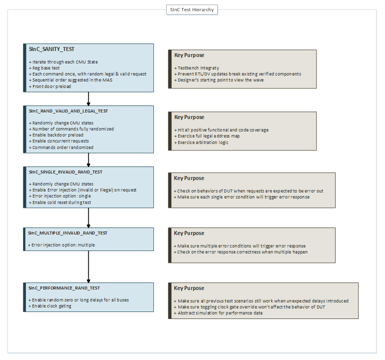
<figcaption>
Figure 13 Test Hierarchy
</figcaption>
</figure>

For more details on the test derives between each other:

<figure>
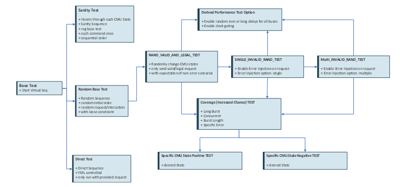
<figcaption>
Figure 14 Test Derives
</figcaption>
</figure>

## Sanity Test

### Intent 

Execute SInC requests one at a time with legal & valid constraints, refer to Section 8 Test Scenarios for positive test cases. Confirm critical path in the RTL and scoreboard is working properly.

### Procedure 

1.  Virtual sequence works in FIFO mode, mimicking SOC flow to access SInC. One request at a time.

2.  Erase asserted during init.

3.  Only legal and valid requests are issued.

4.  AXI read/write to REG are valid.

5.  MEM/MPU access are valid.

6.  MEM address constraints under MPU settings.

7.  FW operation on SInC and AES command follow the rule of CMU states.

## SInC_legal_valid_rand Test

### Intent 

Major test for legal and valid test scenarios mentioned in Section 8 Test Scenarios.

### Procedure 

1.  Virtual sequence works in fork mode. All request channels are concurrently working.

2.  Only legal and valid requests are issued.

3.  Command type, command destination, erase operation, FW operations are generated randomly.

4.  At Cache Active State, a MEM request is pre constrained for hit/miss/replace cache states.

## SInC_single_invalid_rand Test

### Intent 

Major test for invalid test scenarios mentioned in Section 8 Test Scenarios. This test is derived from sinc_legal_valid_rand Test with error injection introduced randomly.

Note: only one invalid case will be introduced in each request.

### Procedure 

1.  Test procedure derived from sinc_legal_valid_rand Test.

2.  Single Error injection introduced before request sent out to SInC.

3.  Single ECC error injected by either front door using Ram Wrapper Error injection interface or backdoor writes to the memory. No double bit error injected in this test.

4.  Status register will be issued with much higher chance after expecting error_cmd.

## SInC_uncor_ecc_error_rand Test

### Intent 

A subset test derived from sinc_single_invalid_rand, for uncorrectable ECC error testing. Instead of only injecting single bit ECC error, uncorrectable ECC error will also be injected.

Note: only one invalid case will be introduced in each request.

### Procedure 

1.  Test procedure derived from sinc_single_invalid_rand Test.

2.  ECC error injected by either front door using Ram Wrapper Error injection interface or backdoor writes to the memory.

3.  Test keep running after seeing error_fault to for test scenarios under section 8 \[TBD\].

4.  Eventually a cold reset will be asserted.

5.  Follow by a status read to make sure error_fault is cleared.

6.  Test keep running after reset.

## sinc_multiple_invalid_rand Test

### Intent 

A subset test derived from sinc_single_invalid_rand, for injecting more than one negative test cases for one request.

### Procedure 

1.  Test procedure derived from sinc_single_invalid_rand test.

2.  Multiple Error injection introduced before request sent out to SInc.

3.  The error expectation from SInC SB should match with error detection and report in SInC RTL.

## sinc_performance_rand Test

### Intent 

A subset test derived from sinc_legal_valid_rand, with extreme performance configuration sending out stimulus on CPU MEM interface. AXI UVC will also be configured be extreme delays.

### Procedure 

1.  Test procedure derived from sinc_legal_valid_rand test.

2.  Keep sending cache hit mem requests.

3.  Keep sending cache miss meme requests.

4.  Toggle clock gating.

## SInC_custom Test

### Intent 

Users can pass run time options to sinc_custom test by sinc.yml file, give details on the stimulus sequence for the commands with attributes.

### Procedure \[TBD\]

1.  Change sinc.yml file for test configuration of sinc_custom.

2.  Add run time option for commands to run. Above custom config will be translated to test

# Test List

[sinc_test_list.md - Repos]

This table contains a comprehensive list of all SINC tests with their stimulus types and descriptions.

| **Test Name** | **Stimulus Type** | **Description** |
|----|----|----|
| sinc_sanity | Direct | Basic requests to SInC DUT, directive driven stimulus to exercise each function. |
| sinc_sanity_dis_auth_check | Direct | Sanity test with DIS_ENCR_AUTH_CHECK set to 1. |
| sinc_sanity_preload | Direct | Sanity test with backdoor preload mem feature enabled. |
| sinc_sanity_dis_reset | Direct | Sanity test with DISABLE_RESET set to 1. |
| sinc_sanity_reinit | Direct | Sanity test focusing on REINIT state. |
| sinc_sanity_dis_reinit | Direct | Sanity test focusing on REINIT state plus DISABLE_REINIT set 1. |
| sinc_sanity_reg | Direct | Sanity test focusing on register testing. |
| sinc_sanity_cpu_mem | Direct | Sanity test focusing on CPU transactions with other operations turned off. |
| sinc_sanity_cpu_mem_preload | Direct | Sanity test focusing on CPU transactions with BACKDOOR_PRELOAD_MEM enabled. |
| sinc_sanity_mpu_config | Direct | Sanity test focusing on MPU transactions. |
| sinc_sanity_fw_op | Direct | Sanity test focusing on FW operations. |
| sinc_sanity_aes | Direct | Sanity test focusing on AES commands. |
| sinc_invalid_aes_test_directed | Direct | Invalid AES test commands to verify error handling. |
| sinc_resp_error_aes_test_directed | Direct | Invalid AES test commands due to AXI subordinate response errors. |
| sinc_legal_valid_rand | Random | Legal and valid requests only. |
| sinc_legal_valid_rand_dis_auth_check | Random | Legal and valid requests with DIS_AUTH set 1. |
| sinc_rand_auth_check | Random | Legal and valid requests with AUTH_CHECK enabled. |
| sinc_rand_auth_check_cache_active | Random, State Focused | Legal and valid requests mostly at CACHE ACTIVE state. |
| sinc_legal_valid_rand_w_min_delay | Random, Performance Oriented | Legal and valid requests with minimum delay. |
| sinc_legal_valid_rand_with_reset | Random | Legal and valid requests with random reset during test. |
| sinc_legal_valid_rand_with_erase | Random | Legal and valid requests with random erase during test. |
| sinc_legal_valid_rand_fw_op_with_erase_and_reset | Random | Legal and valid requests with combination of FW_Operation, Erase, and Reset. |
| sinc_legal_valid_rand_fw_op_with_mpu_read | Random | Legal and valid requests with more MPU reads. |
| sinc_legal_valid_rand_most_erase | Random, Operation Focused | Legal and valid requests, focus on testing erase. |
| sinc_legal_valid_rand_cache_active_with_erase | Random, State Focused | Legal and valid requests, focus on testing erase in CACHE ACTIVE state. |
| sinc_legal_valid_rand_cache_disabled | Random, State Focused | Legal and valid requests, focus on testing in CACHE DISABLED state. |
| sinc_legal_valid_rand_cache_initialized | Random, State Focused | Legal and valid requests, focus on testing in CACHE INITIALIZED state. |
| sinc_legal_valid_rand_cache_active | Random, State Focused | Legal and valid requests, mostly done in CACHE ACTIVE state. |
| sinc_legal_valid_rand_axi_including_fw_op | Random, Protocol Focused | Legal and valid AXI requests and FW operations. |
| sinc_legal_valid_rand_fw_op_no_disable | Random, Protocol Focused | Legal and valid AXI requests and FW operations, avoiding DISABLE state. |
| sinc_legal_valid_rand_axi_non_fw_op | Random, Protocol Focused | Legal and valid AXI requests, no FW operations. |
| sinc_legal_valid_rand_fw_op_only_aes | Random, Protocol Focused | Legal and valid AXI requests and FW operations, only AES test commands. |
| sinc_legal_valid_rand_fw_op_no_aes | Random, Protocol Focused | Legal and valid AXI requests and FW operations, never AES test commands. |
| sinc_legal_valid_rand_cpu_cmd_in_disable_state | Random, State Focused | Legal and valid CPU commands and FW operations in CACHE DISABLED state. |
| sinc_legal_valid_rand_cpu_cmd_in_init_state | Random, State Focused | Legal and valid CPU commands and FW operations in CACHE INITIALIZED state. |
| sinc_legal_valid_rand_cpu_cmd_in_active_state_high_hit | Random, Performance Focused | Legal and valid CPU read requests in CACHE ACTIVE state with high cache hit ratio (90%). |
| sinc_legal_valid_rand_cpu_cmd_in_active_state_high_miss | Random, Performance Focused | Legal and valid CPU read requests in CACHE ACTIVE state with high cache miss ratio (90%). |
| sinc_legal_valid_rand_mpu_req_init_state | Random, State Focused | MPU requests and FW operations in CACHE INITIALIZED state. |
| sinc_legal_valid_rand_mpu_req_active_state | Random, State Focused | MPU requests and FW operations in CACHE ACTIVE state. |
| sinc_legal_valid_rand_mpu_req | Random | MPU requests and FW operations. |
| sinc_invalid_rand | Random with errors | Invalid access to SInC with legal and valid requests. Allow only one error scenario. |
| sinc_invalid_rand_at_cache_failed | Random with errors | Invalid access to SInC in CACHE FAILED state. |
| sinc_invalid_rand_at_cache_failed_erase | Random with errors | Invalid access to SInC in CACHE FAILED state with erase operations. |
| sinc_invalid_rand_w_min_delay | Random with errors, Performance Oriented | Invalid access to SInC with legal and valid requests. Allow only one error scenario. |
| sinc_invalid_axi_rand_non_severe | Random with errors | Invalid access to SInC with legal and valid requests. Allow only one error scenario. |
| sinc_invalid_axi_rand_severe | Random with errors | Invalid access to SInC with legal and valid requests. Allow only one error scenario. |
| sinc_fw_fault_w_rng_fetch_fail_high_reset_high_set_init | Random with errors | Invalid access to SInC with legal and valid requests. Allow only one error scenario. |
| sinc_invalid_axi_rand_severe_at_cache_active | Random with errors | Invalid access to SInC with legal and valid requests. Allow only one error scenario. |
| sinc_invalid_axi_rand_invalid_cmd_for_cache_disabled | Random with errors | Invalid access to SInC with legal and valid requests. Allow only one error scenario. |
| sinc_invalid_axi_rand_invalid_cmd_for_cache_initization | Random with errors | Invalid access to SInC with legal and valid requests. Allow only one error scenario. |
| sinc_invalid_axi_rand_invalid_cmd_for_cache_active | Random with errors | Invalid access to SInC with legal and valid requests. Allow only one error scenario. |
| sinc_fw_fault_w_rng_fetch_fail | Random with errors | Invalid access to SInC with legal and valid requests. Allow only one error scenario. |
| sinc_fw_encr_blcok_fail | Random with errors | Invalid access to SInC with legal and valid requests. Allow only one error scenario. |
| sinc_invalid_cpu_rand | Random with errors | Invalid access to SInC with legal and valid requests. Allow only one error scenario. |
| sinc_invalid_cpu_rand_non_severe | Random with errors | Invalid access to SInC with legal and valid requests. Allow only one error scenario. |
| sinc_invalid_cpu_rand_non_severe_non_blocking_tran_cache_active | Random with errors, Performance Oriented | Invalid access to SInC with legal and valid requests. Allow only one error scenario. |
| sinc_invalid_cpu_rand_non_severe_non_blocking_tran | Random with errors, Performance Oriented | Invalid access to SInC with legal and valid requests. Allow only one error scenario. |
| sinc_legal_valid_rand_cpu_cmd_non_blocking_tran | Random, Performance Oriented | Legal and valid CPU commands and FW operations using non-blocking transactions with back-to-back operations. |
| sinc_invalid_cpu_rand_w_tag_mismatch | Random with errors | Invalid access to SInC with legal and valid requests. Allow only one error scenario. |
| sinc_invalid_cpu_rand_at_cache_active | Random with errors | Invalid access to SInC with legal and valid requests. Allow only one error scenario. |
| sinc_invalid_cpu_rand_non_severe_at_cache_active | Random with errors | Invalid access to SInC with legal and valid requests. Allow only one error scenario. |
| sinc_invalid_cpu_rand_at_cache_active_w_tag_mismatch | Random with errors | Invalid access to SInC with legal and valid requests. Allow only one error scenario. |
| sinc_invalid_severe_cpu_rand_at_cache_active | Random with errors | Invalid access to SInC with legal and valid requests. Allow only one error scenario. |
| sinc_invalid_concurrent_rand | Random with errors | Invalid access to SInC with legal and valid requests. Have concurrent transactions. |
| sinc_invalid_concurrent_rand_at_cache_active | Random with errors | Invalid access to SInC with legal and valid requests. Have concurrent transactions. |
| sinc_concurrent_erase_rand_at_cache_fail | Random with favor of | Higher chance to do severe error, then operate erase and CPU transactions |
| sinc_invalid_concurrent_rand_at_cache_active_erase_during | Random with errors | Invalid access to SInC with legal and valid requests. Have concurrent transactions. |
| sinc_invalid_concurrent_rand_at_cache_initialization_erase_during | Random with errors | Invalid access to SInC with legal and valid requests. Have concurrent transactions. |
| sinc_invalid_concurrent_rand_at_cache_disabled_erase_during | Random with errors | Invalid access to SInC with legal and valid requests. Have concurrent transactions. |
| sinc_invalid_concurrent_rand_at_cache_disabled_cpu_erase_same_time | Random with errors | Invalid access to SInC with legal and valid requests. Have concurrent transactions. |
| sinc_invalid_concurrent_rand_at_cache_active_cpu_during | Random with errors | Invalid access to SInC with legal and valid requests. Have concurrent transactions. |
| sinc_invalid_concurrent_rand_at_cache_initialization_cpu_during | Random with errors | Invalid access to SInC with legal and valid requests. Have concurrent transactions. |
| sinc_invalid_concurrent_rand_at_cache_disabled_cpu_during | Random with errors | Invalid access to SInC with legal and valid requests. Have concurrent transactions. |
| sinc_invalid_concurrent_rand_at_cache_active_axi_during | Random with errors | Invalid access to SInC with legal and valid requests. Have concurrent transactions. |
| sinc_invalid_concurrent_rand_at_cache_initialization_axi_during | Random with errors | Invalid access to SInC with legal and valid requests. Have concurrent transactions. |
| sinc_invalid_concurrent_rand_at_cache_disabled_axi_during | Random with errors | Invalid access to SInC with legal and valid requests. Have concurrent transactions. |
| sinc_invalid_concurrent_rand_at_cache_active_cpu_during_erase | Random with errors | Intentionally doing CPU request during Erase operation. |
| sinc_invalid_concurrent_rand_at_cache_disable_cpu_during_erase | Random with errors | Intentionally doing CPU request during Erase operation. |
| sinc_invalid_concurrent_rand_at_cache_active_erase_during_cpu | Random with errors | Intentionally doing CPU request during Erase operation. |
| sinc_invalid_concurrent_rand_at_cache_disable_erase_during_cpu | Random with errors | Intentionally doing CPU request during Erase operation. |
| sinc_invalid_concurrent_rand_at_cache_active_w_cache_fail | Random with errors | Invalid access to SInC with legal and valid requests. Have concurrent transactions. |
| sinc_invalid_mpu_rand | Random with errors | Invalid access to SInC with legal and valid requests. Allow only one error scenario. |
| sinc_uncor_ecc_error_rand | Random with errors | Memory ECC error injection, specifically uncorrectable errors. |
| sinc_multiple_invalid_rand | Random with errors | Invalid access to SInC with legal and valid requests. Allow multiple error scenarios. |
| sinc_legal_valid_rand_cpu_cmd_in_active_state_w_cache_pool | Random, Performance Focused | Legal and valid CPU read requests in CACHE ACTIVE state with high cache hit ratio and access within cache pool (pool size 10). |
| sinc_ecc_base_test | Direct | Error injection and check correctable and uncorrectable error. |
| sinc_ecc_disable_state_uncorr_err_direct_test | Direct | SINC 2 bit ecc error check in cache disabled state |
| sinc_ecc_init_state_uncorr_err_direct_test | Direct | SINC 2 bit ecc error check in cache init state |
| sinc_ecc_active_state_uncorr_err_direct_test | Direct | SINC 2 bit ecc error check in cache active state |
| sinc_ecc_correctable_err_direct_test | Direct | SINC single bit ecc error check |
| sinc_ecc_corr_err_chk_disabled_direct_test | Direct | SINC single bit ecc error check with error check disabled |
| sinc_ecc_uncorr_err_chk_disabled_direct_test | Direct | SINC 2 bit ecc error check in cache active state with error check disabled |
| sinc_rand_fsm_fault_err_on_cmu_cache_fsm | Random with errors | FSM fault error injection on CMU cache FSM, avoiding DISABLE state. |
| sinc_rand_fsm_fault_err_on_sinc_sub_state_fsm | Random with errors | FSM fault error injection on SINC sub-state FSM, avoiding DISABLE state. |
| sinc_rand_fsm_fault_err_on_cmu_dma_r_fsm | Random with errors | FSM fault error injection on CMU DMA read FSM, focusing on CPU read operations. |
| sinc_rand_fsm_fault_err_on_cmu_dma_w_fsm | Random with errors | FSM fault error injection on CMU DMA write FSM, focusing on CPU write operations. |
| sinc_rand_fsm_fault_err_on_aes_ctrl_fsm | Random with errors | FSM fault error injection on AES control FSM, avoiding DISABLE state. |
| sinc_rand_fsm_fault_err_on_gpaes_mode_main_fsm | Random with errors | FSM fault error injection on GPAES mode main FSM, avoiding DISABLE state. |
| sinc_rand_fsm_fault_err_on_gpaes_ghash_mul_fsm | Random with errors | FSM fault error injection on GPAES GHASH multiplier FSM. |
| sinc_rand_fsm_fault_err_on_gpaes_mode_ghash_fsm | Random with errors | FSM fault error injection on GPAES mode GHASH FSM, focusing on AES test commands. |
| sinc_rand_fsm_fault_err_on_aes_ctrl_fsm_with_aes_test | Random with errors | FSM fault error injection on AES control FSM, focusing on AES test commands. |
| sinc_rand_fsm_fault_err_on_cmu_ctrl_fsm | Random with errors | FSM fault error injection on CMU control FSM, focusing on CPU read operations, avoiding DISABLE state. |
| sinc_rand_fsm_fault_err_on_gpaes_sub_state_fsm | Random with errors | FSM fault error injection on GPAES sub-state FSM. |
| sinc_rand_fsm_fault_err_on_ciu_cache_fsm | Random with errors | FSM fault error injection on CIU cache FSM. |
| sinc_vtag_parity_err_test | Direct | VTAG parity error injection and check. Runs deterministically, DISABLED/ACTIVE + INJECT/NO_INJECT with randomized address kept constant throughout iterations. |
| sinc_vtag_parity_err_rand_test | Random with errors | VTAG parity error injection and check with completely randomized iterations. |
| sinc_cpu_b2b_cache_fail_direct_err_test | Direct, Coverage Oriented | Coverage oriented test to hit back to back CPU RD with cache fail scenarios |
| sinc_cpu_req_on_last_erase_mem_direct_err_test | Direct, Coverage Oriented | Coverage oriented test to hit CPU RD happen at last erase mem slot timing |
| sinc_concurrent_fw_op_and_fetch_block_direct_err_test | Direct, Coverage Oriented | Coverage oriented test to hit CPU RD happen at last erase mem slot timing |
| sinc_lp_rst_rng_fetch_fail_direct_err_test | Direct, Coverage Oriented | Coverage oriented test to hit low power reset follow with RNG fetch fail |
| sinc_lp_rst_rng_fetch_fail_on_iot_seed_direct_err_test | Direct, Coverage Oriented | Coverage oriented test to hit low power reset follow with RNG fetch fail during IOT seed stage |
| sinc_soc_rst_rng_fetch_fail_direct_err_test | Direct, Coverage Oriented | Coverage oriented test to hit SOC reset follow with RNG fetch fail |
| sinc_pow_rst_rng_fetch_fail_direct_err_test | Direct, Coverage Oriented | Coverage oriented test to hit power reset follow with RNG fetch fail |
| sinc_lp_rst_from_active_state_direct_err_test | Direct, Coverage Oriented | Coverage oriented test to hit low power reset from active state |
| sinc_soc_rst_from_active_state_direct_err_test | Direct, Coverage Oriented | Coverage oriented test to hit SOC reset from active state |
| sinc_pow_rst_from_active_state_direct_err_test | Direct, Coverage Oriented | Coverage oriented test to hit power reset from active state |
| sinc_lp_rst_from_disable_state_direct_err_test | Direct, Coverage Oriented | Coverage oriented test to hit low power reset from disabled state |
| sinc_soc_rst_from_disable_state_direct_err_test | Direct, Coverage Oriented | Coverage oriented test to hit SOC reset from disabled state |
| sinc_pow_rst_from_disable_state_direct_err_test | Direct, Coverage Oriented | Coverage oriented test to hit power reset from disabled state |
| sinc_lp_rst_from_init_state_direct_err_test | Direct, Coverage Oriented | Coverage oriented test to hit low power reset from init state |
| sinc_soc_rst_from_init_state_direct_err_test | Direct, Coverage Oriented | Coverage oriented test to hit SOC reset from init state |
| sinc_pow_rst_from_init_state_direct_err_test | Direct, Coverage Oriented | Coverage oriented test to hit power reset from init state |
| sinc_lp_rst_from_active_state_during_aes_compute_direct_err_test | Direct, Coverage Oriented | Coverage oriented test to hit low power reset during AES compute |
| sinc_soc_rst_from_active_state_during_aes_compute_direct_err_test | Direct, Coverage Oriented | Coverage oriented test to hit SOC reset during AES compute |
| sinc_pow_rst_from_active_state_during_aes_compute_direct_err_test | Direct, Coverage Oriented | Coverage oriented test to hit power reset during AES compute |
| sinc_lp_rst_from_active_state_during_axi_transaction_direct_err_test | Direct, Coverage Oriented | Coverage oriented test to hit low power reset during AXI transaction |
| sinc_soc_rst_from_active_state_during_axi_transaction_direct_err_test | Direct, Coverage Oriented | Coverage oriented test to hit SOC reset during AXI transaction |
| sinc_pow_rst_from_active_state_during_axi_transaction_direct_err_test | Direct, Coverage Oriented | Coverage oriented test to hit power reset during AXI transaction |
| sinc_fw_fault_injection | Direct | Test firmware fault injection on SINC FW |

# Randomization

This section will elaborate all the variables that will be randomized in the SInC UVM test bench. Any random object’s base constraint in the SInC TB should strictly follow the constraint guidance list below.

## Randomization Weights

**\<This rest section will be updated when implementing the testbench\>**

<table>
<colgroup>
<col style="width: 25%" />
<col style="width: 40%" />
<col style="width: 33%" />
</colgroup>
<thead>
<tr>
<th><strong>Variable</strong></th>
<th><strong>Randomization Weight</strong></th>
<th><strong>Comment</strong></th>
</tr>
</thead>
<tbody>
<tr>
<td>enum desired_cache_state</td>
<td>Cache_Disable := 2, Cache_Init := 2, Cache_Active := 4, Cache_failed := 2;</td>
<td>
Set when test started.

If current cache state is not desired_cache_state, use FW command to change cache state to desired_cache_state.
</td>
</tr>
<tr>
<td>int cache_hit_miss_rate</td>
<td>hit := 75, miss := 25</td>
<td>In cache active state, CPU request address randomized depends on whether current transaction aim to hit or miss.</td>
</tr>
<tr>
<td></td>
<td></td>
<td></td>
</tr>
<tr>
<td></td>
<td></td>
<td></td>
</tr>
</tbody>
</table>

# Error Injection and Handling

As described in section 8 Test Scenarios’ negative test scenarios and section 7.9 Scoreboard for Scoreboard check flow. Based on the legal and valid positive test cases, all the negative test cases will be treated as error injection on a positive test case. The RTL behavior under error injection will be monitored and checked by the scoreboard behavior model, we call it actual vs. expectation. A signature mentioned in section 8 Test Scenarios will be reported as UVM_ERROR, once a mismatch is seen.

# Coverage

Functional and assert property coverage will be used to help sample the completeness of this test bench.

## Functional Coverage

Functional coverage class will be instantiated at SInC Scoreboard. Each transaction must be checked by the scoreboard before be sampled at functional coverage.

The coverage bins are mainly focused on:

- Individual interface abstracted interactions with the DUT

  - For example, CPU_MEM interface transaction’s attributes shall be sampled, for it’s address, R/W data, operation, response…

- Transaction cross coverage with system status

  - For example, CPU_MEM request vs. Cache States. AXI MGR request vs. Erase busy.

- CPU MEM request in Cache State cross the Cache status

  - Cache miss/hit, cache set full/not full

- Concurrent Transaction

- Back-to-Back transaction combinations

- Continuous transaction combinations (multiple CPU RD, CPU WR, FW operations …)

- Error Handling and error injections

The golden reference are Test Scenarios section in this verification plan. All the scenarios can contribute to the functional coverage.

## Assert Coverage \[DV 0.8 item\]

Assert coverage is mainly used to sample the performance of the DUT. It can compensate functional coverage when it is too hard for the transaction-based scoreboard to collect information.

# Configurations

This section includes verification environment defines and parameters.

The DV parameters are stored at: top/sinc\_\<subsystem\>\_parameters_pkg.sv

## Parameters

This section is for parameters used to instantiate the design and testbench components. Any plusargs that are used by the testbench that are set in the test yaml files should be captured here as well.

### RTL Design Parameters

Any other RTL parameter not mentioned below are using the DEFAULT parameter values.

| **Parameter** | **Possible Values** | **Description** |
|----|----|----|
| DATA_WIDTH | 32 |  |
| EIRAM_SIZE | \`MSFT_SP_EIRAM0_SIZE/1024 |  |
| ADDR_WIDTH | \`MSFT_SP_EIRAM0_ADDR_WIDTH |  |
| CACHE_MEM_WIDTH | \`MSFT_SP_CIRAM0_LOGICAL_MEM_WIDTH |  |
| CACHE_MEM_ADDR_WIDTH | \`MSFT_SP_CIRAM0_ADDR_WIDTH |  |
| CACHE_VTAG_WIDTH | \`MSFT_SINC_VTAG0_LOGICAL_MEM_WIDTH - 4 |  |
| CACHE_VTAG_ADDR_WIDTH | \`MSFT_SINC_VTAG0_ADDR_WIDTH |  |
| KSU_KEY_SLOT_BASE_ADDR | \`KSU_KEY_SLOT_BASE_ADDR |  |
| RNG_SEED_BASE_ADDR | \`RNG_SEED_BASE_ADDR |  |
| REG_BASE_ADDR | \`SINC_REG_BASE_ADDR |  |
| REG_END_ADDR | \`SINC_REG_END_ADDR |  |
| AXI_SUB_BLEN | 4 |  |

### Verification Environment Instance Parameters

There is no verification environment instance parameter.

| **Parameter** | **Value** | **Description** |
|---------------|-----------|-----------------|
|               |           |                 |

\
-

### Verification Environment Runtime Parameters

| **Parameter** | **Possible Values** | **Description** |
|---------------|---------------------|-----------------|
|               |                     |                 |

\
Assumptions
===========

None.

# IS Not

The SInC UVM Verification Test Bench is an L1 test that created for SInC IP. It has limited scope on the design hierarchy, hence below items **IS Not** verified at this test bench:

- Memory model of Cache SRAM for DUT.

- Propagation logic for output signals of SInC.

- Common Design IP, AXI Mgr/Sub and Ram Wrapper are not fully verified.

- Scan mode is not tested.

- Contention between SInC operation with Memory Error injection operation is not verified.

- Memory Error injection logic is taken as verified module to use.

- Propagation of SInC outputs to security subsystem

It is the L1 test bench’s responsibility to test any other features that are not mentioned above.

# Subsystem Specific Details

This section must have a section for each subsystem, which includes:

- RTL Revision of the IP to be verified

- List of deltas for specific subsystem (compared to X subsystem)

- Testbench changes required

- Test plan changes required (in terms of tests)

- Functional coverage changes required

- List any bugs that would be fixed as part of this subsystem (when compared to previous subsystem).

#### DUT Parameters

| Parameter | Value | Note |
|----|----|----|
| DATA_WIDTH | 32 |  |
| EIRAM_SIZE | 16777216/1024 | 16 MB |
| ADDR_WIDTH | 22 |  |
| CACHE_MEM_WIDTH | 156 | 4 \* 32 bits + 7 bits ECC |
| CACHE_MEM_ADDR_WIDTH | 14 |  |
| CACHE_VTAG_WIDTH | 40 - 4 | CACHE_VTAG_WIDTH doesn't inlcude 4 bits of Parity. |
| CACHE_VTAG_ADDR_WIDTH | 7 |  |
| KSU_KEY_SLOT_BASE_ADDR | 32'h8F0C_4000 |  |
| RNG_SEED_BASE_ADDR | 32'h8F0A_0200 |  |
| REG_BASE_ADDR | 32'h8F0E_1000 |  |
| AXI_SUB_BLEN | 4 |  |
| BLOCK_SIZE | **DEFAULT** |  |
| INPUT_BUFFER_SIZE | **DEFAULT** |  |
| ENGN_PARITY_EN | **DEFAULT** |  |
| AXI_PARITY_EN | **DEFAULT** |  |
| AXI_SUB_DFD | **DEFAULT** |  |
| AXI_SUB_CFD | **DEFAULT** |  |
| AXI_SUB_BLEN | **DEFAULT** |  |
| AXI_MGR_BLEN | **DEFAULT** |  |
| AXI_MGR_ANUM | **DEFAULT** |  |
| MPU_SINGLE_CYCLE | **DEFAULT** |  |
| CACHE_VTAG_USE_RF | **DEFAULT** |  |

#### Warmed Up Cache

In Section 7.7.2 DUT Cache Initialization, a Random Mode is described to help cache testing on a warmed-up cache by:

- Backdoor preload VTAG

- Backdoor preload Cache Mem

The “Backdoor preload VTAG” is demoted, it will not fit into current schedule. Thus, the stimulus in cache active state will always be starting with an empty cache sets.

#### AES stimulus and scoreboard support

The test scenarios sections has elaborated all the AES test scenarios including positive and negative tests.

The L3 IP TB will compromise on below test cases:

- AES command’s negative test cases are all treated as low priority. SInC TB will implement the test scenarios if there is bandwidth on the schedule.

- AES command’s result will be checked by sequence, scoreboard will only maintain the minimum check on the correctness considering the FW operation steps are matching the MAS.

- AES positive and negative test scenarios will only be covered by direct test with “low randomization” ongoing with other interface and AES command’s attributes.

# References

| \[1\] | \<Include any references to other documents, publications, or websites here\> |
|----|----|
